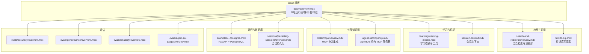
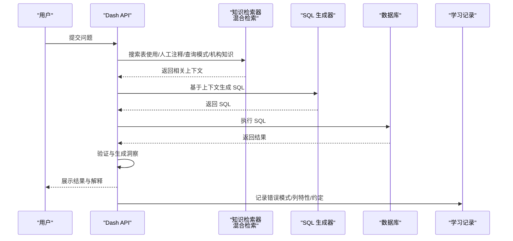
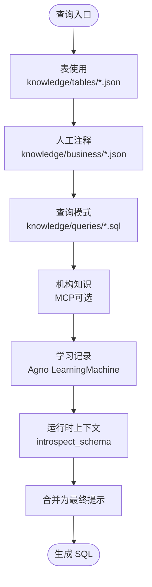
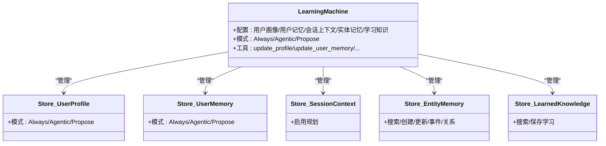
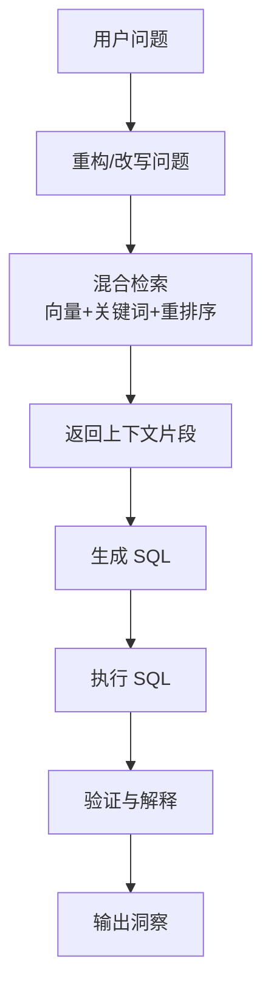
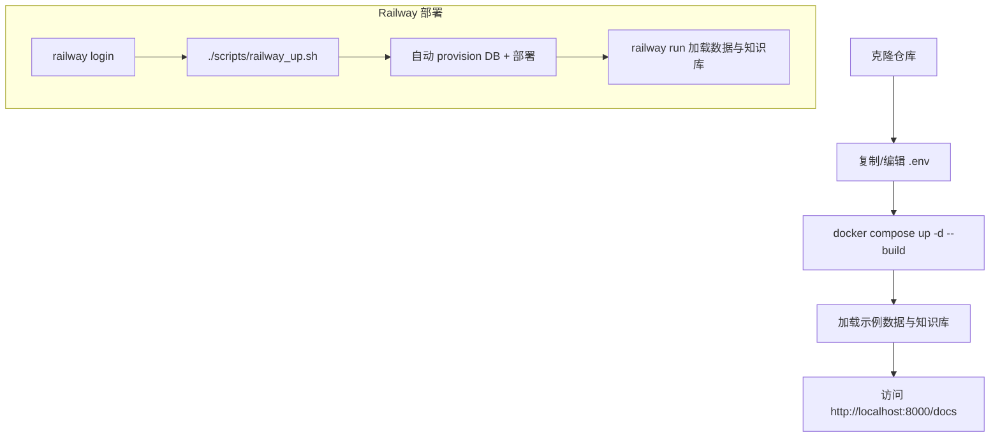
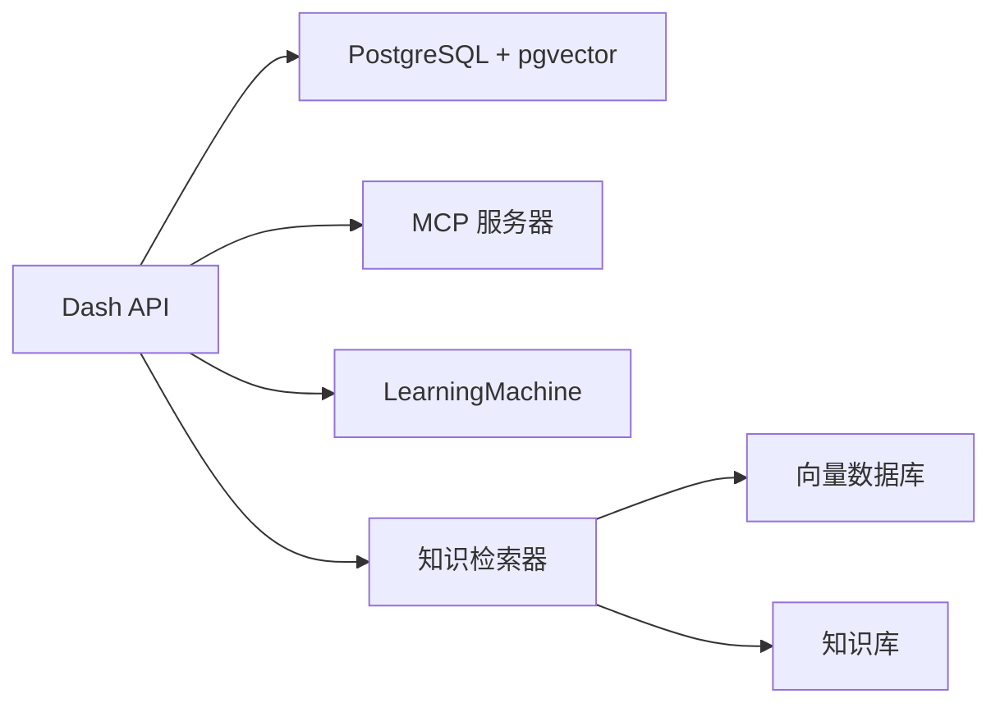

# Dash 数据代理模板

<cite>
**本文引用的文件**
- [deploy/templates/dash/overview.mdx](file://deploy/templates/dash/overview.mdx)
- [knowledge/concepts/search-and-retrieval/overview.mdx](file://knowledge/concepts/search-and-retrieval/overview.mdx)
- [cookbook/streamlit/text-to-sql.mdx](file://cookbook/streamlit/text-to-sql.mdx)
- [production/applications/text-to-sql.mdx](file://production/applications/text-to-sql.mdx)
- [learning/learning-modes.mdx](file://learning/learning-modes.mdx)
- [learning/stores/session-context.mdx](file://learning/stores/session-context.mdx)
- [tools/mcp/overview.mdx](file://tools/mcp/overview.mdx)
- [agent-os/mcp/mcp.mdx](file://agent-os/mcp/mcp.mdx)
- [TBD/pages/templates/agent-infra-railway/run-local.mdx](file://TBD/pages/templates/agent-infra-railway/run-local.mdx)
- [TBD/pages/templates/agent-infra-railway/run-prd.mdx](file://TBD/pages/templates/agent-infra-railway/run-prd.mdx)
- [TBD/pages/templates/agent-infra-railway/env-vars.mdx](file://TBD/pages/templates/agent-infra-railway/env-vars.mdx)
- [examples/agent-os/dbs/postgres.mdx](file://examples/agent-os/dbs/postgres.mdx)
- [sessions/persisting-sessions/overview.mdx](file://sessions/persisting-sessions/overview.mdx)
- [evals/accuracy/overview.mdx](file://evals/accuracy/overview.mdx)
- [evals/performance/overview.mdx](file://evals/performance/overview.mdx)
- [evals/reliability/overview.mdx](file://evals/reliability/overview.mdx)
- [evals/agent-as-judge/overview.mdx](file://evals/agent-as-judge/overview.mdx)
</cite>

## 目录
1. [简介](#简介)
2. [项目结构](#项目结构)
3. [核心组件](#核心组件)
4. [架构总览](#架构总览)
5. [详细组件分析](#详细组件分析)
6. [依赖关系分析](#依赖关系分析)
7. [性能考量](#性能考量)
8. [故障排查指南](#故障排查指南)
9. [结论](#结论)
10. [附录](#附录)

## 简介
Dash 是一个“自我学习的数据代理”，它通过“六层上下文”在查询时进行混合检索，生成有依据的 SQL，并执行查询以提供可解释的洞察。其核心目标是让每次查询都成为改进的机会：知识库与学习记录双系统协同演进，使代理在无重训、无微调的情况下持续提升。

- 六层上下文：表使用、人工注释、查询模式、机构知识、学习记录、运行时上下文
- 自我学习：知识库（团队维护）与学习记录（自动积累）互补
- 混合检索：向量 + 关键词 + 重排序，兼顾语义理解与精确匹配
- 可解释洞察：不仅返回结果行，还给出背景、对比与结论

章节来源
- [deploy/templates/dash/overview.mdx:1-144](file://deploy/templates/dash/overview.mdx#L1-L144)

## 项目结构
Dash 模板位于部署模板目录中，提供本地运行、Railway 部署、示例提示、知识库与评估套件等完整指引。下图展示了 Dash 在整体文档体系中的定位与关键交互点。

图表来源
- [deploy/templates/dash/overview.mdx:1-144](file://deploy/templates/dash/overview.mdx#L1-L144)
- [knowledge/concepts/search-and-retrieval/overview.mdx:74-93](file://knowledge/concepts/search-and-retrieval/overview.mdx#L74-L93)
- [cookbook/streamlit/text-to-sql.mdx:1-33](file://cookbook/streamlit/text-to-sql.mdx#L1-L33)
- [production/applications/text-to-sql.mdx:192-201](file://production/applications/text-to-sql.mdx#L192-L201)
- [learning/learning-modes.mdx:65-95](file://learning/learning-modes.mdx#L65-L95)
- [learning/stores/session-context.mdx:134-164](file://learning/stores/session-context.mdx#L134-L164)
- [tools/mcp/overview.mdx:1-256](file://tools/mcp/overview.mdx#L1-L256)
- [agent-os/mcp/mcp.mdx:1-48](file://agent-os/mcp/mcp.mdx#L1-L48)
- [examples/agent-os/dbs/postgres.mdx:97-129](file://examples/agent-os/dbs/postgres.mdx#L97-L129)
- [sessions/persisting-sessions/overview.mdx:1-30](file://sessions/persisting-sessions/overview.mdx#L1-L30)
- [evals/accuracy/overview.mdx:1-200](file://evals/accuracy/overview.mdx#L1-L200)
- [evals/performance/overview.mdx:1-200](file://evals/performance/overview.mdx#L1-L200)
- [evals/reliability/overview.mdx:1-200](file://evals/reliability/overview.mdx#L1-L200)
- [evals/agent-as-judge/overview.mdx:1-200](file://evals/agent-as-judge/overview.mdx#L1-L200)

章节来源
- [deploy/templates/dash/overview.mdx:1-144](file://deploy/templates/dash/overview.mdx#L1-L144)

## 核心组件
- 六层上下文
  - 表使用：表结构、列、关系
  - 人工注释：指标定义、业务规则、常见陷阱
  - 查询模式：已知有效的 SQL 模式
  - 机构知识：文档、Wiki、外部参考（MCP）
  - 学习记录：错误模式、列特性、团队约定（Agno LearningMachine）
  - 运行时上下文：实时模式变更（introspect_schema 工具）
- 自我学习双系统
  - 知识库：由团队维护与迭代的“已验证查询、表元数据、业务规则”
  - 学习记录：由 LearningMachine 自动管理的“错误模式、列特性、团队约定”
- 混合检索与检索增强
  - 向量 + 关键词 + 重排序，兼顾语义理解与精确匹配
- 可解释洞察
  - 不仅返回行，还提供背景、对比与结论

章节来源
- [deploy/templates/dash/overview.mdx:17-48](file://deploy/templates/dash/overview.mdx#L17-L48)
- [knowledge/concepts/search-and-retrieval/overview.mdx:74-93](file://knowledge/concepts/search-and-retrieval/overview.mdx#L74-L93)
- [cookbook/streamlit/text-to-sql.mdx:6-17](file://cookbook/streamlit/text-to-sql.mdx#L6-L17)
- [production/applications/text-to-sql.mdx:192-201](file://production/applications/text-to-sql.mdx#L192-L201)
- [learning/learning-modes.mdx:65-95](file://learning/learning-modes.mdx#L65-L95)
- [learning/stores/session-context.mdx:134-164](file://learning/stores/session-context.mdx#L134-L164)

## 架构总览
Dash 的端到端流程如下：用户提问 → 混合检索上下文 → 生成 SQL → 执行查询 → 结果验证与洞察输出 → 学习记录更新。

图表来源
- [deploy/templates/dash/overview.mdx:13-15](file://deploy/templates/dash/overview.mdx#L13-L15)
- [knowledge/concepts/search-and-retrieval/overview.mdx:74-93](file://knowledge/concepts/search-and-retrieval/overview.mdx#L74-L93)
- [production/applications/text-to-sql.mdx:179-190](file://production/applications/text-to-sql.mdx#L179-L190)

## 详细组件分析

### 六层上下文机制
- 表使用：来自 `knowledge/tables/*.json`，描述表结构、列含义与数据质量
- 人工注释：来自 `knowledge/business/*.json`，定义指标、规则与常见陷阱
- 查询模式：来自 `knowledge/queries/*.sql`，已知有效的 SQL 模式
- 机构知识：通过 MCP（可选）接入 Wiki、文档、外部参考
- 学习记录：来自 Agno LearningMachine，记录错误模式、列特性、团队约定
- 运行时上下文：通过 `introspect_schema` 工具动态获取最新模式变更

图表来源
- [deploy/templates/dash/overview.mdx:17-27](file://deploy/templates/dash/overview.mdx#L17-L27)
- [tools/mcp/overview.mdx:1-256](file://tools/mcp/overview.mdx#L1-L256)
- [agent-os/mcp/mcp.mdx:1-48](file://agent-os/mcp/mcp.mdx#L1-L48)
- [learning/learning-modes.mdx:65-95](file://learning/learning-modes.mdx#L65-L95)

章节来源
- [deploy/templates/dash/overview.mdx:17-27](file://deploy/templates/dash/overview.mdx#L17-L27)
- [tools/mcp/overview.mdx:1-256](file://tools/mcp/overview.mdx#L1-L256)
- [agent-os/mcp/mcp.mdx:1-48](file://agent-os/mcp/mcp.mdx#L1-L48)
- [learning/learning-modes.mdx:65-95](file://learning/learning-modes.mdx#L65-L95)

### 自我学习机制（知识库与学习记录）
- 知识库：团队维护的“已验证查询、表元数据、业务规则”，随时间迭代
- 学习记录：LearningMachine 自动记录“错误模式、列特性、团队约定”，用于后续检索与生成
- 模式选择：支持 Always、Agentic、Propose 等模式，按存储类型组合使用

图表来源
- [learning/learning-modes.mdx:40-124](file://learning/learning-modes.mdx#L40-L124)
- [learning/stores/session-context.mdx:134-164](file://learning/stores/session-context.mdx#L134-L164)

章节来源
- [deploy/templates/dash/overview.mdx:28-48](file://deploy/templates/dash/overview.mdx#L28-L48)
- [learning/learning-modes.mdx:40-124](file://learning/learning-modes.mdx#L40-L124)
- [learning/stores/session-context.mdx:134-164](file://learning/stores/session-context.mdx#L134-L164)

### 混合检索与检索增强
- 检索策略：向量相似 + 关键词匹配 + 可选重排序器（如 Cohere）
- 适用场景：大多数真实应用需要语义理解与精确匹配的平衡
- 与知识库结合：先检索表元数据、查询模式与业务规则，再生成 SQL

图表来源
- [knowledge/concepts/search-and-retrieval/overview.mdx:74-93](file://knowledge/concepts/search-and-retrieval/overview.mdx#L74-L93)
- [cookbook/streamlit/text-to-sql.mdx:6-17](file://cookbook/streamlit/text-to-sql.mdx#L6-L17)
- [production/applications/text-to-sql.mdx:179-190](file://production/applications/text-to-sql.mdx#L179-L190)

章节来源
- [knowledge/concepts/search-and-retrieval/overview.mdx:74-93](file://knowledge/concepts/search-and-retrieval/overview.mdx#L74-L93)
- [cookbook/streamlit/text-to-sql.mdx:6-17](file://cookbook/streamlit/text-to-sql.mdx#L6-L17)
- [production/applications/text-to-sql.mdx:179-190](file://production/applications/text-to-sql.mdx#L179-L190)

### 本地运行与 Railway 部署
- 本地运行
  - 克隆仓库、复制示例环境变量、启动容器、加载示例数据与知识库
  - 通过控制平面连接本地实例
- Railway 部署
  - 登录后一键部署，脚本自动 provision PostgreSQL、配置环境变量并部署
  - 生产环境加载数据与知识库后，通过控制平面连接

图表来源
- [deploy/templates/dash/overview.mdx:49-106](file://deploy/templates/dash/overview.mdx#L49-L106)

章节来源
- [deploy/templates/dash/overview.mdx:49-106](file://deploy/templates/dash/overview.mdx#L49-L106)
- [TBD/pages/templates/agent-infra-railway/run-local.mdx:1-10](file://TBD/pages/templates/agent-infra-railway/run-local.mdx#L1-L10)
- [TBD/pages/templates/agent-infra-railway/run-prd.mdx:1-10](file://TBD/pages/templates/agent-infra-railway/run-prd.mdx#L1-L10)

### 示例提示与自定义数据添加
- 示例提示：F1 数据集上的冠军、胜场、车队对比等
- 自定义数据：将组织内部的表元数据、查询模式、业务规则放入对应目录，随时 upsert 或重建
- 加载命令：支持增量 upsert 与全新重建两种模式

章节来源
- [deploy/templates/dash/overview.mdx:107-131](file://deploy/templates/dash/overview.mdx#L107-L131)

### 评估套件与最佳实践
- 评估类型：字符串匹配、LLM 评分、黄金 SQL 对比
- 使用方式：容器内或 Railway 运行时执行评估脚本
- 最佳实践：先用字符串匹配快速验证，再引入 LLM 评分与黄金 SQL 对比，逐步提升评估覆盖度

章节来源
- [deploy/templates/dash/overview.mdx:132-141](file://deploy/templates/dash/overview.mdx#L132-L141)
- [evals/accuracy/overview.mdx:1-200](file://evals/accuracy/overview.mdx#L1-L200)
- [evals/performance/overview.mdx:1-200](file://evals/performance/overview.mdx#L1-L200)
- [evals/reliability/overview.mdx:1-200](file://evals/reliability/overview.mdx#L1-L200)
- [evals/agent-as-judge/overview.mdx:1-200](file://evals/agent-as-judge/overview.mdx#L1-L200)

## 依赖关系分析
- 外部知识源：通过 MCP 将外部文档、Wiki、参考链接纳入检索
- 数据库与会话：FastAPI 应用 + PostgreSQL（pgvector），会话持久化支持跨多次运行
- 检索与学习：检索器采用混合策略；学习记录通过 LearningMachine 统一管理

图表来源
- [examples/agent-os/dbs/postgres.mdx:97-129](file://examples/agent-os/dbs/postgres.mdx#L97-L129)
- [sessions/persisting-sessions/overview.mdx:1-30](file://sessions/persisting-sessions/overview.mdx#L1-L30)
- [tools/mcp/overview.mdx:1-256](file://tools/mcp/overview.mdx#L1-L256)
- [agent-os/mcp/mcp.mdx:1-48](file://agent-os/mcp/mcp.mdx#L1-L48)
- [knowledge/concepts/search-and-retrieval/overview.mdx:74-93](file://knowledge/concepts/search-and-retrieval/overview.mdx#L74-L93)

章节来源
- [examples/agent-os/dbs/postgres.mdx:97-129](file://examples/agent-os/dbs/postgres.mdx#L97-L129)
- [sessions/persisting-sessions/overview.mdx:1-30](file://sessions/persisting-sessions/overview.mdx#L1-L30)
- [tools/mcp/overview.mdx:1-256](file://tools/mcp/overview.mdx#L1-L256)
- [agent-os/mcp/mcp.mdx:1-48](file://agent-os/mcp/mcp.mdx#L1-L48)
- [knowledge/concepts/search-and-retrieval/overview.mdx:74-93](file://knowledge/concepts/search-and-retrieval/overview.mdx#L74-L93)

## 性能考量
- 检索性能：优先采用混合检索并配合重排序器，减少无关结果带来的推理开销
- 索引与向量化：确保表元数据与查询模式及时更新，避免过期向量导致的误判
- 会话持久化：启用数据库持久化，避免长对话截断与状态丢失
- 评估闭环：定期运行评估套件，识别性能退化与可靠性问题

## 故障排查指南
- 控制平面连接失败
  - 确认本地服务地址与端口正确，访问文档页面确认可用性
  - 检查网络连通与防火墙设置
- 数据库连接异常
  - 核对数据库连接串、凭据与等待策略
  - 确保数据库已就绪后再启动应用
- 知识库加载失败
  - 检查知识文件格式与路径
  - 使用重建模式清理后重新加载
- 评估未命中
  - 确认评估脚本参数与数据一致性
  - 从字符串匹配起步，逐步引入 LLM 评分与黄金 SQL

章节来源
- [deploy/templates/dash/overview.mdx:66-71](file://deploy/templates/dash/overview.mdx#L66-L71)
- [TBD/pages/templates/agent-infra-railway/env-vars.mdx:1-51](file://TBD/pages/templates/agent-infra-railway/env-vars.mdx#L1-L51)
- [examples/agent-os/dbs/postgres.mdx:97-129](file://examples/agent-os/dbs/postgres.mdx#L97-L129)
- [deploy/templates/dash/overview.mdx:125-131](file://deploy/templates/dash/overview.mdx#L125-L131)
- [deploy/templates/dash/overview.mdx:132-141](file://deploy/templates/dash/overview.mdx#L132-L141)

## 结论
Dash 数据代理模板通过“六层上下文 + 混合检索 + 自我学习”的组合，实现了可解释、可迭代、可评估的文本到 SQL 能力。知识库与学习记录双系统协同演进，使代理在真实业务场景中越用越聪明。借助清晰的本地与云部署流程、可扩展的知识库与评估体系，Dash 能够快速落地并持续优化。

## 附录
- 快速开始
  - 本地：克隆仓库、准备 .env、启动容器、加载示例数据与知识库
  - Railway：登录后一键部署，随后加载生产数据与知识库
- 示例提示
  - F1 数据集：世界冠军、胜场数、车队对比等
- 自定义数据
  - 将表元数据、查询模式、业务规则放入对应目录，随时 upsert 或重建
- 评估
  - 字符串匹配 → LLM 评分 → 黄金 SQL 对比，分层推进

章节来源
- [deploy/templates/dash/overview.mdx:49-141](file://deploy/templates/dash/overview.mdx#L49-L141)
- [cookbook/streamlit/text-to-sql.mdx:27-33](file://cookbook/streamlit/text-to-sql.mdx#L27-L33)