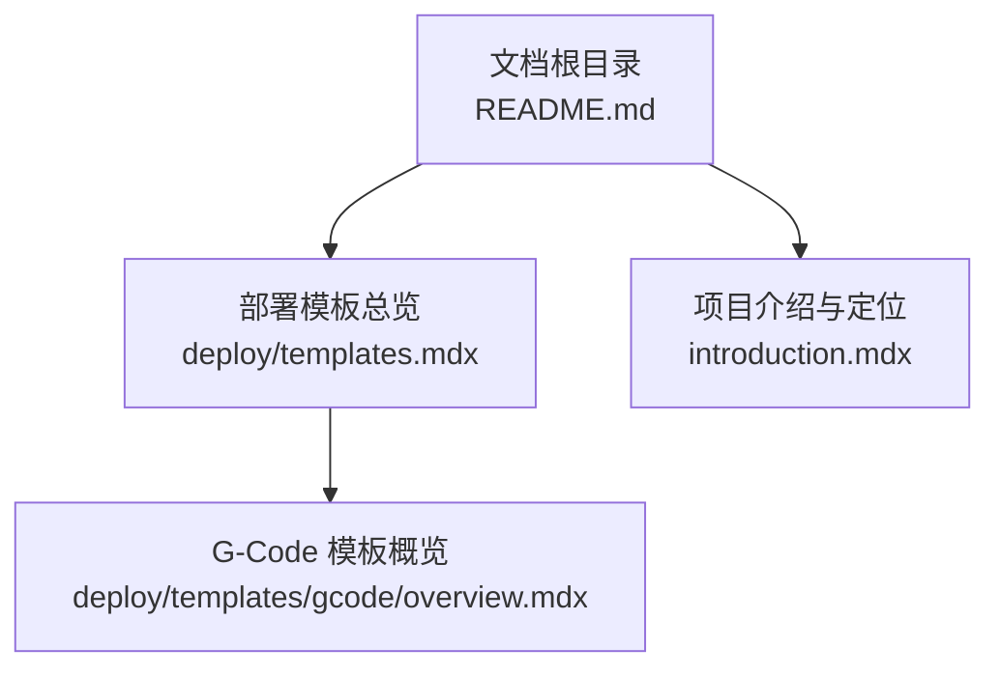
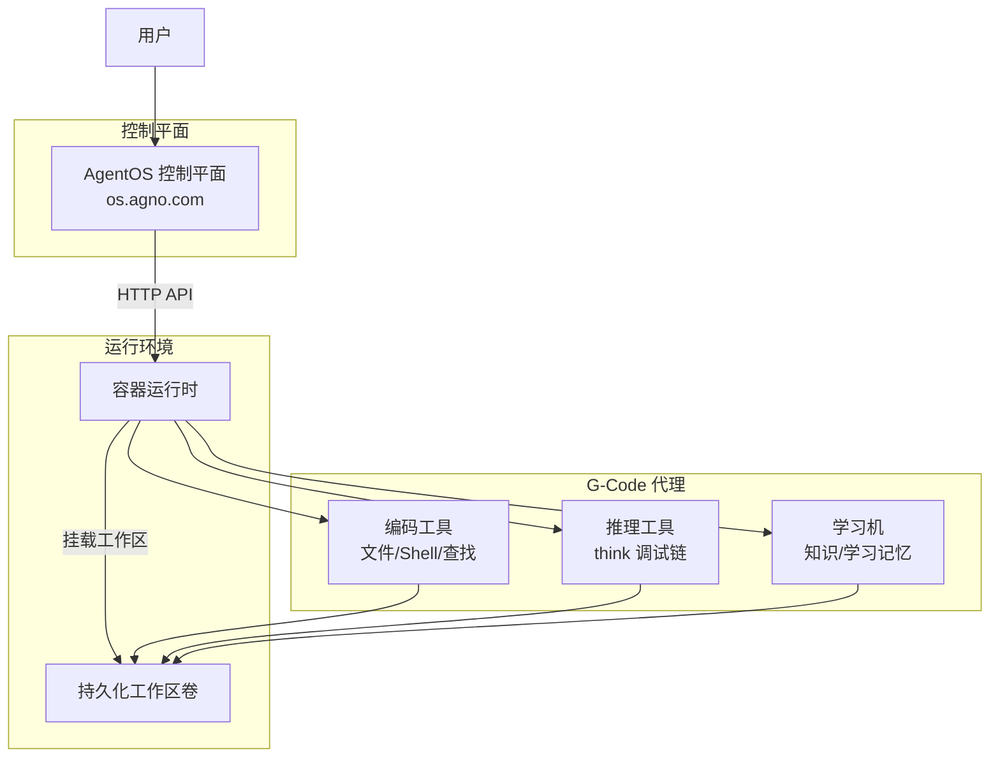
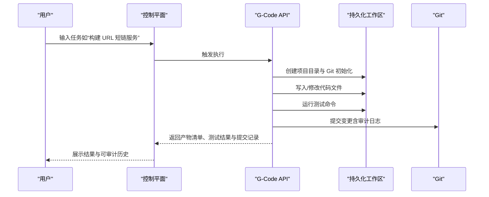
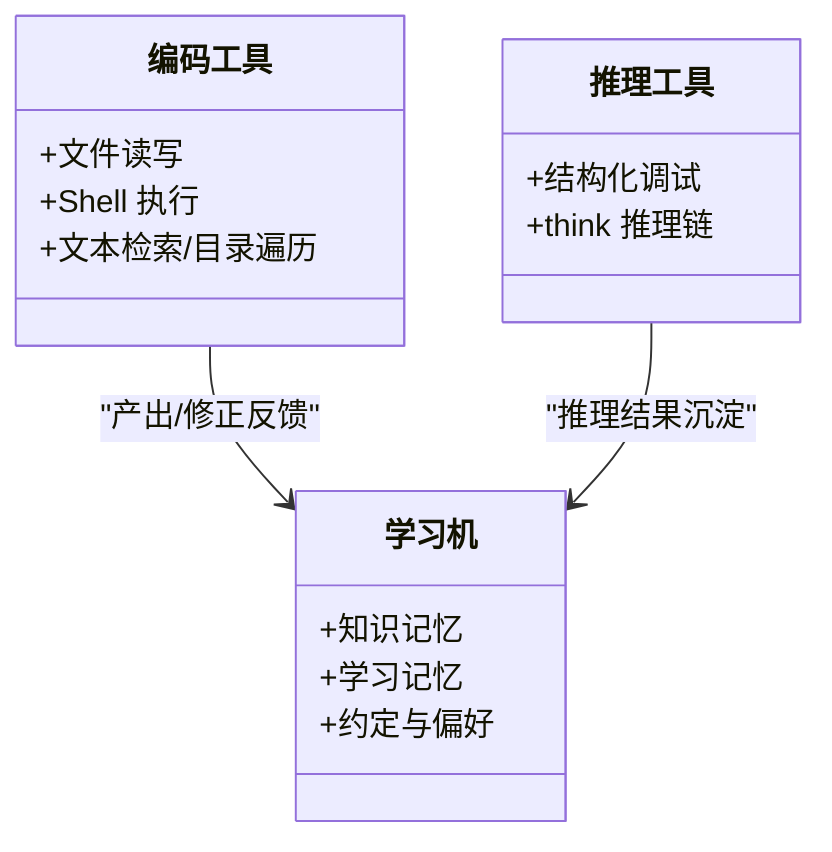
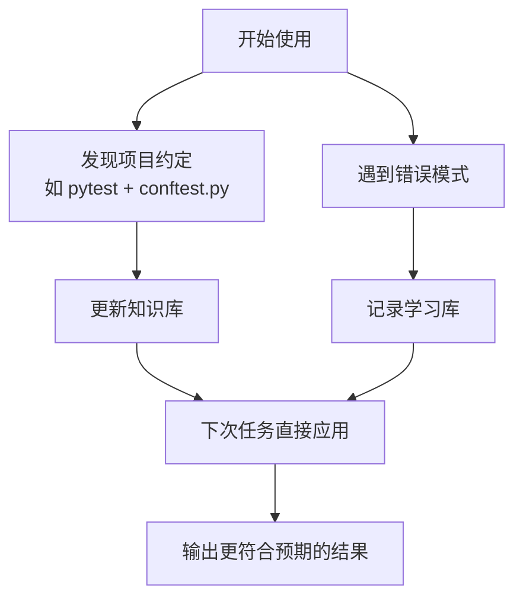
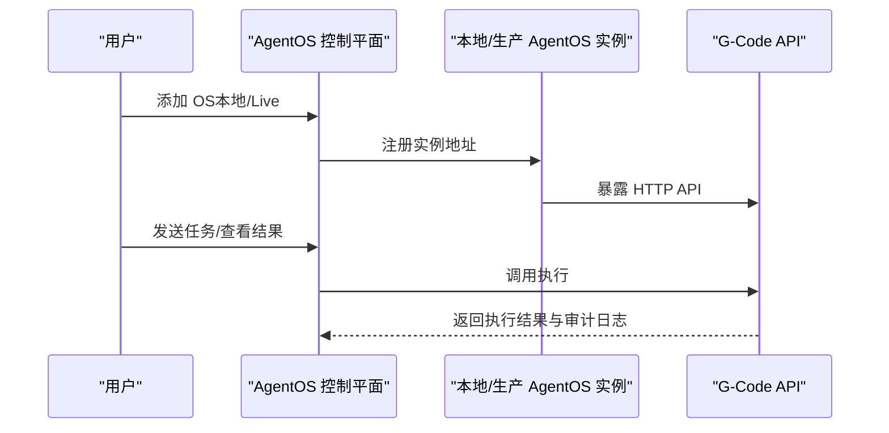
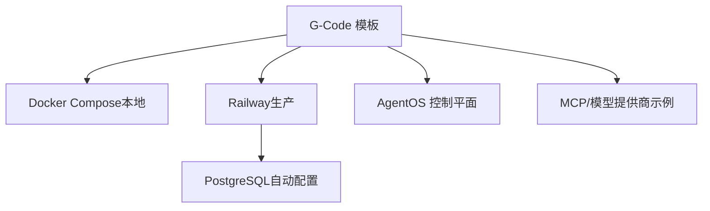

# G-Code 编码代理模板

<cite>
**本文引用的文件**
- [deploy/templates/gcode/overview.mdx](file://deploy/templates/gcode/overview.mdx)
- [deploy/templates.mdx](file://deploy/templates.mdx)
- [introduction.mdx](file://introduction.mdx)
- [README.md](file://README.md)
</cite>

## 目录
1. [简介](#简介)
2. [项目结构](#项目结构)
3. [核心组件](#核心组件)
4. [架构总览](#架构总览)
5. [详细组件分析](#详细组件分析)
6. [依赖关系分析](#依赖关系分析)
7. [性能考虑](#性能考虑)
8. [故障排除指南](#故障排除指南)
9. [结论](#结论)
10. [附录](#附录)

## 简介
本技术文档围绕 G-Code 编码代理模板展开，系统阐述其设计理念、核心能力与使用方法，并重点说明如何将其与 AgentOS 控制平面集成，实现从本地开发到生产部署的完整链路。G-Code 是一个“后 IDE”时代的轻量级编码代理，强调在持久化工作区中进行代码编写、审查、测试与迭代，通过对话式交互完成任务交付；同时具备自学习能力，持续改进对项目约定、错误模式与用户偏好的理解。

- 设计理念：以“容器 + 持久化工作区 + Git 可审计”的方式，确保任务隔离、状态可追溯与行为可复现。
- 核心能力：文件读写编辑、Shell 执行、代码审查与调试、测试运行与提交、知识与学习记忆的沉淀与复用。
- 快速部署：提供本地 Docker Compose 一键启动与 Railway 一键部署脚本，支持控制平面连接与示例提示词。
- 适用场景：快速原型开发、持续迭代的工程任务、需要可审计变更流程的团队协作、以及希望降低工具复杂度的个人开发者。

章节来源
- [introduction.mdx:26](file://introduction.mdx#L26)
- [deploy/templates/gcode/overview.mdx:7](file://deploy/templates/gcode/overview.mdx#L7)
- [deploy/templates/gcode/overview.mdx:35](file://deploy/templates/gcode/overview.mdx#L35)

## 项目结构
本仓库是文档站点（基于 Mintlify），G-Code 模板相关内容主要位于部署模板目录下，入口卡片与对比表位于模板总览页，G-Code 专属概览页提供运行与部署指引。

- 文档根目录包含完整的文档结构与开发说明，便于本地预览与贡献。
- 部署模板目录提供多种平台的模板与对比，其中 G-Code 作为“预构建方案”之一，强调“轻量级编码代理”的定位。
- G-Code 概览页详细描述了其工作原理、工具体系、自学习机制、本地运行与 Railway 部署步骤，以及控制平面连接方式。

图表来源
- [deploy/templates.mdx:37](file://deploy/templates.mdx#L37)
- [deploy/templates/gcode/overview.mdx:1](file://deploy/templates/gcode/overview.mdx#L1)
- [introduction.mdx:26](file://introduction.mdx#L26)

章节来源
- [README.md:1](file://README.md#L1)
- [README.md:20](file://README.md#L20)
- [deploy/templates.mdx:26](file://deploy/templates.mdx#L26)
- [deploy/templates.mdx:37](file://deploy/templates.mdx#L37)
- [deploy/templates/gcode/overview.mdx:1](file://deploy/templates/gcode/overview.mdx#L1)

## 核心组件
G-Code 由三大工具体系与两个自学习系统构成，形成“写-审-测-改”的闭环：

- 编码工具（CodingTools）
  - 职责：文件读写、编辑、Shell 命令、文本检索与目录遍历等基础操作。
  - 价值：在受控工作区内完成代码生成与修改，保证安全边界与可审计性。
- 推理工具（ReasoningTools）
  - 职责：通过“思考”工具进行结构化调试与推理，辅助问题定位与验证。
  - 价值：提升复杂问题的可解释性与可追踪性，减少试错成本。
- 学习机（LearningMachine）
  - 职责：保存并检索项目约定、错误模式与用户偏好，实现“自动学习”。
  - 价值：随着使用次数增加，逐步减少重复劳动，提高一致性与效率。

自学习双系统：
- 知识（Knowledge）：项目结构、测试约定、构建系统等，由用户引导与 G-Code 共同完善。
- 学习（Learnings）：错误模式、代码库特性、用户偏好等，由学习机自动管理与演进。

章节来源
- [deploy/templates/gcode/overview.mdx:35](file://deploy/templates/gcode/overview.mdx#L35)
- [deploy/templates/gcode/overview.mdx:43](file://deploy/templates/gcode/overview.mdx#L43)
- [deploy/templates/gcode/overview.mdx:47](file://deploy/templates/gcode/overview.mdx#L47)

## 架构总览
G-Code 的运行架构建立在“容器 + 持久化工作区 + Git 工作树”的基础上，确保任务间无状态污染且所有变更均可审计。

图表来源
- [deploy/templates/gcode/overview.mdx:15](file://deploy/templates/gcode/overview.mdx#L15)
- [deploy/templates/gcode/overview.mdx:35](file://deploy/templates/gcode/overview.mdx#L35)
- [deploy/templates/gcode/overview.mdx:69](file://deploy/templates/gcode/overview.mdx#L69)

## 详细组件分析

### 组件一：工作流与生命周期
G-Code 的典型工作流包括：接收任务 → 初始化项目（Git 仓库 + 工作树）→ 生成/修改代码 → 运行测试 → 提交变更 → 输出结果与日志。

图表来源
- [deploy/templates/gcode/overview.mdx:19](file://deploy/templates/gcode/overview.mdx#L19)
- [deploy/templates/gcode/overview.mdx:54](file://deploy/templates/gcode/overview.mdx#L54)

章节来源
- [deploy/templates/gcode/overview.mdx:15](file://deploy/templates/gcode/overview.mdx#L15)
- [deploy/templates/gcode/overview.mdx:19](file://deploy/templates/gcode/overview.mdx#L19)

### 组件二：工具体系与职责边界
- 编码工具：负责文件系统与 Shell 操作，确保在受控路径内完成代码生成与修改。
- 推理工具：通过“思考”工具串联问题分析、验证与总结，提升可解释性。
- 学习机：在不侵入业务逻辑的前提下，自动沉淀项目经验与用户偏好，形成“隐式智能”。

图表来源
- [deploy/templates/gcode/overview.mdx:35](file://deploy/templates/gcode/overview.mdx#L35)
- [deploy/templates/gcode/overview.mdx:43](file://deploy/templates/gcode/overview.mdx#L43)

章节来源
- [deploy/templates/gcode/overview.mdx:35](file://deploy/templates/gcode/overview.mdx#L35)
- [deploy/templates/gcode/overview.mdx:43](file://deploy/templates/gcode/overview.mdx#L43)

### 组件三：自学习机制与演进路径
- 知识系统：由用户引导与 G-Code 协同完善，覆盖项目结构、测试约定、构建系统等。
- 学习系统：自动记录错误模式、代码库特性与用户偏好，随使用次数增长而提升效率与一致性。

图表来源
- [deploy/templates/gcode/overview.mdx:47](file://deploy/templates/gcode/overview.mdx#L47)
- [deploy/templates/gcode/overview.mdx:52](file://deploy/templates/gcode/overview.mdx#L52)

章节来源
- [deploy/templates/gcode/overview.mdx:43](file://deploy/templates/gcode/overview.mdx#L43)
- [deploy/templates/gcode/overview.mdx:47](file://deploy/templates/gcode/overview.mdx#L47)
- [deploy/templates/gcode/overview.mdx:52](file://deploy/templates/gcode/overview.mdx#L52)

### 组件四：AgentOS 集成与控制平面
- 本地连接：在控制平面中添加“本地”实例，输入 G-Code API 地址即可接入。
- 生产连接：Railway 部署后，通过“Live”实例接入域名，统一管理与监控。

图表来源
- [deploy/templates/gcode/overview.mdx:69](file://deploy/templates/gcode/overview.mdx#L69)
- [deploy/templates/gcode/overview.mdx:84](file://deploy/templates/gcode/overview.mdx#L84)

章节来源
- [deploy/templates/gcode/overview.mdx:69](file://deploy/templates/gcode/overview.mdx#L69)
- [deploy/templates/gcode/overview.mdx:84](file://deploy/templates/gcode/overview.mdx#L84)

## 依赖关系分析
- 平台与基础设施
  - 容器化运行：依赖 Docker Compose（本地）与 Railway（部署）。
  - 数据存储：Railway 部署脚本会自动配置数据库（PostgreSQL）。
- 控制平面集成
  - AgentOS 控制平面提供统一入口，支持本地与生产两种连接方式。
- 工具与模型
  - 示例中使用主流模型提供商（如 Groq）与 MCP 工具，便于扩展外部能力。

图表来源
- [deploy/templates/gcode/overview.mdx:54](file://deploy/templates/gcode/overview.mdx#L54)
- [deploy/templates/gcode/overview.mdx:75](file://deploy/templates/gcode/overview.mdx#L75)
- [deploy/templates/gcode/overview.mdx:84](file://deploy/templates/gcode/overview.mdx#L84)

章节来源
- [deploy/templates/gcode/overview.mdx:54](file://deploy/templates/gcode/overview.mdx#L54)
- [deploy/templates/gcode/overview.mdx:75](file://deploy/templates/gcode/overview.mdx#L75)
- [deploy/templates/gcode/overview.mdx:84](file://deploy/templates/gcode/overview.mdx#L84)

## 性能考虑
- 任务隔离与可审计
  - 使用 Git 工作树隔离任务，避免状态污染，便于回滚与复盘。
- 安全边界
  - 工作区沙箱限制在特定路径，操作系统权限强制边界，降低风险面。
- 部署效率
  - 本地 Docker Compose 与 Railway 一键部署，缩短上线时间。
- 自学习收益
  - 随着使用次数增加，知识与学习记忆逐步提升任务完成质量与速度。

章节来源
- [deploy/templates/gcode/overview.mdx:17](file://deploy/templates/gcode/overview.mdx#L17)
- [deploy/templates/gcode/overview.mdx:29](file://deploy/templates/gcode/overview.mdx#L29)
- [deploy/templates/gcode/overview.mdx:54](file://deploy/templates/gcode/overview.mdx#L54)
- [deploy/templates/gcode/overview.mdx:75](file://deploy/templates/gcode/overview.mdx#L75)

## 故障排除指南
- 本地无法访问 API
  - 确认本地服务已启动并在指定端口暴露接口，参考本地运行步骤。
- 控制平面无法连接
  - 检查实例地址是否正确，确认网络可达与防火墙放通。
- Railway 部署失败
  - 查看部署脚本输出与数据库初始化日志，确认环境变量与资源配额。
- 权限与安全
  - 工作区仅限受控路径，若出现访问异常，检查容器权限与挂载卷设置。

章节来源
- [deploy/templates/gcode/overview.mdx:67](file://deploy/templates/gcode/overview.mdx#L67)
- [deploy/templates/gcode/overview.mdx:69](file://deploy/templates/gcode/overview.mdx#L69)
- [deploy/templates/gcode/overview.mdx:84](file://deploy/templates/gcode/overview.mdx#L84)
- [deploy/templates/gcode/overview.mdx:29](file://deploy/templates/gcode/overview.mdx#L29)

## 结论
G-Code 编码代理模板以“轻量化、可审计、可学习”为核心，结合容器化与持久化工作区，提供从本地到生产的无缝体验。通过与 AgentOS 控制平面集成，用户可在统一界面中发起任务、观察过程、复核结果并持续优化。对于需要快速交付、强调可追溯与持续改进的工程团队，G-Code 是一个高性价比的选择。

## 附录

### 安装与配置指南（摘要）
- 本地运行
  - 克隆仓库、复制示例环境文件、填写必要密钥、启动容器服务。
- 控制平面连接
  - 在控制平面添加本地实例，输入本地 API 地址。
- 生产部署（Railway）
  - 登录 Railway，执行部署脚本，自动配置数据库与环境变量，随后添加“Live”实例。

章节来源
- [deploy/templates/gcode/overview.mdx:54](file://deploy/templates/gcode/overview.mdx#L54)
- [deploy/templates/gcode/overview.mdx:69](file://deploy/templates/gcode/overview.mdx#L69)
- [deploy/templates/gcode/overview.mdx:75](file://deploy/templates/gcode/overview.mdx#L75)
- [deploy/templates/gcode/overview.mdx:84](file://deploy/templates/gcode/overview.mdx#L84)

### 使用示例（提示词）
- 构建一个带测试的 FastAPI 增删改查应用
- 为现有项目添加认证模块
- 修复某个项目的失败测试
- 对代码库进行安全问题审查
- 查询该项目遵循的工程约定

章节来源
- [deploy/templates/gcode/overview.mdx:90](file://deploy/templates/gcode/overview.mdx#L90)
- [deploy/templates/gcode/overview.mdx:94](file://deploy/templates/gcode/overview.mdx#L94)
- [deploy/templates/gcode/overview.mdx:95](file://deploy/templates/gcode/overview.mdx#L95)
- [deploy/templates/gcode/overview.mdx:96](file://deploy/templates/gcode/overview.mdx#L96)
- [deploy/templates/gcode/overview.mdx:97](file://deploy/templates/gcode/overview.mdx#L97)
- [deploy/templates/gcode/overview.mdx:98](file://deploy/templates/gcode/overview.mdx#L98)

### 与其他模板的对比（摘要）
- Docker：适合本地开发与自托管，上手快。
- Railway：适合快速上线与 MVP，无需管理基础设施。
- AWS：适合大规模生产与企业级可靠性。
- G-Code：面向“后 IDE”的轻量级编码代理，强调可审计与自学习。

章节来源
- [deploy/templates.mdx:44](file://deploy/templates.mdx#L44)
- [deploy/templates.mdx:46](file://deploy/templates.mdx#L46)
- [deploy/templates.mdx:47](file://deploy/templates.mdx#L47)
- [deploy/templates.mdx:48](file://deploy/templates.mdx#L48)