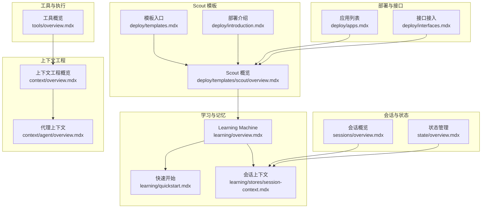
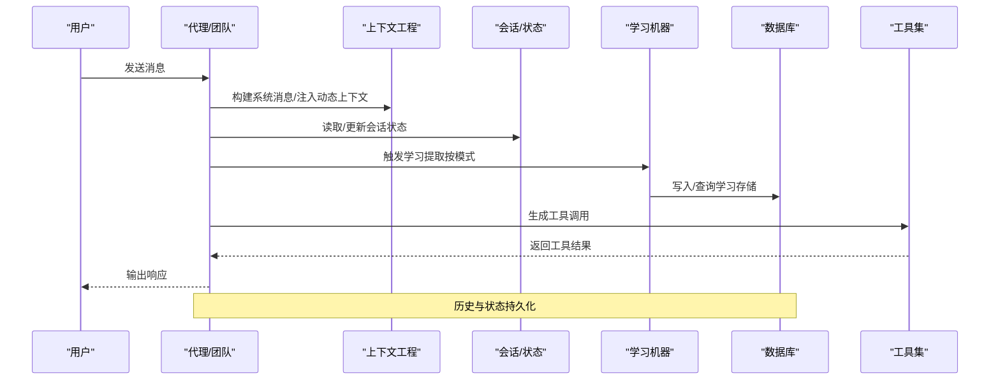
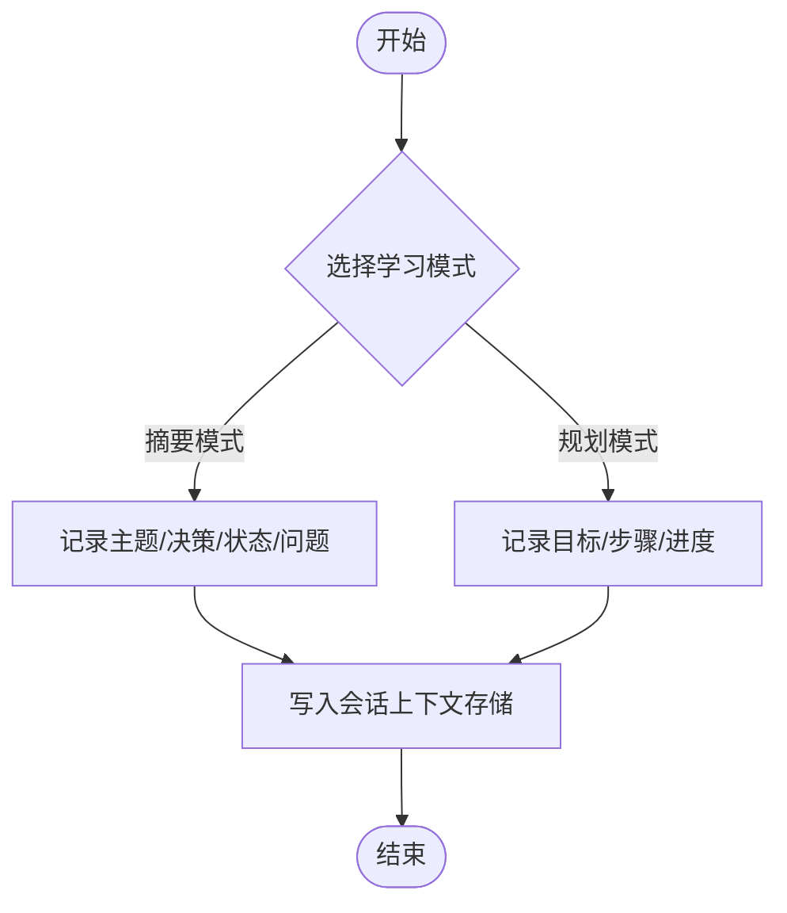
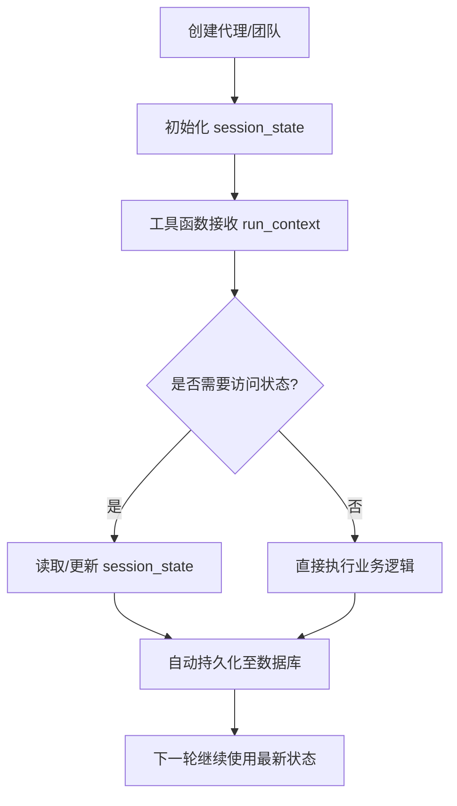
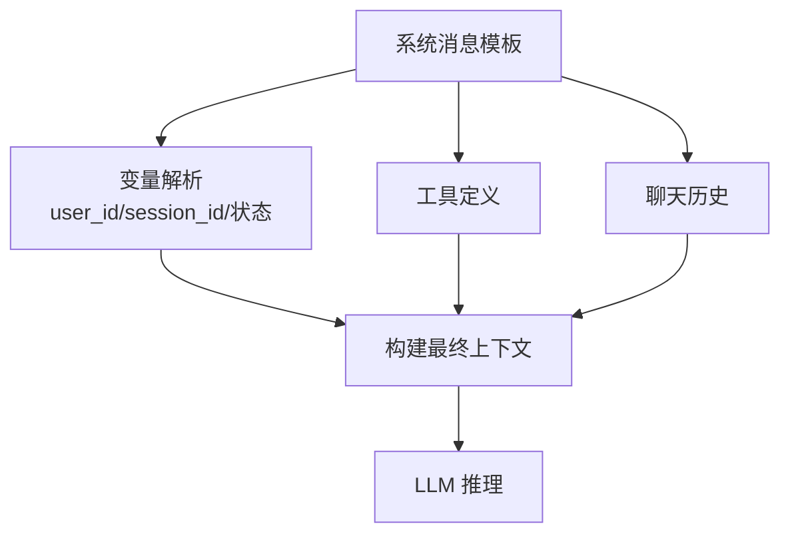
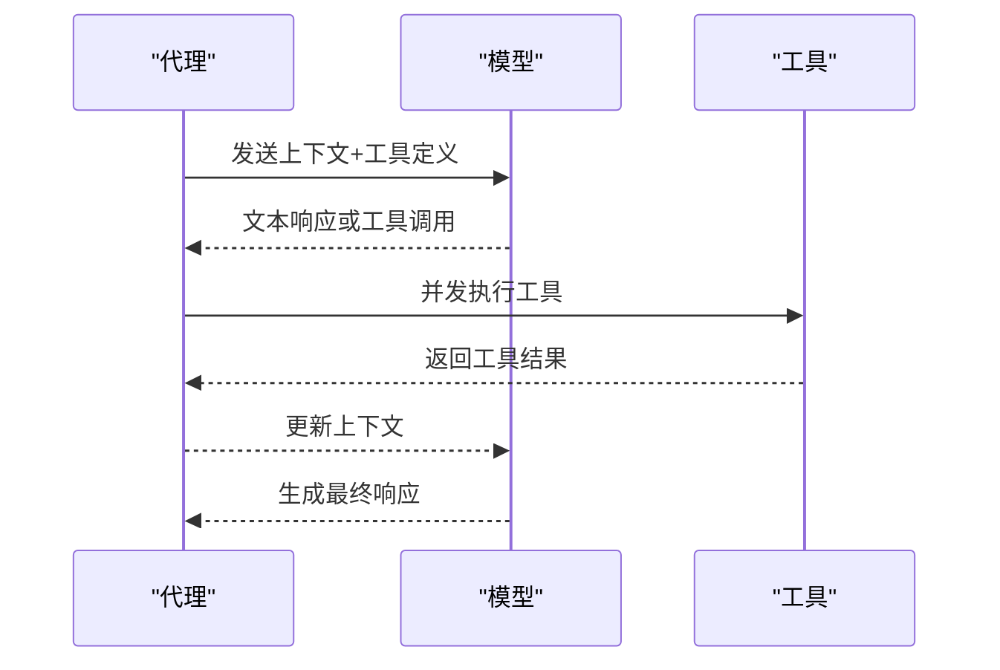
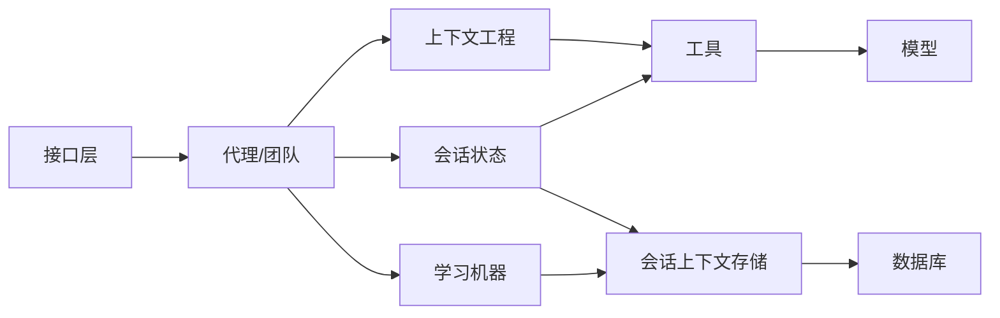

# Scout 上下文代理模板

<cite>
**本文引用的文件**
- [deploy/templates.mdx](file://deploy/templates.mdx)
- [deploy/introduction.mdx](file://deploy/introduction.mdx)
- [deploy/templates/scout/overview.mdx](file://deploy/templates/scout/overview.mdx)
- [learning/overview.mdx](file://learning/overview.mdx)
- [learning/quickstart.mdx](file://learning/quickstart.mdx)
- [learning/stores/session-context.mdx](file://learning/stores/session-context.mdx)
- [sessions/overview.mdx](file://sessions/overview.mdx)
- [state/overview.mdx](file://state/overview.mdx)
- [context/overview.mdx](file://context/overview.mdx)
- [context/agent/overview.mdx](file://context/agent/overview.mdx)
- [examples/learning/session-context/planning-mode.mdx](file://examples/learning/session-context/planning-mode.mdx)
- [examples/learning/basics/b-session-context-planning.mdx](file://examples/learning/basics/b-session-context-planning.mdx)
- [deploy/apps.mdx](file://deploy/apps.mdx)
- [deploy/interfaces.mdx](file://deploy/interfaces.mdx)
- [tools/overview.mdx](file://tools/overview.mdx)
</cite>

## 目录
1. [简介](#简介)
2. [项目结构](#项目结构)
3. [核心组件](#核心组件)
4. [架构总览](#架构总览)
5. [组件详解](#组件详解)
6. [依赖关系分析](#依赖关系分析)
7. [性能考量](#性能考量)
8. [故障排查指南](#故障排查指南)
9. [结论](#结论)
10. [附录](#附录)

## 简介
Scout 是一个“自我管理上下文代理”的模板，旨在通过自动化的上下文管理与学习模式，降低用户的手动配置与维护成本，提升代理系统在多轮对话、复杂任务与跨会话场景中的效率与一致性。Scout 将上下文工程（Context Engineering）、会话状态（Session State）与学习存储（Learning Stores）有机结合，形成“自动感知—自动总结—自动优化”的闭环。

- 自我管理上下文：自动识别并注入关键上下文，避免长对话丢失早期信息。
- 自动学习模式：支持摘要模式与规划模式，按需追踪目标、步骤与进度。
- 持续改进：结合 Session Context Store 与 Curator 维护机制，保持知识新鲜度与准确性。
- 部署即用：基于模板快速落地，支持本地开发与云平台生产部署。

本指南将从系统架构、组件设计、数据流与处理逻辑、部署与配置、最佳实践等方面，全面阐述如何使用与扩展 Scout 模板。

**章节来源**
- [deploy/templates.mdx:34-36](file://deploy/templates.mdx#L34-L36)
- [deploy/introduction.mdx:39-40](file://deploy/introduction.mdx#L39-L40)

## 项目结构
Scout 属于“预构建解决方案”之一，位于部署模板目录中。其核心能力由以下模块协同实现：
- 学习与记忆：Learning Machine、Session Context Store、Curator
- 会话与状态：Sessions、Session State
- 上下文工程：System Message、User Message、Chat History、动态上下文注入
- 工具与执行：工具定义、并发工具调用、RunContext 注入
- 部署与接口：模板选择、应用装配、消息平台与协议接入

**图示来源**
- [deploy/templates.mdx:34-36](file://deploy/templates.mdx#L34-L36)
- [deploy/introduction.mdx:39-40](file://deploy/introduction.mdx#L39-L40)
- [deploy/templates/scout/overview.mdx:5-7](file://deploy/templates/scout/overview.mdx#L5-L7)
- [learning/overview.mdx:8-22](file://learning/overview.mdx#L8-L22)
- [learning/quickstart.mdx:10-24](file://learning/quickstart.mdx#L10-L24)
- [learning/stores/session-context.mdx:45-90](file://learning/stores/session-context.mdx#L45-L90)
- [sessions/overview.mdx:12-28](file://sessions/overview.mdx#L12-L28)
- [state/overview.mdx:8-20](file://state/overview.mdx#L8-L20)
- [context/overview.mdx:8-18](file://context/overview.mdx#L8-L18)
- [context/agent/overview.mdx:11-25](file://context/agent/overview.mdx#L11-L25)
- [tools/overview.mdx:50-58](file://tools/overview.mdx#L50-L58)
- [deploy/apps.mdx:6-8](file://deploy/apps.mdx#L6-L8)
- [deploy/interfaces.mdx:6-38](file://deploy/interfaces.mdx#L6-L38)

**章节来源**
- [deploy/templates.mdx:34-36](file://deploy/templates.mdx#L34-L36)
- [deploy/introduction.mdx:39-40](file://deploy/introduction.mdx#L39-L40)
- [deploy/templates/scout/overview.mdx:5-7](file://deploy/templates/scout/overview.mdx#L5-L7)

## 核心组件
- 学习机器（Learning Machine）
  - 将代理转变为“可学习”的系统，结合多种学习存储（用户画像、用户记忆、会话上下文、实体记忆、已学知识、决策日志）。
  - 支持 Always、Agentic、Propose 三种学习模式，按需控制提取时机与权限。
- 会话上下文（Session Context）
  - 摘要模式：捕捉当前工作主题、关键决策、状态与未决问题。
  - 规划模式：启用目标、步骤与进度跟踪，适合复杂多步任务。
- 会话与状态（Sessions & Session State）
  - 会话是多轮对话线程，包含历史、状态与指标；状态在工具中通过 RunContext 访问与持久化。
- 上下文工程（Context Engineering）
  - 系统消息由描述、指令与期望输出构成；可动态注入变量、状态与检索到的数据。
- 工具与执行（Tools）
  - 工具函数自动转换为模型可用的工具定义；支持并发执行与 RunContext 注入，便于跨轮次共享状态。

**章节来源**
- [learning/overview.mdx:8-38](file://learning/overview.mdx#L8-L38)
- [learning/quickstart.mdx:10-93](file://learning/quickstart.mdx#L10-L93)
- [learning/stores/session-context.mdx:45-90](file://learning/stores/session-context.mdx#L45-L90)
- [sessions/overview.mdx:12-28](file://sessions/overview.mdx#L12-L28)
- [state/overview.mdx:8-20](file://state/overview.mdx#L8-L20)
- [context/overview.mdx:8-18](file://context/overview.mdx#L8-L18)
- [tools/overview.mdx:50-58](file://tools/overview.mdx#L50-L58)

## 架构总览
Scout 的运行时架构围绕“上下文—状态—学习—工具—接口”展开，形成闭环：

**图示来源**
- [context/agent/overview.mdx:11-25](file://context/agent/overview.mdx#L11-L25)
- [state/overview.mdx:14-19](file://state/overview.mdx#L14-L19)
- [learning/overview.mdx:39-48](file://learning/overview.mdx#L39-L48)
- [tools/overview.mdx:50-58](file://tools/overview.mdx#L50-L58)

## 组件详解

### 会话上下文与学习模式
- 摘要模式：默认行为，聚焦“正在做什么、做了什么、当前状态、未决问题”，适合常规对话与知识问答。
- 规划模式：开启后跟踪目标、计划步骤与完成情况，适合需要长期推进的复杂任务。
- 数据模型：会话上下文以结构化 XML 片段形式保存，便于检索与审计。
- 使用建议：对多步任务启用规划模式；对短对话或问答启用摘要模式以降低成本。

**图示来源**
- [learning/stores/session-context.mdx:45-90](file://learning/stores/session-context.mdx#L45-L90)
- [examples/learning/session-context/planning-mode.mdx:91-116](file://examples/learning/session-context/planning-mode.mdx#L91-L116)
- [examples/learning/basics/b-session-context-planning.mdx:68-106](file://examples/learning/basics/b-session-context-planning.mdx#L68-L106)

**章节来源**
- [learning/stores/session-context.mdx:45-90](file://learning/stores/session-context.mdx#L45-L90)
- [examples/learning/session-context/planning-mode.mdx:91-116](file://examples/learning/session-context/planning-mode.mdx#L91-L116)
- [examples/learning/basics/b-session-context-planning.mdx:68-106](file://examples/learning/basics/b-session-context-planning.mdx#L68-L106)

### 会话与状态管理
- 会话：一次多轮交互的线程，包含 run_id 与 session_id；需要数据库才能持久化历史与状态。
- 多用户隔离：通过 user_id 区分不同用户，session_id 区分同一用户的多个会话。
- 状态访问：工具通过 run_context.session_state 访问与更新状态，自动持久化。
- 实践要点：为复杂流程初始化默认状态；在工具中读取状态以驱动后续步骤。

**图示来源**
- [state/overview.mdx:14-19](file://state/overview.mdx#L14-L19)
- [sessions/overview.mdx:12-28](file://sessions/overview.mdx#L12-L28)

**章节来源**
- [state/overview.mdx:8-20](file://state/overview.mdx#L8-L20)
- [sessions/overview.mdx:12-28](file://sessions/overview.mdx#L12-L28)

### 上下文工程与动态注入
- 系统消息由描述、指令与期望输出组成；可注入变量、状态与检索到的知识片段。
- 动态上下文：根据 user_id、session_id 或 run_context 动态拼接提示词，提升个性化与一致性。
- 最佳实践：将“角色设定 + 任务约束 + 可变上下文”组合为稳定的系统消息模板。

**图示来源**
- [context/overview.mdx:8-18](file://context/overview.mdx#L8-L18)
- [context/agent/overview.mdx:11-25](file://context/agent/overview.mdx#L11-L25)

**章节来源**
- [context/overview.mdx:8-18](file://context/overview.mdx#L8-L18)
- [context/agent/overview.mdx:11-25](file://context/agent/overview.mdx#L11-L25)

### 工具与并发执行
- 工具定义：函数自动转换为模型可用的 JSON Schema；支持 Pydantic 模型参数。
- 执行模型：模型可请求多个工具调用；异步执行时并发执行以提升吞吐。
- RunContext 注入：工具可直接访问 session_state、依赖与元数据，实现跨轮次状态共享。

**图示来源**
- [tools/overview.mdx:50-58](file://tools/overview.mdx#L50-L58)
- [tools/overview.mdx:160-174](file://tools/overview.mdx#L160-L174)
- [tools/overview.mdx:271-278](file://tools/overview.mdx#L271-L278)

**章节来源**
- [tools/overview.mdx:50-58](file://tools/overview.mdx#L50-L58)
- [tools/overview.mdx:160-174](file://tools/overview.mdx#L160-L174)
- [tools/overview.mdx:271-278](file://tools/overview.mdx#L271-L278)

## 依赖关系分析
- 组件耦合
  - Learning Machine 与 Session Context Store 强耦合，前者决定何时提取与保存，后者承载具体数据。
  - Session State 与 Tools 弱耦合但高频交互，通过 RunContext 注入实现松耦合共享。
  - Context Engineering 与 Tools 共同影响上下文质量，进而影响学习与工具调用效果。
- 外部依赖
  - 数据库：用于持久化会话历史、状态与学习存储。
  - 消息平台与协议：Slack/Discord/Telegram/MCP 等接口层独立于核心逻辑，便于替换与扩展。

**图示来源**
- [learning/overview.mdx:39-48](file://learning/overview.mdx#L39-L48)
- [state/overview.mdx:14-19](file://state/overview.mdx#L14-L19)
- [tools/overview.mdx:50-58](file://tools/overview.mdx#L50-L58)
- [deploy/interfaces.mdx:6-38](file://deploy/interfaces.mdx#L6-L38)

**章节来源**
- [learning/overview.mdx:39-48](file://learning/overview.mdx#L39-L48)
- [state/overview.mdx:14-19](file://state/overview.mdx#L14-L19)
- [tools/overview.mdx:50-58](file://tools/overview.mdx#L50-L58)
- [deploy/interfaces.mdx:6-38](file://deploy/interfaces.mdx#L6-L38)

## 性能考量
- 上下文压缩：对长历史进行摘要，降低 token 消耗。
- 并发工具执行：在支持并行函数调用的模型上，工具并发执行可显著缩短端到端延迟。
- 学习频率控制：在高负载场景下，可将学习模式调整为 Agentic 或 Propose，减少自动提取开销。
- 数据库优化：合理索引与连接池配置，避免成为瓶颈。

[本节为通用指导，无需特定文件来源]

## 故障排查指南
- 会话无持久化
  - 症状：多轮对话无法延续。
  - 排查：确认已配置数据库；检查 session_id 是否正确传递。
  - 参考：[sessions/overview.mdx:22-28](file://sessions/overview.mdx#L22-L28)
- 工具未生效
  - 症状：模型未调用工具或调用失败。
  - 排查：检查工具定义是否正确；确认模型支持并行函数调用；验证工具参数类型。
  - 参考：[tools/overview.mdx:50-58](file://tools/overview.mdx#L50-L58)
- 学习未触发
  - 症状：上下文未随时间改善。
  - 排查：确认学习模式配置；检查 Curator 是否清理过期数据；核对存储后端可用性。
  - 参考：[learning/quickstart.mdx:66-93](file://learning/quickstart.mdx#L66-L93)
- 上下文不一致
  - 症状：不同轮次上下文缺失或冲突。
  - 排查：检查动态上下文注入逻辑；确保 RunContext 注入顺序正确。
  - 参考：[context/agent/overview.mdx:11-25](file://context/agent/overview.mdx#L11-L25)

**章节来源**
- [sessions/overview.mdx:22-28](file://sessions/overview.mdx#L22-L28)
- [tools/overview.mdx:50-58](file://tools/overview.mdx#L50-L58)
- [learning/quickstart.mdx:66-93](file://learning/quickstart.mdx#L66-L93)
- [context/agent/overview.mdx:11-25](file://context/agent/overview.mdx#L11-L25)

## 结论
Scout 通过“上下文工程 + 会话状态 + 学习存储 + 工具执行”的一体化设计，实现了代理系统的自我管理与持续优化。它降低了用户在多轮对话、复杂任务与跨会话场景中的配置与维护成本，同时提供了灵活的部署与接口扩展能力。建议在生产环境中结合数据库与接口层，按需启用规划模式与并发工具执行，并通过 Curator 与学习模式实现可持续改进。

[本节为总结性内容，无需特定文件来源]

## 附录

### 部署与配置指南（Scout 模板）
- 选择模板
  - 预构建解决方案中包含 Scout，适合快速落地“自我管理上下文代理”。
  - 参考：[deploy/templates.mdx:34-36](file://deploy/templates.mdx#L34-L36)
- 应用装配
  - 在模板基础上添加应用（如研究代理、知识代理等），按需扩展能力。
  - 参考：[deploy/apps.mdx:6-8](file://deploy/apps.mdx#L6-L8)
- 接口接入
  - 连接 Slack、Discord、WhatsApp、Telegram 或 MCP 协议，暴露给最终用户。
  - 参考：[deploy/interfaces.mdx:6-38](file://deploy/interfaces.mdx#L6-L38)
- 本地开发与生产部署
  - 本地开发可参考“空白画布”模板（Docker/Railway/AWS）进行环境搭建。
  - 参考：[deploy/introduction.mdx:11-48](file://deploy/introduction.mdx#L11-L48)

**章节来源**
- [deploy/templates.mdx:34-36](file://deploy/templates.mdx#L34-L36)
- [deploy/apps.mdx:6-8](file://deploy/apps.mdx#L6-L8)
- [deploy/interfaces.mdx:6-38](file://deploy/interfaces.mdx#L6-L38)
- [deploy/introduction.mdx:11-48](file://deploy/introduction.mdx#L11-L48)

### 使用示例与最佳实践
- 示例参考
  - 规划模式示例：展示如何启用规划模式并跟踪进度。
    - [examples/learning/session-context/planning-mode.mdx:91-116](file://examples/learning/session-context/planning-mode.mdx#L91-L116)
  - 基础规划示例：展示回合推进与上下文打印。
    - [examples/learning/basics/b-session-context-planning.mdx:68-106](file://examples/learning/basics/b-session-context-planning.mdx#L68-L106)
- 最佳实践
  - 对复杂任务启用规划模式；对常规问答使用摘要模式。
  - 在工具中通过 RunContext 访问状态，避免重复计算。
  - 合理配置学习模式，平衡效果与性能。
  - 使用上下文工程模板化系统消息，确保一致性与可维护性。

**章节来源**
- [examples/learning/session-context/planning-mode.mdx:91-116](file://examples/learning/session-context/planning-mode.mdx#L91-L116)
- [examples/learning/basics/b-session-context-planning.mdx:68-106](file://examples/learning/basics/b-session-context-planning.mdx#L68-L106)
- [tools/overview.mdx:271-278](file://tools/overview.mdx#L271-L278)
- [learning/stores/session-context.mdx:45-90](file://learning/stores/session-context.mdx#L45-L90)