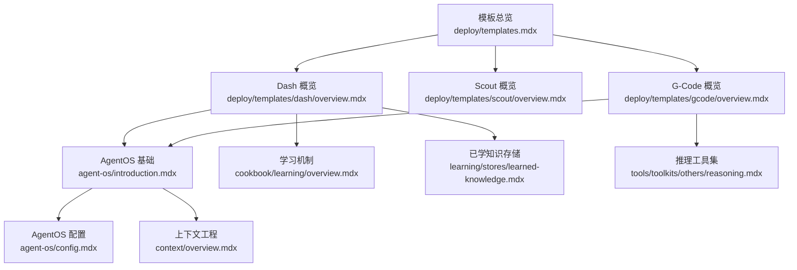
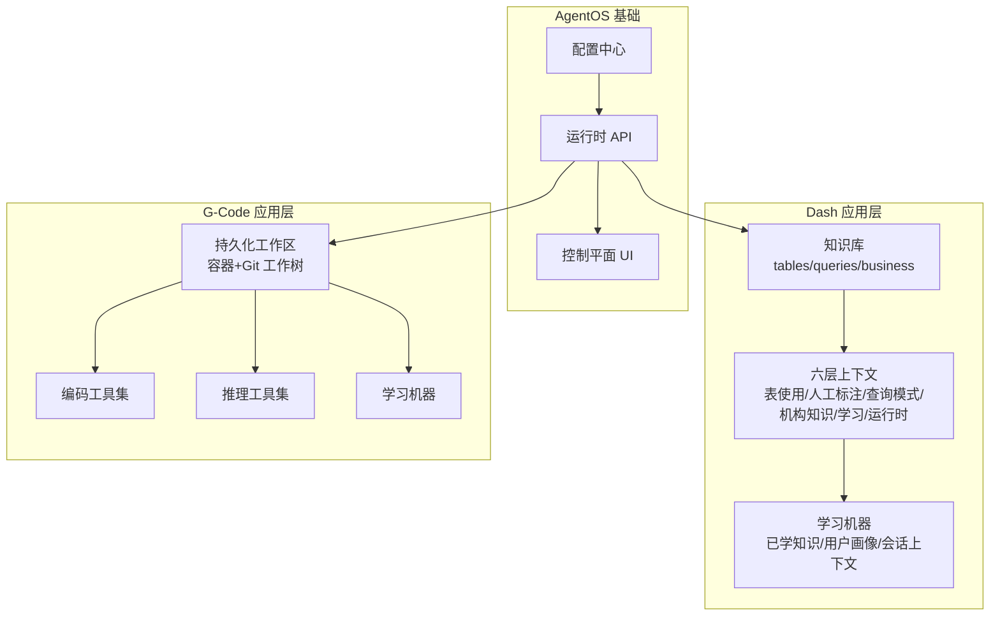
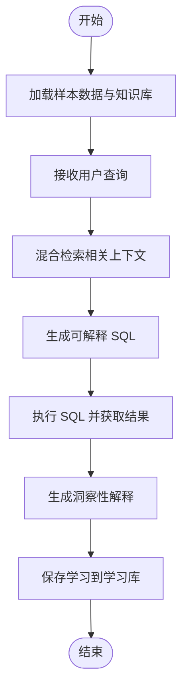
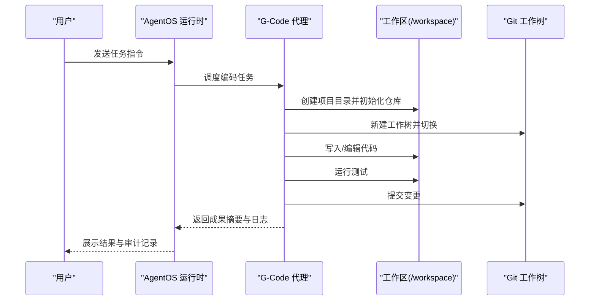
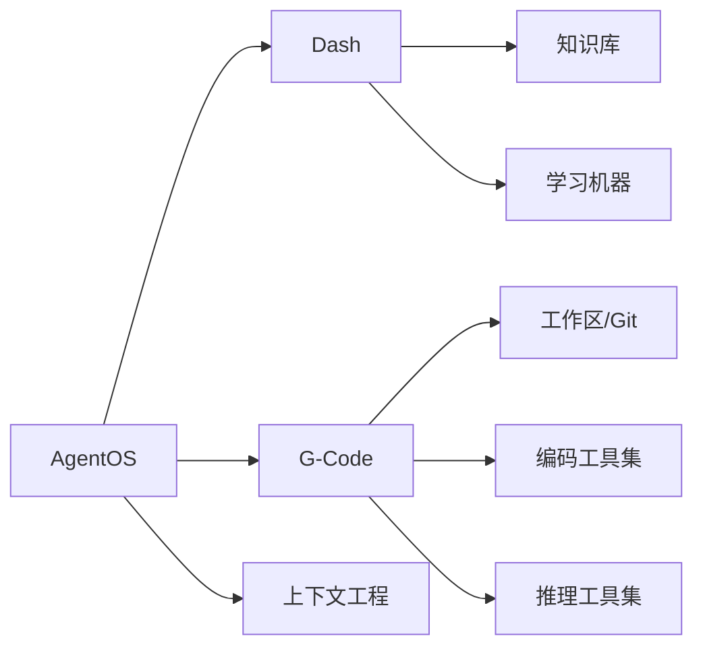

# 预构建解决方案

<cite>
**本文引用的文件**
- [deploy/templates.mdx](file://deploy/templates.mdx)
- [deploy/templates/dash/overview.mdx](file://deploy/templates/dash/overview.mdx)
- [deploy/templates/gcode/overview.mdx](file://deploy/templates/gcode/overview.mdx)
- [agent-os/introduction.mdx](file://agent-os/introduction.mdx)
- [agent-os/config.mdx](file://agent-os/config.mdx)
- [learning/stores/learned-knowledge.mdx](file://learning/stores/learned-knowledge.mdx)
- [cookbook/learning/overview.mdx](file://cookbook/learning/overview.mdx)
- [tools/toolkits/others/reasoning.mdx](file://tools/toolkits/others/reasoning.mdx)
- [context/overview.mdx](file://context/overview.mdx)
- [examples/learning/quickstart/learned-knowledge.mdx](file://examples/learning/quickstart/learned-knowledge.mdx)
- [FAQ/agentos-connection.mdx](file://faq/agentos-connection.mdx)
</cite>

## 目录
1. [简介](#简介)
2. [项目结构](#项目结构)
3. [核心组件](#核心组件)
4. [架构总览](#架构总览)
5. [详细组件分析](#详细组件分析)
6. [依赖关系分析](#依赖关系分析)
7. [性能考虑](#性能考虑)
8. [故障排查指南](#故障排查指南)
9. [结论](#结论)
10. [附录](#附录)

## 简介
本文件面向“预构建解决方案”的三款应用模板：Dash（自学习数据代理）、Scout（自我管理上下文代理）与 G-Code（轻量级编码代理）。我们将从功能特性、使用场景、部署步骤、配置参数与定制选项入手，解释这些模板如何在 AgentOS 基础之上集成特定能力，并给出使用案例、最佳实践与扩展指导。

## 项目结构
- 模板概览页面展示了三种“预构建解决方案”及其对比维度，便于快速选择适合的模板。
- Dash 与 G-Code 提供了完整的本地运行、Railway 部署、示例提示、知识加载与评估等说明。
- Scout 模板当前处于待完善状态，建议关注后续更新或参考 Dash/G-Code 的实现模式进行迁移。

**图表来源**
- [deploy/templates.mdx:1-48](file://deploy/templates.mdx#L1-L48)
- [deploy/templates/dash/overview.mdx:1-144](file://deploy/templates/dash/overview.mdx#L1-L144)
- [deploy/templates/gcode/overview.mdx:1-102](file://deploy/templates/gcode/overview.mdx#L1-L102)
- [agent-os/introduction.mdx:1-113](file://agent-os/introduction.mdx#L1-L113)
- [agent-os/config.mdx:1-213](file://agent-os/config.mdx#L1-L213)
- [cookbook/learning/overview.mdx:1-42](file://cookbook/learning/overview.mdx#L1-L42)
- [learning/stores/learned-knowledge.mdx:43-214](file://learning/stores/learned-knowledge.mdx#L43-L214)
- [tools/toolkits/others/reasoning.mdx:1-48](file://tools/toolkits/others/reasoning.mdx#L1-L48)
- [context/overview.mdx:1-69](file://context/overview.mdx#L1-L69)

**章节来源**
- [deploy/templates.mdx:1-48](file://deploy/templates.mdx#L1-L48)

## 核心组件
- AgentOS 运行时与控制平面：提供生产级 API、数据所有权、请求隔离、安全与可观测性，支持通过浏览器直连控制平面。
- 学习机器（Learning Machine）：统一管理用户画像、会话上下文、实体记忆、已学知识等多类学习存储，支持聚合与跨用户传递。
- 推理工具集（ReasoningTools）：提供结构化思考与分析能力，辅助复杂问题求解。
- 上下文工程：通过系统消息、历史与附加输入设计，引导模型行为与输出质量。

**章节来源**
- [agent-os/introduction.mdx:1-113](file://agent-os/introduction.mdx#L1-L113)
- [agent-os/config.mdx:1-213](file://agent-os/config.mdx#L1-L213)
- [cookbook/learning/overview.mdx:1-42](file://cookbook/learning/overview.mdx#L1-L42)
- [learning/stores/learned-knowledge.mdx:43-214](file://learning/stores/learned-knowledge.mdx#L43-L214)
- [tools/toolkits/others/reasoning.mdx:1-48](file://tools/toolkits/others/reasoning.mdx#L1-L48)
- [context/overview.mdx:1-69](file://context/overview.mdx#L1-L69)

## 架构总览
Dash/G-Code 在 AgentOS 之上叠加各自领域的“智能增强层”：
- Dash：以“六层上下文”与“学习机器”为核心，结合知识库与运行时上下文，实现“自学习数据代理”。
- G-Code：以内置容器工作区与 Git 工作树为沙箱边界，结合“编码工具集+推理工具集+学习机器”，实现“自改进编码代理”。

**图表来源**
- [agent-os/introduction.mdx:40-74](file://agent-os/introduction.mdx#L40-L74)
- [deploy/templates/dash/overview.mdx:17-48](file://deploy/templates/dash/overview.mdx#L17-L48)
- [deploy/templates/gcode/overview.mdx:15-53](file://deploy/templates/gcode/overview.mdx#L15-L53)

## 详细组件分析

### Dash：自学习数据代理
- 功能特性
  - 六层上下文：表使用、人工标注、查询模式、机构知识、学习、运行时上下文。
  - 自学习：通过“知识”和“学习”两套互补体系持续改进，无需再训练。
  - 结果解释：不仅返回结果，还能解释“为什么”有用，提升可解释性。
- 使用场景
  - 数据问答与报表生成、业务指标对齐、跨团队知识沉淀。
- 部署与运行
  - 本地：克隆仓库、准备环境变量、Docker Compose 启动、加载示例数据与知识。
  - Railway：一键脚本完成数据库与应用部署，随后加载数据与知识。
  - 控制平面连接：在控制面板添加本地/线上实例并访问 API 文档。
- 配置与定制
  - 知识库目录：knowledge/tables、knowledge/queries、knowledge/business。
  - 评估：支持字符串匹配、LLM 评分与黄金 SQL 对比。
- 最佳实践
  - 将组织内部术语、口径与规则沉淀到知识库，减少歧义。
  - 定期回放失败案例，固化“错误模式”到学习库。
  - 使用示例提示驱动对话，提高回答一致性。

**图表来源**
- [deploy/templates/dash/overview.mdx:13-48](file://deploy/templates/dash/overview.mdx#L13-L48)
- [cookbook/learning/overview.mdx:32-42](file://cookbook/learning/overview.mdx#L32-L42)
- [learning/stores/learned-knowledge.mdx:43-214](file://learning/stores/learned-knowledge.mdx#L43-L214)

**章节来源**
- [deploy/templates/dash/overview.mdx:1-144](file://deploy/templates/dash/overview.mdx#L1-L144)
- [cookbook/learning/overview.mdx:1-42](file://cookbook/learning/overview.mdx#L1-L42)
- [learning/stores/learned-knowledge.mdx:43-214](file://learning/stores/learned-knowledge.mdx#L43-L214)

### Scout：自我管理上下文代理（待完善）
- 当前状态：该页面提示内容即将推出，建议关注后续发布或参考 Dash/G-Code 的实现思路进行迁移。
- 可预期能力（基于命名与 AgentOS 能力推断）
  - 自我管理上下文：在多轮交互中动态维护与压缩上下文，确保长程对话稳定性。
  - 与 AgentOS 集成：通过运行时 API 与控制平面协同，支持可视化调试与治理。

**章节来源**
- [deploy/templates/scout/overview.mdx:1-8](file://deploy/templates/scout/overview.mdx#L1-L8)

### G-Code：轻量级编码代理
- 功能特性
  - 持久化工作区：容器内工作区 + Git 工作树，无状态任务间隔离，变更可审计。
  - 编码工具集：文件读写、Shell、grep/find/ls 等常用操作。
  - 推理工具集：结构化思考与分析，辅助调试与重构。
  - 自学习：保存项目约定、测试规范、常见错误模式，持续改进。
- 使用场景
  - 快速原型开发、自动化测试修复、代码审查与规范检查。
- 部署与运行
  - 本地：克隆仓库、准备环境变量、Docker Compose 启动。
  - Railway：一键脚本完成数据库与应用部署。
  - 控制平面连接：在控制面板添加本地/线上实例。
- 配置与定制
  - 工作区边界：仅限 /workspace，宿主机不可见，权限隔离。
  - 示例提示：围绕 CRUD、鉴权、测试修复、安全审查等任务展开。
- 最佳实践
  - 将项目约定（如测试框架、配置位置）沉淀到学习库。
  - 利用工作树隔离不同任务，保证可回溯与可重复。

**图表来源**
- [deploy/templates/gcode/overview.mdx:15-53](file://deploy/templates/gcode/overview.mdx#L15-L53)
- [tools/toolkits/others/reasoning.mdx:1-48](file://tools/toolkits/others/reasoning.mdx#L1-L48)
- [learning/stores/learned-knowledge.mdx:43-214](file://learning/stores/learned-knowledge.mdx#L43-L214)

**章节来源**
- [deploy/templates/gcode/overview.mdx:1-102](file://deploy/templates/gcode/overview.mdx#L1-L102)
- [tools/toolkits/others/reasoning.mdx:1-48](file://tools/toolkits/others/reasoning.mdx#L1-L48)
- [learning/stores/learned-knowledge.mdx:43-214](file://learning/stores/learned-knowledge.mdx#L43-L214)

## 依赖关系分析
- Dash 依赖
  - AgentOS 运行时与控制平面
  - 知识库（tables/queries/business）
  - 学习机器（已学知识/会话上下文/用户画像）
  - 上下文工程（六层上下文设计）
- G-Code 依赖
  - AgentOS 运行时与控制平面
  - 工作区与 Git 工作树（隔离与审计）
  - 编码工具集与推理工具集
  - 学习机器（项目约定与错误模式）

**图表来源**
- [agent-os/introduction.mdx:40-74](file://agent-os/introduction.mdx#L40-L74)
- [deploy/templates/dash/overview.mdx:17-48](file://deploy/templates/dash/overview.mdx#L17-L48)
- [deploy/templates/gcode/overview.mdx:15-53](file://deploy/templates/gcode/overview.mdx#L15-L53)
- [context/overview.mdx:20-35](file://context/overview.mdx#L20-L35)

**章节来源**
- [agent-os/introduction.mdx:1-113](file://agent-os/introduction.mdx#L1-L113)
- [context/overview.mdx:1-69](file://context/overview.mdx#L1-L69)

## 性能考虑
- 上下文缓存：利用模型侧提示缓存，将静态内容置于系统消息前缀，降低 token 消耗。
- 评估与迭代：Dash 提供多种评估方式，建议在上线前进行基准测试与回归验证。
- 工作区隔离：G-Code 的工作树与 Git 历史有助于快速回滚与增量迭代，避免状态污染。
- 数据库与会话：AgentOS 支持按域配置可用模型与显示名称，便于多租户或多环境管理。

**章节来源**
- [context/overview.mdx:27-41](file://context/overview.mdx#L27-L41)
- [agent-os/config.mdx:67-79](file://agent-os/config.mdx#L67-L79)

## 故障排查指南
- 本地连接控制平面
  - 浏览器兼容性：优先使用 Chrome 或 Edge。
  - 本地隧道：可通过 ngrok 或 Cloudflare Tunnel 将本地端口暴露至公网。
- 环境变量与密钥
  - 确保 .env 中包含必要密钥（如大模型 API Key），并在容器重启后生效。
- 数据与知识加载
  - Dash：确认已加载示例数据与知识库；必要时重建知识库以消除冲突。
  - G-Code：工作区为空属正常，首次任务会自动初始化项目。

**章节来源**
- [FAQ/agentos-connection.mdx:39-61](file://faq/agentos-connection.mdx#L39-L61)
- [deploy/templates/dash/overview.mdx:51-64](file://deploy/templates/dash/overview.mdx#L51-L64)
- [deploy/templates/gcode/overview.mdx:54-67](file://deploy/templates/gcode/overview.mdx#L54-L67)

## 结论
Dash、Scout 与 G-Code 三款模板在 AgentOS 基础上分别聚焦“数据智能”“上下文管理”“编码智能”。Dash 通过“六层上下文+学习机器”实现自学习数据代理；G-Code 依托“工作区+工具集+学习机器”打造自改进编码代理；Scout 则作为未来能力的占位，可借鉴现有模板的设计模式进行演进。结合 AgentOS 的配置中心、上下文工程与学习机制，用户可在本地快速验证、在云平台稳定交付，并持续优化应用效果。

## 附录
- 使用案例与最佳实践
  - Dash：将业务术语与口径沉淀到 business 知识库；定期回放失败案例，固化学习；使用示例提示驱动对话。
  - G-Code：将项目约定与测试规范纳入学习库；利用工作树隔离任务，确保可审计与可回溯。
- 定制与扩展
  - AgentOS 配置：通过 YAML 或配置类定义快速提示、显示名、数据库域配置等。
  - 学习存储：启用用户画像、会话上下文、实体记忆与已学知识，按需组合。
  - 上下文工程：将静态内容前缀化，结合模型侧提示缓存优化成本。

**章节来源**
- [agent-os/config.mdx:18-91](file://agent-os/config.mdx#L18-L91)
- [examples/learning/quickstart/learned-knowledge.mdx:1-32](file://examples/learning/quickstart/learned-knowledge.mdx#L1-L32)
- [context/overview.mdx:20-35](file://context/overview.mdx#L20-L35)