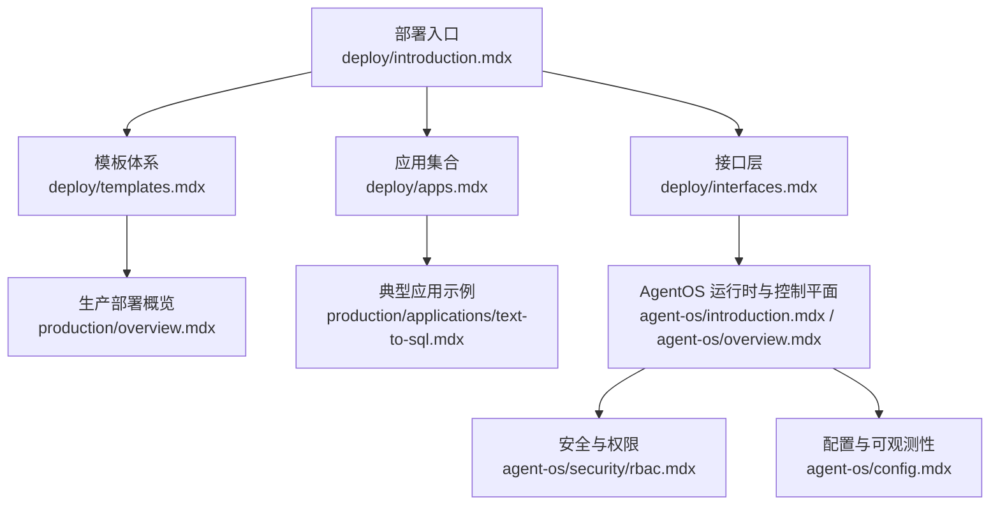
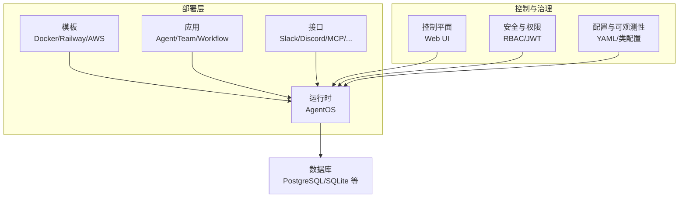
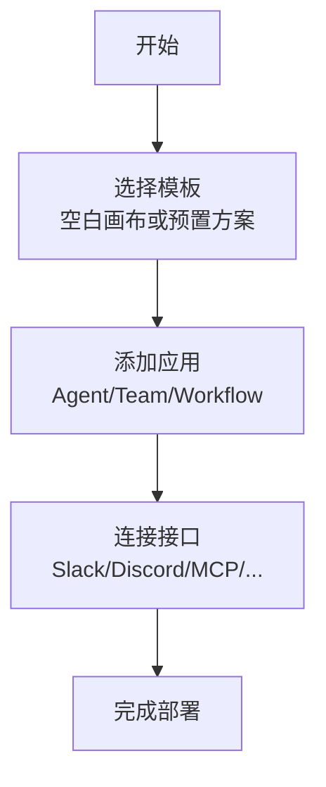
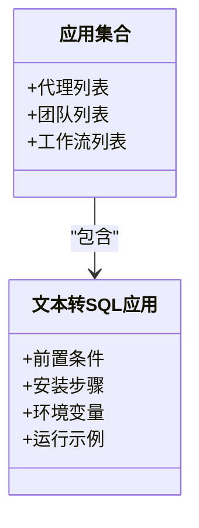
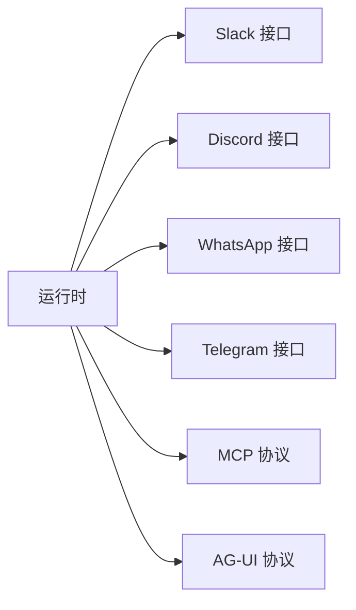
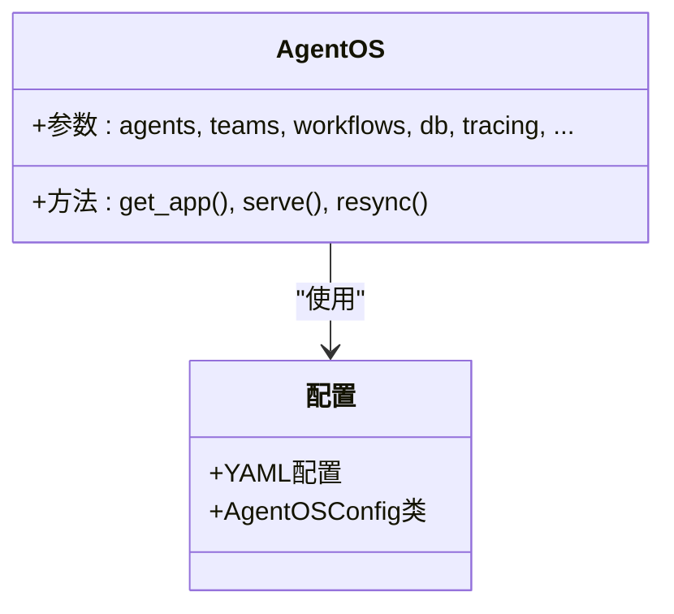
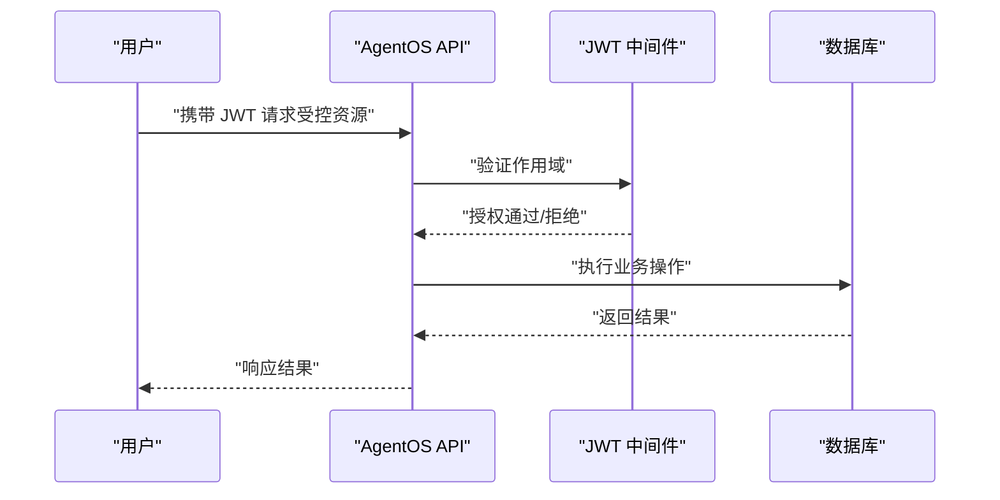
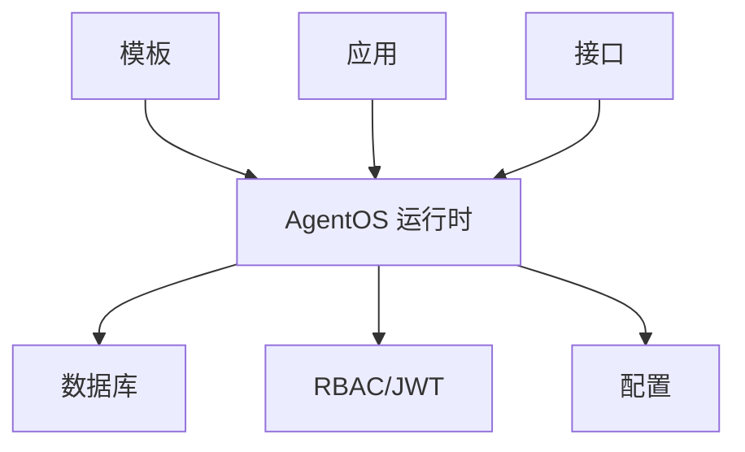

# 部署基础概念

<cite>
**本文引用的文件**
- [deploy/introduction.mdx](file://deploy/introduction.mdx)
- [deploy/templates.mdx](file://deploy/templates.mdx)
- [deploy/apps.mdx](file://deploy/apps.mdx)
- [deploy/interfaces.mdx](file://deploy/interfaces.mdx)
- [production/overview.mdx](file://production/overview.mdx)
- [agent-os/introduction.mdx](file://agent-os/introduction.mdx)
- [agent-os/overview.mdx](file://agent-os/overview.mdx)
- [agent-os/config.mdx](file://agent-os/config.mdx)
- [agent-os/security/rbac.mdx](file://agent-os/security/rbac.mdx)
- [production/applications/text-to-sql.mdx](file://production/applications/text-to-sql.mdx)
</cite>

## 目录
1. [引言](#引言)
2. [项目结构](#项目结构)
3. [核心组件](#核心组件)
4. [架构总览](#架构总览)
5. [详细组件分析](#详细组件分析)
6. [依赖关系分析](#依赖关系分析)
7. [性能考量](#性能考量)
8. [故障排查指南](#故障排查指南)
9. [结论](#结论)
10. [附录](#附录)

## 引言
本章节面向初学者与有经验的开发者，系统性介绍部署基础概念与实践方法。内容涵盖：
- 部署系统的核心理念与目标用户（开发者、运维人员、企业用户）
- 部署的基本流程：从模板到应用再到接口
- 关键组件：运行时、控制平面、数据库、接口层
- 与 AgentOS 运行时的关系及如何通过部署系统实现应用快速上线
- 部署前准备、环境要求、依赖检查与配置准备
- 版本兼容性与升级路径建议
- 为不同层次用户提供认知框架与技术细节

## 项目结构
部署相关内容主要分布在以下模块：
- 部署入口与流程：deploy/introduction.mdx、production/overview.mdx
- 模板体系：deploy/templates.mdx 及各平台模板（Docker、Railway、AWS）
- 应用与接口：deploy/apps.mdx、deploy/interfaces.mdx
- AgentOS 运行时与控制平面：agent-os/introduction.mdx、agent-os/overview.mdx
- 安全与权限：agent-os/security/rbac.mdx
- 配置与可观测性：agent-os/config.mdx
- 典型应用示例：production/applications/text-to-sql.mdx

**图示来源**
- [deploy/introduction.mdx:1-102](file://deploy/introduction.mdx#L1-L102)
- [deploy/templates.mdx:1-48](file://deploy/templates.mdx#L1-L48)
- [deploy/apps.mdx:1-138](file://deploy/apps.mdx#L1-L138)
- [deploy/interfaces.mdx:1-38](file://deploy/interfaces.mdx#L1-L38)
- [production/overview.mdx:1-73](file://production/overview.mdx#L1-L73)
- [agent-os/introduction.mdx:1-113](file://agent-os/introduction.mdx#L1-L113)
- [agent-os/overview.mdx:1-86](file://agent-os/overview.mdx#L1-L86)
- [agent-os/security/rbac.mdx:1-410](file://agent-os/security/rbac.mdx#L1-L410)
- [agent-os/config.mdx:1-213](file://agent-os/config.mdx#L1-L213)
- [production/applications/text-to-sql.mdx:1-261](file://production/applications/text-to-sql.mdx#L1-L261)

**章节来源**
- [deploy/introduction.mdx:1-102](file://deploy/introduction.mdx#L1-L102)
- [deploy/templates.mdx:1-48](file://deploy/templates.mdx#L1-L48)
- [deploy/apps.mdx:1-138](file://deploy/apps.mdx#L1-L138)
- [deploy/interfaces.mdx:1-38](file://deploy/interfaces.mdx#L1-L38)
- [production/overview.mdx:1-73](file://production/overview.mdx#L1-L73)

## 核心组件
- 模板（Templates）：提供可直接克隆的生产级代码基座，覆盖本地开发（Docker）、快速上云（Railway）、企业级（AWS），并内置数据库与部署脚本。
- 应用（Apps）：在部署中运行的智能体、团队与工作流，如文本转 SQL、研究代理、知识代理等。
- 接口（Interfaces）：将应用连接到用户已使用的平台与协议，如 Slack、Discord、WhatsApp、Telegram、MCP、AG-UI。
- AgentOS 运行时与控制平面：提供生产 API、数据所有权、请求隔离、安全与可观测性，并支持通过 UI 管理与调试。
- 安全与权限（RBAC）：基于 JWT 的细粒度权限控制，支持管理员、系统、代理、团队、工作流、会话、记忆、知识、指标与评估等多维度权限映射。
- 配置（Config）：支持 YAML 或配置类两种方式，用于设置显示名、快速提示、数据库域配置、可用模型等。

**章节来源**
- [deploy/templates.mdx:6-48](file://deploy/templates.mdx#L6-L48)
- [deploy/apps.mdx:6-138](file://deploy/apps.mdx#L6-L138)
- [deploy/interfaces.mdx:6-38](file://deploy/interfaces.mdx#L6-L38)
- [agent-os/introduction.mdx:7-113](file://agent-os/introduction.mdx#L7-L113)
- [agent-os/overview.mdx:27-86](file://agent-os/overview.mdx#L27-L86)
- [agent-os/security/rbac.mdx:21-410](file://agent-os/security/rbac.mdx#L21-L410)
- [agent-os/config.mdx:8-213](file://agent-os/config.mdx#L8-L213)

## 架构总览
部署系统以“模板—应用—接口”为主线，结合 AgentOS 运行时与控制平面，形成端到端的生产化能力闭环。模板负责基础设施与运行环境，应用承载业务逻辑，接口打通用户触点；AgentOS 提供统一 API、安全与可观测性，控制平面用于管理与调试。

**图示来源**
- [deploy/introduction.mdx:7-102](file://deploy/introduction.mdx#L7-L102)
- [agent-os/introduction.mdx:40-113](file://agent-os/introduction.mdx#L40-L113)
- [agent-os/security/rbac.mdx:21-410](file://agent-os/security/rbac.mdx#L21-L410)
- [agent-os/config.mdx:18-213](file://agent-os/config.mdx#L18-L213)

## 详细组件分析

### 组件一：部署流程与模板体系
- 流程三步法：选择模板 → 添加应用 → 连接接口
- 模板类型：空白画布（Docker、Railway、AWS）与预置解决方案（Dash、Scout、Gcode）
- 各平台对比：时间成本、适用场景与优势差异

**图示来源**
- [deploy/introduction.mdx:7-102](file://deploy/introduction.mdx#L7-L102)
- [deploy/templates.mdx:6-48](file://deploy/templates.mdx#L6-L48)
- [production/overview.mdx:8-73](file://production/overview.mdx#L8-L73)

**章节来源**
- [deploy/introduction.mdx:7-102](file://deploy/introduction.mdx#L7-L102)
- [deploy/templates.mdx:6-48](file://deploy/templates.mdx#L6-L48)
- [production/overview.mdx:8-73](file://production/overview.mdx#L8-L73)

### 组件二：应用集合与典型场景
- 应用分类：代理（Agent）、团队（Team）、工作流（Workflow）
- 典型应用示例：文本转 SQL、研究代理、知识代理、内容生产团队、销售通话分析等
- 示例应用的前置条件、安装步骤、环境变量与运行要点

**图示来源**
- [deploy/apps.mdx:10-138](file://deploy/apps.mdx#L10-L138)
- [production/applications/text-to-sql.mdx:27-96](file://production/applications/text-to-sql.mdx#L27-L96)

**章节来源**
- [deploy/apps.mdx:6-138](file://deploy/apps.mdx#L6-L138)
- [production/applications/text-to-sql.mdx:27-96](file://production/applications/text-to-sql.mdx#L27-L96)

### 组件三：接口层与用户触点
- 支持平台：Slack、Discord、WhatsApp、Telegram
- 协议支持：MCP、AG-UI
- 扩展能力：按需请求新平台或协议支持

**图示来源**
- [deploy/interfaces.mdx:8-38](file://deploy/interfaces.mdx#L8-L38)

**章节来源**
- [deploy/interfaces.mdx:6-38](file://deploy/interfaces.mdx#L6-L38)

### 组件四：AgentOS 运行时与控制平面
- 运行时职责：提供生产 API、数据存储、请求隔离、可观测性
- 控制平面职责：管理、监控与调试
- 参数与方法：AgentOS 类参数、serve 方法、resync 方法
- 配置方式：YAML 文件或配置类对象

**图示来源**
- [agent-os/overview.mdx:27-86](file://agent-os/overview.mdx#L27-L86)
- [agent-os/config.mdx:18-213](file://agent-os/config.mdx#L18-L213)

**章节来源**
- [agent-os/introduction.mdx:40-113](file://agent-os/introduction.mdx#L40-L113)
- [agent-os/overview.mdx:27-86](file://agent-os/overview.mdx#L27-L86)
- [agent-os/config.mdx:18-213](file://agent-os/config.mdx#L18-L213)

### 组件五：安全与权限（RBAC）
- 权限模型：基于 JWT 的分层作用域
- 范围映射：系统、代理、团队、工作流、会话、记忆、知识、指标、评估等
- 默认与自定义映射：中间件扩展与覆盖
- 错误响应与示例：401/403 场景与令牌结构

**图示来源**
- [agent-os/security/rbac.mdx:21-410](file://agent-os/security/rbac.mdx#L21-L410)

**章节来源**
- [agent-os/security/rbac.mdx:21-410](file://agent-os/security/rbac.mdx#L21-L410)

## 依赖关系分析
- 模板依赖：模板提供运行时与数据库环境，应用与接口依赖运行时暴露的 API
- 运行时依赖：AgentOS 依赖数据库（如 PostgreSQL/SQLite）与可选的 MCP/接口扩展
- 安全依赖：RBAC 依赖 JWT 验证配置与中间件
- 配置依赖：配置文件或配置类决定运行时行为与 UI 展示

**图示来源**
- [deploy/templates.mdx:6-48](file://deploy/templates.mdx#L6-L48)
- [agent-os/overview.mdx:27-86](file://agent-os/overview.mdx#L27-L86)
- [agent-os/security/rbac.mdx:21-410](file://agent-os/security/rbac.mdx#L21-L410)
- [agent-os/config.mdx:18-213](file://agent-os/config.mdx#L18-L213)

**章节来源**
- [deploy/templates.mdx:6-48](file://deploy/templates.mdx#L6-L48)
- [agent-os/overview.mdx:27-86](file://agent-os/overview.mdx#L27-L86)
- [agent-os/security/rbac.mdx:21-410](file://agent-os/security/rbac.mdx#L21-L410)
- [agent-os/config.mdx:18-213](file://agent-os/config.mdx#L18-L213)

## 性能考量
- 数据库性能：合理选择数据库类型与索引策略，避免跨实例高延迟访问
- 并发与扩展：根据流量峰值配置 Worker 数量与容器资源
- 观测性：启用追踪与指标，定期审查慢查询与错误率
- 缓存与降级：对热点接口与知识检索进行缓存与降级策略
- 网络与安全：限制 CORS 源，启用 HTTPS，减少不必要的数据传输

## 故障排查指南
- 数据库连接问题：确认数据库容器状态、端口映射与凭据
- 权限不足：核对 JWT 作用域是否满足端点要求
- 配置不生效：检查 YAML 路径或配置类字段是否正确
- 接口不可达：验证路由映射、中间件顺序与网关配置

**章节来源**
- [production/applications/text-to-sql.mdx:228-254](file://production/applications/text-to-sql.mdx#L228-L254)
- [agent-os/security/rbac.mdx:367-373](file://agent-os/security/rbac.mdx#L367-L373)
- [agent-os/config.mdx:146-213](file://agent-os/config.mdx#L146-L213)

## 结论
部署系统以模板为入口、应用为核心、接口为触点，结合 AgentOS 运行时与控制平面，形成可快速上线、可扩展、可治理的生产化能力。通过合理的模板选择、应用编排与接口对接，配合 RBAC 与配置管理，可在不同规模与场景下高效落地。

## 附录

### 部署前准备清单
- 环境要求：Python 版本、Docker（如需本地数据库）、数据库服务
- 依赖检查：模型提供商密钥、数据库连接字符串、接口平台凭证
- 配置准备：AgentOS 配置文件或配置类、JWT 验证密钥、CORS 白名单

**章节来源**
- [production/applications/text-to-sql.mdx:27-96](file://production/applications/text-to-sql.mdx#L27-L96)
- [agent-os/config.mdx:18-213](file://agent-os/config.mdx#L18-L213)
- [agent-os/security/rbac.mdx:47-50](file://agent-os/security/rbac.mdx#L47-L50)

### 版本兼容性与升级路径
- 模板版本：关注各平台模板的发布说明与迁移指引
- AgentOS 版本：遵循官方迁移文档，逐步升级运行时与控制平面
- 配置兼容：优先使用 YAML 配置，保留历史配置以便回滚
- 接口与应用：升级前先在测试环境验证接口与应用兼容性

**章节来源**
- [agent-os/overview.mdx:73-86](file://agent-os/overview.mdx#L73-L86)
- [agent-os/config.mdx:18-213](file://agent-os/config.mdx#L18-L213)