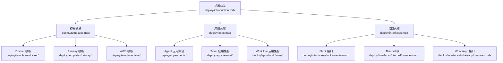
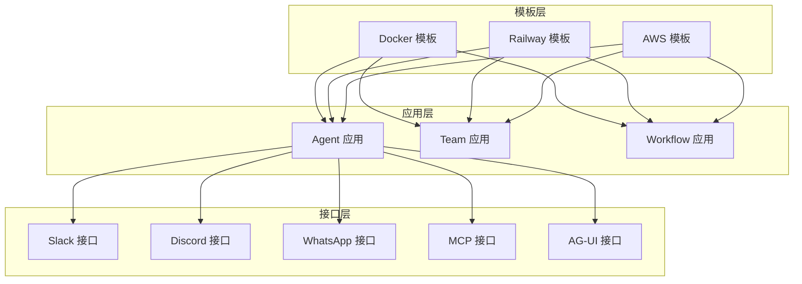
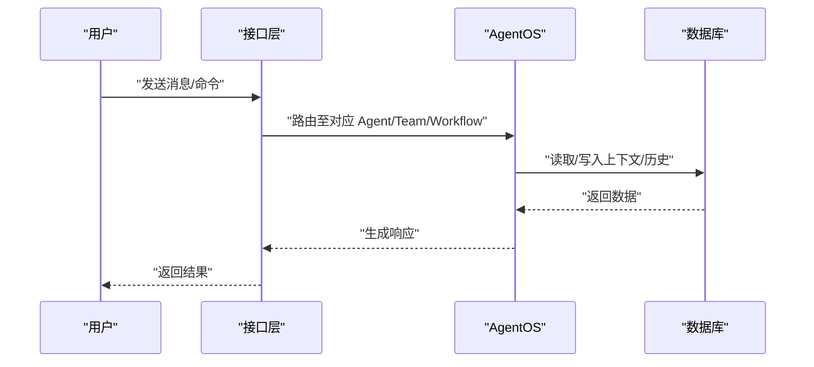
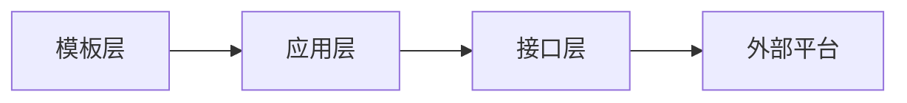

# 部署系统

<cite>
**本文引用的文件**
- [部署总览](file://deploy/introduction.mdx)
- [应用总览](file://deploy/apps.mdx)
- [接口总览](file://deploy/interfaces.mdx)
- [模板总览](file://deploy/templates.mdx)
- [Slack 接口概览](file://deploy/interfaces/slack/overview.mdx)
- [Discord 接口概览](file://deploy/interfaces/discord/overview.mdx)
- [WhatsApp 接口概览](file://deploy/interfaces/whatsapp/overview.mdx)
- [生产部署总览](file://production/overview.mdx)
- [生产应用总览](file://production/applications/overview.mdx)
</cite>

## 目录
1. [简介](#简介)
2. [项目结构](#项目结构)
3. [核心组件](#核心组件)
4. [架构总览](#架构总览)
5. [详细组件分析](#详细组件分析)
6. [依赖关系分析](#依赖关系分析)
7. [性能考虑](#性能考虑)
8. [故障排除指南](#故障排除指南)
9. [结论](#结论)
10. [附录](#附录)

## 简介
本技术文档面向需要将 AgentOS 部署到生产环境的开发者与运维人员，系统性阐述部署系统的三大支柱：模板系统（Template）、应用（Apps）与接口（Interfaces）。文档覆盖从零开始的部署流程、不同平台（如 AG-UI、Discord、Slack、WhatsApp）的集成配置、模板在 AWS、Docker、Railway 等环境中的使用方式，并提供环境配置、安全设置、性能优化与 CI/CD 集成的最佳实践与排障建议。

## 项目结构
部署相关文档主要分布在以下路径：
- 模板与部署：/deploy/templates 与 /production/templates
- 应用：/deploy/apps 与 /production/applications
- 接口：/deploy/interfaces 与 /production/interfaces
- 总览与导航：/deploy/introduction.mdx、/deploy/templates.mdx、/deploy/apps.mdx、/deploy/interfaces.mdx、/production/overview.mdx

图表来源
- [部署总览:1-102](file://deploy/introduction.mdx#L1-L102)
- [模板总览:1-48](file://deploy/templates.mdx#L1-L48)
- [应用总览:1-138](file://deploy/apps.mdx#L1-L138)
- [接口总览:1-38](file://deploy/interfaces.mdx#L1-L38)

章节来源
- [部署总览:1-102](file://deploy/introduction.mdx#L1-L102)
- [模板总览:1-48](file://deploy/templates.mdx#L1-L48)
- [应用总览:1-138](file://deploy/apps.mdx#L1-L138)
- [接口总览:1-38](file://deploy/interfaces.mdx#L1-L38)

## 核心组件
- 模板系统：提供“空白画布”与“预置解决方案”，内置 AgentOS、数据库与部署脚本，适配 Docker、Railway、AWS 等环境。
- 应用系统：包含 Agent、Team、Workflow 三类应用，覆盖数据查询、研究分析、知识问答、内容生产、销售分析等场景。
- 接口系统：连接用户已使用的平台与协议，支持 Slack、Discord、WhatsApp、Telegram、MCP、AG-UI 等。

章节来源
- [模板总览:1-48](file://deploy/templates.mdx#L1-L48)
- [应用总览:1-138](file://deploy/apps.mdx#L1-L138)
- [接口总览:1-38](file://deploy/interfaces.mdx#L1-L38)

## 架构总览
下图展示从模板到应用再到接口的整体部署架构，体现“模板—应用—接口”的分层关系与交互方向。

图表来源
- [模板总览:1-48](file://deploy/templates.mdx#L1-L48)
- [应用总览:1-138](file://deploy/apps.mdx#L1-L138)
- [接口总览:1-38](file://deploy/interfaces.mdx#L1-L38)

## 详细组件分析

### 模板系统：AWS、Docker、Railway
- 设计理念
  - “空白画布”模板：提供最小可用 AgentOS 安装，便于按需扩展。
  - “预置解决方案”模板：内置典型应用，开箱即用。
  - 每个模板包含 AgentOS、PostgreSQL 与目标平台的部署脚本。
- 使用方法
  - Docker：适合本地开发与自托管，快速启动与测试。
  - Railway：强调“无需管理基础设施”的快速上线体验。
  - AWS：面向规模化与企业级可靠性与合规控制。
- 配置要点
  - 数据库初始化与迁移脚本随模板提供。
  - 平台特定的环境变量与资源编排文件由模板统一管理。
  - 生产环境建议结合密钥管理服务与网络隔离策略。

章节来源
- [模板总览:1-48](file://deploy/templates.mdx#L1-L48)
- [生产部署总览:1-73](file://production/overview.mdx#L1-L73)

### 应用系统：代理应用、团队应用、工作流应用
- 设计理念
  - 应用是运行于部署环境内的具体业务单元，可直接替换或扩展模板自带的应用。
  - 支持 Agent、Team、Workflow 三类，覆盖从单智能体到多智能体协作与自动化流程。
- 部署方式与配置要求
  - 代理应用：通过 AgentOS 注册并暴露接口，按需启用历史上下文、时间戳注入等能力。
  - 团队应用：以多智能体协同的方式完成复杂任务，需关注任务分配与状态同步。
  - 工作流应用：以流程编排实现端到端自动化，强调步骤间的数据传递与错误处理。
- 典型场景
  - 文本转 SQL、研究代理、知识问答、发票解析、合同审查、代码评审、销售通话分析等。

章节来源
- [应用总览:1-138](file://deploy/apps.mdx#L1-L138)
- [生产应用总览:1-169](file://production/applications/overview.mdx#L1-L169)

### 接口系统：AG-UI、Discord、Slack、WhatsApp 等
- 设计理念
  - 将 AgentOS 内部的智能体能力通过用户熟悉的平台与协议对外暴露，降低接入成本。
  - 不同平台的差异体现在事件模型、认证机制、消息模型与回调验证等方面。
- Slack 集成
  - 通过事件订阅与签名验证保障安全性；线程时间戳自动作为会话 ID，保持对话上下文。
  - 开发阶段推荐使用 ngrok 进行外网穿透，生产环境需配置稳定域名与证书。
- Discord 集成
  - 基于 Gateway API 直连，无需 Webhook；适合在 Railway、Render、AWS EC2 等持续运行环境中部署。
  - 关注意图权限与消息内容意图的开启，确保能正确读取消息与创建线程。
- WhatsApp 集成
  - 通过 Meta Business API 与 Webhook 实现消息收发；验证令牌与应用密钥用于生产环境的安全校验。
  - 用户手机号自动作为 user_id 与 session_id，保证会话隔离与记忆作用域。
- AG-UI 与 MCP
  - AG-UI 提供前端协议对接；MCP 作为通用协议，可被任意 MCP 客户端消费。

图表来源
- [Slack 接口概览:1-143](file://deploy/interfaces/slack/overview.mdx#L1-L143)
- [Discord 接口概览:1-116](file://deploy/interfaces/discord/overview.mdx#L1-L116)
- [WhatsApp 接口概览:1-137](file://deploy/interfaces/whatsapp/overview.mdx#L1-L137)

章节来源
- [接口总览:1-38](file://deploy/interfaces.mdx#L1-L38)
- [Slack 接口概览:1-143](file://deploy/interfaces/slack/overview.mdx#L1-L143)
- [Discord 接口概览:1-116](file://deploy/interfaces/discord/overview.mdx#L1-L116)
- [WhatsApp 接口概览:1-137](file://deploy/interfaces/whatsapp/overview.mdx#L1-L137)

### 部署流程：从模板到应用再到接口
- 步骤一：选择模板
  - 根据本地开发、快速上线或规模化生产的需求，选择 Docker、Railway 或 AWS 模板。
- 步骤二：添加应用
  - 在模板基础上添加或替换 Agent、Team、Workflow 应用，适配业务场景。
- 步骤三：连接接口
  - 为应用配置 Slack、Discord、WhatsApp、Telegram、MCP 或 AG-UI 等接口，完成平台集成与认证。
- 生产部署建议
  - 使用模板提供的数据库初始化与迁移脚本。
  - 在生产环境启用 HTTPS、严格的环境变量管理与密钥轮换。
  - 对外暴露的回调地址与验证机制必须严格配置，避免中间人攻击与伪造请求。

章节来源
- [部署总览:1-102](file://deploy/introduction.mdx#L1-L102)
- [生产部署总览:1-73](file://production/overview.mdx#L1-L73)

## 依赖关系分析
- 组件耦合
  - 模板层为应用层提供运行时与基础设施；应用层为接口层提供业务能力；接口层负责与外部平台交互。
- 外部依赖
  - 平台 SDK（如 Slack SDK、discord.py）、Meta Business API、数据库驱动与迁移工具。
- 风险点
  - Webhook 验证失败、签名密钥泄露、意图权限未开启、回调地址不可达等问题可能导致服务不可用或安全风险。

图表来源
- [模板总览:1-48](file://deploy/templates.mdx#L1-L48)
- [应用总览:1-138](file://deploy/apps.mdx#L1-L138)
- [接口总览:1-38](file://deploy/interfaces.mdx#L1-L38)

章节来源
- [模板总览:1-48](file://deploy/templates.mdx#L1-L48)
- [应用总览:1-138](file://deploy/apps.mdx#L1-L138)
- [接口总览:1-38](file://deploy/interfaces.mdx#L1-L38)

## 性能考虑
- 启动与冷启动
  - 优先选择具备自动扩缩容与低冷启动时间的平台（如 Railway），对高并发场景尤为关键。
- 数据访问
  - 使用连接池与只读副本，减少主库压力；对高频查询建立索引与物化视图。
- 上下文与历史
  - 控制上下文长度与历史轮数，避免超长上下文导致延迟增加；必要时采用分页与增量加载。
- 缓存与异步
  - 对外部 API 调用进行缓存；将耗时操作异步化，提升接口响应速度。
- 监控与告警
  - 建立端到端链路追踪与关键指标监控，及时发现性能瓶颈。

## 故障排除指南
- Slack
  - 症状：事件无法到达或验证失败
  - 排查：确认 ngrok 运行状态、回调 URL 与签名验证配置；检查 Bot Token 与签名密钥是否正确；核对事件订阅中勾选的 bot 事件。
- Discord
  - 症状：机器人无响应或无法创建线程
  - 排查：确认意图权限（消息内容意图、服务器成员意图）已开启；核对机器人权限与邀请链接；检查运行环境是否持续在线。
- WhatsApp
  - 症状：Webhook 验证失败或消息不触发
  - 排查：确认验证令牌与回调 URL；生产环境需配置 APP_SECRET；核对订阅字段与号码绑定；确保应用处于可访问状态。
- 通用
  - 症状：数据库连接失败或迁移异常
  - 排查：核对数据库连接字符串与凭据；确认网络策略允许访问；查看迁移日志定位问题。
  - 症状：接口回调 401/403
  - 排查：检查签名算法与密钥一致性；确认回调地址与平台配置一致；核对平台白名单与 IP 策略。

章节来源
- [Slack 接口概览:1-143](file://deploy/interfaces/slack/overview.mdx#L1-L143)
- [Discord 接口概览:1-116](file://deploy/interfaces/discord/overview.mdx#L1-L116)
- [WhatsApp 接口概览:1-137](file://deploy/interfaces/whatsapp/overview.mdx#L1-L137)

## 结论
通过模板系统快速搭建运行环境，借助应用系统承载业务逻辑，并以接口系统无缝连接用户常用平台，是 AgentOS 生产部署的最佳实践路径。遵循本文的配置清单、安全设置与排障指南，可显著提升部署效率与系统稳定性。建议在 CI/CD 流水线中固化模板选择、应用替换与接口验证步骤，确保每次发布的一致性与可追溯性。

## 附录
- 快速开始
  - 选择模板：Docker（本地）、Railway（快速）、AWS（生产）
  - 添加应用：复制粘贴所需 Agent/Team/Workflow 代码并按需定制
  - 连接接口：根据平台指引完成认证与回调配置
- 参考资源
  - 模板与应用的更多细节可在对应目录中查阅
  - 如需特定平台或应用的补充说明，请参考“获取帮助”入口