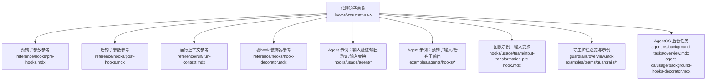
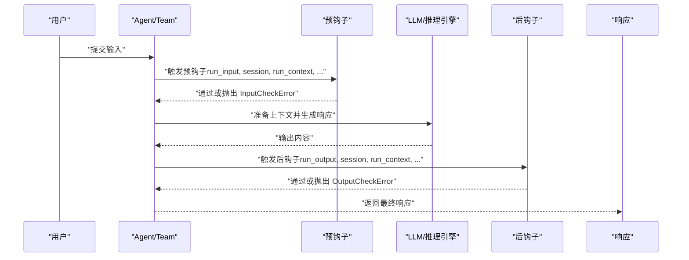
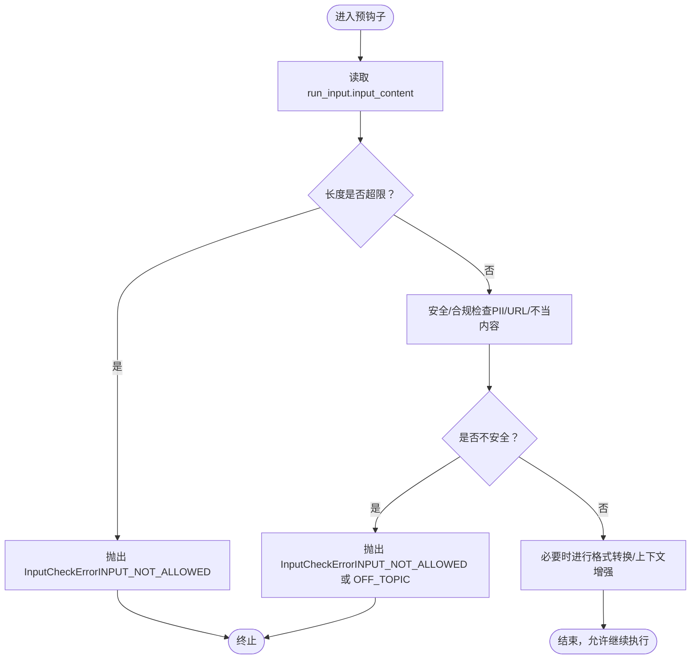
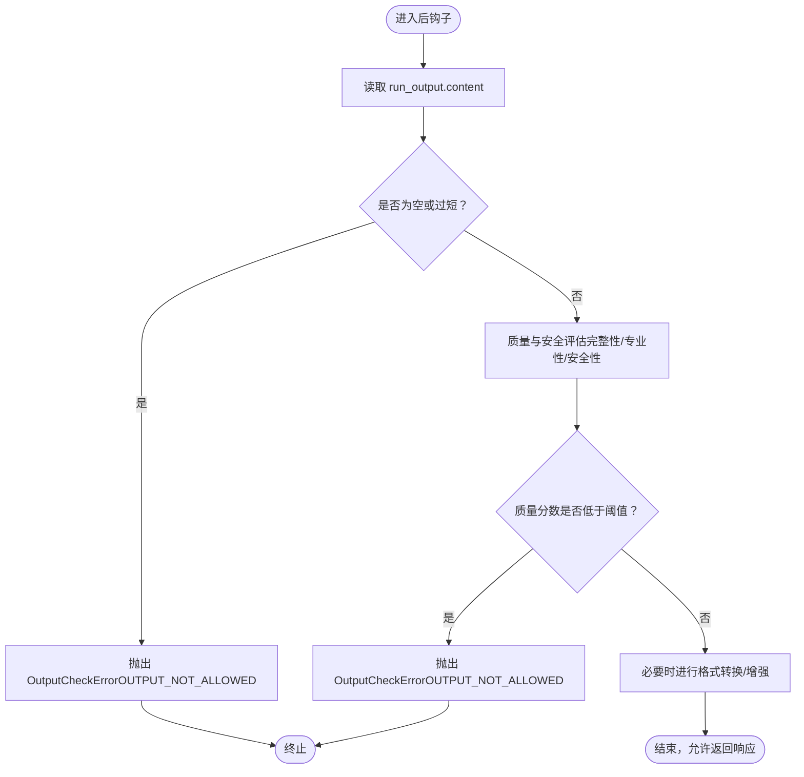
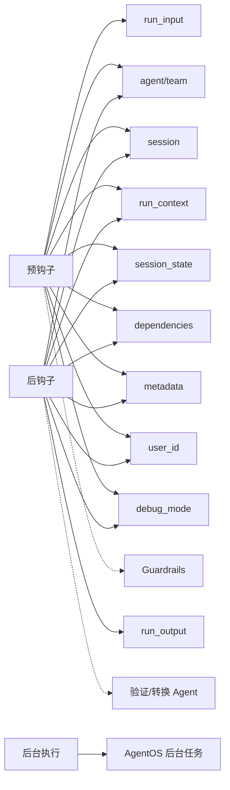

# 代理钩子

<cite>
**本文引用的文件**
- [代理钩子总览](file://hooks/overview.mdx)
- [预钩子参数参考](file://reference/hooks/pre-hooks.mdx)
- [后钩子参数参考](file://reference/hooks/post-hooks.mdx)
- [运行上下文参考](file://reference/run/run-context.mdx)
- [@hook 装饰器参考](file://reference/hooks/hook-decorator.mdx)
- [Agent 输入验证预钩子示例](file://hooks/usage/agent/input-validation-pre-hook.mdx)
- [Agent 输出验证后钩子示例](file://hooks/usage/agent/output-validation-post-hook.mdx)
- [Agent 输入变换预钩子示例](file://hooks/usage/agent/input-transformation-pre-hook.mdx)
- [团队输入验证预钩子示例](file://hooks/usage/team/input-transformation-pre-hook.mdx)
- [Agent 预钩子输入示例](file://examples/agents/hooks/pre-hook-input.mdx)
- [Agent 后钩子输出示例](file://examples/agents/hooks/post-hook-output.mdx)
- [Agent 自定义守卫护栏示例](file://examples/agents/guardrails/custom-guardrail.mdx)
- [团队守卫护栏：提示注入示例](file://examples/teams/guardrails/prompt-injection.mdx)
- [AgentOS 后台任务概览](file://agent-os/background-tasks/overview.mdx)
- [AgentOS 后台钩子（按钩子）示例](file://agent-os/usage/background-hooks-decorator.mdx)
- [守卫护栏总览](file://guardrails/overview.mdx)
</cite>

## 目录
1. [简介](#简介)
2. [项目结构](#项目结构)
3. [核心组件](#核心组件)
4. [架构总览](#架构总览)
5. [详细组件分析](#详细组件分析)
6. [依赖关系分析](#依赖关系分析)
7. [性能考量](#性能考量)
8. [故障排查指南](#故障排查指南)
9. [结论](#结论)
10. [附录](#附录)

## 简介
本文件系统性阐述代理级别的钩子（预钩子与后钩子）在 Agno 中的实现与使用方法，覆盖输入/输出验证、安全检查、数据预处理与后处理、格式转换、合规校验、异常处理以及后台执行等主题。文档同时给出参数说明、调用时机、最佳实践与常见应用场景，帮助开发者在不侵入业务逻辑的前提下，构建可维护、可观测、可扩展的智能体运行管线。

## 项目结构
围绕代理钩子的相关资料主要分布在以下位置：
- 概览与使用：hooks/overview.mdx、hooks/usage/*、examples/agents/hooks/*
- 参数与上下文：reference/hooks/*、reference/run/run-context.mdx
- 后台执行：agent-os/background-tasks/overview.mdx、agent-os/usage/background-hooks-decorator.mdx
- 守卫护栏：guardrails/overview.mdx、examples/teams/guardrails/*

**图表来源**
- [代理钩子总览](file://hooks/overview.mdx)
- [预钩子参数参考](file://reference/hooks/pre-hooks.mdx)
- [后钩子参数参考](file://reference/hooks/post-hooks.mdx)
- [运行上下文参考](file://reference/run/run-context.mdx)
- [@hook 装饰器参考](file://reference/hooks/hook-decorator.mdx)
- [Agent 输入验证预钩子示例](file://hooks/usage/agent/input-validation-pre-hook.mdx)
- [Agent 输出验证后钩子示例](file://hooks/usage/agent/output-validation-post-hook.mdx)
- [Agent 输入变换预钩子示例](file://hooks/usage/agent/input-transformation-pre-hook.mdx)
- [Agent 预钩子输入示例](file://examples/agents/hooks/pre-hook-input.mdx)
- [Agent 后钩子输出示例](file://examples/agents/hooks/post-hook-output.mdx)
- [团队输入变换预钩子示例](file://hooks/usage/team/input-transformation-pre-hook.mdx)
- [守卫护栏总览](file://guardrails/overview.mdx)
- [AgentOS 后台任务概览](file://agent-os/background-tasks/overview.mdx)
- [AgentOS 后台钩子（按钩子）示例](file://agent-os/usage/background-hooks-decorator.mdx)

**章节来源**
- [代理钩子总览](file://hooks/overview.mdx)
- [预钩子参数参考](file://reference/hooks/pre-hooks.mdx)
- [后钩子参数参考](file://reference/hooks/post-hooks.mdx)
- [运行上下文参考](file://reference/run/run-context.mdx)
- [@hook 装饰器参考](file://reference/hooks/hook-decorator.mdx)
- [Agent 输入验证预钩子示例](file://hooks/usage/agent/input-validation-pre-hook.mdx)
- [Agent 输出验证后钩子示例](file://hooks/usage/agent/output-validation-post-hook.mdx)
- [Agent 输入变换预钩子示例](file://hooks/usage/agent/input-transformation-pre-hook.mdx)
- [Agent 预钩子输入示例](file://examples/agents/hooks/pre-hook-input.mdx)
- [Agent 后钩子输出示例](file://examples/agents/hooks/post-hook-output.mdx)
- [团队输入变换预钩子示例](file://hooks/usage/team/input-transformation-pre-hook.mdx)
- [守卫护栏总览](file://guardrails/overview.mdx)
- [AgentOS 后台任务概览](file://agent-os/background-tasks/overview.mdx)
- [AgentOS 后台钩子（按钩子）示例](file://agent-os/usage/background-hooks-decorator.mdx)

## 核心组件
- 预钩子（Pre-hooks）
  - 触发时机：会话加载完成后、模型上下文准备前、LLM 执行前
  - 主要职责：输入验证、安全检查、敏感信息过滤、数据预处理、格式规范化、上下文增强
  - 典型参数：run_input、agent/team、session、run_context、session_state、dependencies、metadata、user_id、debug_mode
- 后钩子（Post-hooks）
  - 触发时机：生成响应后、输出准备完成但返回用户前；流式响应中每块生成后
  - 主要职责：输出验证、合规检查、内容过滤、格式转换、响应增强、元数据附加
  - 典型参数：run_output、agent/team、session、run_context、session_state、dependencies、metadata、user_id、debug_mode
- 守卫护栏（Guardrails）
  - 基于预钩子实现的安全与合规策略，如 PII 检测、提示注入防护、不当内容拦截等
- 后台执行（Background Execution）
  - 使用 @hook(run_in_background=True) 或 AgentOS 全局设置，将非关键任务异步执行，避免阻塞响应

**章节来源**
- [代理钩子总览](file://hooks/overview.mdx)
- [预钩子参数参考](file://reference/hooks/pre-hooks.mdx)
- [后钩子参数参考](file://reference/hooks/post-hooks.mdx)
- [守卫护栏总览](file://guardrails/overview.mdx)
- [AgentOS 后台任务概览](file://agent-os/background-tasks/overview.mdx)
- [@hook 装饰器参考](file://reference/hooks/hook-decorator.mdx)

## 架构总览
下图展示了从请求进入、预处理、LLM 执行到响应生成与后处理的整体流程，以及钩子在其中的插入点。

**图表来源**
- [代理钩子总览](file://hooks/overview.mdx)
- [预钩子参数参考](file://reference/hooks/pre-hooks.mdx)
- [后钩子参数参考](file://reference/hooks/post-hooks.mdx)

## 详细组件分析

### 预钩子：输入验证、安全检查与数据预处理
- 输入长度验证
  - 可通过读取 run_input.input_content 的长度进行阈值控制，并在超限时抛出 InputCheckError，携带 CheckTrigger 标识
  - 示例路径：[输入长度验证示例](file://hooks/usage/agent/input-transformation-pre-hook.mdx)
- 敏感信息检测（如 PII、URL、不当内容）
  - 可结合正则或内置 Guardrails（如 PIIDetectionGuardrail）进行检测
  - 自定义 Guardrail 可继承 BaseGuardrail 并实现同步/异步检查方法
  - 示例路径：[自定义 Guardrail 示例](file://examples/agents/guardrails/custom-guardrail.mdx)
- 提示注入与不当内容防护
  - 团队示例展示了针对 jailbreak、提示注入尝试的拦截
  - 示例路径：[团队提示注入示例](file://examples/teams/guardrails/prompt-injection.mdx)
- 数据预处理与格式转换
  - 使用小型验证/转换 Agent 对输入进行重写、规范化、增强上下文
  - 示例路径：[输入变换预钩子示例](file://hooks/usage/agent/input-transformation-pre-hook.mdx)
- 参数与上下文
  - 可访问 run_input、agent/team、session、run_context、session_state、dependencies、metadata、user_id、debug_mode
  - 示例路径：[预钩子参数参考](file://reference/hooks/pre-hooks.mdx)，[运行上下文参考](file://reference/run/run-context.mdx)

**图表来源**
- [代理钩子总览](file://hooks/overview.mdx)
- [Agent 输入验证预钩子示例](file://hooks/usage/agent/input-validation-pre-hook.mdx)
- [Agent 预钩子输入示例](file://examples/agents/hooks/pre-hook-input.mdx)
- [守卫护栏总览](file://guardrails/overview.mdx)

**章节来源**
- [代理钩子总览](file://hooks/overview.mdx)
- [Agent 输入验证预钩子示例](file://hooks/usage/agent/input-validation-pre-hook.mdx)
- [Agent 预钩子输入示例](file://examples/agents/hooks/pre-hook-input.mdx)
- [团队输入变换预钩子示例](file://hooks/usage/team/input-transformation-pre-hook.mdx)
- [预钩子参数参考](file://reference/hooks/pre-hooks.mdx)
- [运行上下文参考](file://reference/run/run-context.mdx)
- [守卫护栏总览](file://guardrails/overview.mdx)

### 后钩子：输出验证、格式转换与合规检查
- 输出长度验证
  - 通过 run_output.content 的长度阈值控制，超限时抛出 OutputCheckError
  - 示例路径：[输出长度验证示例](file://hooks/usage/agent/output-validation-post-hook.mdx)
- 内容质量与安全性评估
  - 使用小型验证 Agent 对响应进行完整性、专业性、安全性评分与建议
  - 示例路径：[输出质量验证示例](file://hooks/usage/agent/output-validation-post-hook.mdx)
- 格式转换与响应增强
  - 在保证合规前提下，对输出进行格式化、补充元数据或上下文
  - 示例路径：[Agent 后钩子输出示例](file://examples/agents/hooks/post-hook-output.mdx)
- 参数与上下文
  - 可访问 run_output、agent/team、session、run_context、session_state、dependencies、metadata、user_id、debug_mode
  - 示例路径：[后钩子参数参考](file://reference/hooks/post-hooks.mdx)，[运行上下文参考](file://reference/run/run-context.mdx)

**图表来源**
- [代理钩子总览](file://hooks/overview.mdx)
- [Agent 输出验证后钩子示例](file://hooks/usage/agent/output-validation-post-hook.mdx)
- [Agent 后钩子输出示例](file://examples/agents/hooks/post-hook-output.mdx)

**章节来源**
- [代理钩子总览](file://hooks/overview.mdx)
- [Agent 输出验证后钩子示例](file://hooks/usage/agent/output-validation-post-hook.mdx)
- [Agent 后钩子输出示例](file://examples/agents/hooks/post-hook-output.mdx)
- [后钩子参数参考](file://reference/hooks/post-hooks.mdx)
- [运行上下文参考](file://reference/run/run-context.mdx)

### 钩子参数详解与获取方式
- 预钩子参数
  - agent/team、run_input、session、run_context、session_state、dependencies、metadata、user_id、debug_mode
  - 框架自动注入函数签名所需的参数，仅传入被声明的参数
  - 示例路径：[预钩子参数参考](file://reference/hooks/pre-hooks.mdx)
- 后钩子参数
  - agent/team、run_output、session、run_context、session_state、dependencies、metadata、user_id、debug_mode
  - 示例路径：[后钩子参数参考](file://reference/hooks/post-hooks.mdx)
- 运行上下文（RunContext）
  - 包含 run_id、session_id、user_id、dependencies、knowledge_filters、metadata、session_state 等
  - 示例路径：[运行上下文参考](file://reference/run/run-context.mdx)

**章节来源**
- [预钩子参数参考](file://reference/hooks/pre-hooks.mdx)
- [后钩子参数参考](file://reference/hooks/post-hooks.mdx)
- [运行上下文参考](file://reference/run/run-context.mdx)

### 异常处理机制
- InputCheckError
  - 用于预钩子阶段阻止不合规输入，支持 check_trigger 标识（如 INPUT_NOT_ALLOWED、OFF_TOPIC）
  - 示例路径：[输入验证示例](file://hooks/usage/agent/input-validation-pre-hook.mdx)、[预钩子输入示例](file://examples/agents/hooks/pre-hook-input.mdx)
- OutputCheckError
  - 用于后钩子阶段拒绝低质量或不合规输出，支持 check_trigger 标识（如 OUTPUT_NOT_ALLOWED）
  - 示例路径：[输出验证示例](file://hooks/usage/agent/output-validation-post-hook.mdx)、[后钩子输出示例](file://examples/agents/hooks/post-hook-output.mdx)
- 守卫护栏
  - 继承 BaseGuardrail，实现 check/async_check 方法，在预钩子中统一拦截风险
  - 示例路径：[守卫护栏总览](file://guardrails/overview.mdx)、[自定义 Guardrail 示例](file://examples/agents/guardrails/custom-guardrail.mdx)

**章节来源**
- [代理钩子总览](file://hooks/overview.mdx)
- [Agent 输入验证预钩子示例](file://hooks/usage/agent/input-validation-pre-hook.mdx)
- [Agent 输出验证后钩子示例](file://hooks/usage/agent/output-validation-post-hook.mdx)
- [Agent 预钩子输入示例](file://examples/agents/hooks/pre-hook-input.mdx)
- [Agent 后钩子输出示例](file://examples/agents/hooks/post-hook-output.mdx)
- [守卫护栏总览](file://guardrails/overview.mdx)

### 后台执行与最佳实践
- 后台执行
  - 使用 @hook(run_in_background=True) 或 AgentOS 全局设置，将钩子标记为后台任务
  - 后台任务在响应发送后顺序执行，不可修改 run_input/run_output
  - 示例路径：[@hook 装饰器参考](file://reference/hooks/hook-decorator.mdx)、[AgentOS 后台任务概览](file://agent-os/background-tasks/overview.mdx)、[AgentOS 后台钩子（按钩子）示例](file://agent-os/usage/background-hooks-decorator.mdx)
- 最佳实践
  - 将“必须在响应前完成”的关键校验（如输出质量、合规）放在前台（同步）钩子
  - 将“不影响响应”的日志、通知、异步存储等放在后台钩子
  - 使用 RunContext 存储会话状态与元数据，便于跨组件共享
  - 通过小而专的验证 Agent 实现复杂规则，保持钩子逻辑清晰

**章节来源**
- [@hook 装饰器参考](file://reference/hooks/hook-decorator.mdx)
- [AgentOS 后台任务概览](file://agent-os/background-tasks/overview.mdx)
- [AgentOS 后台钩子（按钩子）示例](file://agent-os/usage/background-hooks-decorator.mdx)
- [运行上下文参考](file://reference/run/run-context.mdx)

## 依赖关系分析
- 预钩子依赖
  - 依赖 run_input、agent/team、session、run_context、session_state、dependencies、metadata、user_id、debug_mode
  - 可能依赖 Guardrails 或小型验证 Agent 完成复杂检查
- 后钩子依赖
  - 依赖 run_output、agent/team、session、run_context、session_state、dependencies、metadata、user_id、debug_mode
  - 可能依赖小型验证 Agent 完成质量与安全评估
- 后台执行依赖
  - 依赖 AgentOS 的后台任务调度能力，确保数据隔离与错误不影响响应

**图表来源**
- [预钩子参数参考](file://reference/hooks/pre-hooks.mdx)
- [后钩子参数参考](file://reference/hooks/post-hooks.mdx)
- [运行上下文参考](file://reference/run/run-context.mdx)
- [AgentOS 后台任务概览](file://agent-os/background-tasks/overview.mdx)

**章节来源**
- [预钩子参数参考](file://reference/hooks/pre-hooks.mdx)
- [后钩子参数参考](file://reference/hooks/post-hooks.mdx)
- [运行上下文参考](file://reference/run/run-context.mdx)
- [AgentOS 后台任务概览](file://agent-os/background-tasks/overview.mdx)

## 性能考量
- 预钩子与后钩子中的外部调用（如 LLM 验证/转换）应尽量轻量化与可缓存
- 后台执行可显著降低响应延迟，但需注意后台失败不影响响应结果
- 复杂规则建议拆分为多个小钩子，便于测试与维护
- 使用 RunContext 缓存必要的上下文信息，减少重复计算

## 故障排查指南
- 输入被拒绝
  - 检查 InputCheckError 的 check_trigger 与消息，定位是长度、相关性、安全性还是格式问题
  - 示例路径：[输入验证示例](file://hooks/usage/agent/input-validation-pre-hook.mdx)、[预钩子输入示例](file://examples/agents/hooks/pre-hook-input.mdx)
- 输出被拒绝
  - 检查 OutputCheckError 的 check_trigger 与消息，关注质量分数、完整性与安全性
  - 示例路径：[输出验证示例](file://hooks/usage/agent/output-validation-post-hook.mdx)、[后钩子输出示例](file://examples/agents/hooks/post-hook-output.mdx)
- 后台钩子未生效
  - 确认是否在 AgentOS 环境中启用后台执行，或是否正确使用 @hook(run_in_background=True)
  - 示例路径：[AgentOS 后台任务概览](file://agent-os/background-tasks/overview.mdx)、[@hook 装饰器参考](file://reference/hooks/hook-decorator.mdx)
- 参数缺失或类型不符
  - 根据参考文档核对参数列表，确保函数签名与框架注入一致
  - 示例路径：[预钩子参数参考](file://reference/hooks/pre-hooks.mdx)、[后钩子参数参考](file://reference/hooks/post-hooks.mdx)

**章节来源**
- [代理钩子总览](file://hooks/overview.mdx)
- [Agent 输入验证预钩子示例](file://hooks/usage/agent/input-validation-pre-hook.mdx)
- [Agent 输出验证后钩子示例](file://hooks/usage/agent/output-validation-post-hook.mdx)
- [Agent 预钩子输入示例](file://examples/agents/hooks/pre-hook-input.mdx)
- [Agent 后钩子输出示例](file://examples/agents/hooks/post-hook-output.mdx)
- [AgentOS 后台任务概览](file://agent-os/background-tasks/overview.mdx)
- [@hook 装饰器参考](file://reference/hooks/hook-decorator.mdx)
- [预钩子参数参考](file://reference/hooks/pre-hooks.mdx)
- [后钩子参数参考](file://reference/hooks/post-hooks.mdx)

## 结论
代理钩子为智能体提供了强大的前置与后置控制点，既能保障输入/输出的质量与安全，又能灵活地进行数据预处理与响应增强。通过合理划分前台与后台任务、善用 RunContext 与 Guardrails、遵循异常处理规范，可以构建既稳健又高性能的智能体运行体系。

## 附录
- 示例清单
  - 预钩子：输入验证、输入变换、团队输入变换
  - 后钩子：输出验证、输出变换
  - 守卫护栏：PII 检测、提示注入防护、自定义规则
- 参考清单
  - 预钩子参数、后钩子参数、运行上下文、@hook 装饰器、AgentOS 后台任务