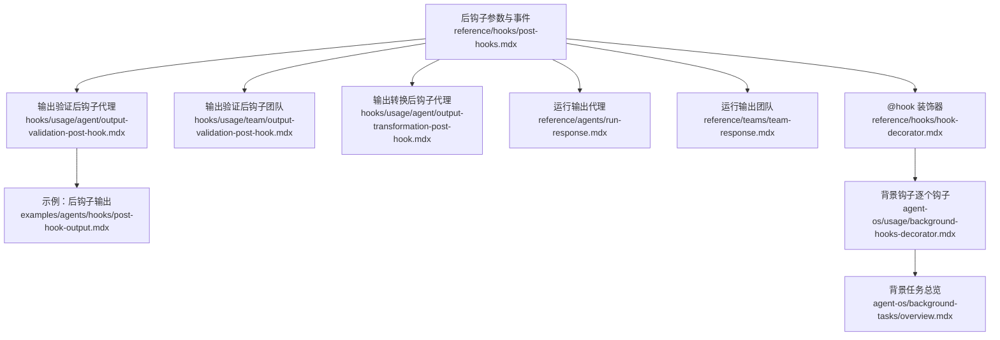
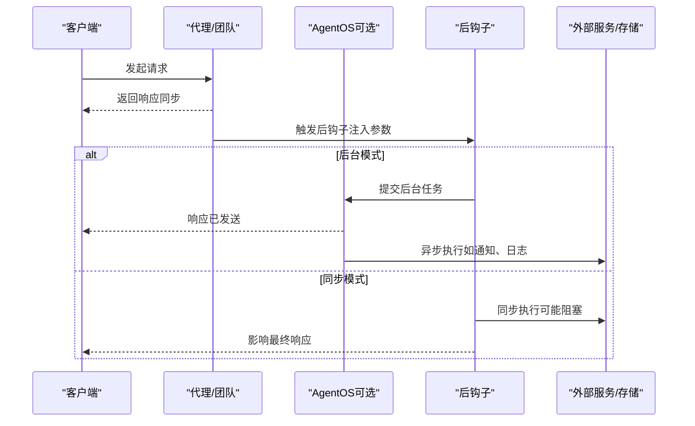
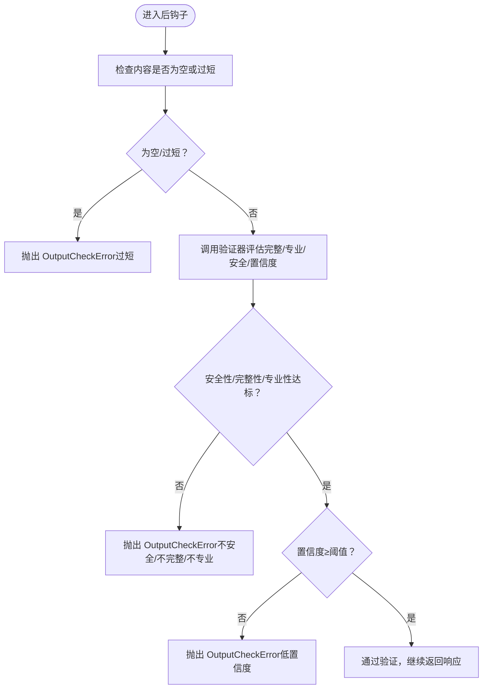
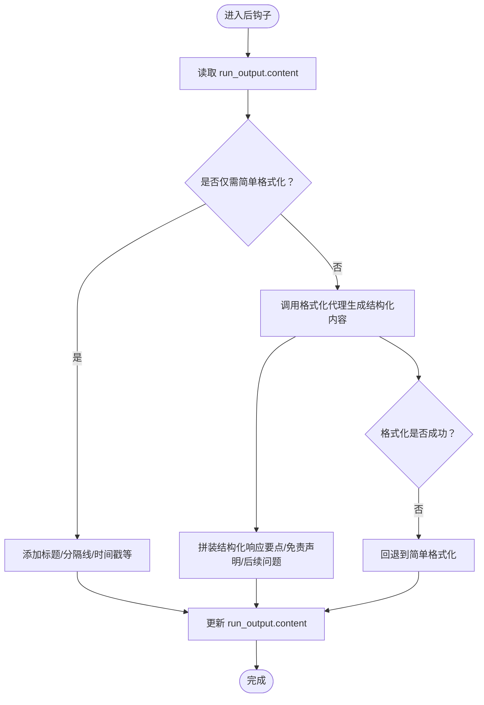
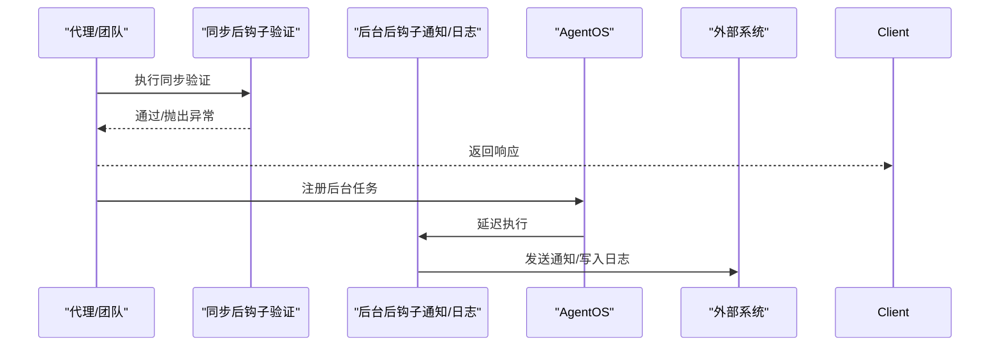
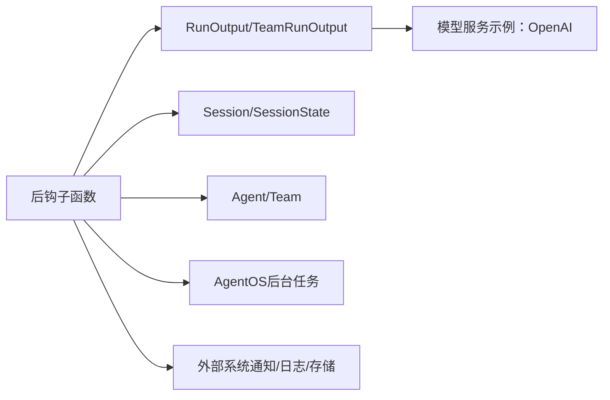

# 后钩子

<cite>
**本文引用的文件**
- [后钩子参数与事件](file://reference/hooks/post-hooks.mdx)
- [输出验证后钩子（代理）](file://hooks/usage/agent/output-validation-post-hook.mdx)
- [输出验证后钩子（团队）](file://hooks/usage/team/output-validation-post-hook.mdx)
- [输出转换后钩子（代理）](file://hooks/usage/agent/output-transformation-post-hook.mdx)
- [示例：后钩子输出](file://examples/agents/hooks/post-hook-output.mdx)
- [运行输出（代理）](file://reference/agents/run-response.mdx)
- [运行输出（团队）](file://reference/teams/team-response.mdx)
- [后钩子装饰器](file://reference/hooks/hook-decorator.mdx)
- [背景任务（AgentOS）](file://agent-os/usage/background-hooks-decorator.mdx)
- [背景任务总览](file://agent-os/background-tasks/overview.mdx)
- [后钩子概览](file://hooks/overview.mdx)
</cite>

## 目录
1. [简介](#简介)
2. [项目结构](#项目结构)
3. [核心组件](#核心组件)
4. [架构总览](#架构总览)
5. [详细组件分析](#详细组件分析)
6. [依赖关系分析](#依赖关系分析)
7. [性能考量](#性能考量)
8. [故障排查指南](#故障排查指南)
9. [结论](#结论)
10. [附录](#附录)

## 简介
本文件系统化阐述代理与团队在“后钩子”阶段的输出处理机制，重点覆盖两大能力：
- 输出转换：在响应返回前对内容进行格式化、结构化增强与合规性检查后的再加工。
- 输出验证：在响应返回前进行质量、长度、安全性等维度的校验，必要时抛出异常阻止响应。

文档将解释后钩子函数的参数结构（run_output、session、agent、run_context 等），并结合仓库中的示例与参考文档，给出实现思路、流程图、异常处理策略与最佳实践。

## 项目结构
围绕后钩子的关键文档与示例分布如下：
- 参考与参数说明：后钩子参数与事件、运行输出（代理/团队）、后钩子装饰器
- 示例与用法：输出转换后钩子（代理）、输出验证后钩子（代理/团队）、示例：后钩子输出
- AgentOS 背景任务：背景任务总览、背景钩子（逐个钩子）

**图表来源**
- [后钩子参数与事件:1-21](file://reference/hooks/post-hooks.mdx#L1-L21)
- [输出验证后钩子（代理）:1-212](file://hooks/usage/agent/output-validation-post-hook.mdx#L1-L212)
- [输出验证后钩子（团队）:1-212](file://hooks/usage/team/output-validation-post-hook.mdx#L1-L212)
- [输出转换后钩子（代理）:1-206](file://hooks/usage/agent/output-transformation-post-hook.mdx#L1-L206)
- [示例：后钩子输出:1-210](file://examples/agents/hooks/post-hook-output.mdx#L1-L210)
- [运行输出（代理）:1-281](file://reference/agents/run-response.mdx#L1-L281)
- [运行输出（团队）:1-438](file://reference/teams/team-response.mdx#L1-L438)
- [后钩子装饰器:1-45](file://reference/hooks/hook-decorator.mdx#L1-L45)
- [背景钩子（逐个钩子）:1-142](file://agent-os/usage/background-hooks-decorator.mdx#L1-L142)
- [背景任务总览:1-136](file://agent-os/background-tasks/overview.mdx#L1-L136)

**章节来源**
- [后钩子参数与事件:1-21](file://reference/hooks/post-hooks.mdx#L1-L21)
- [输出验证后钩子（代理）:1-212](file://hooks/usage/agent/output-validation-post-hook.mdx#L1-L212)
- [输出验证后钩子（团队）:1-212](file://hooks/usage/team/output-validation-post-hook.mdx#L1-L212)
- [输出转换后钩子（代理）:1-206](file://hooks/usage/agent/output-transformation-post-hook.mdx#L1-L206)
- [示例：后钩子输出:1-210](file://examples/agents/hooks/post-hook-output.mdx#L1-L210)
- [运行输出（代理）:1-281](file://reference/agents/run-response.mdx#L1-L281)
- [运行输出（团队）:1-438](file://reference/teams/team-response.mdx#L1-L438)
- [后钩子装饰器:1-45](file://reference/hooks/hook-decorator.mdx#L1-L45)
- [背景钩子（逐个钩子）:1-142](file://agent-os/usage/background-hooks-decorator.mdx#L1-L142)
- [背景任务总览:1-136](file://agent-os/background-tasks/overview.mdx#L1-L136)

## 核心组件
- 后钩子参数注入：在代理或团队运行完成后自动注入，包括 agent、team、run_output、session、session_state、dependencies、metadata、user_id、debug_mode 等。
- 运行输出模型：
  - 代理：RunOutput，包含 content、content_type、reasoning_content、messages、metrics、tools、images、videos、audio、files、response_audio、input、citations、references、metadata、created_at、events、status、workflow_step_id 等。
  - 团队：TeamRunOutput，除上述字段外，还包含 member_responses、reasoning_steps、reasoning_messages、model_provider_data、session_state 等，并支持流式事件。
- 后钩子装饰器：通过 @hook(run_in_background=True) 将特定钩子标记为后台执行，不阻塞响应；全局模式可通过 AgentOS 配置。
- 异常与触发器：输出验证失败时抛出 OutputCheckError，并可携带 check_trigger 指示触发类型。

**章节来源**
- [后钩子参数与事件:5-21](file://reference/hooks/post-hooks.mdx#L5-L21)
- [运行输出（代理）:6-42](file://reference/agents/run-response.mdx#L6-L42)
- [运行输出（团队）:6-46](file://reference/teams/team-response.mdx#L6-L46)
- [后钩子装饰器:14-18](file://reference/hooks/hook-decorator.mdx#L14-L18)
- [背景钩子（逐个钩子）:24-54](file://agent-os/usage/background-hooks-decorator.mdx#L24-L54)
- [背景任务总览:102-136](file://agent-os/background-tasks/overview.mdx#L102-L136)

## 架构总览
后钩子在代理/团队执行完成后介入，对 run_output 进行二次处理。根据是否启用后台模式，决定是否阻塞响应返回。

**图表来源**
- [后钩子参数与事件:7-19](file://reference/hooks/post-hooks.mdx#L7-L19)
- [后钩子装饰器:22-33](file://reference/hooks/hook-decorator.mdx#L22-L33)
- [背景钩子（逐个钩子）:125-131](file://agent-os/usage/background-hooks-decorator.mdx#L125-L131)
- [背景任务总览:102-110](file://agent-os/background-tasks/overview.mdx#L102-L110)

## 详细组件分析

### 输出验证后钩子（质量与安全）
目标：在响应返回前进行质量与安全检查，不符合标准则抛出 OutputCheckError 并阻止响应。

- 关键点
  - 长度校验：过短或过长均拒绝。
  - 安全性与专业性：通过专用验证器评估完整性、专业性、安全性与置信度。
  - 异常触发：当评估结果不满足阈值或存在不安全内容时，抛出 OutputCheckError，并设置 check_trigger 为 OUTPUT_NOT_ALLOWED。

**图表来源**
- [输出验证后钩子（代理）:32-99](file://hooks/usage/agent/output-validation-post-hook.mdx#L32-L99)
- [输出验证后钩子（团队）:32-99](file://hooks/usage/team/output-validation-post-hook.mdx#L32-L99)

**章节来源**
- [输出验证后钩子（代理）:32-99](file://hooks/usage/agent/output-validation-post-hook.mdx#L32-L99)
- [输出验证后钩子（团队）:32-99](file://hooks/usage/team/output-validation-post-hook.mdx#L32-L99)
- [示例：后钩子输出:33-99](file://examples/agents/hooks/post-hook-output.mdx#L33-L99)

### 输出转换后钩子（格式化与增强）
目标：在响应返回前对内容进行格式化、结构化增强与附加信息补充，提升用户体验与合规性。

- 关键点
  - 简单格式化：为内容添加标题、分隔线、时间戳等基础 Markdown 结构。
  - 结构化增强：使用代理将内容转为结构化格式（主内容、要点、免责声明、后续问题等）。
  - 失败回退：若高级格式化失败，回退到简单格式化，保证可用性。

**图表来源**
- [输出转换后钩子（代理）:30-124](file://hooks/usage/agent/output-transformation-post-hook.mdx#L30-L124)

**章节来源**
- [输出转换后钩子（代理）:30-124](file://hooks/usage/agent/output-transformation-post-hook.mdx#L30-L124)

### 后钩子参数结构与使用
- 参数注入
  - agent：仅代理运行时存在。
  - team：仅团队运行时存在。
  - run_output：当前运行的输出对象（代理为 RunOutput，团队为 TeamRunOutput）。
  - session：当前会话对象（AgentSession 或 TeamSession）。
  - session_state、dependencies、metadata、user_id、debug_mode：上下文与调试相关。
- 获取与使用
  - 在后钩子中直接访问 run_output.content 进行读取/修改（注意：后台模式下不建议修改以避免竞态）。
  - 使用 session、session_state 记录上下文状态或指标。
  - 使用 agent/team 获取运行主体信息，用于审计或路由。

**章节来源**
- [后钩子参数与事件:7-19](file://reference/hooks/post-hooks.mdx#L7-L19)
- [运行输出（代理）:17-18](file://reference/agents/run-response.mdx#L17-L18)
- [运行输出（团队）:12-13](file://reference/teams/team-response.mdx#L12-L13)

### 后钩子函数的实现与调用
- 同步后钩子：直接在响应返回前执行，适合输出验证等必须阻断的场景。
- 后台后钩子：通过 @hook(run_in_background=True) 标记，AgentOS 在响应发送后再异步执行，适合日志、通知等非关键任务。
- 混合策略：部分钩子同步（如验证），部分后台（如通知），以兼顾质量与性能。

**图表来源**
- [后钩子装饰器:22-33](file://reference/hooks/hook-decorator.mdx#L22-L33)
- [背景钩子（逐个钩子）:125-131](file://agent-os/usage/background-hooks-decorator.mdx#L125-L131)
- [背景任务总览:102-110](file://agent-os/background-tasks/overview.mdx#L102-L110)

**章节来源**
- [后钩子装饰器:14-18](file://reference/hooks/hook-decorator.mdx#L14-L18)
- [背景钩子（逐个钩子）:24-54](file://agent-os/usage/background-hooks-decorator.mdx#L24-L54)
- [背景任务总览:102-136](file://agent-os/background-tasks/overview.mdx#L102-L136)

### 实际应用场景与最佳实践
- 日志与监控：后台执行，记录指标、事件、耗时，不影响响应时间。
- 通知与回调：后台执行，避免阻塞用户等待。
- 输出验证：同步执行，确保质量与安全门槛。
- 结构化输出：在验证通过后进行格式化，提升可读性与一致性。
- 最佳实践
  - 将“必须阻断”的验证放在同步后钩子。
  - 将“非关键”的任务放入后台后钩子。
  - 对后台任务做好异常捕获与重试策略。
  - 使用 session_state/metadata 记录审计信息，便于追踪。

**章节来源**
- [后钩子概览:196-216](file://hooks/overview.mdx#L196-L216)
- [背景任务总览:123-136](file://agent-os/background-tasks/overview.mdx#L123-L136)

## 依赖关系分析
- 组件耦合
  - 后钩子依赖注入的参数（agent/team/run_output/session 等）与运行输出模型（RunOutput/TeamRunOutput）紧密耦合。
  - 后台模式依赖 AgentOS 的后台任务机制，且对参数修改有限制。
- 外部依赖
  - 输出验证示例中使用了结构化输出模型（Pydantic）与外部模型服务（OpenAIResponses）。
  - 后台任务依赖外部系统（如通知服务、日志系统）。

**图表来源**
- [后钩子参数与事件:7-19](file://reference/hooks/post-hooks.mdx#L7-L19)
- [运行输出（代理）:17-41](file://reference/agents/run-response.mdx#L17-L41)
- [运行输出（团队）:12-46](file://reference/teams/team-response.mdx#L12-L46)
- [背景任务总览:102-110](file://agent-os/background-tasks/overview.mdx#L102-L110)

**章节来源**
- [后钩子参数与事件:7-19](file://reference/hooks/post-hooks.mdx#L7-L19)
- [运行输出（代理）:17-41](file://reference/agents/run-response.mdx#L17-L41)
- [运行输出（团队）:12-46](file://reference/teams/team-response.mdx#L12-L46)
- [背景任务总览:102-110](file://agent-os/background-tasks/overview.mdx#L102-L110)

## 性能考量
- 后台模式优先：将非关键任务移至后台，缩短首字节时间与端到端延迟。
- 数据隔离：后台执行时 AgentOS 自动深拷贝 run_input/run_context/run_output，避免竞态与数据污染。
- 资源控制：后台任务顺序执行，避免并发压力；对耗时操作（如网络调用）应设置超时与重试。
- 事件与指标：利用 RunOutput.events/metrics 记录关键节点，辅助性能分析与告警。

**章节来源**
- [背景任务总览:113-136](file://agent-os/background-tasks/overview.mdx#L113-L136)
- [运行输出（代理）:38-41](file://reference/agents/run-response.mdx#L38-L41)
- [运行输出（团队）:35-46](file://reference/teams/team-response.mdx#L35-L46)

## 故障排查指南
- OutputCheckError 异常
  - 触发条件：内容过短、过长、不安全、不专业或置信度过低。
  - 处理方式：在后钩子中捕获并记录 check_trigger 与具体原因，必要时降级或提示用户。
- 后台任务异常
  - 现象：响应已返回但后台任务失败。
  - 处理：在后台钩子内捕获异常并记录日志，必要时引入重试与死信队列。
- 参数修改限制
  - 后台模式下不要尝试修改 run_input/run_output，否则不会影响原执行。
- 验证失败回退
  - 当高级格式化失败时，回退到简单格式化，确保用户体验。

**章节来源**
- [输出验证后钩子（代理）:46-99](file://hooks/usage/agent/output-validation-post-hook.mdx#L46-L99)
- [输出验证后钩子（团队）:46-99](file://hooks/usage/team/output-validation-post-hook.mdx#L46-L99)
- [示例：后钩子输出:46-99](file://examples/agents/hooks/post-hook-output.mdx#L46-L99)
- [背景任务总览:123-136](file://agent-os/background-tasks/overview.mdx#L123-L136)

## 结论
后钩子为代理与团队提供了强大的输出治理能力：既能通过验证确保质量与安全，也能通过转换提升用户体验与合规性。结合 @hook 装饰器与 AgentOS 的后台任务机制，可在保证质量的前提下优化响应性能，并通过事件与指标完善可观测性与可追溯性。

## 附录
- 术语
  - RunOutput：代理运行输出模型。
  - TeamRunOutput：团队运行输出模型。
  - OutputCheckError：输出验证异常。
  - CheckTrigger：异常触发器枚举（如 OUTPUT_NOT_ALLOWED）。
- 参考路径
  - [后钩子参数与事件:1-21](file://reference/hooks/post-hooks.mdx#L1-L21)
  - [运行输出（代理）:1-281](file://reference/agents/run-response.mdx#L1-L281)
  - [运行输出（团队）:1-438](file://reference/teams/team-response.mdx#L1-L438)
  - [后钩子装饰器:1-45](file://reference/hooks/hook-decorator.mdx#L1-L45)
  - [背景钩子（逐个钩子）:1-142](file://agent-os/usage/background-hooks-decorator.mdx#L1-L142)
  - [背景任务总览:1-136](file://agent-os/background-tasks/overview.mdx#L1-L136)