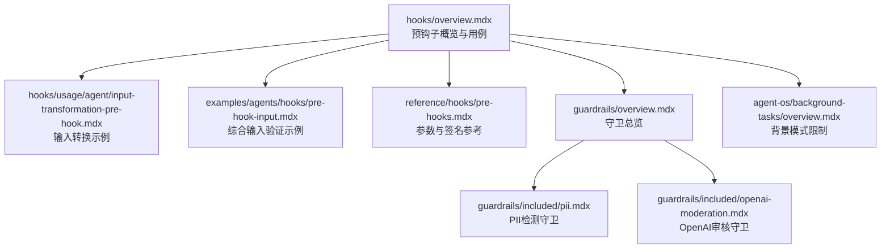
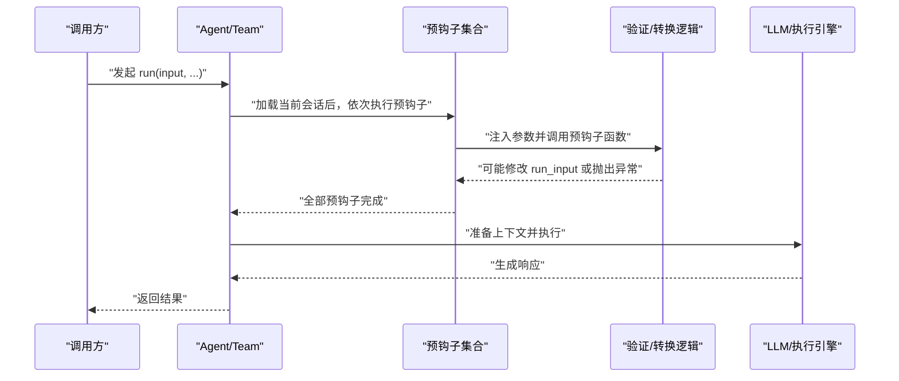
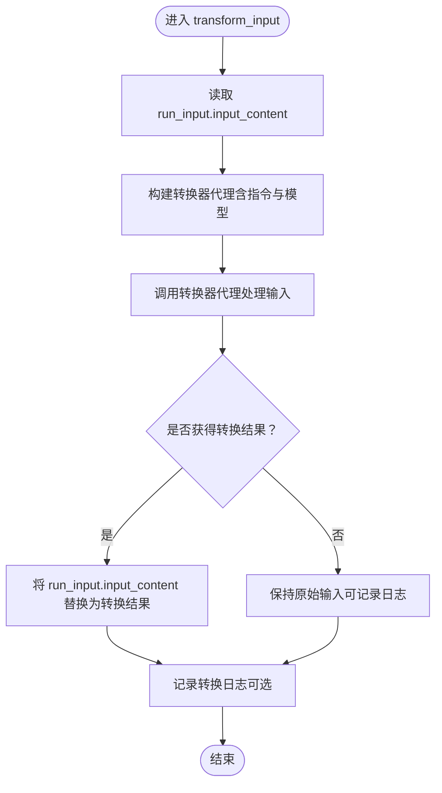
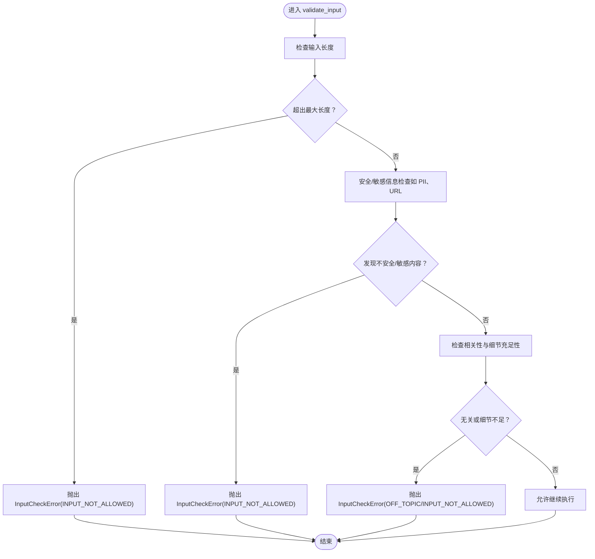
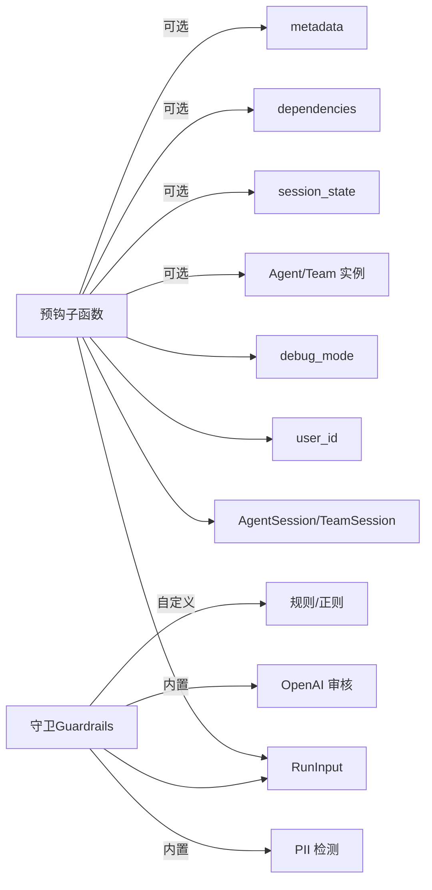

# 预钩子

<cite>
**本文引用的文件**
- [hooks/overview.mdx](file://hooks/overview.mdx)
- [hooks/usage/agent/input-transformation-pre-hook.mdx](file://hooks/usage/agent/input-transformation-pre-hook.mdx)
- [examples/agents/hooks/pre-hook-input.mdx](file://examples/agents/hooks/pre-hook-input.mdx)
- [reference/hooks/pre-hooks.mdx](file://reference/hooks/pre-hooks.mdx)
- [guardrails/overview.mdx](file://guardrails/overview.mdx)
- [guardrails/included/pii.mdx](file://guardrails/included/pii.mdx)
- [guardrails/included/openai-moderation.mdx](file://guardrails/included/openai-moderation.mdx)
- [agent-os/background-tasks/overview.mdx](file://agent-os/background-tasks/overview.mdx)
</cite>

## 目录
1. [简介](#简介)
2. [项目结构](#项目结构)
3. [核心组件](#核心组件)
4. [架构总览](#架构总览)
5. [详细组件分析](#详细组件分析)
6. [依赖关系分析](#依赖关系分析)
7. [性能考量](#性能考量)
8. [故障排查指南](#故障排查指南)
9. [结论](#结论)
10. [附录](#附录)

## 简介
本篇文档系统性阐述代理（Agent）与团队（Team）的“预钩子”（Pre-hooks）。预钩子在一次运行开始时最早执行，负责对即将进入模型的输入进行“转换”或“验证”，从而确保输入更贴合代理目的、更安全、更规范。本文围绕两大核心能力展开：输入转换与输入验证，并结合内置守卫（Guardrails）与异常处理机制，给出可落地的实现思路、流程图与最佳实践。

## 项目结构
与预钩子直接相关的知识分布在以下位置：
- 概览与用法：hooks/overview.mdx
- 输入转换示例：hooks/usage/agent/input-transformation-pre-hook.mdx
- 综合输入验证示例：examples/agents/hooks/pre-hook-input.mdx
- 预钩子参数参考：reference/hooks/pre-hooks.mdx
- 守卫总览与内置守卫：guardrails/overview.mdx、guardrails/included/pii.mdx、guardrails/included/openai-moderation.mdx
- 背景任务与限制说明：agent-os/background-tasks/overview.mdx

**图表来源**
- [hooks/overview.mdx:1-217](file://hooks/overview.mdx#L1-L217)
- [hooks/usage/agent/input-transformation-pre-hook.mdx:1-105](file://hooks/usage/agent/input-transformation-pre-hook.mdx#L1-L105)
- [examples/agents/hooks/pre-hook-input.mdx:1-182](file://examples/agents/hooks/pre-hook-input.mdx#L1-L182)
- [reference/hooks/pre-hooks.mdx:1-21](file://reference/hooks/pre-hooks.mdx#L1-L21)
- [guardrails/overview.mdx:63-85](file://guardrails/overview.mdx#L63-L85)
- [guardrails/included/pii.mdx:1-78](file://guardrails/included/pii.mdx#L1-L78)
- [guardrails/included/openai-moderation.mdx:1-63](file://guardrails/included/openai-moderation.mdx#L1-L63)
- [agent-os/background-tasks/overview.mdx:108-116](file://agent-os/background-tasks/overview.mdx#L108-L116)

**章节来源**
- [hooks/overview.mdx:1-217](file://hooks/overview.mdx#L1-L217)

## 核心组件
- 预钩子函数：在 Agent/Team 运行开始时自动注入参数并执行，支持对输入进行转换或验证。
- 输入转换（Transform）：通过另一个代理重写用户请求，使其更贴合代理目的与上下文。
- 输入验证（Validate）：对输入长度、格式、相关性、安全性等进行检查，必要时抛出异常阻止继续。
- 守卫（Guardrails）：内置或自定义的输入过滤器，如 PII 检测、OpenAI 内容审核等。
- 异常与触发器：使用 InputCheckError 及其触发器枚举（如 INPUT_NOT_ALLOWED、OFF_TOPIC）控制拦截与提示。

**章节来源**
- [hooks/overview.mdx:33-101](file://hooks/overview.mdx#L33-L101)
- [reference/hooks/pre-hooks.mdx:1-21](file://reference/hooks/pre-hooks.mdx#L1-L21)

## 架构总览
下图展示了预钩子在一次运行中的执行时机与职责边界：

**图表来源**
- [hooks/overview.mdx:25-37](file://hooks/overview.mdx#L25-L37)
- [reference/hooks/pre-hooks.mdx:5-21](file://reference/hooks/pre-hooks.mdx#L5-L21)

## 详细组件分析

### 输入转换预钩子（Transform）
- 目标：在进入模型前重写用户输入，使其更贴合代理目的与上下文，提升回答质量与一致性。
- 实现要点：
  - 使用另一个代理作为“转换器”，接收原始输入并输出改写后的输入。
  - 将转换后的文本回写到 run_input.input_content，覆盖原输入。
  - 可选地开启调试模式以记录日志。
- 关键参数：run_input、session、user_id、debug_mode（按需注入）。
- 示例路径：hooks/usage/agent/input-transformation-pre-hook.mdx

**图表来源**
- [hooks/usage/agent/input-transformation-pre-hook.mdx:19-54](file://hooks/usage/agent/input-transformation-pre-hook.mdx#L19-L54)

**章节来源**
- [hooks/usage/agent/input-transformation-pre-hook.mdx:1-105](file://hooks/usage/agent/input-transformation-pre-hook.mdx#L1-L105)

### 输入验证预钩子（Validate）
- 目标：在进入模型前对输入进行安全与合规检查，必要时拒绝请求。
- 常见检查项：
  - 长度限制：超过阈值则阻断。
  - 敏感信息检测：如 PII（个人身份信息）、URL 等。
  - 内容安全：识别不当、危险或违反政策的内容。
  - 相关性与细节：判断输入是否与代理领域相关且具备足够上下文。
- 异常与触发器：
  - 使用 InputCheckError 抛出异常。
  - 通过 check_trigger 指定拦截原因（如 INPUT_NOT_ALLOWED、OFF_TOPIC）。
- 示例路径：examples/agents/hooks/pre-hook-input.mdx

**图表来源**
- [examples/agents/hooks/pre-hook-input.mdx:31-85](file://examples/agents/hooks/pre-hook-input.mdx#L31-L85)
- [guardrails/overview.mdx:63-85](file://guardrails/overview.mdx#L63-L85)

**章节来源**
- [examples/agents/hooks/pre-hook-input.mdx:1-182](file://examples/agents/hooks/pre-hook-input.mdx#L1-L182)
- [guardrails/overview.mdx:63-85](file://guardrails/overview.mdx#L63-L85)

### 预钩子函数参数结构
- 自动注入参数（按需注入）：
  - run_input：待校验或可修改的输入对象。
  - agent/team：当前运行的代理或团队实例（仅在对应场景存在）。
  - session：当前会话对象。
  - session_state、dependencies、metadata：会话状态、依赖与元数据。
  - user_id：上下文用户标识（可选）。
  - debug_mode：调试模式开关（可选）。
- 参数选择：框架仅注入钩子函数声明所需的参数，便于最小化耦合。

**章节来源**
- [reference/hooks/pre-hooks.mdx:1-21](file://reference/hooks/pre-hooks.mdx#L1-L21)
- [hooks/overview.mdx:89-101](file://hooks/overview.mdx#L89-L101)

### 守卫（Guardrails）与内置工具
- 守卫是预钩子的重要实现载体，常见类型：
  - PII 检测：屏蔽或阻断敏感信息（SSN、信用卡、邮箱、电话等）。
  - OpenAI 内容审核：基于审核模型快速识别违规内容。
  - 自定义守卫：基于规则或正则表达式拦截特定关键词或模式。
- 使用方式：将守卫实例作为 pre_hooks 注入到 Agent/Team。

**章节来源**
- [guardrails/overview.mdx:63-85](file://guardrails/overview.mdx#L63-L85)
- [guardrails/included/pii.mdx:1-78](file://guardrails/included/pii.mdx#L1-L78)
- [guardrails/included/openai-moderation.mdx:1-63](file://guardrails/included/openai-moderation.mdx#L1-L63)

### 异常处理与 InputCheckError
- 当输入被判定为不安全、过长、无关或细节不足时，应抛出 InputCheckError。
- 触发器（check_trigger）用于明确拦截原因，便于上层策略与日志区分。
- 背景模式限制：在 AgentOS 的后台模式下，预钩子无法修改 run_input，仅适合日志/监控类任务。

**章节来源**
- [examples/agents/hooks/pre-hook-input.mdx:68-85](file://examples/agents/hooks/pre-hook-input.mdx#L68-L85)
- [agent-os/background-tasks/overview.mdx:108-116](file://agent-os/background-tasks/overview.mdx#L108-L116)

## 依赖关系分析
- 预钩子依赖于：
  - 运行输入对象（RunInput）以读取/写入 input_content。
  - 会话对象（AgentSession/TeamSession）以获取上下文。
  - 可选的调试与用户标识参数。
- 守卫依赖于：
  - 内置规则或外部审核服务（如 OpenAI Moderation）。
  - 正则或模式匹配库（如 PII 检测）。

**图表来源**
- [reference/hooks/pre-hooks.mdx:5-21](file://reference/hooks/pre-hooks.mdx#L5-L21)
- [guardrails/included/pii.mdx:1-78](file://guardrails/included/pii.mdx#L1-L78)
- [guardrails/included/openai-moderation.mdx:1-63](file://guardrails/included/openai-moderation.mdx#L1-L63)

**章节来源**
- [reference/hooks/pre-hooks.mdx:1-21](file://reference/hooks/pre-hooks.mdx#L1-L21)
- [guardrails/included/pii.mdx:1-78](file://guardrails/included/pii.mdx#L1-L78)
- [guardrails/included/openai-moderation.mdx:1-63](file://guardrails/included/openai-moderation.mdx#L1-L63)

## 性能考量
- 预钩子在模型执行前运行，应尽量轻量，避免引入显著延迟。
- 输入转换建议：
  - 使用较轻量的模型或提示词工程，减少推理成本。
  - 对重复输入进行缓存（如上下文相似度高时复用结果）。
- 输入验证建议：
  - 先做快速正则/长度检查，再做复杂语义分析。
  - 将守卫作为预钩子的一部分，利用其内置优化。
- 背景模式：
  - 日志/通知等非关键任务可后台执行，但注意不可修改输入。

[本节为通用建议，无需具体文件引用]

## 故障排查指南
- 常见问题与对策：
  - 输入被无故拦截：检查 check_trigger 与异常消息，确认是否误判（如相关性阈值过高）。
  - 转换后效果不佳：调整转换器指令与示例，或切换更合适的模型。
  - PII 误报/漏报：调整检测规则或启用掩码模式；必要时扩展自定义模式。
  - 后台模式无效：确认是否在 AgentOS 中运行，且未尝试修改 run_input。
- 排查步骤：
  - 开启 debug_mode 并查看日志，定位具体拦截点。
  - 分模块测试：先单独测试守卫，再组合多守卫。
  - 回归测试：针对边界输入（极短/极长、模糊/敏感、无关）进行回归。

**章节来源**
- [agent-os/background-tasks/overview.mdx:108-116](file://agent-os/background-tasks/overview.mdx#L108-L116)
- [guardrails/included/pii.mdx:60-72](file://guardrails/included/pii.mdx#L60-L72)

## 结论
预钩子是保障输入质量与安全的关键环节。通过“输入转换”使请求更贴合代理目标，“输入验证”确保合规与安全，配合内置守卫与异常机制，可构建稳健、可控的代理输入管线。建议在保证性能的前提下，优先采用轻量规则+守卫组合，并以调试与回归测试持续优化拦截策略。

[本节为总结，无需具体文件引用]

## 附录

### 实际应用场景与最佳实践
- 场景一：金融咨询代理
  - 使用输入转换预钩子将口语化问题转化为结构化财务背景。
  - 使用综合输入验证预钩子确保输入具备年龄、收入、风险偏好等关键信息。
  - 使用 PII 检测守卫屏蔽敏感信息。
- 场景二：客户服务代理
  - 使用 OpenAI 审核守卫过滤不当内容。
  - 使用长度与敏感信息检查防止滥用。
- 最佳实践清单
  - 明确拦截原因（check_trigger），便于日志与策略管理。
  - 逐步迭代：先规则后模型，先简单后复杂。
  - 保留回退策略：当转换失败时保留原始输入并记录告警。
  - 在 AgentOS 中谨慎使用后台模式，避免修改输入。

**章节来源**
- [hooks/usage/agent/input-transformation-pre-hook.mdx:1-105](file://hooks/usage/agent/input-transformation-pre-hook.mdx#L1-L105)
- [examples/agents/hooks/pre-hook-input.mdx:1-182](file://examples/agents/hooks/pre-hook-input.mdx#L1-L182)
- [guardrails/included/pii.mdx:1-78](file://guardrails/included/pii.mdx#L1-L78)
- [guardrails/included/openai-moderation.mdx:1-63](file://guardrails/included/openai-moderation.mdx#L1-L63)