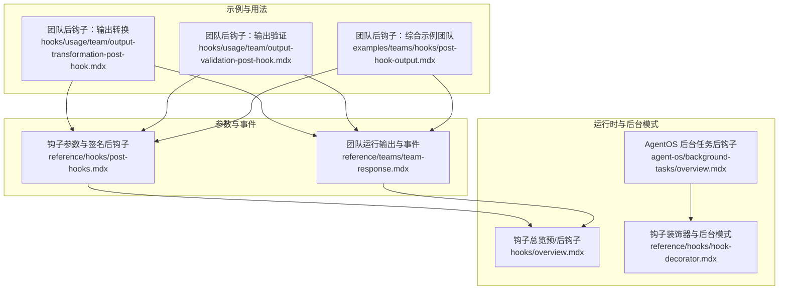
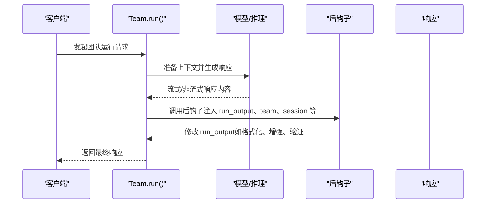
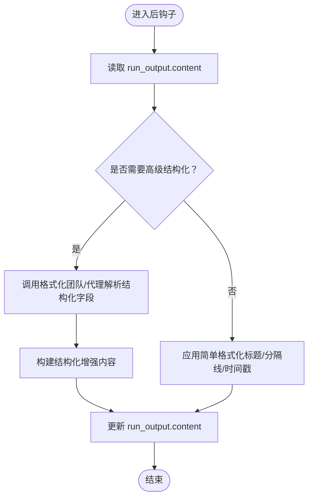
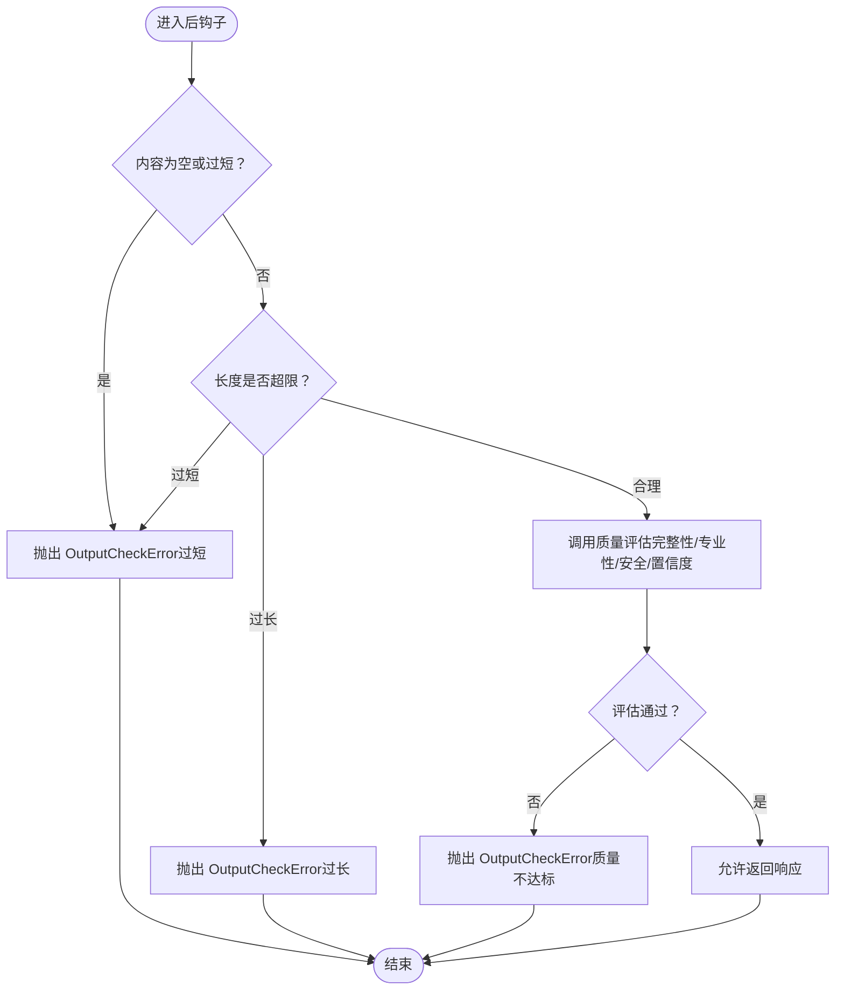
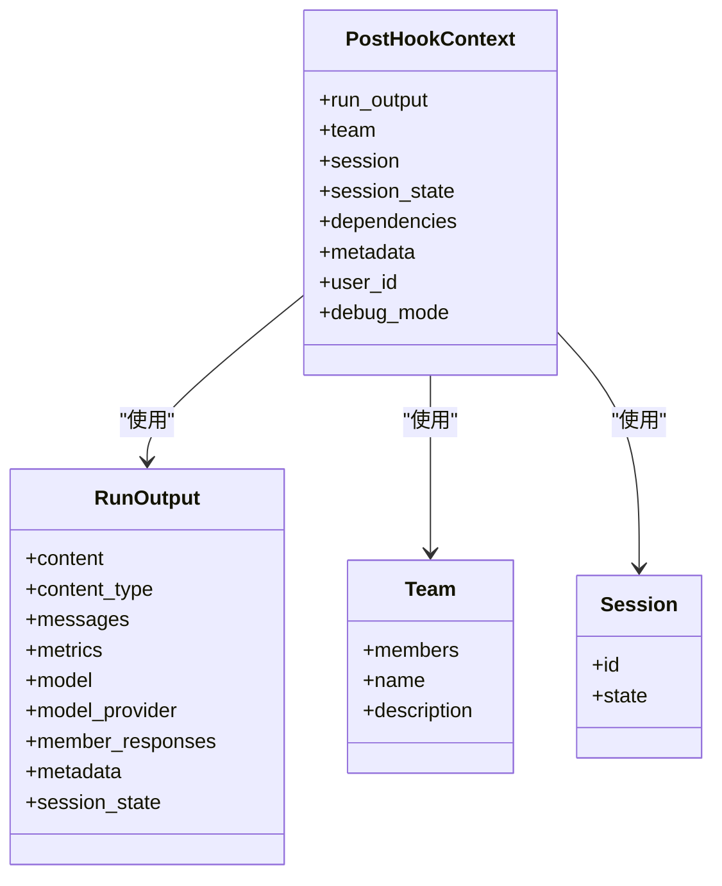
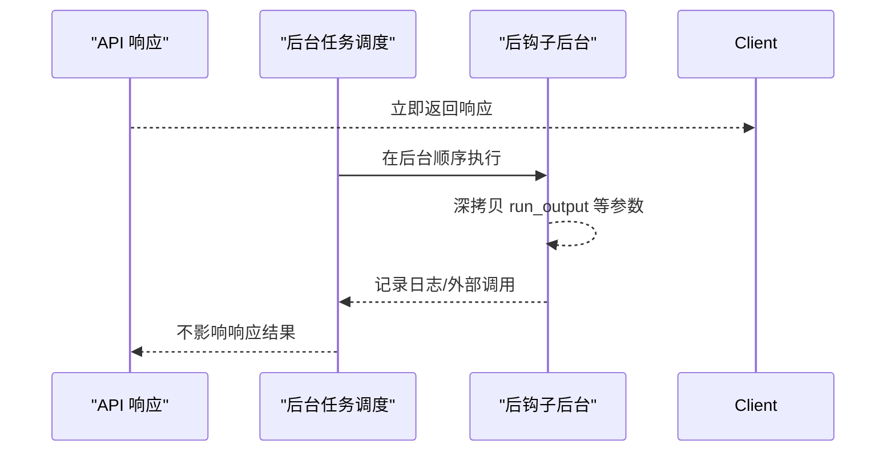
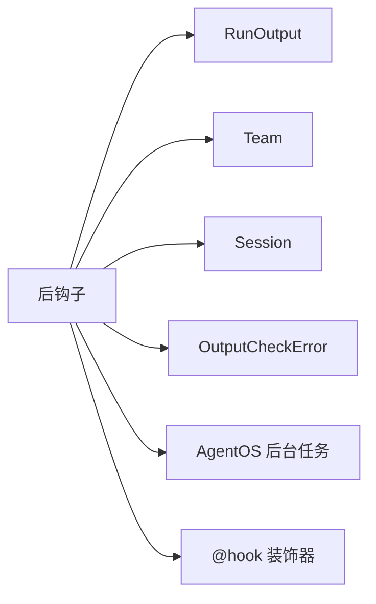

# 团队后钩子

<cite>
**本文引用的文件**
- [团队后钩子：输出转换](file://hooks/usage/team/output-transformation-post-hook.mdx)
- [团队后钩子：输出验证](file://hooks/usage/team/output-validation-post-hook.mdx)
- [团队后钩子：综合示例（团队）](file://examples/teams/hooks/post-hook-output.mdx)
- [钩子参数与签名（后钩子）](file://reference/hooks/post-hooks.mdx)
- [团队运行输出与事件](file://reference/teams/team-response.mdx)
- [钩子总览（预/后钩子）](file://hooks/overview.mdx)
- [AgentOS 后台任务（后钩子）](file://agent-os/background-tasks/overview.mdx)
- [钩子装饰器与后台模式](file://reference/hooks/hook-decorator.mdx)
</cite>

## 目录
1. [简介](#简介)
2. [项目结构](#项目结构)
3. [核心组件](#核心组件)
4. [架构总览](#架构总览)
5. [详细组件分析](#详细组件分析)
6. [依赖关系分析](#依赖关系分析)
7. [性能考量](#性能考量)
8. [故障排查指南](#故障排查指南)
9. [结论](#结论)
10. [附录](#附录)

## 简介
本文件系统性阐述“团队后钩子”的技术机制与实践方法，覆盖以下主题：
- 团队后钩子在团队执行后的处理职责：响应数据的后处理、验证与增强
- 后钩子函数的签名与参数使用：团队响应、会话状态与执行上下文
- 执行时机与在团队生命周期中的作用
- 输出转换后钩子的实际示例：格式化团队响应以满足特定需求
- 输出验证后钩子的实现：响应内容检查、格式验证与质量控制
- 异常处理策略与错误恢复机制
- 团队后钩子的配置示例与集成指南
- 后钩子与预钩子的配合使用方式

## 项目结构
围绕团队后钩子的相关资料主要分布在以下位置：
- 示例与用法：hooks/usage/team 与 examples/teams/hooks
- 参数与事件：reference/hooks 与 reference/teams
- 运行时行为与后台模式：agent-os/background-tasks 与 reference/hooks/hook-decorator

图表来源
- [团队后钩子：输出转换](file://hooks/usage/team/output-transformation-post-hook.mdx)
- [团队后钩子：输出验证](file://hooks/usage/team/output-validation-post-hook.mdx)
- [团队后钩子：综合示例（团队）](file://examples/teams/hooks/post-hook-output.mdx)
- [钩子参数与签名（后钩子）](file://reference/hooks/post-hooks.mdx)
- [团队运行输出与事件](file://reference/teams/team-response.mdx)
- [钩子总览（预/后钩子）](file://hooks/overview.mdx)
- [AgentOS 后台任务（后钩子）](file://agent-os/background-tasks/overview.mdx)
- [钩子装饰器与后台模式](file://reference/hooks/hook-decorator.mdx)

章节来源
- [钩子参数与签名（后钩子）](file://reference/hooks/post-hooks.mdx)
- [团队运行输出与事件](file://reference/teams/team-response.mdx)
- [钩子总览（预/后钩子）](file://hooks/overview.mdx)

## 核心组件
- 后钩子函数
  - 接收参数：run_output（团队运行输出）、team（团队实例）、session（会话对象）、session_state（会话状态）、dependencies（依赖字典）、metadata（元数据）、user_id（用户标识）、debug_mode（调试模式）
  - 返回值：无；通过修改 run_output.content 或其他字段实现响应增强
- 团队运行输出（TeamRunOutput）
  - 包含整体响应 content、成员响应列表 member_responses、消息列表 messages、指标 metrics、模型信息、媒体与文件等
  - 支持事件流：内容分块、中间态、完成态、错误、取消、暂停/继续等
- 验证与异常
  - 使用 OutputCheckError 触发校验失败，结合 CheckTrigger 指定触发类型
- 后台执行
  - 通过 @hook(run_in_background=True) 或 AgentOS 全局设置，使后钩子在响应返回后再异步执行，避免阻塞

章节来源
- [钩子参数与签名（后钩子）](file://reference/hooks/post-hooks.mdx)
- [团队运行输出与事件](file://reference/teams/team-response.mdx)
- [AgentOS 后台任务（后钩子）](file://agent-os/background-tasks/overview.mdx)
- [钩子装饰器与后台模式](file://reference/hooks/hook-decorator.mdx)

## 架构总览
团队后钩子在团队生命周期中的位置如下：

图表来源
- [钩子总览（预/后钩子）](file://hooks/overview.mdx)
- [团队运行输出与事件](file://reference/teams/team-response.mdx)

## 详细组件分析

### 组件A：输出转换后钩子
目标：在团队响应返回前对其进行格式化、结构化与增强，提升可读性与用户体验。

- 关键点
  - 修改 run_output.content 实现格式化（如添加标题、分隔线、时间戳、免责声明）
  - 可调用另一个团队或代理进行结构化解析与重组（如提取要点、建议问题、免责声明）
  - 失败回退：当高级格式化失败时，回退到简单格式化策略
- 示例路径
  - [输出转换后钩子示例](file://hooks/usage/team/output-transformation-post-hook.mdx)
  - [综合团队后钩子示例（含结构化输出）](file://examples/teams/hooks/post-hook-output.mdx)

图表来源
- [团队后钩子：输出转换](file://hooks/usage/team/output-transformation-post-hook.mdx)
- [团队后钩子：综合示例（团队）](file://examples/teams/hooks/post-hook-output.mdx)

章节来源
- [团队后钩子：输出转换](file://hooks/usage/team/output-transformation-post-hook.mdx)
- [团队后钩子：综合示例（团队）](file://examples/teams/hooks/post-hook-output.mdx)

### 组件B：输出验证后钩子
目标：在团队响应返回前进行质量与安全校验，确保输出满足最小标准。

- 关键点
  - 基础长度校验：过短或过长均拒绝
  - 综合质量评估：完整性、专业性、安全性、置信度阈值
  - 使用 OutputCheckError 抛出校验失败，并携带 CheckTrigger 类型
  - 可通过另一个团队/代理对响应进行结构化评估
- 示例路径
  - [输出验证后钩子示例](file://hooks/usage/team/output-validation-post-hook.mdx)
  - [综合团队后钩子示例（含团队协作质量校验）](file://examples/teams/hooks/post-hook-output.mdx)

图表来源
- [团队后钩子：输出验证](file://hooks/usage/team/output-validation-post-hook.mdx)
- [团队后钩子：综合示例（团队）](file://examples/teams/hooks/post-hook-output.mdx)

章节来源
- [团队后钩子：输出验证](file://hooks/usage/team/output-validation-post-hook.mdx)
- [团队后钩子：综合示例（团队）](file://examples/teams/hooks/post-hook-output.mdx)

### 组件C：后钩子参数与签名
- 必要参数
  - run_output：当前团队运行输出（包含 content、member_responses、metrics 等）
  - team：当前团队实例（用于读取成员、描述等上下文）
  - session：当前会话对象
  - session_state：会话状态字典
  - dependencies、metadata、user_id、debug_mode：可选上下文
- 事件与生命周期
  - 团队运行事件：开始、内容分块、中间态、完成、错误、取消、暂停/继续
  - 后钩子事件：开始、完成
- 示例路径
  - [钩子参数与签名（后钩子）](file://reference/hooks/post-hooks.mdx)
  - [团队运行输出与事件](file://reference/teams/team-response.mdx)

图表来源
- [钩子参数与签名（后钩子）](file://reference/hooks/post-hooks.mdx)
- [团队运行输出与事件](file://reference/teams/team-response.mdx)

章节来源
- [钩子参数与签名（后钩子）](file://reference/hooks/post-hooks.mdx)
- [团队运行输出与事件](file://reference/teams/team-response.mdx)

### 组件D：后台执行与错误隔离
- 后台模式
  - 通过 @hook(run_in_background=True) 或 AgentOS 全局设置，使后钩子在响应返回后异步执行
  - 适合日志、通知、外部同步等非关键任务
- 数据隔离
  - AgentOS 自动深拷贝 run_input、run_context、run_output，避免竞态
- 错误处理
  - 后台任务失败不影响已发送的响应，需在钩子内记录日志并容错
- 示例路径
  - [AgentOS 后台任务（后钩子）](file://agent-os/background-tasks/overview.mdx)
  - [钩子装饰器与后台模式](file://reference/hooks/hook-decorator.mdx)

图表来源
- [AgentOS 后台任务（后钩子）](file://agent-os/background-tasks/overview.mdx)
- [钩子装饰器与后台模式](file://reference/hooks/hook-decorator.mdx)

章节来源
- [AgentOS 后台任务（后钩子）](file://agent-os/background-tasks/overview.mdx)
- [钩子装饰器与后台模式](file://reference/hooks/hook-decorator.mdx)

## 依赖关系分析
- 组件耦合
  - 后钩子强依赖 run_output 的结构（content、member_responses 等），弱依赖 team 的成员信息
  - 验证类钩子可能依赖额外的团队/代理进行结构化评估
- 外部依赖
  - AgentOS 提供后台任务能力与数据隔离
  - 异常类型 OutputCheckError 用于统一校验失败语义
- 潜在循环
  - 后钩子不应修改已发送响应；若需修改，应使用同步后钩子并在 AgentOS 中谨慎配置

图表来源
- [钩子参数与签名（后钩子）](file://reference/hooks/post-hooks.mdx)
- [AgentOS 后台任务（后钩子）](file://agent-os/background-tasks/overview.mdx)
- [钩子装饰器与后台模式](file://reference/hooks/hook-decorator.mdx)

章节来源
- [钩子参数与签名（后钩子）](file://reference/hooks/post-hooks.mdx)
- [AgentOS 后台任务（后钩子）](file://agent-os/background-tasks/overview.mdx)
- [钩子装饰器与后台模式](file://reference/hooks/hook-decorator.mdx)

## 性能考量
- 后台执行可显著降低响应延迟，适用于非关键后处理（日志、通知、外部同步）
- 结构化格式化与质量评估可能引入额外推理成本，建议：
  - 对高频场景采用轻量规则（如长度/关键词检测）
  - 对低频场景启用复杂评估，或在后台执行
- 注意避免在后钩子中进行阻塞 IO 或高延迟操作，必要时使用后台模式

## 故障排查指南
- 常见问题
  - 响应被拒绝：检查 OutputCheckError 的触发条件与 CheckTrigger 类型
  - 后台钩子未生效：确认是否在 AgentOS 中启用全局后台模式或使用 @hook(run_in_background=True)
  - 数据被意外修改：后台模式下无法修改请求/响应，需改为同步后钩子或在预钩子阶段处理
- 定位手段
  - 查看团队运行事件（开始/内容/中间态/完成/错误/取消/暂停/继续）
  - 检查后钩子事件（开始/完成）
  - 开启调试模式（debug_mode）查看上下文参数
- 示例路径
  - [团队运行输出与事件](file://reference/teams/team-response.mdx)
  - [AgentOS 后台任务（后钩子）](file://agent-os/background-tasks/overview.mdx)

章节来源
- [团队运行输出与事件](file://reference/teams/team-response.mdx)
- [AgentOS 后台任务（后钩子）](file://agent-os/background-tasks/overview.mdx)

## 结论
团队后钩子提供了在响应返回前进行“后处理、验证与增强”的统一机制。通过合理的参数注入、事件感知与后台执行策略，可以在保证用户体验的同时，严格控制输出质量与合规性。建议优先采用轻量规则作为默认策略，复杂评估与结构化处理按需启用后台模式，确保系统性能与稳定性。

## 附录

### 配置与集成示例
- 在团队上注册后钩子
  - 将后钩子函数加入 post_hooks 列表
  - 示例路径
    - [输出转换后钩子示例](file://hooks/usage/team/output-transformation-post-hook.mdx)
    - [输出验证后钩子示例](file://hooks/usage/team/output-validation-post-hook.mdx)
    - [综合团队后钩子示例（团队）](file://examples/teams/hooks/post-hook-output.mdx)
- 后台执行
  - 使用 @hook(run_in_background=True) 标记特定后钩子
  - 或在 AgentOS 中开启全局后台模式
  - 示例路径
    - [AgentOS 后台任务（后钩子）](file://agent-os/background-tasks/overview.mdx)
    - [钩子装饰器与后台模式](file://reference/hooks/hook-decorator.mdx)

### 与预钩子的配合
- 预钩子：在团队运行开始前执行，适合输入验证、预处理与上下文注入
- 后钩子：在团队生成响应后、返回前执行，适合输出验证、格式化与增强
- 协同建议
  - 输入阶段做“准入控制”，输出阶段做“质量把关”
  - 对于需要修改请求/响应的逻辑，优先使用同步钩子；仅将非关键任务放入后台

章节来源
- [钩子总览（预/后钩子）](file://hooks/overview.mdx)
- [AgentOS 后台任务（后钩子）](file://agent-os/background-tasks/overview.mdx)
- [钩子装饰器与后台模式](file://reference/hooks/hook-decorator.mdx)