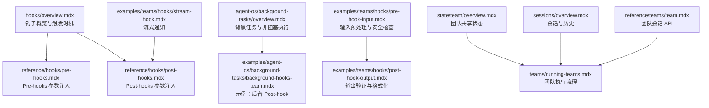
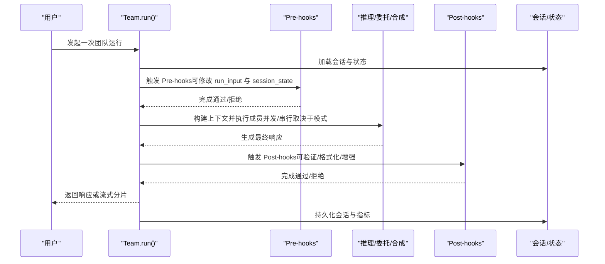
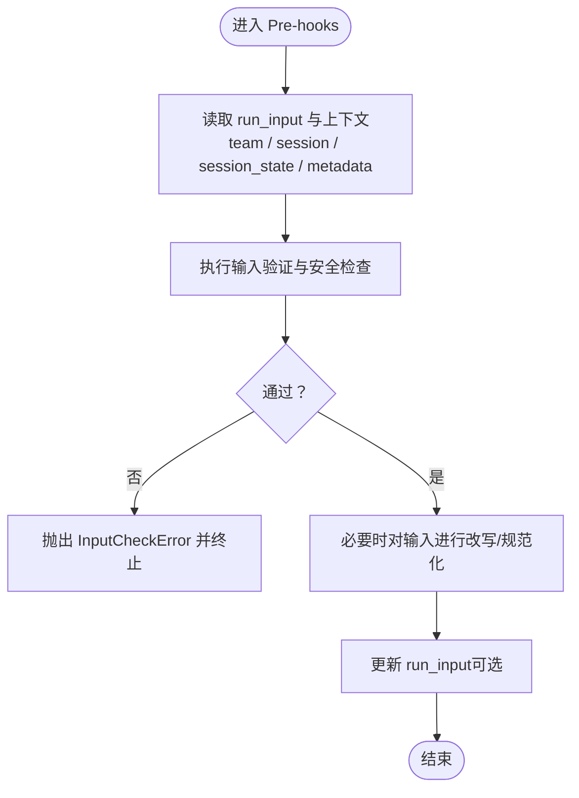
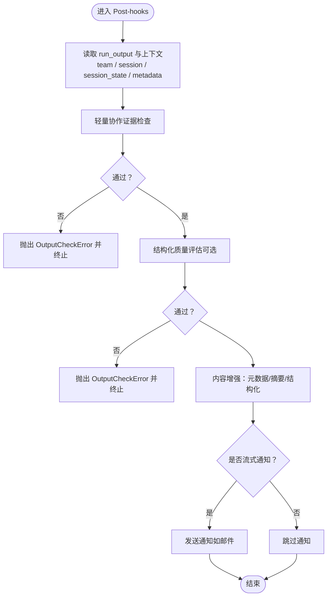
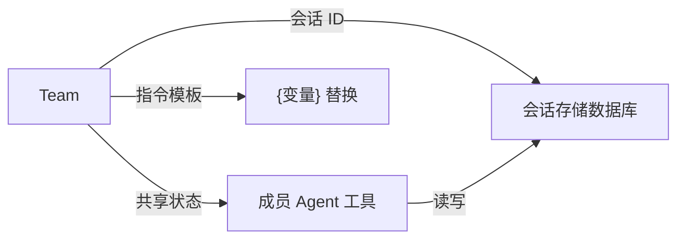
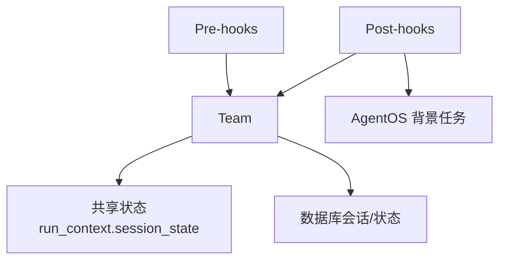

# 团队钩子

<cite>
**本文引用的文件**
- [hooks/overview.mdx](file://hooks/overview.mdx)
- [reference/hooks/pre-hooks.mdx](file://reference/hooks/pre-hooks.mdx)
- [reference/hooks/post-hooks.mdx](file://reference/hooks/post-hooks.mdx)
- [agent-os/background-tasks/overview.mdx](file://agent-os/background-tasks/overview.mdx)
- [examples/teams/hooks/pre-hook-input.mdx](file://examples/teams/hooks/pre-hook-input.mdx)
- [examples/teams/hooks/post-hook-output.mdx](file://examples/teams/hooks/post-hook-output.mdx)
- [examples/teams/hooks/stream-hook.mdx](file://examples/teams/hooks/stream-hook.mdx)
- [examples/agent-os/background-tasks/background-hooks-team.mdx](file://examples/agent-os/background-tasks/background-hooks-team.mdx)
- [state/team/overview.mdx](file://state/team/overview.mdx)
- [sessions/overview.mdx](file://sessions/overview.mdx)
- [teams/running-teams.mdx](file://teams/running-teams.mdx)
- [reference/teams/team.mdx](file://reference/teams/team.mdx)
</cite>

## 目录
1. [简介](#简介)
2. [项目结构](#项目结构)
3. [核心组件](#核心组件)
4. [架构总览](#架构总览)
5. [详细组件分析](#详细组件分析)
6. [依赖关系分析](#依赖关系分析)
7. [性能考量](#性能考量)
8. [故障排查指南](#故障排查指南)
9. [结论](#结论)
10. [附录](#附录)

## 简介
本文件系统性阐述团队级别的钩子（Pre-hooks 与 Post-hooks）在多智能体协作中的设计与实践，覆盖以下主题：
- 团队级输入验证、数据预处理与安全检查（Pre-hooks）
- 团队级响应验证、格式化与增强（Post-hooks）
- 钩子在团队协调中的角色与执行顺序
- 参数注入与上下文访问（团队上下文、成员状态、会话信息）
- 异常处理与调试技巧
- 实际协作场景示例（从输入守卫到输出增强）

## 项目结构
围绕“团队钩子”的知识分布在如下位置：
- 概览与触发时机：hooks/overview.mdx
- 参数注入规范：reference/hooks/pre-hooks.mdx、reference/hooks/post-hooks.mdx
- 背景任务与非阻塞执行：agent-os/background-tasks/overview.mdx
- 示例：输入预处理与安全检查、输出验证与格式化、流式通知
- 团队运行时流程与模式：teams/running-teams.mdx
- 团队会话与共享状态：state/team/overview.mdx、sessions/overview.mdx
- 团队 API 参考：reference/teams/team.mdx

图示来源
- [hooks/overview.mdx:1-33](file://hooks/overview.mdx#L1-L33)
- [reference/hooks/pre-hooks.mdx:1-21](file://reference/hooks/pre-hooks.mdx#L1-L21)
- [reference/hooks/post-hooks.mdx:1-21](file://reference/hooks/post-hooks.mdx#L1-L21)
- [agent-os/background-tasks/overview.mdx:1-168](file://agent-os/background-tasks/overview.mdx#L1-L168)
- [examples/teams/hooks/pre-hook-input.mdx:1-314](file://examples/teams/hooks/pre-hook-input.mdx#L1-L314)
- [examples/teams/hooks/post-hook-output.mdx:1-516](file://examples/teams/hooks/post-hook-output.mdx#L1-L516)
- [examples/teams/hooks/stream-hook.mdx:1-84](file://examples/teams/hooks/stream-hook.mdx#L1-L84)
- [examples/agent-os/background-tasks/background-hooks-team.mdx:1-99](file://examples/agent-os/background-tasks/background-hooks-team.mdx#L1-L99)
- [state/team/overview.mdx:1-357](file://state/team/overview.mdx#L1-L357)
- [sessions/overview.mdx:1-87](file://sessions/overview.mdx#L1-L87)
- [teams/running-teams.mdx:38-59](file://teams/running-teams.mdx#L38-L59)
- [reference/teams/team.mdx:359-433](file://reference/teams/team.mdx#L359-L433)

章节来源
- [hooks/overview.mdx:1-33](file://hooks/overview.mdx#L1-L33)
- [reference/hooks/pre-hooks.mdx:1-21](file://reference/hooks/pre-hooks.mdx#L1-L21)
- [reference/hooks/post-hooks.mdx:1-21](file://reference/hooks/post-hooks.mdx#L1-L21)
- [agent-os/background-tasks/overview.mdx:1-168](file://agent-os/background-tasks/overview.mdx#L1-L168)
- [examples/teams/hooks/pre-hook-input.mdx:1-314](file://examples/teams/hooks/pre-hook-input.mdx#L1-L314)
- [examples/teams/hooks/post-hook-output.mdx:1-516](file://examples/teams/hooks/post-hook-output.mdx#L1-L516)
- [examples/teams/hooks/stream-hook.mdx:1-84](file://examples/teams/hooks/stream-hook.mdx#L1-L84)
- [examples/agent-os/background-tasks/background-hooks-team.mdx:1-99](file://examples/agent-os/background-tasks/background-hooks-team.mdx#L1-L99)
- [state/team/overview.mdx:1-357](file://state/team/overview.mdx#L1-L357)
- [sessions/overview.mdx:1-87](file://sessions/overview.mdx#L1-L87)
- [teams/running-teams.mdx:38-59](file://teams/running-teams.mdx#L38-L59)
- [reference/teams/team.mdx:359-433](file://reference/teams/team.mdx#L359-L433)

## 核心组件
- 钩子类型与触发点
  - Pre-hooks：在会话加载后、模型上下文准备前执行，适合输入校验、规范化与安全检查；修改 run_input 与 session_state 在此阶段生效。
  - Post-hooks：在生成响应并准备返回前执行，适合输出验证、格式化与增强；在流式响应中，每个分片生成后均可能触发。
- 参数注入
  - 共同参数：team、session、session_state、dependencies、metadata、user_id、debug_mode
  - Pre-hooks 特有：run_input
  - Post-hooks 特有：run_output
- 执行模式
  - 同步：默认阻塞响应
  - 背景任务：AgentOS 提供全局或按钩子粒度的异步执行，不阻塞响应，但无法修改请求/响应

章节来源
- [hooks/overview.mdx:25-32](file://hooks/overview.mdx#L25-L32)
- [reference/hooks/pre-hooks.mdx:5-21](file://reference/hooks/pre-hooks.mdx#L5-L21)
- [reference/hooks/post-hooks.mdx:5-21](file://reference/hooks/post-hooks.mdx#L5-L21)
- [agent-os/background-tasks/overview.mdx:8-110](file://agent-os/background-tasks/overview.mdx#L8-L110)

## 架构总览
下图展示了团队运行时中钩子与上下文、状态、历史之间的交互关系。

图示来源
- [teams/running-teams.mdx:38-59](file://teams/running-teams.mdx#L38-L59)
- [hooks/overview.mdx:25-32](file://hooks/overview.mdx#L25-L32)
- [state/team/overview.mdx:14-31](file://state/team/overview.mdx#L14-L31)
- [sessions/overview.mdx:12-28](file://sessions/overview.mdx#L12-L28)

## 详细组件分析

### 团队预钩子（Pre-hooks）
目标与职责
- 输入验证：判断请求是否与团队能力匹配、是否需要团队协作、是否具备足够细节
- 安全检查：识别潜在风险内容，阻止不当请求
- 数据预处理：将原始输入改写为更利于团队协作的结构化表述
- 会话与上下文：基于 session/session_state/dependencies/metadata/user_id 进行上下文感知处理

关键参数与访问方式
- team：当前团队对象
- run_input：本次运行的输入（可被预钩子修改）
- session/session_state：当前会话及其状态
- dependencies/metadata/user_id/debug_mode：运行元数据与环境信息

典型实现要点
- 使用专用 Agent 对输入进行结构化评估，输出评分与建议
- 将评估结果映射为异常（如 InputCheckError）以中断执行
- 将改写后的输入回写到 run_input，确保后续执行使用规范化输入

图示来源
- [reference/hooks/pre-hooks.mdx:5-21](file://reference/hooks/pre-hooks.mdx#L5-L21)
- [examples/teams/hooks/pre-hook-input.mdx:35-150](file://examples/teams/hooks/pre-hook-input.mdx#L35-L150)

章节来源
- [reference/hooks/pre-hooks.mdx:5-21](file://reference/hooks/pre-hooks.mdx#L5-L21)
- [examples/teams/hooks/pre-hook-input.mdx:1-314](file://examples/teams/hooks/pre-hook-input.mdx#L1-L314)

### 团队后钩子（Post-hooks）
目标与职责
- 输出质量与一致性验证：确保响应涵盖多视角、逻辑一致、专业且安全
- 响应增强与格式化：添加元数据、摘要、结构化输出等
- 流式通知：在流式响应中发送外部通知（如邮件）

关键参数与访问方式
- team：当前团队对象
- run_output：本次运行的输出（可被后钩子修改）
- session/session_state：当前会话及其状态
- dependencies/metadata/user_id/debug_mode：运行元数据与环境信息

典型实现要点
- 轻量规则：基于关键词与长度快速判定协作证据
- 结构化评估：使用专用 Agent 对响应进行多维度打分
- 内容增强：追加团队元信息、成员贡献摘要或结构化报告
- 流式场景：利用 metadata 中的用户邮箱等信息进行异步通知

图示来源
- [reference/hooks/post-hooks.mdx:5-21](file://reference/hooks/post-hooks.mdx#L5-L21)
- [examples/teams/hooks/post-hook-output.mdx:46-134](file://examples/teams/hooks/post-hook-output.mdx#L46-L134)
- [examples/teams/hooks/stream-hook.mdx:25-37](file://examples/teams/hooks/stream-hook.mdx#L25-L37)

章节来源
- [reference/hooks/post-hooks.mdx:5-21](file://reference/hooks/post-hooks.mdx#L5-L21)
- [examples/teams/hooks/post-hook-output.mdx:1-516](file://examples/teams/hooks/post-hook-output.mdx#L1-L516)
- [examples/teams/hooks/stream-hook.mdx:1-84](file://examples/teams/hooks/stream-hook.mdx#L1-L84)

### 团队钩子与单个代理钩子的区别
- 作用范围
  - 团队钩子：面向团队级输入/输出，关注多智能体协作的整体质量与一致性
  - 代理钩子：面向单个智能体的输入/输出，关注个体行为与策略
- 协调机制
  - 团队钩子通常在团队领导层统一执行，作为“门卫”或“装饰器”
  - 代理钩子在成员内部执行，侧重工具调用、记忆与推理
- 执行顺序
  - 团队 Pre-hooks → 成员执行 → 团队 Post-hooks
  - 与单代理的 Pre/Post 顺序类似，但增加了跨成员的汇总与合成环节

章节来源
- [teams/running-teams.mdx:38-59](file://teams/running-teams.mdx#L38-L59)
- [hooks/overview.mdx:25-32](file://hooks/overview.mdx#L25-L32)

### 团队上下文、成员状态与会话信息的访问方法
- 团队上下文
  - 通过 run_context.session_state 访问共享状态（团队成员可见）
  - 在指令中使用 {key} 语法引用 session_state 变量
- 成员状态
  - 成员工具函数接收 run_context，可在其中读写 session_state
  - 支持嵌套团队与子团队的状态传播
- 会话信息
  - 通过 session_id 切换会话，加载/保存 session_state
  - 会话持久化需配置数据库（InMemoryDb 可用于演示）

图示来源
- [state/team/overview.mdx:14-31](file://state/team/overview.mdx#L14-L31)
- [state/team/overview.mdx:214-235](file://state/team/overview.mdx#L214-L235)
- [reference/teams/team.mdx:359-433](file://reference/teams/team.mdx#L359-L433)
- [sessions/overview.mdx:12-28](file://sessions/overview.mdx#L12-L28)

章节来源
- [state/team/overview.mdx:1-357](file://state/team/overview.mdx#L1-L357)
- [reference/teams/team.mdx:359-433](file://reference/teams/team.mdx#L359-L433)
- [sessions/overview.mdx:1-87](file://sessions/overview.mdx#L1-L87)

### 团队钩子的参数说明（一览）
- 公共参数
  - team：团队对象
  - session：会话对象
  - session_state：会话状态字典
  - dependencies：运行依赖字典
  - metadata：运行元数据字典
  - user_id：用户标识
  - debug_mode：调试模式开关
- Pre-hooks 特有
  - run_input：运行输入对象
- Post-hooks 特有
  - run_output：运行输出对象

章节来源
- [reference/hooks/pre-hooks.mdx:5-21](file://reference/hooks/pre-hooks.mdx#L5-L21)
- [reference/hooks/post-hooks.mdx:5-21](file://reference/hooks/post-hooks.mdx#L5-L21)

### 异常处理与调试技巧
- 异常类型
  - InputCheckError：Pre-hooks 中用于拒绝输入
  - OutputCheckError：Post-hooks 中用于拒绝输出
- 调试建议
  - 使用 debug_mode 输出中间状态
  - 在 Pre-hooks 中打印 run_input 与 session_state 的变化
  - 在 Post-hooks 中打印 run_output 的结构与增强结果
- 背景任务注意事项
  - 背景模式不支持修改请求/响应，仅适用于日志、通知等非关键操作
  - AgentOS 自动深拷贝 run_input/run_context/run_output，避免竞态

章节来源
- [examples/teams/hooks/pre-hook-input.mdx:257-287](file://examples/teams/hooks/pre-hook-input.mdx#L257-L287)
- [examples/teams/hooks/post-hook-output.mdx:46-134](file://examples/teams/hooks/post-hook-output.mdx#L46-L134)
- [agent-os/background-tasks/overview.mdx:108-134](file://agent-os/background-tasks/overview.mdx#L108-L134)

### 实际协作场景示例
- 场景一：输入守卫与规范化
  - 使用 Pre-hooks 对复杂请求进行“是否适合团队协作”的评估，并改写为更利于成员分工的表述
  - 示例路径：[输入预处理与安全检查:1-314](file://examples/teams/hooks/pre-hook-input.mdx#L1-L314)
- 场景二：输出验证与增强
  - 使用 Post-hooks 对团队响应进行多维度质量评估，并追加元数据、协作摘要或结构化报告
  - 示例路径：[输出验证与格式化:1-516](file://examples/teams/hooks/post-hook-output.mdx#L1-L516)
- 场景三：流式通知
  - 在 Post-hooks 中读取 metadata 中的用户邮箱，向用户发送通知
  - 示例路径：[流式通知:1-84](file://examples/teams/hooks/stream-hook.mdx#L1-L84)
- 场景四：后台 Post-hook
  - 使用 AgentOS 的背景任务模式，将耗时的外部同步或日志记录放入后台
  - 示例路径：[后台 Post-hook 示例:1-99](file://examples/agent-os/background-tasks/background-hooks-team.mdx#L1-L99)

章节来源
- [examples/teams/hooks/pre-hook-input.mdx:1-314](file://examples/teams/hooks/pre-hook-input.mdx#L1-L314)
- [examples/teams/hooks/post-hook-output.mdx:1-516](file://examples/teams/hooks/post-hook-output.mdx#L1-L516)
- [examples/teams/hooks/stream-hook.mdx:1-84](file://examples/teams/hooks/stream-hook.mdx#L1-L84)
- [examples/agent-os/background-tasks/background-hooks-team.mdx:1-99](file://examples/agent-os/background-tasks/background-hooks-team.mdx#L1-L99)

## 依赖关系分析
- 组件耦合
  - 钩子与团队：Pre-hooks/Post-hooks 依赖 team、session、session_state
  - 钩子与 AgentOS：背景任务模式依赖 AgentOS 的 BackgroundTasks
  - 钩子与状态：共享状态通过 run_context.session_state 在成员间传播
- 外部依赖
  - 数据库：会话与状态持久化
  - 第三方服务：流式通知示例中模拟的邮件发送

图示来源
- [state/team/overview.mdx:14-31](file://state/team/overview.mdx#L14-L31)
- [agent-os/background-tasks/overview.mdx:102-122](file://agent-os/background-tasks/overview.mdx#L102-L122)
- [reference/teams/team.mdx:359-433](file://reference/teams/team.mdx#L359-L433)

章节来源
- [state/team/overview.mdx:1-357](file://state/team/overview.mdx#L1-L357)
- [agent-os/background-tasks/overview.mdx:1-168](file://agent-os/background-tasks/overview.mdx#L1-L168)
- [reference/teams/team.mdx:359-433](file://reference/teams/team.mdx#L359-L433)

## 性能考量
- 背景任务
  - 启用 run_hooks_in_background 可显著降低响应延迟，但仅适用于非关键操作
  - 背景任务顺序执行，避免并发竞争
- I/O 与外部服务
  - 将外部 API 调用、日志与通知移至后台，减少主流程阻塞
- 评估成本
  - 结构化评估（如使用专用 Agent）会增加推理开销，建议在必要时启用

章节来源
- [agent-os/background-tasks/overview.mdx:8-110](file://agent-os/background-tasks/overview.mdx#L8-L110)

## 故障排查指南
- 输入被拒绝
  - 检查 InputCheckError 的 check_trigger，定位具体失败原因（安全、相关性、协作价值、置信度）
  - 在 Pre-hooks 中打印 run_input 与评估结果，确认改写是否正确
- 输出被拒绝
  - 检查 OutputCheckError 的 check_trigger，关注综合性、协作性、一致性、专业性与安全性
  - 使用轻量规则快速定位问题，再引入结构化评估
- 背景任务未生效
  - 确认运行环境为 AgentOS；直接运行团队不会触发 @hook(run_in_background)
  - 确认错误处理与日志记录，避免静默失败
- 状态不同步
  - 确保 add_session_state_to_context=True，并在工具中正确读写 run_context.session_state
  - 嵌套团队中注意状态传播

章节来源
- [examples/teams/hooks/pre-hook-input.mdx:257-287](file://examples/teams/hooks/pre-hook-input.mdx#L257-L287)
- [examples/teams/hooks/post-hook-output.mdx:46-134](file://examples/teams/hooks/post-hook-output.mdx#L46-L134)
- [agent-os/background-tasks/overview.mdx:98-134](file://agent-os/background-tasks/overview.mdx#L98-L134)
- [state/team/overview.mdx:14-31](file://state/team/overview.mdx#L14-L31)

## 结论
团队钩子为多智能体协作提供了强大的“门卫”与“装饰器”能力：
- Pre-hooks 保障输入质量与安全，Post-hooks 提升输出质量与用户体验
- 通过会话与共享状态，团队成员在统一上下文中协同
- AgentOS 的背景任务模式进一步优化了响应速度与可观测性
结合本文档的参数说明、执行顺序与示例，可快速构建健壮的团队级工作流

## 附录
- 相关参考
  - 团队运行流程与模式：[团队运行:38-59](file://teams/running-teams.mdx#L38-L59)
  - 团队会话 API：[团队会话:359-433](file://reference/teams/team.mdx#L359-L433)
  - 会话与历史：[会话概览:1-87](file://sessions/overview.mdx#L1-L87)
  - 团队共享状态：[团队状态:1-357](file://state/team/overview.mdx#L1-L357)