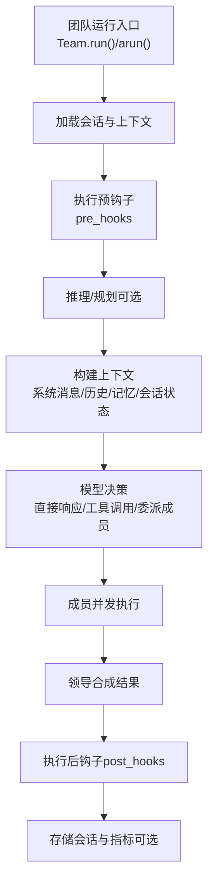
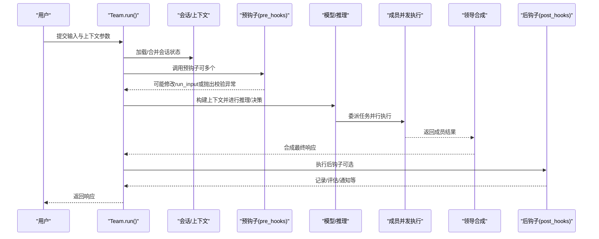
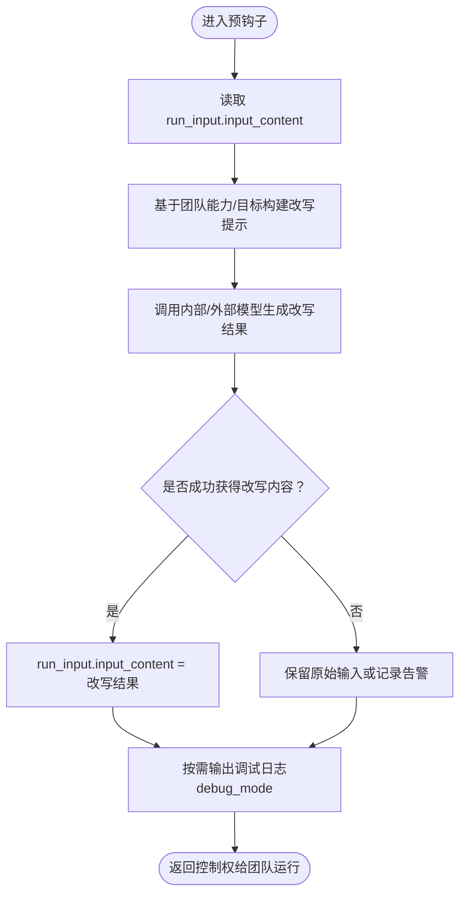
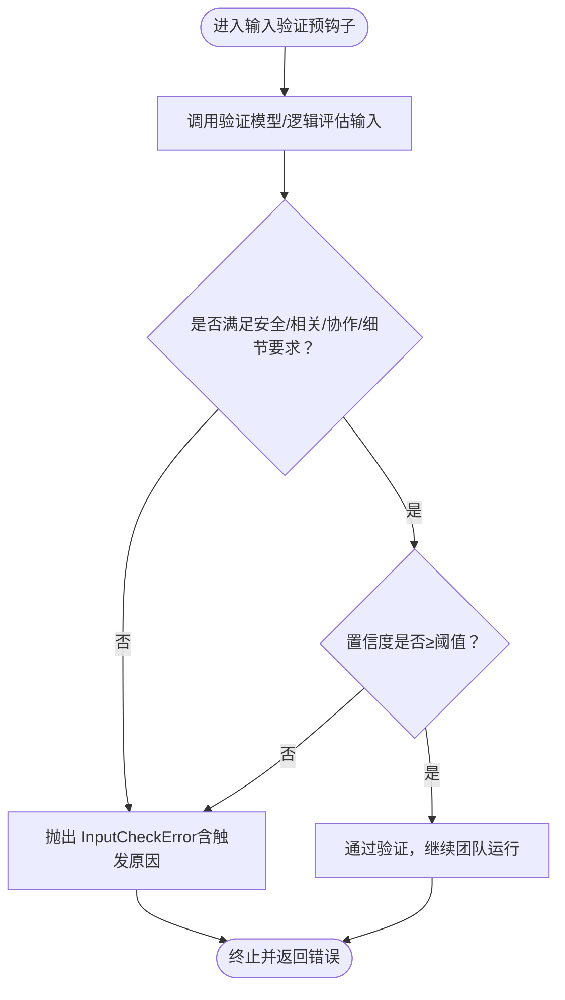
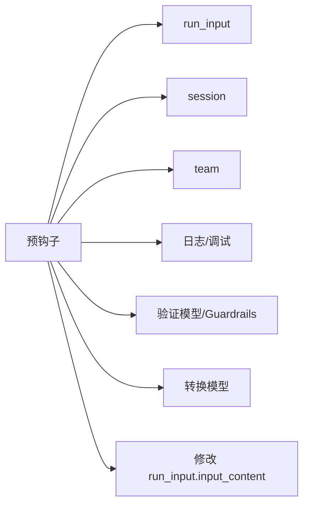

# 团队预钩子

<cite>
**本文引用的文件**
- [hooks/usage/team/input-transformation-pre-hook.mdx](file://hooks/usage/team/input-transformation-pre-hook.mdx)
- [examples/teams/hooks/pre-hook-input.mdx](file://examples/teams/hooks/pre-hook-input.mdx)
- [reference/hooks/pre-hooks.mdx](file://reference/hooks/pre-hooks.mdx)
- [agent-os/background-tasks/overview.mdx](file://agent-os/background-tasks/overview.mdx)
- [teams/running-teams.mdx](file://teams/running-teams.mdx)
- [reference/teams/team.mdx](file://reference/teams/team.mdx)
- [hooks/usage/team/input-validation-pre-hook.mdx](file://hooks/usage/team/input-validation-pre-hook.mdx)
- [guardrails/overview.mdx](file://guardrails/overview.mdx)
- [custom-logging.mdx](file://custom-logging.mdx)
- [agents/debugging-agents.mdx](file://agents/debugging-agents.mdx)
</cite>

## 目录
1. [简介](#简介)
2. [项目结构](#项目结构)
3. [核心组件](#核心组件)
4. [架构总览](#架构总览)
5. [详细组件分析](#详细组件分析)
6. [依赖分析](#依赖分析)
7. [性能考虑](#性能考虑)
8. [故障排查指南](#故障排查指南)
9. [结论](#结论)
10. [附录](#附录)

## 简介
本文件系统性阐述“团队预钩子”的技术机制与最佳实践，覆盖以下主题：
- 预钩子在团队执行前的处理职责：输入预处理、验证与转换
- 预钩子函数签名与参数使用：run_input、session、user_id、debug_mode
- 执行时机与在团队生命周期中的位置
- 输入转换与验证的实战示例
- 异常处理策略与调试技巧
- 性能优化与背景任务（AgentOS）集成建议

## 项目结构
围绕团队预钩子的关键文档与示例分布如下：
- 示例与用法
  - 输入转换预钩子示例：hooks/usage/team/input-transformation-pre-hook.mdx
  - 输入验证与转换综合示例：examples/teams/hooks/pre-hook-input.mdx
  - 输入验证预钩子示例：hooks/usage/team/input-validation-pre-hook.mdx
- 参考与规范
  - 预钩子参数参考：reference/hooks/pre-hooks.mdx
  - 团队运行流程与钩子位置：teams/running-teams.mdx
  - 团队 API 参数与能力：reference/teams/team.mdx
- 背景任务与非阻塞执行
  - AgentOS 背景钩子说明：agent-os/background-tasks/overview.mdx
- 安全与异常
  - 自定义守卫（Guardrails）与异常触发：guardrails/overview.mdx
- 调试与日志
  - 日志定制与调试模式：custom-logging.mdx、agents/debugging-agents.mdx

图表来源
- [teams/running-teams.mdx:38-59](file://teams/running-teams.mdx#L38-L59)

章节来源
- [teams/running-teams.mdx:38-59](file://teams/running-teams.mdx#L38-L59)

## 核心组件
- 预钩子函数签名与注入参数
  - run_input：本次运行的输入对象，可在预钩子中读取或修改
  - session：当前会话对象，用于访问会话状态、ID等
  - user_id：上下文用户标识（可选）
  - debug_mode：是否启用调试模式（可选）
  - 其他注入项：team、session_state、dependencies、metadata（视配置而定）

- 团队运行时序中的位置
  - 预钩子在“推理/规划”之前、“上下文构建”之前执行
  - 后续才进入模型决策、成员执行与合成阶段

章节来源
- [reference/hooks/pre-hooks.mdx:5-21](file://reference/hooks/pre-hooks.mdx#L5-L21)
- [teams/running-teams.mdx:38-59](file://teams/running-teams.mdx#L38-L59)

## 架构总览
下图展示了团队运行期间预钩子的典型交互路径，以及与会话、日志、守卫等模块的关系。

图表来源
- [teams/running-teams.mdx:38-59](file://teams/running-teams.mdx#L38-L59)
- [reference/hooks/pre-hooks.mdx:5-21](file://reference/hooks/pre-hooks.mdx#L5-L21)

## 详细组件分析

### 组件A：输入转换预钩子
- 目标
  - 将原始用户输入改写为更适合团队协作与目标的表达形式
  - 保持原意的同时，增强结构性与可执行性
- 关键点
  - 在预钩子中读取 run_input.input_content，并将其改写回该字段
  - 可结合团队成员能力描述生成更优的输入提示
  - 使用 debug_mode 控制日志输出，便于开发调试
- 实战示例
  - 输入转换示例：hooks/usage/team/input-transformation-pre-hook.mdx
  - 综合示例（含验证与转换）：examples/teams/hooks/pre-hook-input.mdx

图表来源
- [hooks/usage/team/input-transformation-pre-hook.mdx:19-54](file://hooks/usage/team/input-transformation-pre-hook.mdx#L19-L54)
- [examples/teams/hooks/pre-hook-input.mdx:100-149](file://examples/teams/hooks/pre-hook-input.mdx#L100-L149)

章节来源
- [hooks/usage/team/input-transformation-pre-hook.mdx:19-54](file://hooks/usage/team/input-transformation-pre-hook.mdx#L19-L54)
- [examples/teams/hooks/pre-hook-input.mdx:100-149](file://examples/teams/hooks/pre-hook-input.mdx#L100-L149)

### 组件B：输入验证预钩子
- 目标
  - 在团队执行前对输入进行安全、相关性、细节与协作价值的评估
  - 对不合规输入抛出 InputCheckError，阻止后续执行
- 关键点
  - 使用输出模式（output_schema）约束验证结果结构
  - 基于置信度阈值决定是否放行
  - 结合守卫（Guardrails）与异常触发器（CheckTrigger）实现统一错误语义
- 实战示例
  - 综合验证示例：examples/teams/hooks/pre-hook-input.mdx
  - 守卫与异常触发参考：guardrails/overview.mdx

图表来源
- [examples/teams/hooks/pre-hook-input.mdx:38-97](file://examples/teams/hooks/pre-hook-input.mdx#L38-L97)
- [guardrails/overview.mdx:63-85](file://guardrails/overview.mdx#L63-L85)

章节来源
- [examples/teams/hooks/pre-hook-input.mdx:38-97](file://examples/teams/hooks/pre-hook-input.mdx#L38-L97)
- [guardrails/overview.mdx:63-85](file://guardrails/overview.mdx#L63-L85)

### 组件C：预钩子参数与注入机制
- 参数一览
  - agent、team：当前运行的实体（team 仅在团队场景）
  - run_input：输入对象（可读/可改）
  - session：会话对象（可读/可改 session_state）
  - session_state、dependencies、metadata：上下文扩展
  - user_id、debug_mode：用户与调试开关
- 使用建议
  - 在转换类预钩子中优先修改 run_input.input_content
  - 在验证类预钩子中严格依据输出模式与阈值判断
  - 利用 debug_mode 输出必要日志，避免生产环境泄露敏感信息

章节来源
- [reference/hooks/pre-hooks.mdx:5-21](file://reference/hooks/pre-hooks.mdx#L5-L21)

### 组件D：执行时机与生命周期位置
- 团队运行生命周期（预钩子前后）
  - 预钩子：会话加载后、推理/规划前
  - 推理/规划：根据配置决定是否启用
  - 上下文构建：系统消息、历史、记忆、会话状态
  - 模型决策：直接响应/工具/委派成员
  - 成员执行与合成：并发执行与领导汇总
  - 后钩子：响应生成后、返回前
  - 存储：会话与指标持久化（可选）

章节来源
- [teams/running-teams.mdx:38-59](file://teams/running-teams.mdx#L38-L59)

### 组件E：与 AgentOS 背景任务的集成
- 背景钩子特性
  - API 响应立即返回，钩子在后台顺序执行
  - 不适用于需要修改请求/响应的预钩子（如输入转换/验证）
  - 适合日志、监控、通知等非关键任务
- 注意事项
  - 数据隔离：后台执行时对 run_input、run_context、run_output 进行深拷贝
  - 错误处理：后台失败不影响已发送的响应，需自管日志与告警

章节来源
- [agent-os/background-tasks/overview.mdx:75-135](file://agent-os/background-tasks/overview.mdx#L75-L135)

## 依赖分析
- 组件耦合关系
  - 预钩子依赖 run_input、session、team 等注入对象
  - 输入转换依赖团队成员能力描述与内部/外部模型
  - 输入验证依赖输出模式与守卫（Guardrails）异常体系
- 外部依赖
  - 模型服务（OpenAIResponses 等）
  - 会话存储与事件流（TeamSession、事件类型）
  - 日志系统与调试模式

图表来源
- [reference/hooks/pre-hooks.mdx:5-21](file://reference/hooks/pre-hooks.mdx#L5-L21)
- [examples/teams/hooks/pre-hook-input.mdx:38-97](file://examples/teams/hooks/pre-hook-input.mdx#L38-L97)

章节来源
- [reference/hooks/pre-hooks.mdx:5-21](file://reference/hooks/pre-hooks.mdx#L5-L21)
- [examples/teams/hooks/pre-hook-input.mdx:38-97](file://examples/teams/hooks/pre-hook-input.mdx#L38-L97)

## 性能考虑
- 预钩子尽量轻量
  - 避免长耗时操作；必要时使用 AgentOS 背景任务（仅限非关键钩子）
  - 对输入转换与验证采用最小必要开销的提示工程与模型调用
- 并发与流式
  - 团队成员并发执行，预钩子应在单线程同步路径中完成
  - 流式执行时，预钩子仍需在响应返回前完成
- 缓存与复用
  - 合理利用缓存键（cache_callables、自定义 cache_key）减少重复计算
  - 对会话状态与依赖进行必要的合并与去重

## 故障排查指南
- 常见问题
  - 预钩子未生效：确认已正确注册到 Team.pre_hooks，且参数注入顺序正确
  - 输入被拒绝：检查验证阈值与输出模式，关注 InputCheckError 的触发原因
  - 转换结果不符合预期：优化提示词与团队成员能力描述，提升改写质量
  - 调试困难：开启 debug_mode 或自定义日志器，输出 run_input、session 等关键上下文
- 调试技巧
  - 使用自定义日志器与命名空间，区分 Agent/Team/Workflow 日志
  - 在开发环境设置 AGNO_DEBUG 或 debug_mode，观察中间步骤与事件
  - 对背景任务钩子增加异常捕获与告警，避免静默失败

章节来源
- [custom-logging.mdx:95-138](file://custom-logging.mdx#L95-L138)
- [agents/debugging-agents.mdx:14-41](file://agents/debugging-agents.mdx#L14-L41)
- [agent-os/background-tasks/overview.mdx:123-135](file://agent-os/background-tasks/overview.mdx#L123-L135)

## 结论
团队预钩子是保障输入质量、提升团队协作效率与安全性的重要环节。通过规范的输入转换与验证，配合严格的异常与调试机制，可以在保证用户体验的同时，最大化团队执行的价值。对于非关键任务，建议结合 AgentOS 背景钩子实现非阻塞执行，进一步优化响应速度。

## 附录
- 最佳实践清单
  - 明确定义预钩子职责：转换/验证二选一或组合
  - 使用输出模式约束验证结果，确保可解释与可审计
  - 严格控制阈值与触发原因，避免误杀或漏检
  - 在开发阶段启用 debug_mode，生产阶段谨慎输出敏感信息
  - 对长耗时任务使用 AgentOS 背景钩子，但不要用于修改请求/响应
- 参考与示例
  - 输入转换示例：hooks/usage/team/input-transformation-pre-hook.mdx
  - 输入验证与转换综合示例：examples/teams/hooks/pre-hook-input.mdx
  - 预钩子参数参考：reference/hooks/pre-hooks.mdx
  - 团队运行流程：teams/running-teams.mdx
  - AgentOS 背景钩子：agent-os/background-tasks/overview.mdx
  - 守卫与异常：guardrails/overview.mdx
  - 日志与调试：custom-logging.mdx、agents/debugging-agents.mdx