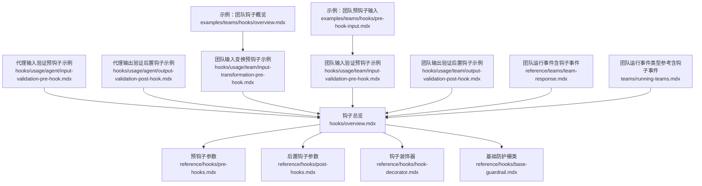
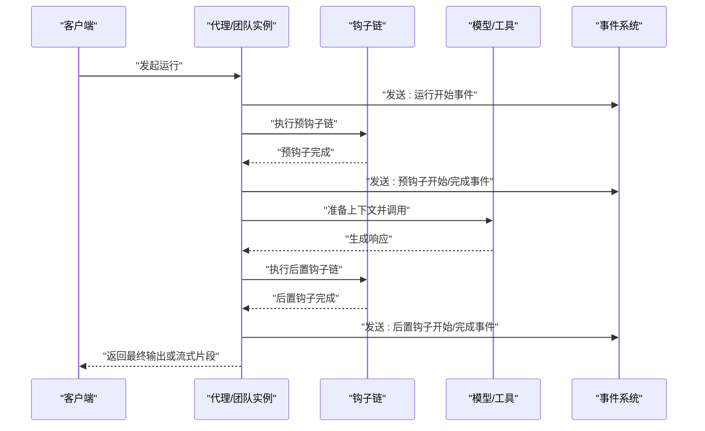
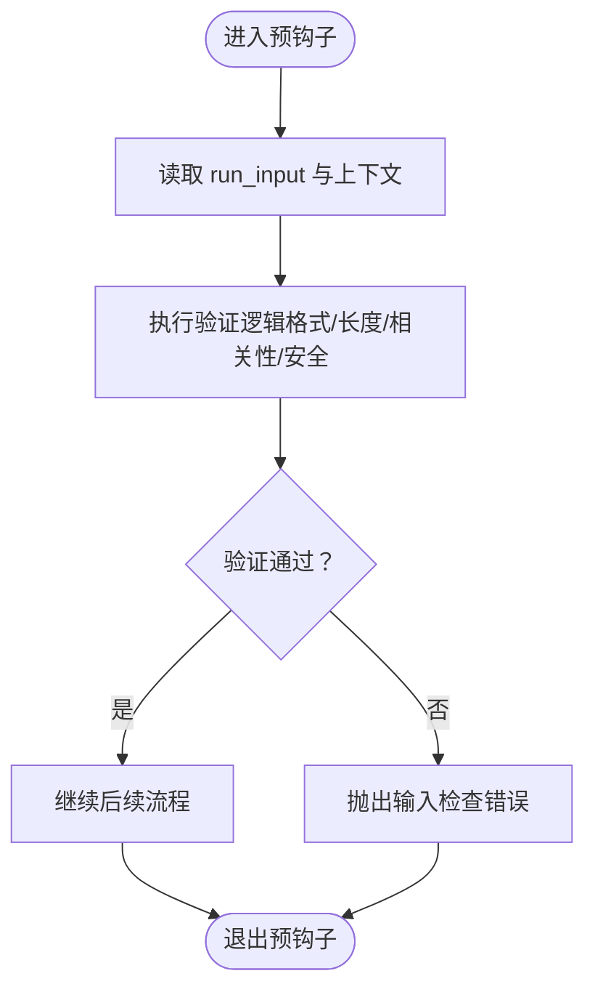
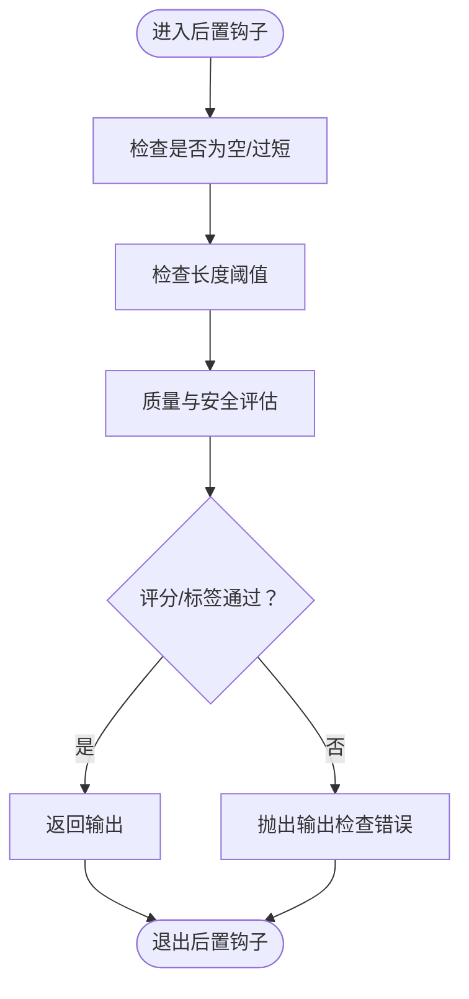
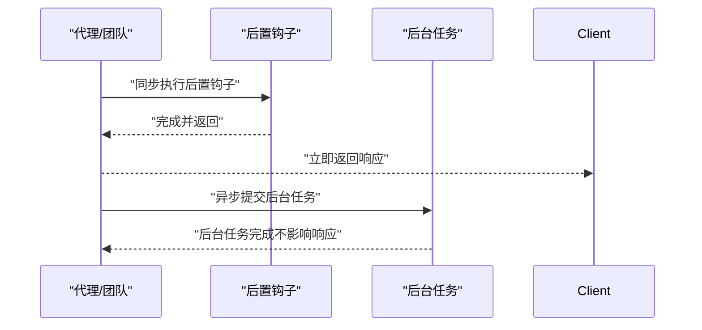
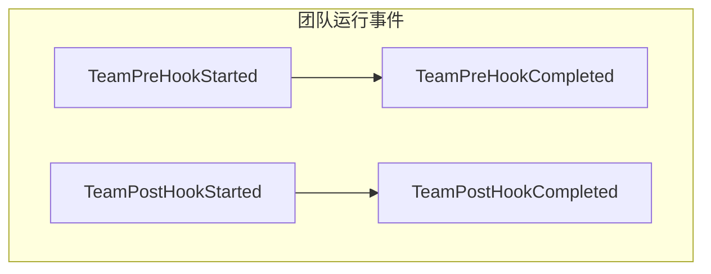
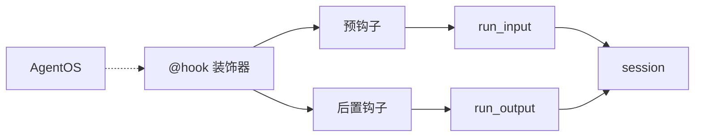

# 钩子系统

<cite>
**本文引用的文件**
- [钩子总览](file://hooks/overview.mdx)
- [预钩子参数](file://reference/hooks/pre-hooks.mdx)
- [后置钩子参数](file://reference/hooks/post-hooks.mdx)
- [钩子装饰器](file://reference/hooks/hook-decorator.mdx)
- [基础防护栅类](file://reference/hooks/base-guardrail.mdx)
- [代理输入验证预钩子示例](file://hooks/usage/agent/input-validation-pre-hook.mdx)
- [代理输出验证后置钩子示例](file://hooks/usage/agent/output-validation-post-hook.mdx)
- [团队输入变换预钩子示例](file://hooks/usage/team/input-transformation-pre-hook.mdx)
- [团队输入验证预钩子示例](file://hooks/usage/team/input-validation-pre-hook.mdx)
- [团队输出验证后置钩子示例](file://hooks/usage/team/output-validation-post-hook.mdx)
- [团队运行事件类型（含钩子事件）](file://reference/teams/team-response.mdx)
- [团队运行事件类型参考（含钩子事件）](file://teams/running-teams.mdx)
- [示例：团队钩子概览](file://examples/teams/hooks/overview.mdx)
- [示例：团队预钩子输入](file://examples/teams/hooks/pre-hook-input.mdx)
</cite>

## 目录
1. [简介](#简介)
2. [项目结构](#项目结构)
3. [核心组件](#核心组件)
4. [架构总览](#架构总览)
5. [详细组件分析](#详细组件分析)
6. [依赖关系分析](#依赖关系分析)
7. [性能考量](#性能考量)
8. [故障排查指南](#故障排查指南)
9. [结论](#结论)
10. [附录](#附录)

## 简介
钩子系统允许在代理与团队的运行生命周期中插入自定义逻辑，分为两类：
- 预钩子（Pre-hooks）：在模型上下文准备与 LLM 执行之前执行，适合输入验证、安全检查与数据预处理。
- 后置钩子（Post-hooks）：在生成响应并准备返回前执行，适合输出过滤、合规校验与响应增强。

钩子可直接作为同步函数注册，也可通过装饰器标记为后台执行；后台模式需配合 AgentOS 使用，否则会退化为同步执行。钩子参数由框架自动注入，仅包含函数签名所需的对象，便于按需扩展。

## 项目结构
本仓库中与钩子系统相关的文档主要分布在以下位置：
- 概念与用法总览：hooks/overview.mdx
- 参数与行为参考：reference/hooks/*.mdx
- 示例与最佳实践：hooks/usage/* 与 examples/teams/hooks/*
- 团队运行事件（包含钩子事件）：reference/teams/team-response.mdx 与 teams/running-teams.mdx

**图表来源**
- [钩子总览:1-217](file://hooks/overview.mdx#L1-L217)
- [预钩子参数:1-21](file://reference/hooks/pre-hooks.mdx#L1-L21)
- [后置钩子参数:1-21](file://reference/hooks/post-hooks.mdx#L1-L21)
- [钩子装饰器:1-74](file://reference/hooks/hook-decorator.mdx#L1-L74)
- [基础防护栅类:1-25](file://reference/hooks/base-guardrail.mdx#L1-L25)
- [代理输入验证预钩子示例:1-177](file://hooks/usage/agent/input-validation-pre-hook.mdx#L1-L177)
- [代理输出验证后置钩子示例:1-212](file://hooks/usage/agent/output-validation-post-hook.mdx#L1-L212)
- [团队输入变换预钩子示例:1-105](file://hooks/usage/team/input-transformation-pre-hook.mdx#L1-L105)
- [团队输入验证预钩子示例:1-175](file://hooks/usage/team/input-validation-pre-hook.mdx#L1-L175)
- [团队输出验证后置钩子示例:1-210](file://hooks/usage/team/output-validation-post-hook.mdx#L1-L210)
- [团队运行事件（含钩子事件）:47-79](file://reference/teams/team-response.mdx#L47-L79)
- [团队运行事件类型参考（含钩子事件）:235-285](file://teams/running-teams.mdx#L235-L285)
- [示例：团队钩子概览:1-10](file://examples/teams/hooks/overview.mdx#L1-L10)
- [示例：团队预钩子输入:1-313](file://examples/teams/hooks/pre-hook-input.mdx#L1-L313)

**章节来源**
- [钩子总览:1-217](file://hooks/overview.mdx#L1-L217)
- [团队运行事件（含钩子事件）:47-79](file://reference/teams/team-response.mdx#L47-L79)
- [团队运行事件类型参考（含钩子事件）:235-285](file://teams/running-teams.mdx#L235-L285)

## 核心组件
- 预钩子（Pre-hooks）
  - 触发时机：会话加载完成后、模型上下文准备与 LLM 执行之前。
  - 典型用途：输入验证、安全检查（如 PII、提示词注入）、数据预处理（格式化、增强）。
  - 参数注入：run_input、agent（代理运行时）、team（团队运行时）、session、session_state、dependencies、metadata、user_id、debug_mode。
- 后置钩子（Post-hooks）
  - 触发时机：生成响应并准备返回前；流式响应中，每产生一个片段后都会触发一次。
  - 典型用途：输出验证、合规过滤、响应增强（添加元信息或上下文）。
  - 参数注入：run_output、agent（代理运行时）、team（团队运行时）、session、session_state、dependencies、metadata、user_id、debug_mode。
- 钩子装饰器（@hook）
  - 支持 run_in_background=True 将钩子标记为后台任务；需配合 AgentOS 使用，否则退化为同步执行。
  - 后台钩子不可修改传入参数（如 run_input、run_output），适合日志、分析、通知等非关键后处理。
- 基础防护栅类（BaseGuardrail）
  - 提供同步与异步检查接口，用于构建可复用的防护栅（如 PII、提示词注入）。

**章节来源**
- [钩子总览:25-101](file://hooks/overview.mdx#L25-L101)
- [钩子总览:104-167](file://hooks/overview.mdx#L104-L167)
- [钩子装饰器:1-74](file://reference/hooks/hook-decorator.mdx#L1-L74)
- [基础防护栅类:1-25](file://reference/hooks/base-guardrail.mdx#L1-L25)
- [预钩子参数:1-21](file://reference/hooks/pre-hooks.mdx#L1-L21)
- [后置钩子参数:1-21](file://reference/hooks/post-hooks.mdx#L1-L21)

## 架构总览
下图展示了代理与团队在运行生命周期中，钩子与事件的交互关系。

**图表来源**
- [钩子总览:25-32](file://hooks/overview.mdx#L25-L32)
- [团队运行事件（含钩子事件）:65-78](file://reference/teams/team-response.mdx#L65-L78)
- [团队运行事件类型参考（含钩子事件）:270-278](file://teams/running-teams.mdx#L270-L278)

## 详细组件分析

### 预钩子：输入验证与安全检查
- 场景要点
  - 在 LLM 执行前对输入进行验证与清洗，确保输入相关性、完整性与安全性。
  - 可结合小型验证代理或规则引擎进行自动化判断。
- 关键参数
  - run_input：当前运行的输入内容与上下文。
  - agent/team：当前运行的实体引用。
  - session/session_state/dependencies/metadata/user_id/debug_mode：运行上下文与调试开关。
- 实现建议
  - 使用结构化输出模式（如 Pydantic 模型）返回验证结果，便于统一处理。
  - 对于高风险场景（如金融咨询），建议引入多层验证与人工审核通道。
- 示例路径
  - [代理输入验证预钩子示例:1-177](file://hooks/usage/agent/input-validation-pre-hook.mdx#L1-L177)
  - [团队输入验证预钩子示例:1-175](file://hooks/usage/team/input-validation-pre-hook.mdx#L1-L175)
  - [示例：团队预钩子输入:1-313](file://examples/teams/hooks/pre-hook-input.mdx#L1-L313)

**图表来源**
- [代理输入验证预钩子示例:25-78](file://hooks/usage/agent/input-validation-pre-hook.mdx#L25-L78)
- [团队输入验证预钩子示例:132-153](file://hooks/usage/team/input-validation-pre-hook.mdx#L132-L153)

**章节来源**
- [钩子总览:39-56](file://hooks/overview.mdx#L39-L56)
- [预钩子参数:1-21](file://reference/hooks/pre-hooks.mdx#L1-L21)
- [代理输入验证预钩子示例:1-177](file://hooks/usage/agent/input-validation-pre-hook.mdx#L1-L177)
- [团队输入验证预钩子示例:1-175](file://hooks/usage/team/input-validation-pre-hook.mdx#L1-L175)
- [示例：团队预钩子输入:1-313](file://examples/teams/hooks/pre-hook-input.mdx#L1-L313)

### 后置钩子：输出验证与增强
- 场景要点
  - 在响应返回前进行质量与合规性检查，必要时进行内容增强或二次加工。
  - 流式响应中，每个片段均会触发一次后置钩子，适合实时风控与指标统计。
- 关键参数
  - run_output：当前运行的输出内容与元信息。
  - agent/team：当前运行的实体引用。
  - session/session_state/dependencies/metadata/user_id/debug_mode：运行上下文与调试开关。
- 实现建议
  - 对短文本、空文本、过长文本设置阈值，避免用户体验劣化。
  - 结合评分与风险标签，对低质量或高风险输出进行拦截或降级处理。
- 示例路径
  - [代理输出验证后置钩子示例:1-212](file://hooks/usage/agent/output-validation-post-hook.mdx#L1-L212)
  - [团队输出验证后置钩子示例:1-210](file://hooks/usage/team/output-validation-post-hook.mdx#L1-L210)

**图表来源**
- [代理输出验证后置钩子示例:32-99](file://hooks/usage/agent/output-validation-post-hook.mdx#L32-L99)
- [团队输出验证后置钩子示例:32-99](file://hooks/usage/team/output-validation-post-hook.mdx#L32-L99)

**章节来源**
- [钩子总览:110-121](file://hooks/overview.mdx#L110-L121)
- [后置钩子参数:1-21](file://reference/hooks/post-hooks.mdx#L1-L21)
- [代理输出验证后置钩子示例:1-212](file://hooks/usage/agent/output-validation-post-hook.mdx#L1-L212)
- [团队输出验证后置钩子示例:1-210](file://hooks/usage/team/output-validation-post-hook.mdx#L1-L210)

### 钩子装饰器与后台执行
- 背景与适用场景
  - 对于日志、分析、通知等非关键任务，可标记为后台执行以提升响应速度。
  - 后台模式需配合 AgentOS 使用；未通过 AgentOS 运行时，将退化为同步执行。
- 注意事项
  - 后台钩子无法修改 run_input、run_output 等参数，因为响应已返回。
  - 不建议将安全防护栅（如 PII、提示词注入）放在后台钩子中。
- 示例路径
  - [钩子装饰器:1-74](file://reference/hooks/hook-decorator.mdx#L1-L74)

**图表来源**
- [钩子装饰器:22-66](file://reference/hooks/hook-decorator.mdx#L22-L66)

**章节来源**
- [钩子装饰器:1-74](file://reference/hooks/hook-decorator.mdx#L1-L74)

### 团队钩子的配置与事件
- 配置方式
  - 团队支持在构造时传入 pre_hooks 与 post_hooks 列表，与代理一致。
- 事件体系
  - 团队运行期间会发出与钩子相关的事件，便于可观测性与调试。
  - 包括：TeamPreHookStarted、TeamPreHookCompleted、TeamPostHookStarted、TeamPostHookCompleted。
- 示例路径
  - [团队输入变换预钩子示例:1-105](file://hooks/usage/team/input-transformation-pre-hook.mdx#L1-L105)
  - [团队输入验证预钩子示例:1-175](file://hooks/usage/team/input-validation-pre-hook.mdx#L1-L175)
  - [团队输出验证后置钩子示例:1-210](file://hooks/usage/team/output-validation-post-hook.mdx#L1-L210)
  - [团队运行事件（含钩子事件）:65-78](file://reference/teams/team-response.mdx#L65-L78)
  - [团队运行事件类型参考（含钩子事件）:270-278](file://teams/running-teams.mdx#L270-L278)
  - [示例：团队钩子概览:1-10](file://examples/teams/hooks/overview.mdx#L1-L10)
  - [示例：团队预钩子输入:1-313](file://examples/teams/hooks/pre-hook-input.mdx#L1-L313)

**图表来源**
- [团队运行事件（含钩子事件）:65-78](file://reference/teams/team-response.mdx#L65-L78)
- [团队运行事件类型参考（含钩子事件）:270-278](file://teams/running-teams.mdx#L270-L278)

**章节来源**
- [团队输入变换预钩子示例:1-105](file://hooks/usage/team/input-transformation-pre-hook.mdx#L1-L105)
- [团队输入验证预钩子示例:1-175](file://hooks/usage/team/input-validation-pre-hook.mdx#L1-L175)
- [团队输出验证后置钩子示例:1-210](file://hooks/usage/team/output-validation-post-hook.mdx#L1-L210)
- [团队运行事件（含钩子事件）:65-78](file://reference/teams/team-response.mdx#L65-L78)
- [团队运行事件类型参考（含钩子事件）:270-278](file://teams/running-teams.mdx#L270-L278)
- [示例：团队钩子概览:1-10](file://examples/teams/hooks/overview.mdx#L1-L10)
- [示例：团队预钩子输入:1-313](file://examples/teams/hooks/pre-hook-input.mdx#L1-L313)

## 依赖关系分析
- 组件耦合
  - 预钩子与后置钩子通过 run_input/run_output 与 session 等上下文参数耦合到运行生命周期。
  - 钩子装饰器提供后台执行能力，但不改变钩子与运行体之间的契约。
- 外部依赖
  - 后台执行需要 AgentOS 支持；未使用 AgentOS 时，后台标记退化为同步执行。
- 潜在循环依赖
  - 钩子内部不应直接依赖运行体的内部状态变更，以免造成不可预期的副作用。

**图表来源**
- [钩子装饰器:1-74](file://reference/hooks/hook-decorator.mdx#L1-L74)
- [预钩子参数:1-21](file://reference/hooks/pre-hooks.mdx#L1-L21)
- [后置钩子参数:1-21](file://reference/hooks/post-hooks.mdx#L1-L21)

**章节来源**
- [钩子装饰器:1-74](file://reference/hooks/hook-decorator.mdx#L1-L74)
- [预钩子参数:1-21](file://reference/hooks/pre-hooks.mdx#L1-L21)
- [后置钩子参数:1-21](file://reference/hooks/post-hooks.mdx#L1-L21)

## 性能考量
- 同步 vs 异步钩子
  - 同步钩子会阻塞响应返回，适合关键性检查（如安全防护栅）。
  - 后台钩子不阻塞响应，适合日志、分析、通知等非关键任务。
- 流式响应
  - 后置钩子在流式响应中逐片段触发，应尽量保持轻量逻辑，避免累积延迟。
- 资源开销
  - 验证代理或外部服务调用会增加延迟，建议缓存与限流策略配合使用。
- 调试与可观测性
  - 利用钩子事件与日志，定位性能瓶颈与异常路径。

[本节为通用指导，无需特定文件来源]

## 故障排查指南
- 常见问题
  - 钩子未生效：确认是否通过 Agent/Team 的 pre_hooks/post_hooks 正确注册。
  - 后台钩子无效：确认是否通过 AgentOS 运行；否则会被退化为同步执行。
  - 输出被拦截：检查后置钩子的阈值与评分逻辑，必要时放宽策略或增加人工审核。
  - 输入被拒绝：检查预钩子的验证规则与提示词，确保不过度限制合法请求。
- 排查步骤
  - 开启 debug_mode 获取更详细的上下文信息。
  - 使用钩子事件（如 TeamPreHookStarted/Completed）定位执行阶段。
  - 对高成本钩子（如外部服务调用）增加超时与重试策略。
- 相关参考
  - [钩子装饰器:58-66](file://reference/hooks/hook-decorator.mdx#L58-L66)
  - [团队运行事件（含钩子事件）:65-78](file://reference/teams/team-response.mdx#L65-L78)
  - [团队运行事件类型参考（含钩子事件）:270-278](file://teams/running-teams.mdx#L270-L278)

**章节来源**
- [钩子装饰器:58-66](file://reference/hooks/hook-decorator.mdx#L58-L66)
- [团队运行事件（含钩子事件）:65-78](file://reference/teams/team-response.mdx#L65-L78)
- [团队运行事件类型参考（含钩子事件）:270-278](file://teams/running-teams.mdx#L270-L278)

## 结论
钩子系统为代理与团队提供了强大的生命周期扩展点。通过预钩子与后置钩子，可以在不侵入主流程的前提下实现输入/输出的验证、增强与安全控制。结合 @hook 装饰器与 AgentOS，可以灵活地平衡性能与功能，满足从简单日志到复杂合规的多样化需求。

[本节为总结性内容，无需特定文件来源]

## 附录
- 实际应用示例路径
  - 代理输入验证预钩子示例：[路径:1-177](file://hooks/usage/agent/input-validation-pre-hook.mdx#L1-L177)
  - 代理输出验证后置钩子示例：[路径:1-212](file://hooks/usage/agent/output-validation-post-hook.mdx#L1-L212)
  - 团队输入变换预钩子示例：[路径:1-105](file://hooks/usage/team/input-transformation-pre-hook.mdx#L1-L105)
  - 团队输入验证预钩子示例：[路径:1-175](file://hooks/usage/team/input-validation-pre-hook.mdx#L1-L175)
  - 团队输出验证后置钩子示例：[路径:1-210](file://hooks/usage/team/output-validation-post-hook.mdx#L1-L210)
  - 示例：团队预钩子输入：[路径:1-313](file://examples/teams/hooks/pre-hook-input.mdx#L1-L313)

**章节来源**
- [代理输入验证预钩子示例:1-177](file://hooks/usage/agent/input-validation-pre-hook.mdx#L1-L177)
- [代理输出验证后置钩子示例:1-212](file://hooks/usage/agent/output-validation-post-hook.mdx#L1-L212)
- [团队输入变换预钩子示例:1-105](file://hooks/usage/team/input-transformation-pre-hook.mdx#L1-L105)
- [团队输入验证预钩子示例:1-175](file://hooks/usage/team/input-validation-pre-hook.mdx#L1-L175)
- [团队输出验证后置钩子示例:1-210](file://hooks/usage/team/output-validation-post-hook.mdx#L1-L210)
- [示例：团队预钩子输入:1-313](file://examples/teams/hooks/pre-hook-input.mdx#L1-L313)