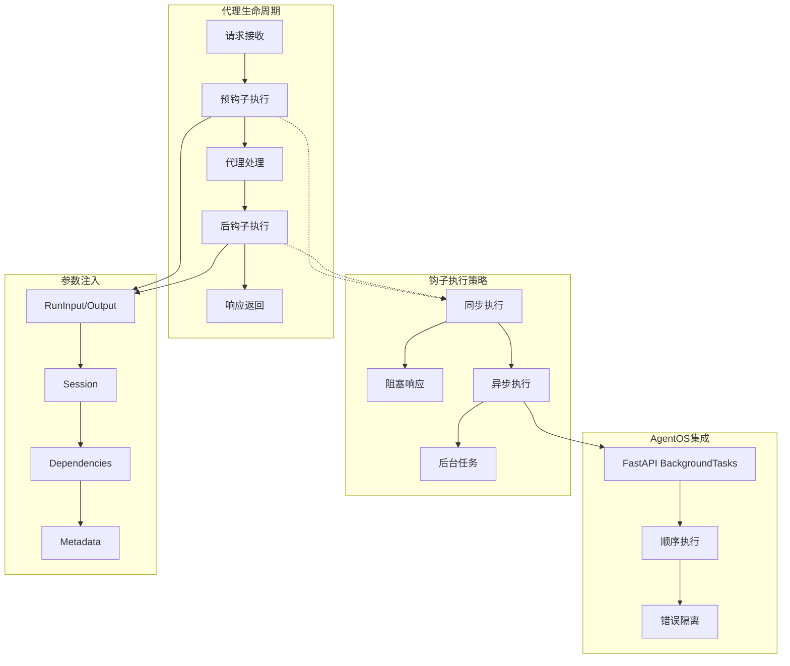
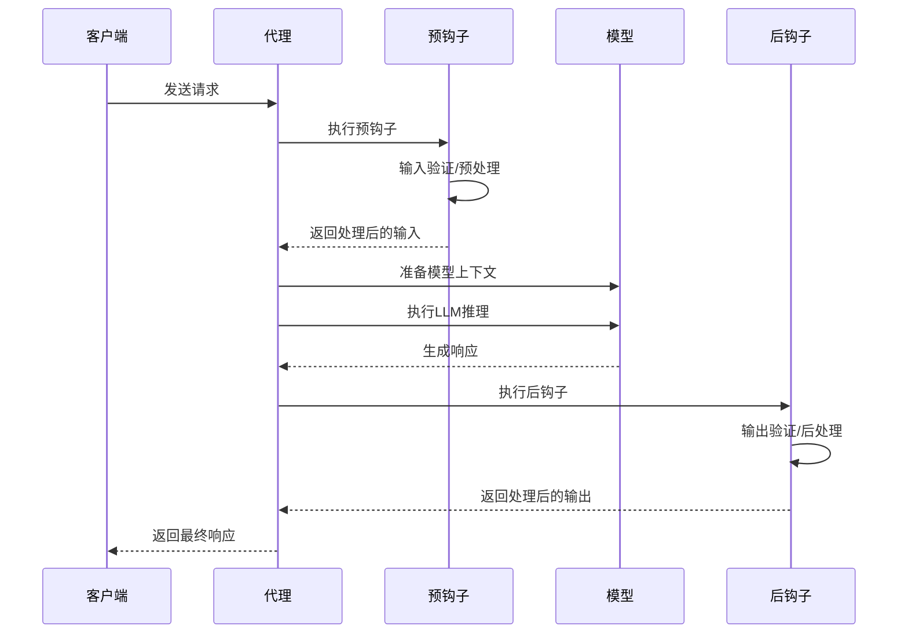
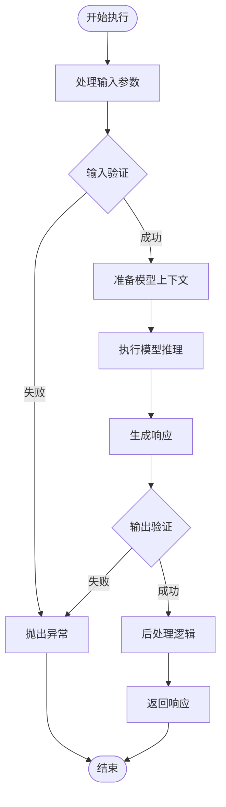
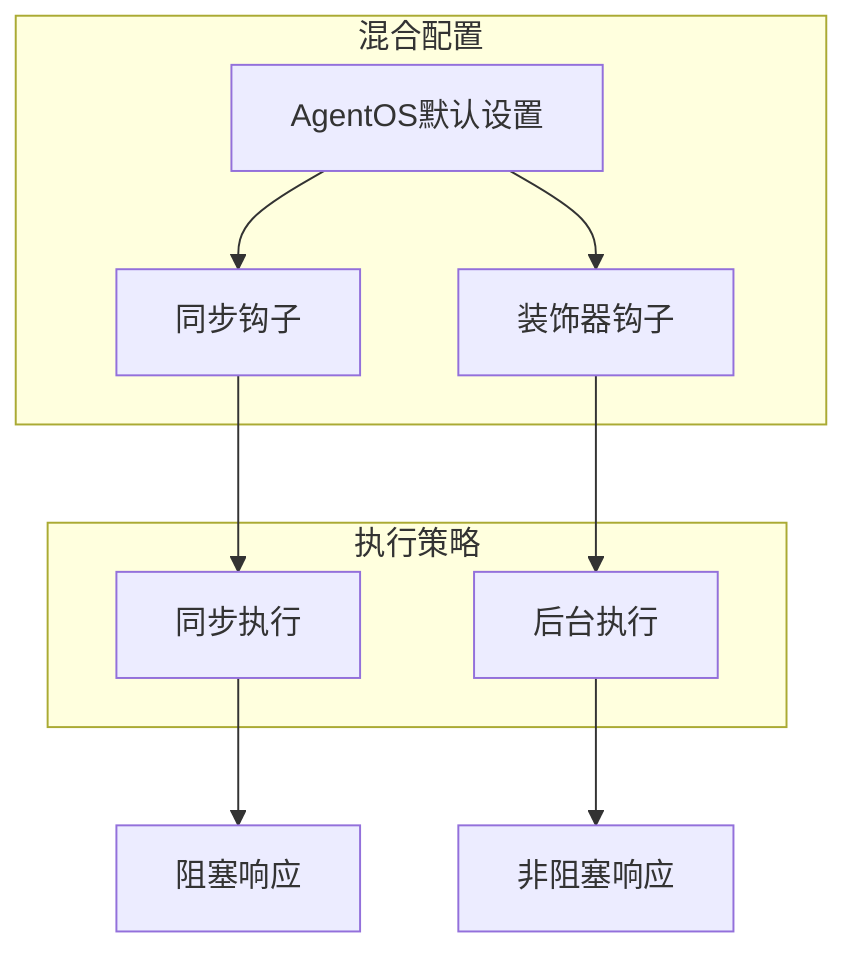
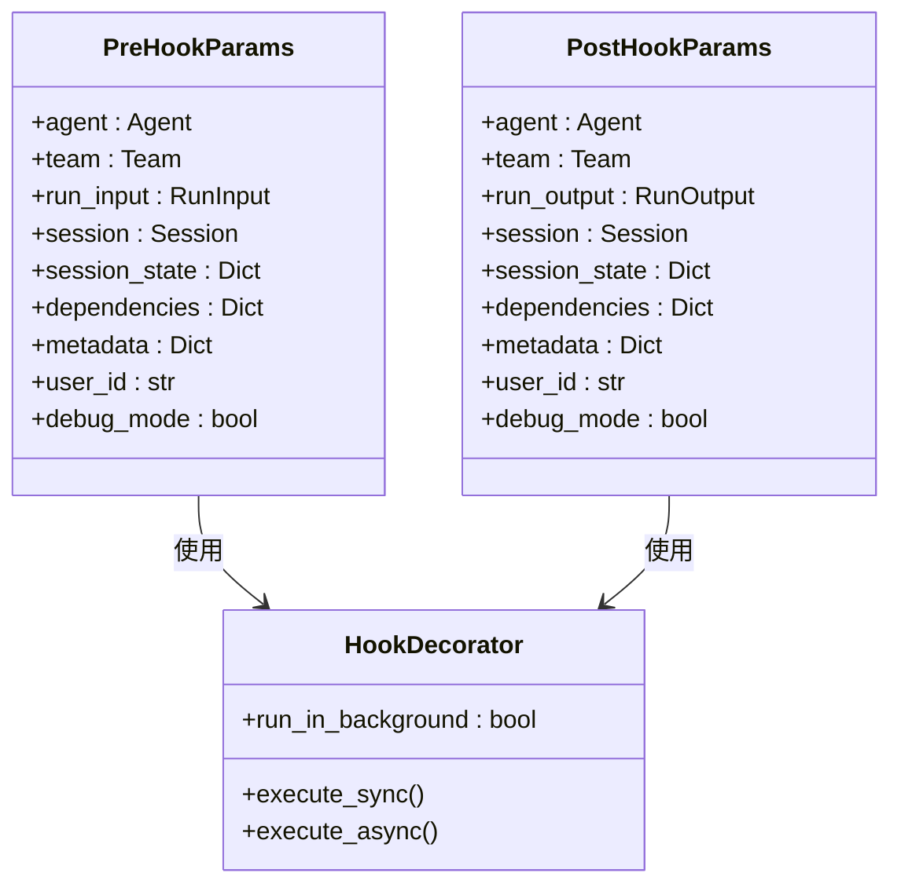
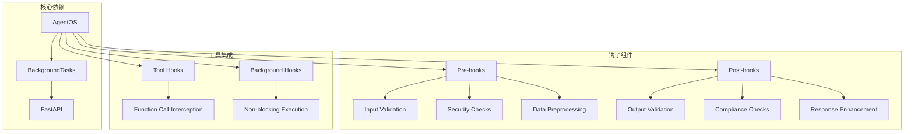

# 钩子系统概述

<cite>
**本文档引用的文件**
- [hooks/overview.mdx](file://hooks/overview.mdx)
- [reference/hooks/pre-hooks.mdx](file://reference/hooks/pre-hooks.mdx)
- [reference/hooks/post-hooks.mdx](file://reference/hooks/post-hooks.mdx)
- [reference/hooks/hook-decorator.mdx](file://reference/hooks/hook-decorator.mdx)
- [agent-os/background-tasks/overview.mdx](file://agent-os/background-tasks/overview.mdx)
- [agent-os/usage/background-hooks-global.mdx](file://agent-os/usage/background-hooks-global.mdx)
- [agent-os/usage/background-hooks-decorator.mdx](file://agent-os/usage/background-hooks-decorator.mdx)
- [hooks/usage/agent/input-transformation-pre-hook.mdx](file://hooks/usage/agent/input-transformation-pre-hook.mdx)
- [hooks/usage/team/input-transformation-pre-hook.mdx](file://hooks/usage/team/input-transformation-pre-hook.mdx)
- [examples/tools/tool-hooks/pre-and-post-hooks.mdx](file://examples/tools/tool-hooks/pre-and-post-hooks.mdx)
</cite>

## 目录
1. [简介](#简介)
2. [项目结构](#项目结构)
3. [核心组件](#核心组件)
4. [架构总览](#架构总览)
5. [详细组件分析](#详细组件分析)
6. [依赖关系分析](#依赖关系分析)
7. [性能考量](#性能考量)
8. [故障排除指南](#故障排除指南)
9. [结论](#结论)
10. [附录](#附录)

## 简介
钩子系统是代理生命周期中的可扩展机制，允许在代理运行前后插入自定义逻辑。它支持两类钩子：
- 预钩子（Pre-hooks）：在代理处理开始前执行，用于输入验证、安全防护、数据预处理等
- 后钩子（Post-hooks）：在代理生成响应后执行，用于输出验证、合规检查、响应增强等

钩子系统广泛应用于安全防护、输入验证、输出验证、数据预处理和后处理、日志记录等场景，并支持同步和异步执行模式。

## 项目结构
钩子系统相关内容分布在多个文档中，形成完整的知识体系：

```mermaid
graph TB
subgraph "钩子系统文档"
A[hooks/overview.mdx] --> B[预钩子参考]
A --> C[后钩子参考]
A --> D[@hook装饰器]
B --> E[reference/hooks/pre-hooks.mdx]
C --> F[reference/hooks/post-hooks.mdx]
D --> G[reference/hooks/hook-decorator.mdx]
subgraph "AgentOS背景任务"
H[agent-os/background-tasks/overview.mdx]
I[agent-os/usage/background-hooks-global.mdx]
J[agent-os/usage/background-hooks-decorator.mdx]
end
D --> H
H --> I
H --> J
subgraph "使用示例"
K[hooks/usage/agent/input-transformation-pre-hook.mdx]
L[hooks/usage/team/input-transformation-pre-hook.mdx]
M[examples/tools/tool-hooks/pre-and-post-hooks.mdx]
end
A --> K
A --> L
A --> M
end
```

**图表来源**
- [hooks/overview.mdx:1-217](file://hooks/overview.mdx#L1-L217)
- [agent-os/background-tasks/overview.mdx:1-168](file://agent-os/background-tasks/overview.mdx#L1-L168)

**章节来源**
- [hooks/overview.mdx:1-217](file://hooks/overview.mdx#L1-L217)

## 核心组件
钩子系统由以下核心组件构成：

### 预钩子（Pre-hooks）
预钩子在代理运行的最早阶段执行，负责：
- 输入验证和格式化
- 安全检查（PII检测、提示注入防护）
- 数据预处理和上下文增强
- 会话状态初始化

### 后钩子（Post-hooks）
后钩子在代理生成响应后执行，负责：
- 输出验证和合规检查
- 响应格式转换和增强
- 日志记录和指标收集
- 通知和外部系统集成

### 装饰器系统
通过`@hook`装饰器实现细粒度控制：
- `run_in_background`参数控制是否异步执行
- 支持混合同步和异步钩子组合
- 提供全局设置和单个钩子设置两种方式

**章节来源**
- [hooks/overview.mdx:25-167](file://hooks/overview.mdx#L25-L167)
- [reference/hooks/hook-decorator.mdx:14-18](file://reference/hooks/hook-decorator.mdx#L14-L18)

## 架构总览
钩子系统采用分层架构设计，确保灵活性和可扩展性：



**图表来源**
- [agent-os/background-tasks/overview.mdx:102-121](file://agent-os/background-tasks/overview.mdx#L102-L121)
- [reference/hooks/pre-hooks.mdx:9-20](file://reference/hooks/pre-hooks.mdx#L9-L20)
- [reference/hooks/post-hooks.mdx:9-20](file://reference/hooks/post-hooks.mdx#L9-L20)

## 详细组件分析

### 预钩子执行流程
预钩子在整个代理运行生命周期中处于最前端位置，具有以下特点：



**图表来源**
- [hooks/overview.mdx:27-31](file://hooks/overview.mdx#L27-L31)
- [hooks/usage/agent/input-transformation-pre-hook.mdx:19-54](file://hooks/usage/agent/input-transformation-pre-hook.mdx#L19-L54)

### 后钩子执行流程
后钩子在响应生成后但返回前执行，确保不会影响用户感知的响应时间：



**图表来源**
- [hooks/overview.mdx:104-167](file://hooks/overview.mdx#L104-L167)

### 背景钩子执行机制
AgentOS提供了两种背景执行模式：

#### 全局背景模式
```mermaid
graph LR
subgraph "全局设置"
A[AgentOS(run_hooks_in_background=True)] --> B[所有钩子]
end
subgraph "执行流程"
B --> C[立即响应]
C --> D[后台执行]
end
D --> E[顺序执行]
E --> F[错误隔离]
```

**图表来源**
- [agent-os/usage/background-hooks-global.mdx:71-75](file://agent-os/usage/background-hooks-global.mdx#L71-L75)

#### 单钩子装饰器模式


**图表来源**
- [agent-os/usage/background-hooks-decorator.mdx:68-71](file://agent-os/usage/background-hooks-decorator.mdx#L68-L71)

**章节来源**
- [agent-os/background-tasks/overview.mdx:49-100](file://agent-os/background-tasks/overview.mdx#L49-L100)
- [agent-os/usage/background-hooks-decorator.mdx:8-142](file://agent-os/usage/background-hooks-decorator.mdx#L8-L142)

### 参数注入机制
钩子系统采用智能参数注入，只传递钩子函数需要的参数：



**图表来源**
- [reference/hooks/pre-hooks.mdx:9-20](file://reference/hooks/pre-hooks.mdx#L9-L20)
- [reference/hooks/post-hooks.mdx:9-20](file://reference/hooks/post-hooks.mdx#L9-L20)
- [reference/hooks/hook-decorator.mdx:16-18](file://reference/hooks/hook-decorator.mdx#L16-L18)

**章节来源**
- [reference/hooks/pre-hooks.mdx:1-21](file://reference/hooks/pre-hooks.mdx#L1-L21)
- [reference/hooks/post-hooks.mdx:1-21](file://reference/hooks/post-hooks.mdx#L1-L21)

## 依赖关系分析
钩子系统与其他组件的依赖关系如下：



**图表来源**
- [agent-os/background-tasks/overview.mdx:102-106](file://agent-os/background-tasks/overview.mdx#L102-L106)
- [examples/tools/tool-hooks/pre-and-post-hooks.mdx:23-36](file://examples/tools/tool-hooks/pre-and-post-hooks.mdx#L23-L36)

**章节来源**
- [hooks/overview.mdx:14-23](file://hooks/overview.mdx#L14-L23)
- [examples/tools/tool-hooks/pre-and-post-hooks.mdx:1-72](file://examples/tools/tool-hooks/pre-and-post-hooks.mdx#L1-L72)

## 性能考量
钩子系统的性能优化策略：

### 同步 vs 异步执行
- **同步执行**：保证数据一致性，但会阻塞响应
- **异步执行**：提升响应速度，但需要考虑数据隔离和错误处理

### 背景任务最佳实践
- 将非关键任务（日志、通知、分析）设为后台执行
- 保持关键任务（验证、过滤）同步执行
- 实现适当的错误处理和重试机制

### 数据隔离机制
AgentOS自动为后台钩子创建深拷贝，防止竞态条件和数据污染。

**章节来源**
- [agent-os/background-tasks/overview.mdx:113-134](file://agent-os/background-tasks/overview.mdx#L113-L134)

## 故障排除指南
常见问题及解决方案：

### 背景执行不生效
**问题**：使用`@hook(run_in_background=True)`但钩子仍同步执行
**原因**：直接运行代理而非通过AgentOS
**解决**：确保通过AgentOS启动服务

### 数据修改无效
**问题**：后台钩子无法修改输入或输出
**原因**：后台执行时机晚于代理处理完成
**解决**：仅在后台钩子中进行日志和监控，不在后台钩子中修改数据

### 错误处理不当
**问题**：后台任务异常影响主流程
**解决**：实现适当的try-catch和日志记录

**章节来源**
- [reference/hooks/hook-decorator.mdx:60-66](file://reference/hooks/hook-decorator.mdx#L60-L66)
- [agent-os/background-tasks/overview.mdx:123-134](file://agent-os/background-tasks/overview.mdx#L123-L134)

## 结论
钩子系统为代理提供了强大的扩展能力，通过预钩子和后钩子实现了对代理生命周期的精细控制。结合AgentOS的背景执行机制，可以在保证功能完整性的同时优化用户体验。建议根据具体业务需求选择合适的执行策略，将关键的安全和验证逻辑保留在同步执行路径中，将非关键的辅助功能移至后台执行。

## 附录

### 常见使用场景
- **安全防护**：PII检测、提示注入防护、内容过滤
- **输入验证**：格式验证、长度限制、敏感信息处理
- **输出验证**：合规检查、内容净化、格式标准化
- **数据预处理**：上下文增强、特征工程、数据清洗
- **日志记录**：性能监控、行为追踪、审计日志

### 配置要点
- 使用`@hook`装饰器精确控制执行时机
- 在AgentOS中合理配置全局背景执行选项
- 根据任务重要性选择同步或异步执行
- 实现完善的错误处理和监控机制