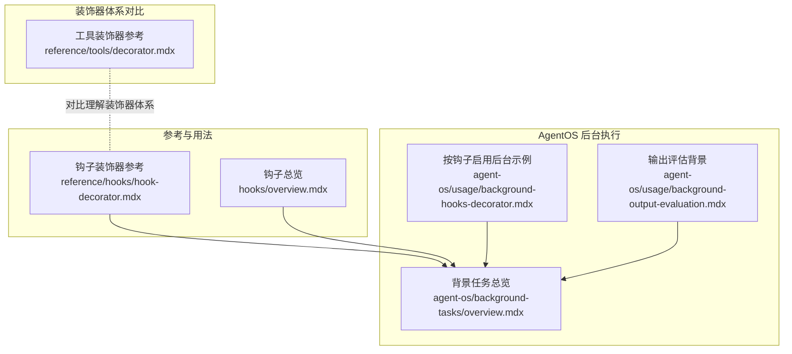
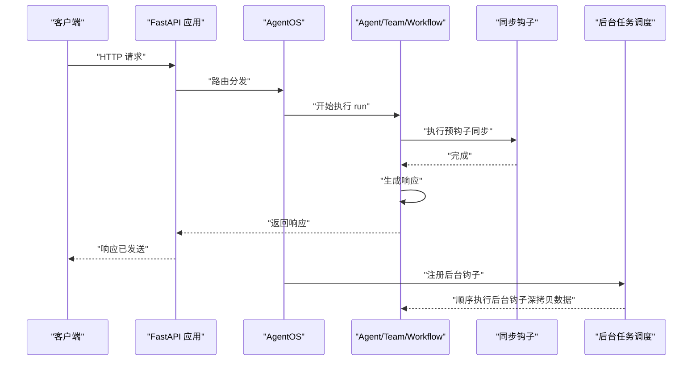
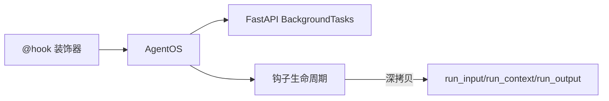

# 钩子装饰器

<cite>
**本文引用的文件**
- [钩子装饰器参考](file://reference/hooks/hook-decorator.mdx)
- [背景钩子（按钩子）](file://agent-os/usage/background-hooks-decorator.mdx)
- [背景任务总览](file://agent-os/background-tasks/overview.mdx)
- [钩子总览](file://hooks/overview.mdx)
- [输出评估（背景）](file://agent-os/usage/background-output-evaluation.mdx)
- [工具装饰器参考](file://reference/tools/decorator.mdx)
</cite>

## 目录
1. [简介](#简介)
2. [项目结构](#项目结构)
3. [核心组件](#核心组件)
4. [架构总览](#架构总览)
5. [详细组件分析](#详细组件分析)
6. [依赖分析](#依赖分析)
7. [性能考虑](#性能考虑)
8. [故障排查指南](#故障排查指南)
9. [结论](#结论)
10. [附录：API 参考](#附录api-参考)

## 简介
本文件面向需要在 AgentOS 中使用钩子装饰器的开发者，系统性说明 @hook 装饰器的 API、配置项与行为控制，重点解释 run_in_background 参数的使用方式、后台执行的工作原理、性能影响与注意事项，并给出可直接对照的示例路径与集成要点。

## 项目结构
围绕钩子装饰器与后台执行的相关内容主要分布在以下位置：
- 装饰器 API 参考：reference/hooks/hook-decorator.mdx
- 使用示例（按钩子启用后台）：agent-os/usage/background-hooks-decorator.mdx
- 背景任务总览与工作机制：agent-os/background-tasks/overview.mdx
- 钩子通用概念与参数说明：hooks/overview.mdx
- 输出评估（背景）示例：agent-os/usage/background-output-evaluation.mdx
- 工具装饰器参考（对比理解装饰器体系）：reference/tools/decorator.mdx

图表来源
- [钩子装饰器参考](file://reference/hooks/hook-decorator.mdx)
- [背景任务总览](file://agent-os/background-tasks/overview.mdx)
- [钩子总览](file://hooks/overview.mdx)
- [按钩子启用后台示例](file://agent-os/usage/background-hooks-decorator.mdx)
- [输出评估（背景）](file://agent-os/usage/background-output-evaluation.mdx)
- [工具装饰器参考](file://reference/tools/decorator.mdx)

章节来源
- [钩子装饰器参考](file://reference/hooks/hook-decorator.mdx)
- [背景任务总览](file://agent-os/background-tasks/overview.mdx)
- [钩子总览](file://hooks/overview.mdx)
- [按钩子启用后台示例](file://agent-os/usage/background-hooks-decorator.mdx)
- [输出评估（背景）](file://agent-os/usage/background-output-evaluation.mdx)
- [工具装饰器参考](file://reference/tools/decorator.mdx)

## 核心组件
- @hook 装饰器：用于对单个钩子进行行为配置，当前支持 run_in_background 布尔参数，标记该钩子在 AgentOS 中以“响应发送后”的后台任务形式运行。
- AgentOS 后台执行机制：基于 FastAPI 的 BackgroundTasks，在响应返回给客户端之后顺序执行后台钩子。
- 数据隔离与错误处理：后台执行时对 run_input、run_context、run_output 进行深拷贝，避免竞态；后台异常不影响已发送的响应，需在钩子内自行记录日志。

章节来源
- [钩子装饰器参考](file://reference/hooks/hook-decorator.mdx)
- [背景任务总览](file://agent-os/background-tasks/overview.mdx)
- [钩子总览](file://hooks/overview.mdx)

## 架构总览
下图展示了在 AgentOS 中，请求到达、同步钩子执行、响应返回以及后台钩子顺序执行的整体流程。

图表来源
- [背景任务总览](file://agent-os/background-tasks/overview.mdx)
- [按钩子启用后台示例](file://agent-os/usage/background-hooks-decorator.mdx)

## 详细组件分析

### 组件一：@hook 装饰器 API 与参数
- 导入方式：from agno.hooks import hook
- 当前唯一参数：run_in_background（布尔，默认 False）
- 行为说明：
  - run_in_background=True：在 AgentOS 中，该钩子在响应发送后作为后台任务顺序执行
  - run_in_background=False 或未设置：默认同步执行，阻塞响应直至完成
- 重要约束：
  - 在非 AgentOS 环境中，即使设置 run_in_background=True，也会退化为同步执行
  - 后台钩子无法修改 run_input、run_output 等参数（因响应已发送），仅适用于日志、分析、通知等非关键任务

章节来源
- [钩子装饰器参考](file://reference/hooks/hook-decorator.mdx)
- [钩子总览](file://hooks/overview.mdx)

### 组件二：后台执行工作原理与数据隔离
- 执行机制：AgentOS 使用 FastAPI 的 BackgroundTasks，在响应发送后顺序执行后台钩子
- 数据隔离：自动对 run_input、run_context、run_output 进行深拷贝，防止后台钩子与主流程并发修改导致竞态
- 错误处理：后台异常不影响已发送响应，需在钩子内部做好异常捕获与日志记录

章节来源
- [背景任务总览](file://agent-os/background-tasks/overview.mdx)

### 组件三：与 AgentOS 的集成与依赖
- 必要条件：必须通过 AgentOS 提供的服务端环境才能启用后台钩子
- 全局 vs 按钩子：
  - 全局：AgentOS(run_hooks_in_background=True) 将使所有钩子后台执行
  - 按钩子：@hook(run_in_background=True) 精准选择特定钩子后台执行
- 适用场景：日志、分析、通知、外部 API 调用、非关键后处理等

章节来源
- [背景任务总览](file://agent-os/background-tasks/overview.mdx)
- [按钩子启用后台示例](file://agent-os/usage/background-hooks-decorator.mdx)

### 组件四：参数配置与行为控制
- run_in_background 默认值：False
- 与同步钩子混用：可在同一 Agent/Team 中同时存在同步与后台钩子，实现“关键逻辑同步、非关键逻辑后台”的混合策略
- 限制与边界：
  - 后台钩子不可修改输入/输出
  - 不适合用于 Guardrails（安全检查、输入/输出校验等）

章节来源
- [钩子装饰器参考](file://reference/hooks/hook-decorator.mdx)
- [钩子总览](file://hooks/overview.mdx)

### 组件五：使用场景与限制
- 推荐场景：
  - 日志与分析：记录指标、埋点，不阻塞响应
  - 通知：邮件、Slack、Webhook 等
  - 外部写入：异步写数据库或第三方服务
- 不适用场景：
  - Guardrails（输入/输出校验、安全过滤）
  - 需要修改 run_input/run_output 的钩子

章节来源
- [背景任务总览](file://agent-os/background-tasks/overview.mdx)
- [钩子总览](file://hooks/overview.mdx)

### 组件六：完整 API 参考（摘要）
- 装饰器导入：from agno.hooks import hook
- 参数：
  - run_in_background: bool，默认 False
- 重要提示：
  - 非 AgentOS 环境下，run_in_background=True 无效，退化为同步
  - 后台钩子不可修改参数，仅用于日志/监控/通知

章节来源
- [钩子装饰器参考](file://reference/hooks/hook-decorator.mdx)

### 组件七：实际代码示例（路径索引）
- 按钩子启用后台（示例文件与步骤）：见 [按钩子启用后台示例](file://agent-os/usage/background-hooks-decorator.mdx)
- 输出评估（背景）：见 [输出评估（背景）](file://agent-os/usage/background-output-evaluation.mdx)
- 钩子装饰器参考（含参数与用法）：见 [钩子装饰器参考](file://reference/hooks/hook-decorator.mdx)

章节来源
- [按钩子启用后台示例](file://agent-os/usage/background-hooks-decorator.mdx)
- [输出评估（背景）](file://agent-os/usage/background-output-evaluation.mdx)
- [钩子装饰器参考](file://reference/hooks/hook-decorator.mdx)

## 依赖分析
- 与 AgentOS 的耦合：后台执行依赖 AgentOS 的服务端能力与 BackgroundTasks 机制
- 与 FastAPI 的耦合：后台任务由 FastAPI 的 BackgroundTasks 管理
- 与钩子生命周期的耦合：后台钩子在响应发送后顺序执行，受 run_input/run_output 的深拷贝保护

图表来源
- [背景任务总览](file://agent-os/background-tasks/overview.mdx)
- [钩子总览](file://hooks/overview.mdx)

章节来源
- [背景任务总览](file://agent-os/background-tasks/overview.mdx)
- [钩子总览](file://hooks/overview.mdx)

## 性能考虑
- 响应延迟优化：将非关键钩子标记为后台，可显著降低首包延迟
- 串行执行开销：后台钩子按顺序执行，若存在多个后台钩子，总耗时为各钩子耗时之和
- I/O 密集友好：后台钩子适合网络请求、文件写入等 I/O 密集型任务
- CPU 密集规避：后台钩子不适合 CPU 密集计算，以免拖慢后续钩子的执行

## 故障排查指南
- 症状：设置了 run_in_background=True，但钩子仍同步执行
  - 原因：未通过 AgentOS 启动服务
  - 处理：确保使用 AgentOS 提供的应用入口启动服务
- 症状：后台钩子报错但响应已返回
  - 原因：后台异常不影响已发送响应
  - 处理：在钩子内添加 try/except 并记录日志
- 症状：后台钩子无法修改输入/输出
  - 原因：AgentOS 对 run_input/run_output 进行深拷贝
  - 处理：改为只读操作（日志、分析、通知），或将关键逻辑移至同步钩子

章节来源
- [背景任务总览](file://agent-os/background-tasks/overview.mdx)
- [钩子装饰器参考](file://reference/hooks/hook-decorator.mdx)

## 结论
@hook 装饰器为钩子提供了细粒度的后台执行控制，结合 AgentOS 的 BackgroundTasks 机制，可在保证用户体验的前提下，将非关键任务异步化。正确理解 run_in_background 的行为边界、数据隔离与错误处理策略，是稳定落地的关键。

## 附录：API 参考
- 装饰器导入：from agno.hooks import hook
- 参数
  - run_in_background: bool，默认 False
    - True：在 AgentOS 中，响应发送后顺序执行该钩子
    - False：默认同步执行，阻塞响应
- 使用建议
  - 与 AgentOS 集成时，优先将日志、分析、通知类钩子设为后台
  - 不在后台模式下进行 Guardrails 或需要修改输入/输出的操作
  - 如需全局后台，可使用 AgentOS(run_hooks_in_background=True)，或按钩子使用 @hook(run_in_background=True) 实现混合策略

章节来源
- [钩子装饰器参考](file://reference/hooks/hook-decorator.mdx)
- [背景任务总览](file://agent-os/background-tasks/overview.mdx)
- [钩子总览](file://hooks/overview.mdx)