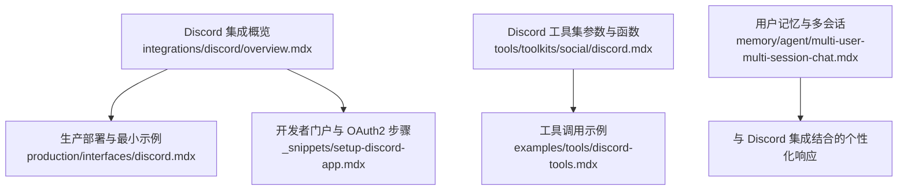
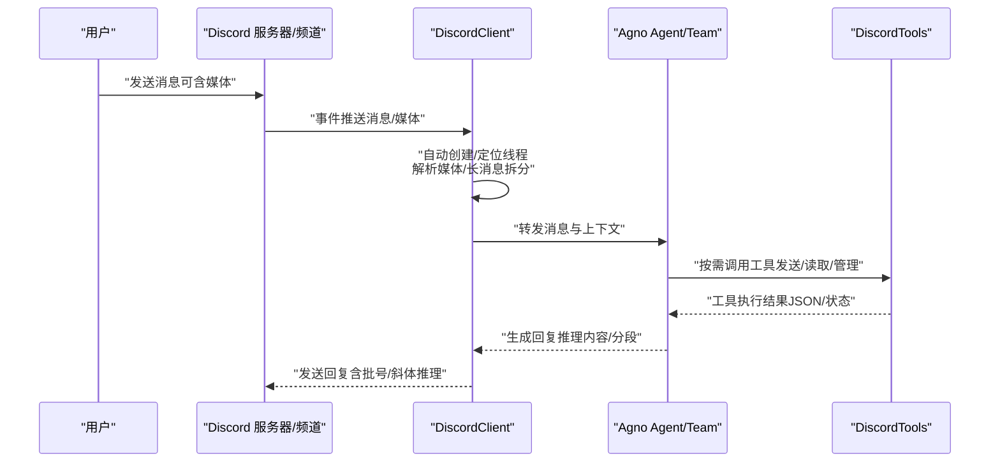
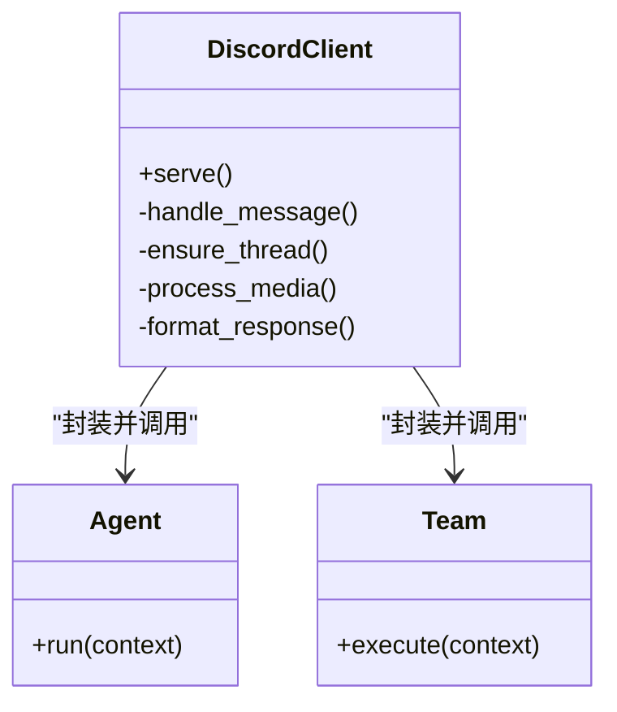
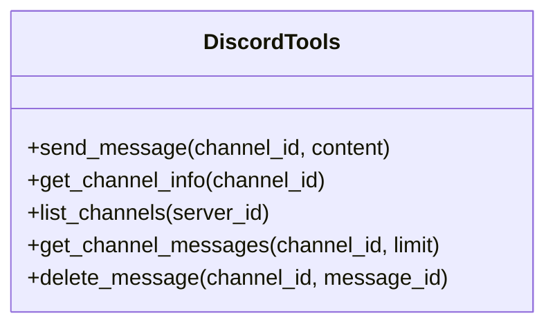
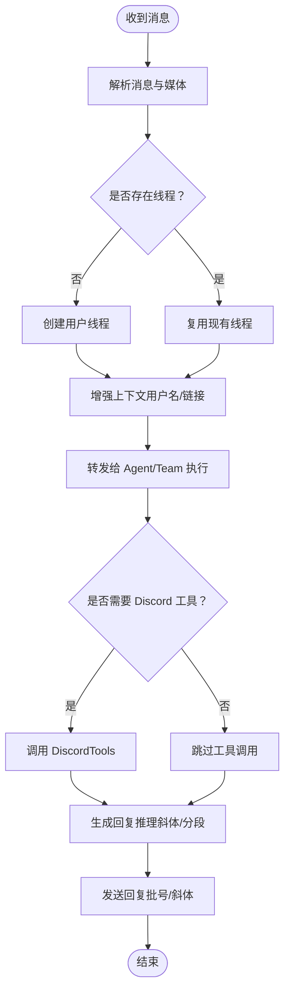
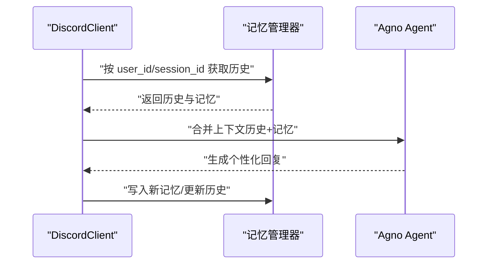
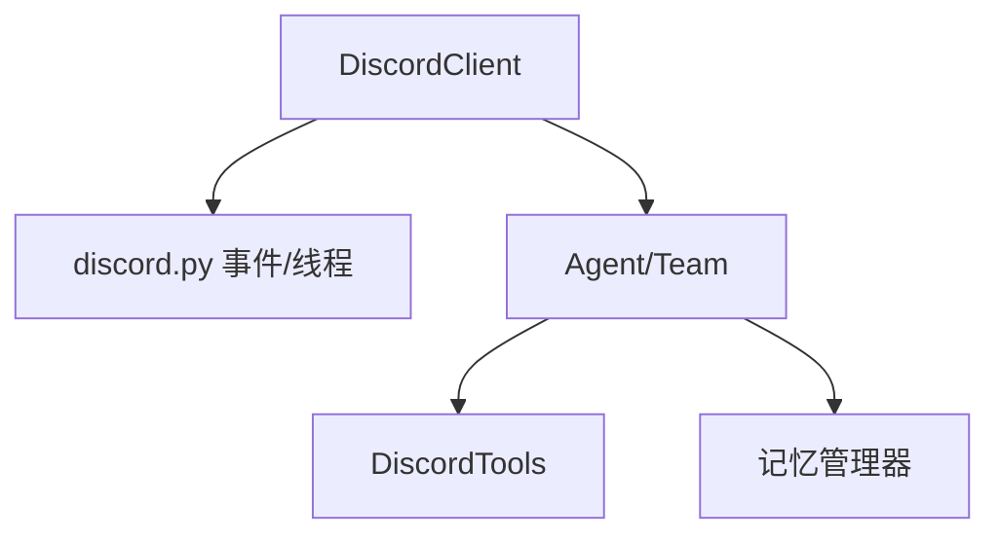

# Discord 集成

<cite>
**本文引用的文件**
- [integrations/discord/overview.mdx](file://integrations/discord/overview.mdx)
- [production/interfaces/discord.mdx](file://production/interfaces/discord.mdx)
- [_snippets/setup-discord-app.mdx](file://_snippets/setup-discord-app.mdx)
- [examples/tools/discord-tools.mdx](file://examples/tools/discord-tools.mdx)
- [tools/toolkits/social/discord.mdx](file://tools/toolkits/social/discord.mdx)
- [memory/agent/multi-user-multi-session-chat.mdx](file://memory/agent/multi-user-multi-session-chat.mdx)
</cite>

## 目录
1. [简介](#简介)
2. [项目结构](#项目结构)
3. [核心组件](#核心组件)
4. [架构总览](#架构总览)
5. [详细组件分析](#详细组件分析)
6. [依赖关系分析](#依赖关系分析)
7. [性能考量](#性能考量)
8. [故障排除指南](#故障排除指南)
9. [结论](#结论)
10. [附录](#附录)

## 简介
本文件面向在 Discord 上部署与运行 Agno 代理（Agent）或团队（Team）的工程师与产品人员，系统性说明以下内容：
- 机器人创建与部署：从开发者门户到 OAuth2 权限配置、意图设置与邀请链接生成
- 频道管理与消息处理：文本消息、媒体文件（图片/视频/音频/附件）的接收、解析与转发
- 消息处理机制：线程自动创建、长消息拆分、推理内容展示、上下文增强
- 用户记忆集成：用户状态跟踪、会话与历史管理、个性化响应
- 实际示例：基础聊天机器人、具备媒体处理能力的代理、具备用户记忆的智能助手
- 故障排除与性能优化建议

## 项目结构
围绕 Discord 集成的相关文档分布在如下位置：
- 集成概览与使用说明：integrations/discord/overview.mdx
- 生产级部署与最小示例：production/interfaces/discord.mdx
- 开发者门户与 OAuth2 设置步骤：_snippets/setup-discord-app.mdx
- 工具集（DiscordTools）参数与函数说明：tools/toolkits/social/discord.mdx
- 示例：工具调用与多用户/多会话聊天：examples/tools/discord-tools.mdx、memory/agent/multi-user-multi-session-chat.mdx

**图表来源**
- [integrations/discord/overview.mdx:1-119](file://integrations/discord/overview.mdx#L1-L119)
- [production/interfaces/discord.mdx:1-116](file://production/interfaces/discord.mdx#L1-L116)
- [_snippets/setup-discord-app.mdx:1-88](file://_snippets/setup-discord-app.mdx#L1-L88)
- [tools/toolkits/social/discord.mdx:1-51](file://tools/toolkits/social/discord.mdx#L1-L51)
- [examples/tools/discord-tools.mdx:1-148](file://examples/tools/discord-tools.mdx#L1-L148)
- [memory/agent/multi-user-multi-session-chat.mdx:63-106](file://memory/agent/multi-user-multi-session-chat.mdx#L63-L106)

**章节来源**
- [integrations/discord/overview.mdx:1-119](file://integrations/discord/overview.mdx#L1-L119)
- [production/interfaces/discord.mdx:1-116](file://production/interfaces/discord.mdx#L1-L116)
- [_snippets/setup-discord-app.mdx:1-88](file://_snippets/setup-discord-app.mdx#L1-L88)
- [tools/toolkits/social/discord.mdx:1-51](file://tools/toolkits/social/discord.mdx#L1-L51)
- [examples/tools/discord-tools.mdx:1-148](file://examples/tools/discord-tools.mdx#L1-L148)
- [memory/agent/multi-user-multi-session-chat.mdx:63-106](file://memory/agent/multi-user-multi-session-chat.mdx#L63-L106)

## 核心组件
- DiscordClient：封装 Agno 的 Agent 或 Team，通过 discord.py 处理 Discord 事件并进行消息收发。
- DiscordTools：作为工具集，允许代理在 Discord 中发送消息、获取频道信息、列出频道、读取消息历史、删除消息等。

关键职责与特性：
- 自动线程创建：为每个用户的首次消息创建独立线程，保持会话上下文
- 媒体支持：图片、视频、音频、文件的下载与处理
- 消息格式化：长消息拆分、推理内容以斜体显示、批号标记
- 环境变量：通过 DISCORD_BOT_TOKEN 注入机器人令牌

**章节来源**
- [integrations/discord/overview.mdx:35-119](file://integrations/discord/overview.mdx#L35-L119)
- [tools/toolkits/social/discord.mdx:5-51](file://tools/toolkits/social/discord.mdx#L5-L51)

## 架构总览
下图展示了从用户消息到代理执行再到响应返回的端到端流程，以及与 Discord 工具集的协作关系。

**图表来源**
- [integrations/discord/overview.mdx:53-110](file://integrations/discord/overview.mdx#L53-L110)
- [tools/toolkits/social/discord.mdx:38-51](file://tools/toolkits/social/discord.mdx#L38-L51)

## 详细组件分析

### 组件一：DiscordClient（机器人入口）
- 职责：承载 Agent/Team，监听 Discord 事件，处理消息与媒体，维护线程与上下文，控制消息格式化与拆分
- 关键行为：
  - 自动线程创建与命名规则
  - 媒体下载与对象化传递（图片/视频/音频/文件）
  - 长消息拆分与批号标记
  - 推理内容以斜体展示
- 初始化参数：支持注入 Agent 或 Team（二选一）

**图表来源**
- [integrations/discord/overview.mdx:40-52](file://integrations/discord/overview.mdx#L40-L52)

**章节来源**
- [integrations/discord/overview.mdx:35-119](file://integrations/discord/overview.mdx#L35-L119)

### 组件二：DiscordTools（工具集）
- 功能清单：发送消息、获取频道信息、列出频道、读取消息历史、删除消息
- 参数控制：是否启用消息发送、历史读取、频道管理、消息管理
- 使用方式：在 Agent 的工具列表中添加 DiscordTools，并传入 bot_token

**图表来源**
- [tools/toolkits/social/discord.mdx:38-51](file://tools/toolkits/social/discord.mdx#L38-L51)

**章节来源**
- [tools/toolkits/social/discord.mdx:5-51](file://tools/toolkits/social/discord.mdx#L5-L51)
- [examples/tools/discord-tools.mdx:34-88](file://examples/tools/discord-tools.mdx#L34-L88)

### 组件三：消息处理流程（文本/媒体/交互）
- 文本消息：解析内容、增强上下文（用户名、消息 URL）、触发代理执行
- 媒体处理：图片（URL）、视频（下载后内容）、音频（URL）、文件（下载后内容）
- 线程管理：首次消息自动创建线程，后续消息复用线程
- 回复格式：长消息拆分、推理内容斜体、批号标记

**图表来源**
- [integrations/discord/overview.mdx:82-110](file://integrations/discord/overview.mdx#L82-L110)

**章节来源**
- [integrations/discord/overview.mdx:53-110](file://integrations/discord/overview.mdx#L53-L110)

### 组件四：用户记忆集成（状态/历史/个性化）
- 多用户/多会话：为不同用户与会话维护独立的记忆与历史
- 记忆管理：基于用户 ID 与会话 ID 进行记忆检索与更新
- 与 Discord 集成：在消息处理前/后，将用户上下文与历史注入代理，提升个性化响应质量

**图表来源**
- [memory/agent/multi-user-multi-session-chat.mdx:63-106](file://memory/agent/multi-user-multi-session-chat.mdx#L63-L106)

**章节来源**
- [memory/agent/multi-user-multi-session-chat.mdx:63-106](file://memory/agent/multi-user-multi-session-chat.mdx#L63-L106)

## 依赖关系分析
- DiscordClient 依赖 discord.py 事件模型与线程 API
- DiscordTools 依赖 Discord 平台提供的 REST/事件接口
- 记忆模块与会话管理为可选增强，与 DiscordClient 解耦

**图表来源**
- [integrations/discord/overview.mdx:35-52](file://integrations/discord/overview.mdx#L35-L52)
- [tools/toolkits/social/discord.mdx:5-51](file://tools/toolkits/social/discord.mdx#L5-L51)
- [memory/agent/multi-user-multi-session-chat.mdx:63-106](file://memory/agent/multi-user-multi-session-chat.mdx#L63-L106)

**章节来源**
- [integrations/discord/overview.mdx:35-52](file://integrations/discord/overview.mdx#L35-L52)
- [tools/toolkits/social/discord.mdx:5-51](file://tools/toolkits/social/discord.mdx#L5-L51)
- [memory/agent/multi-user-multi-session-chat.mdx:63-106](file://memory/agent/multi-user-multi-session-chat.mdx#L63-L106)

## 性能考量
- 媒体处理：视频/音频/大文件下载可能带来延迟，建议异步下载与缓存策略
- 长消息拆分：批量发送时注意批号与顺序，避免 Discord 速率限制
- 线程并发：多用户并发场景下，确保线程隔离与上下文一致性
- 工具调用：按需启用 DiscordTools 功能，减少不必要的 API 调用
- 记忆查询：对高频用户的历史与记忆进行索引与缓存，降低检索开销

[本节为通用指导，无需特定文件引用]

## 故障排除指南
- 环境变量未设置：确认已导出 DISCORD_BOT_TOKEN
- 机器人无权限：检查开发者门户中的意图与权限配置（消息内容意图、发送消息、读取历史、创建线程、附件等）
- 无法接收消息：核对意图开关（消息内容意图必须开启）
- 邀请链接不生效：确认 OAuth2 URL 生成时选择了 bot 与所需权限
- 测试步骤：启动应用 → 在服务器对应频道发送消息 → 观察是否自动创建线程并回复
- 安全提示：不要将机器人令牌提交至版本控制，使用环境变量或安全配置管理

**章节来源**
- [production/interfaces/discord.mdx:74-104](file://production/interfaces/discord.mdx#L74-L104)
- [_snippets/setup-discord-app.mdx:40-81](file://_snippets/setup-discord-app.mdx#L40-L81)

## 结论
通过 DiscordClient 与 DiscordTools 的组合，Agno 能够在 Discord 上实现从消息接收、媒体处理、线程管理到工具调用与个性化回复的完整闭环。配合用户记忆与会话管理，可进一步提升交互体验与智能化水平。按照开发者门户与 OAuth2 配置流程完成部署，并遵循性能与安全最佳实践，即可稳定地在生产环境中运行 Discord 集成。

[本节为总结性内容，无需特定文件引用]

## 附录

### 实际示例路径
- 基础聊天机器人（最小示例）：见生产部署文档中的示例代码
  - [production/interfaces/discord.mdx:10-26](file://production/interfaces/discord.mdx#L10-L26)
- 带媒体处理能力的代理：参考消息处理与媒体支持说明
  - [integrations/discord/overview.mdx:68-110](file://integrations/discord/overview.mdx#L68-L110)
- 具备用户记忆功能的智能助手：结合多用户/多会话记忆示例
  - [memory/agent/multi-user-multi-session-chat.mdx:63-106](file://memory/agent/multi-user-multi-session-chat.mdx#L63-L106)
- 工具调用示例（发送/读取/管理）：参考工具集示例
  - [examples/tools/discord-tools.mdx:34-131](file://examples/tools/discord-tools.mdx#L34-L131)

### 开发者门户与 OAuth2 配置要点
- 创建应用与机器人用户
- 启用必要意图（消息内容意图、成员意图等）
- 设置机器人权限（发送消息、读取历史、创建线程、附件等）
- 生成邀请 URL 并邀请机器人到服务器
- 导出 DISCORD_BOT_TOKEN 至环境变量

**章节来源**
- [_snippets/setup-discord-app.mdx:11-81](file://_snippets/setup-discord-app.mdx#L11-L81)
- [production/interfaces/discord.mdx:45-96](file://production/interfaces/discord.mdx#L45-L96)