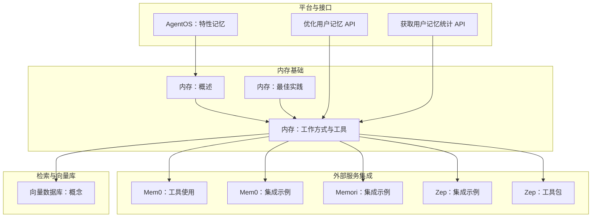
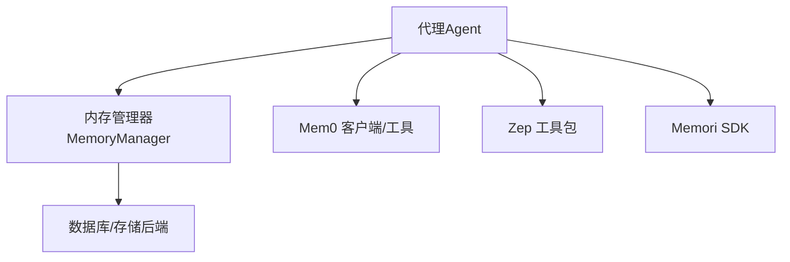
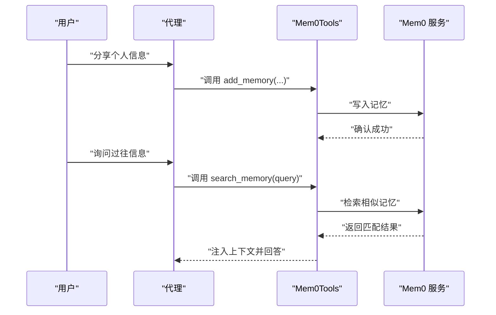
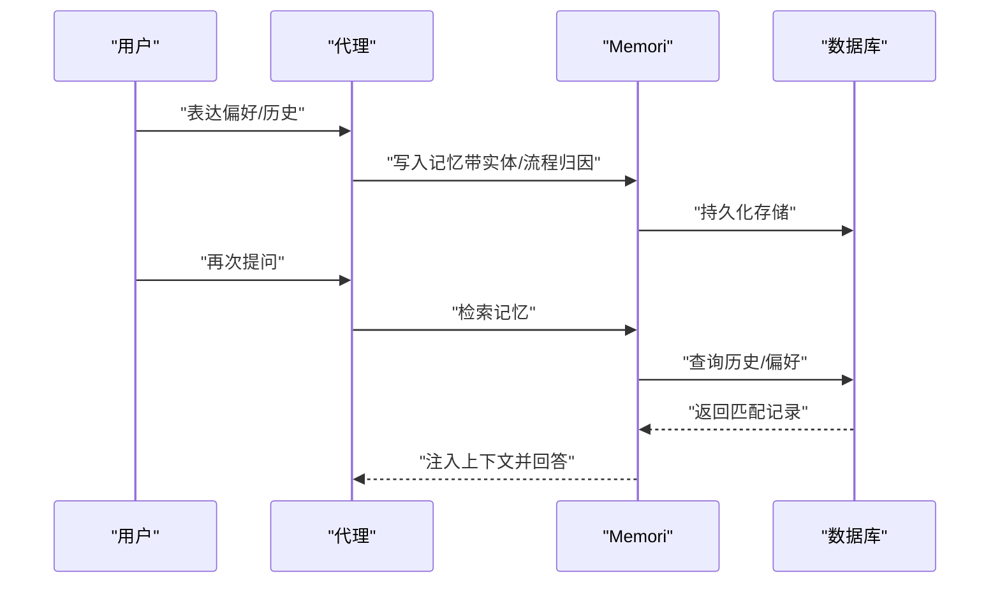
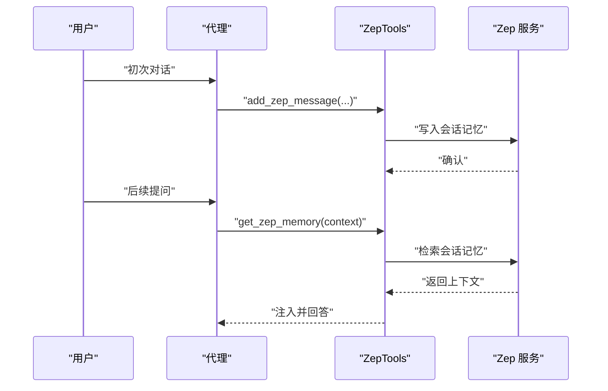
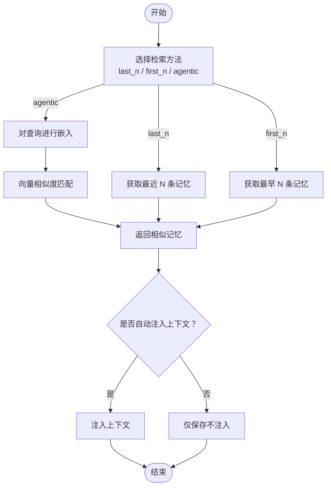
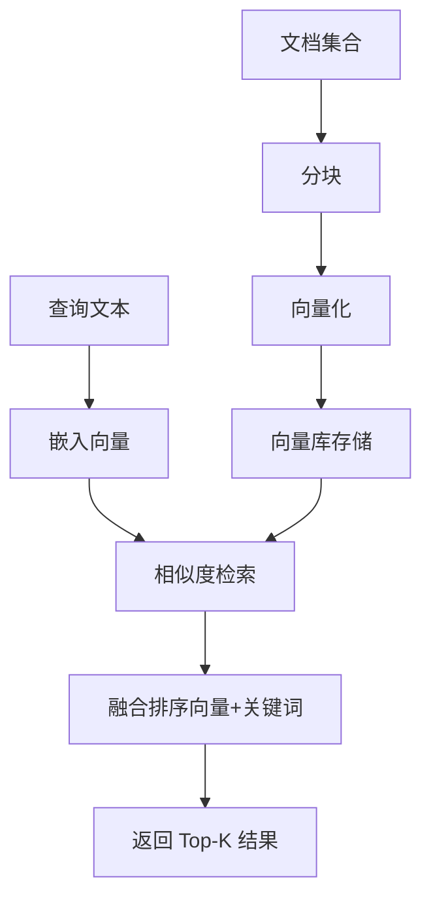
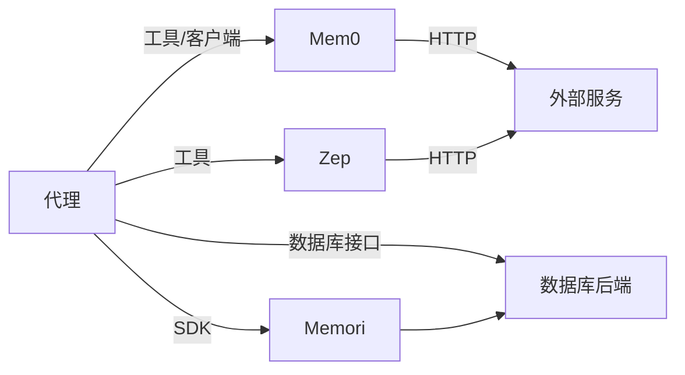

# 内存集成

<cite>
**本文引用的文件**
- [内存：概述](file://memory/overview.mdx)
- [内存：最佳实践](file://memory/best-practices.mdx)
- [内存：工作方式与工具](file://memory/working-with-memories/overview.mdx)
- [内存：检索示例](file://examples/memory/memory-manager/memory-search.mdx)
- [内存：自定义指令示例](file://memory/working-with-memories/custom-memory-instructions.mdx)
- [Mem0：工具使用](file://examples/tools/mem0-tools.mdx)
- [Mem0：集成示例](file://examples/integrations/memory/mem0-integration.mdx)
- [Memori：集成示例](file://integrations/memory/memori.mdx)
- [Zep：集成示例](file://examples/integrations/memory/zep-integration.mdx)
- [Zep：工具包](file://tools/toolkits/database/zep.mdx)
- [向量数据库：概念](file://knowledge/concepts/vector-db.mdx)
- [AgentOS：特性（记忆）](file://TBD/pages/agent-os/features/memories.mdx)
- [参考：优化用户记忆 API](file://reference-api/schema/memory/optimize-user-memories.mdx)
- [参考：获取用户记忆统计 API](file://reference-api/schema/memory/get-user-memory-statistics.mdx)
</cite>

## 目录
1. [引言](#引言)
2. [项目结构](#项目结构)
3. [核心组件](#核心组件)
4. [架构总览](#架构总览)
5. [详细组件分析](#详细组件分析)
6. [依赖分析](#依赖分析)
7. [性能考量](#性能考量)
8. [故障排查指南](#故障排查指南)
9. [结论](#结论)
10. [附录](#附录)

## 引言
本技术文档聚焦“内存集成”，阐述其在智能代理系统中的关键作用：长期记忆管理、上下文保持与个性化体验提升。文档覆盖三类外部内存服务的集成实现：Mem0、Memori、Zep；梳理内存数据模型、检索与匹配算法（语义搜索、相似度计算、上下文相关性分析）；提供配置示例与安全建议，并给出可操作的优化策略。

## 项目结构
围绕内存集成的相关内容主要分布在以下主题路径：
- 内存基础与最佳实践：用于理解自动/代理式记忆、数据模型、检索方法与生产优化
- 外部内存服务集成：Mem0、Memori、Zep 的使用示例与工具包
- 向量数据库与检索：为“语义搜索”与“相似度计算”提供背景知识
- AgentOS 记忆特性与 API：面向平台侧的记忆管理与隐私控制

图表来源
- [内存：概述:1-202](file://memory/overview.mdx#L1-L202)
- [内存：最佳实践:1-202](file://memory/best-practices.mdx#L1-L202)
- [内存：工作方式与工具:1-166](file://memory/working-with-memories/overview.mdx#L1-L166)
- [Mem0：工具使用:1-150](file://examples/tools/mem0-tools.mdx#L1-L150)
- [Mem0：集成示例:1-74](file://examples/integrations/memory/mem0-integration.mdx#L1-L74)
- [Memori：集成示例:1-85](file://integrations/memory/memori.mdx#L1-L85)
- [Zep：集成示例:1-64](file://examples/integrations/memory/zep-integration.mdx#L1-L64)
- [Zep：工具包:1-64](file://tools/toolkits/database/zep.mdx#L1-L64)
- [向量数据库：概念:1-32](file://knowledge/concepts/vector-db.mdx#L1-L32)
- [AgentOS：特性（记忆）:40-74](file://TBD/pages/agent-os/features/memories.mdx#L40-L74)
- [参考：优化用户记忆 API:1-3](file://reference-api/schema/memory/optimize-user-memories.mdx#L1-L3)
- [参考：获取用户记忆统计 API:1-3](file://reference-api/schema/memory/get-user-memory-statistics.mdx#L1-L3)

章节来源
- [内存：概述:1-202](file://memory/overview.mdx#L1-L202)
- [内存：最佳实践:1-202](file://memory/best-practices.mdx#L1-L202)
- [内存：工作方式与工具:1-166](file://memory/working-with-memories/overview.mdx#L1-L166)
- [Mem0：工具使用:1-150](file://examples/tools/mem0-tools.mdx#L1-L150)
- [Mem0：集成示例:1-74](file://examples/integrations/memory/mem0-integration.mdx#L1-L74)
- [Memori：集成示例:1-85](file://integrations/memory/memori.mdx#L1-L85)
- [Zep：集成示例:1-64](file://examples/integrations/memory/zep-integration.mdx#L1-L64)
- [Zep：工具包:1-64](file://tools/toolkits/database/zep.mdx#L1-L64)
- [向量数据库：概念:1-32](file://knowledge/concepts/vector-db.mdx#L1-L32)
- [AgentOS：特性（记忆）:40-74](file://TBD/pages/agent-os/features/memories.mdx#L40-L74)
- [参考：优化用户记忆 API:1-3](file://reference-api/schema/memory/optimize-user-memories.mdx#L1-L3)
- [参考：获取用户记忆统计 API:1-3](file://reference-api/schema/memory/get-user-memory-statistics.mdx#L1-L3)

## 核心组件
- 自动记忆与代理式记忆
  - 自动记忆：在每次运行后自动提取、存储与召回，适合大多数场景
  - 代理式记忆：通过工具由代理自主决定何时增删改查，适合复杂多轮交互
- 内存管理器（MemoryManager）
  - 控制记忆生成与更新所用的模型、附加指令、上下文注入策略
  - 支持检索方法：最近 N 条、最早 N 条、AI 语义检索（agentic）
- 外部内存服务工具包
  - Mem0Tools：支持添加、搜索、获取全部、删除全部等操作
  - ZepTools：基于会话的存储、检索与上下文注入
  - Memori：与数据库结合的持久化记忆层，支持多种数据库后端
- 检索与优化
  - 基于向量库的语义相似度搜索
  - 记忆优化（如摘要合并）降低上下文开销

章节来源
- [内存：概述:38-92](file://memory/overview.mdx#L38-L92)
- [内存：工作方式与工具:10-44](file://memory/working-with-memories/overview.mdx#L10-L44)
- [_snippets：MemoryManager 参考:44-57](file://_snippets/memory-manager-reference.mdx#L44-L57)
- [Mem0：工具使用:24-104](file://examples/tools/mem0-tools.mdx#L24-L104)
- [Zep：工具包:1-64](file://tools/toolkits/database/zep.mdx#L1-L64)
- [向量数据库：概念:1-32](file://knowledge/concepts/vector-db.mdx#L1-L32)

## 架构总览
下图展示了三种外部内存服务与代理系统的集成关系，以及内部记忆管理器与检索流程：

图表来源
- [内存：工作方式与工具:10-44](file://memory/working-with-memories/overview.mdx#L10-L44)
- [Mem0：工具使用:24-104](file://examples/tools/mem0-tools.mdx#L24-L104)
- [Zep：工具包:1-64](file://tools/toolkits/database/zep.mdx#L1-L64)
- [Memori：集成示例:1-85](file://integrations/memory/memori.mdx#L1-L85)

## 详细组件分析

### 组件一：Mem0 集成
- 功能要点
  - 提供添加、搜索、获取全部、删除全部等记忆操作
  - 支持按用户维度隔离记忆
  - 可通过工具或客户端直接接入代理
- 典型流程（客户端直连）
  - 初始化客户端
  - 将对话消息写入 Mem0
  - 在代理中注入依赖（记忆内容）参与上下文
- 典型流程（工具包）
  - 使用 Mem0Tools 注册到代理
  - 通过工具调用实现增删改查
- 配置要点
  - API 密钥与组织/项目 ID（环境变量）
  - 用户 ID 与会话 ID（确保跨平台一致性）

图表来源
- [Mem0：工具使用:24-104](file://examples/tools/mem0-tools.mdx#L24-L104)
- [Mem0：集成示例:1-74](file://examples/integrations/memory/mem0-integration.mdx#L1-L74)

章节来源
- [Mem0：工具使用:1-150](file://examples/tools/mem0-tools.mdx#L1-L150)
- [Mem0：集成示例:1-74](file://examples/integrations/memory/mem0-integration.mdx#L1-L74)

### 组件二：Memori 集成
- 功能要点
  - 与数据库（SQLAlchemy）结合，持久化记忆
  - 支持实体与流程归因（entity/process attribution）
  - 多数据库后端（PostgreSQL、MySQL、SQLite、MongoDB 等）
- 典型流程
  - 创建数据库引擎与会话
  - 初始化 Memori 并注册到模型
  - 设置实体与流程 ID，构建存储
  - 代理在对话中自然引用记忆

图表来源
- [Memori：集成示例:1-85](file://integrations/memory/memori.mdx#L1-L85)

章节来源
- [Memori：集成示例:1-85](file://integrations/memory/memori.mdx#L1-L85)

### 组件三：Zep 集成
- 功能要点
  - 基于会话的记忆存储与检索
  - 通过 ZepTools 添加消息、获取上下文记忆
  - 支持云服务（zep-cloud）与本地部署
- 典型流程
  - 初始化 ZepTools（user_id、session_id）
  - 追加用户消息到 Zep
  - 等待同步后，将 Zep 上下文注入代理依赖

图表来源
- [Zep：集成示例:1-64](file://examples/integrations/memory/zep-integration.mdx#L1-L64)
- [Zep：工具包:1-64](file://tools/toolkits/database/zep.mdx#L1-L64)

章节来源
- [Zep：集成示例:1-64](file://examples/integrations/memory/zep-integration.mdx#L1-L64)
- [Zep：工具包:1-64](file://tools/toolkits/database/zep.mdx#L1-L64)

### 组件四：内部记忆管理器与检索
- 数据模型（字段）
  - memory_id、memory、topics、input、user_id、agent_id、team_id、updated_at
- 检索方法
  - last_n：最近记忆
  - first_n：最早记忆
  - agentic：基于 AI 的语义相似检索
- 优化与上下文控制
  - 可选择是否将记忆自动注入上下文
  - 支持记忆优化（如摘要合并），减少上下文开销

图表来源
- [内存：概述:148-166](file://memory/overview.mdx#L148-L166)
- [_snippets：MemoryManager 参考:44-57](file://_snippets/memory-manager-reference.mdx#L44-L57)
- [内存：工作方式与工具:67-88](file://memory/working-with-memories/overview.mdx#L67-L88)

章节来源
- [内存：概述:148-166](file://memory/overview.mdx#L148-L166)
- [_snippets：MemoryManager 参考:44-57](file://_snippets/memory-manager-reference.mdx#L44-L57)
- [内存：工作方式与工具:67-88](file://memory/working-with-memories/overview.mdx#L67-L88)

### 组件五：向量数据库与语义检索
- 流程
  - 文档分块（chunking）
  - 向量化（embedding）
  - 存储向量（vector store）
  - 查询时嵌入并相似度匹配
- 混合检索
  - 向量相似 + 关键词匹配（full-text）融合排序

图表来源
- [向量数据库：概念:1-32](file://knowledge/concepts/vector-db.mdx#L1-L32)

章节来源
- [向量数据库：概念:1-32](file://knowledge/concepts/vector-db.mdx#L1-L32)

## 依赖分析
- 组件耦合
  - 代理依赖内存管理器或外部工具包（Mem0/Zep/Memori）
  - 内存管理器依赖数据库/存储后端
  - 外部服务依赖各自的 SDK/密钥与网络连接
- 可能的循环依赖
  - 通过工具包与客户端解耦外部服务，避免循环导入
- 外部依赖与集成点
  - Mem0：API 密钥、组织/项目 ID
  - Zep：API 密钥、会话/用户标识
  - Memori：数据库引擎、Schema 初始化

图表来源
- [Mem0：工具使用:24-104](file://examples/tools/mem0-tools.mdx#L24-L104)
- [Zep：工具包:1-64](file://tools/toolkits/database/zep.mdx#L1-L64)
- [Memori：集成示例:1-85](file://integrations/memory/memori.mdx#L1-L85)

章节来源
- [Mem0：工具使用:24-104](file://examples/tools/mem0-tools.mdx#L24-L104)
- [Zep：工具包:1-64](file://tools/toolkits/database/zep.mdx#L1-L64)
- [Memori：集成示例:1-85](file://integrations/memory/memori.mdx#L1-L85)

## 性能考量
- 自动记忆优于频繁的代理式记忆更新，以避免“嵌套 LLM 调用”导致的令牌暴涨
- 使用廉价模型执行记忆操作，主对话仍用高性能模型
- 通过“记忆优化”（如摘要合并）降低上下文长度
- 实施记忆修剪（按时间窗口清理旧记忆）
- 限制工具调用次数，防止过度记忆操作
- 生产监控：定期检查用户记忆数量，异常增长及时告警

章节来源
- [内存：最佳实践:21-142](file://memory/best-practices.mdx#L21-L142)
- [内存：工作方式与工具:67-88](file://memory/working-with-memories/overview.mdx#L67-L88)

## 故障排查指南
- 用户 ID 缺失导致记忆混用
  - 现象：不同用户的记忆互相影响
  - 处理：显式传入 user_id
- 同时启用自动与代理式记忆
  - 现象：自动模式被代理模式覆盖
  - 处理：二选一，优先自动记忆
- 记忆过多导致上下文膨胀
  - 现象：成本上升、响应变慢
  - 处理：开启优化、修剪、限制工具调用
- 外部服务未正确初始化
  - 现象：无法写入/读取外部记忆
  - 处理：检查密钥、会话/用户标识、网络连通性

章节来源
- [内存：最佳实践:144-178](file://memory/best-practices.mdx#L144-L178)
- [Mem0：工具使用:13-22](file://examples/tools/mem0-tools.mdx#L13-L22)
- [Zep：工具包:10-21](file://tools/toolkits/database/zep.mdx#L10-L21)

## 结论
内存集成为智能代理提供“长期记忆 + 上下文保持 + 个性化体验”的关键能力。通过 Mem0、Memori、Zep 等外部服务与内部 MemoryManager 的协同，可在保证隐私与性能的前提下，实现高可用的记忆系统。生产落地需重视检索优化、成本控制与安全合规。

## 附录

### A. 内存数据模型（字段说明）
- memory_id：记忆唯一标识
- memory：记忆内容文本
- topics：主题列表
- input：触发该记忆的输入
- user_id：用户标识
- agent_id：代理标识
- team_id：团队标识
- updated_at：最后更新时间戳

章节来源
- [内存：概述:148-166](file://memory/overview.mdx#L148-L166)

### B. 检索与匹配算法要点
- 语义搜索：查询嵌入 + 向量库相似度匹配
- 相似度计算：向量空间距离（余弦/内积等）
- 上下文相关性：结合主题、时间、实体等特征进行重排

章节来源
- [向量数据库：概念:1-32](file://knowledge/concepts/vector-db.mdx#L1-L32)

### C. 配置示例与最佳实践清单
- Mem0
  - 设置 API 密钥与组织/项目 ID
  - 显式指定 user_id 与 session_id
  - 使用工具或客户端写入/检索
- Zep
  - 安装 zep-cloud，设置 API 密钥
  - 初始化 ZepTools 并添加消息
  - 注入上下文记忆参与对话
- Memori
  - 准备数据库引擎（SQLAlchemy）
  - 初始化 Memori 并注册到模型
  - 设置实体/流程归因并构建存储
- 内部记忆
  - 选择自动或代理式记忆
  - 控制是否自动注入上下文
  - 开启记忆优化与定期修剪

章节来源
- [Mem0：工具使用:13-22](file://examples/tools/mem0-tools.mdx#L13-L22)
- [Mem0：集成示例:1-74](file://examples/integrations/memory/mem0-integration.mdx#L1-L74)
- [Zep：工具包:10-21](file://tools/toolkits/database/zep.mdx#L10-L21)
- [Zep：集成示例:1-64](file://examples/integrations/memory/zep-integration.mdx#L1-L64)
- [Memori：集成示例:73-85](file://integrations/memory/memori.mdx#L73-L85)
- [内存：工作方式与工具:67-88](file://memory/working-with-memories/overview.mdx#L67-L88)

### D. 安全与隐私
- 记忆与用户 ID 绑定，仅限当前 OS 实例内的代理访问
- 记忆数据驻留在本地部署，不外发
- 可通过 MemoryManager 的附加指令屏蔽敏感字段
- 建议对外部服务通信启用最小权限与加密通道

章节来源
- [AgentOS：特性（记忆）:55-59](file://TBD/pages/agent-os/features/memories.mdx#L55-L59)
- [内存：工作方式与工具:12-44](file://memory/working-with-memories/overview.mdx#L12-L44)