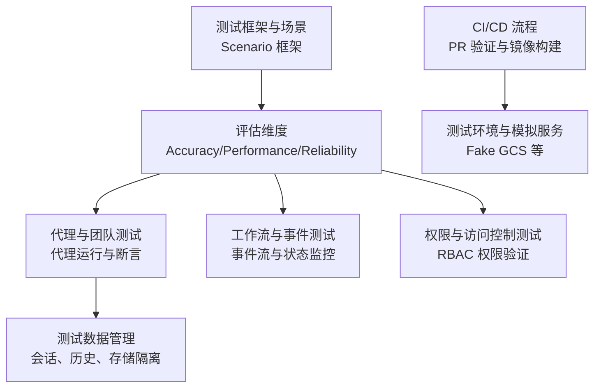
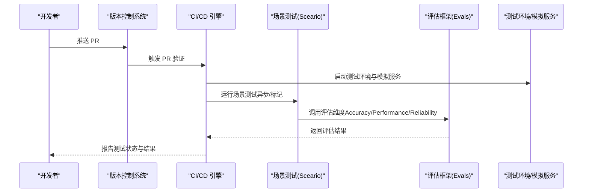
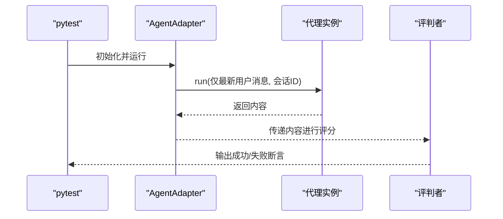
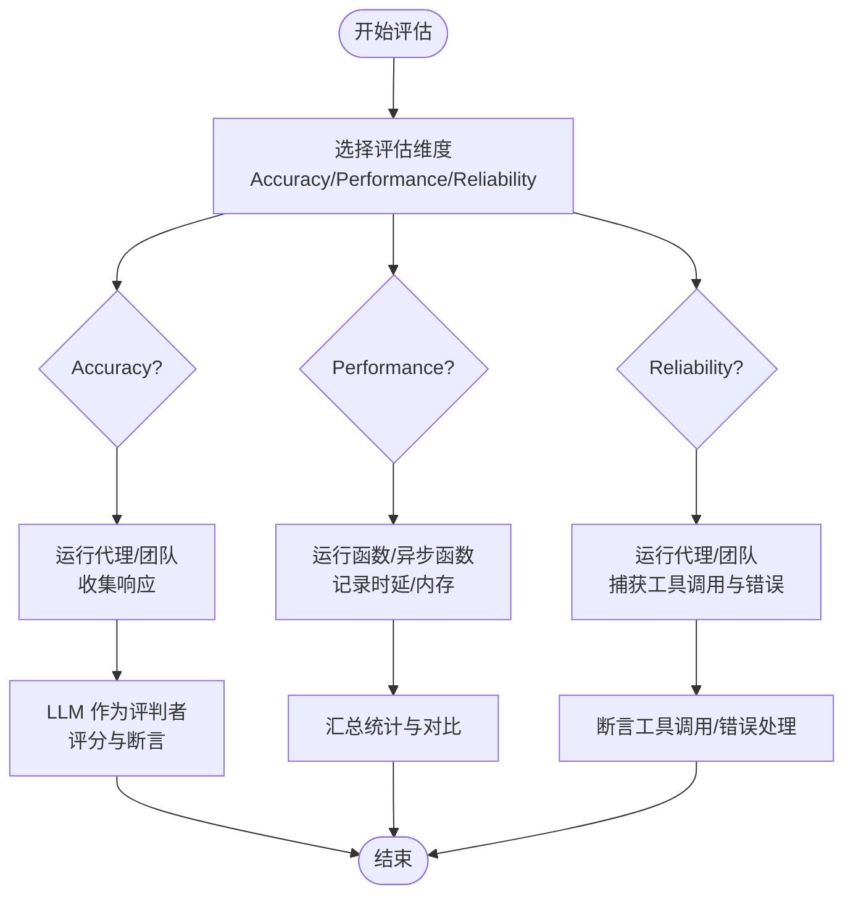
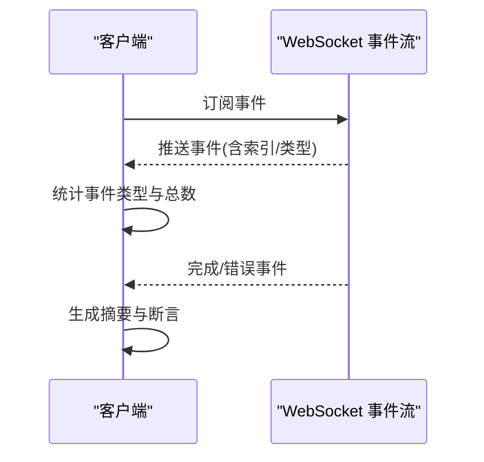
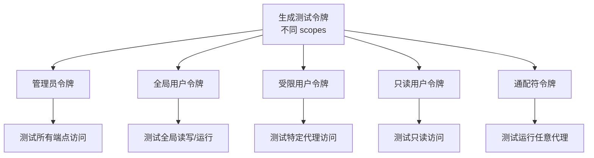
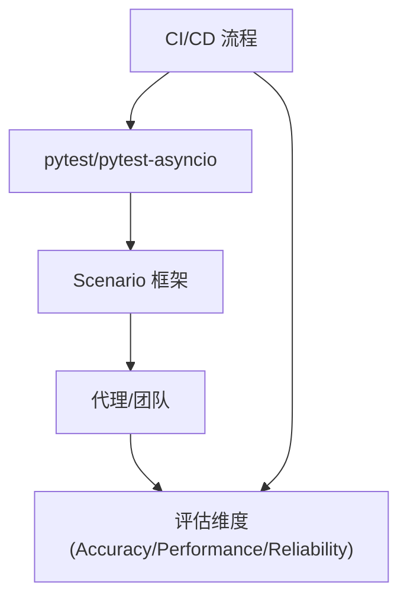

# 测试集成

<cite>
**本文引用的文件**   
- [integrations/testing/overview.mdx](file://integrations/testing/overview.mdx)
- [integrations/testing/usage/basic.mdx](file://integrations/testing/usage/basic.mdx)
- [evals/overview.mdx](file://evals/overview.mdx)
- [evals/accuracy/overview.mdx](file://evals/accuracy/overview.mdx)
- [evals/performance/overview.mdx](file://evals/performance/overview.mdx)
- [evals/reliability/overview.mdx](file://evals/reliability/overview.mdx)
- [examples/evals/performance/response-with-storage.mdx](file://examples/evals/performance/response-with-storage.mdx)
- [examples/evals/performance/team-response-with-memory-and-reasoning.mdx](file://examples/evals/performance/team-response-with-memory-and-reasoning.mdx)
- [examples/agents/approvals/approval-list-and-resolve.mdx](file://examples/agents/approvals/approval-list-and-resolve.mdx)
- [examples/workflows/advanced-concepts/long-running/websocket-reconnect.mdx](file://examples/workflows/advanced-concepts/long-running/websocket-reconnect.mdx)
- [examples/agent-os/rbac/symmetric/advanced-scopes.mdx](file://examples/agent-os/rbac/symmetric/advanced-scopes.mdx)
- [_snippets/gcs-auth-storage.mdx](file://_snippets/gcs-auth-storage.mdx)
- [deploy/templates/aws/configure/ci-cd.mdx](file://deploy/templates/aws/configure/ci-cd.mdx)
</cite>

## 目录
1. [引言](#引言)
2. [项目结构](#项目结构)
3. [核心组件](#核心组件)
4. [架构总览](#架构总览)
5. [详细组件分析](#详细组件分析)
6. [依赖关系分析](#依赖关系分析)
7. [性能考量](#性能考量)
8. [故障排查指南](#故障排查指南)
9. [结论](#结论)
10. [附录](#附录)

## 引言
本文件面向测试集成场景，系统化阐述在持续集成与持续部署（CI/CD）中如何组织自动化测试、集成测试与端到端测试。结合仓库内已有的评估体系与测试示例，文档覆盖测试框架配置、测试环境搭建、模拟服务设置、断言验证机制、测试用例设计原则、测试数据管理策略，以及针对代理行为、团队协作与工作流执行的实证测试方法，并补充并发测试、负载测试与性能基准测试的实施建议。

## 项目结构
围绕测试集成的关键路径，仓库提供了以下支撑模块：
- 集成测试与场景测试：通过 Scenario 框架进行对话式仿真测试，便于在受控环境中评估代理行为。
- 评估维度：准确性（Accuracy）、性能（Performance）、可靠性（Reliability），用于系统性度量代理质量。
- CI/CD：提供 PR 自动验证与镜像构建流程的参考说明。
- 示例与工具：包含审批流程、工作流事件监控、RBAC 权限验证、存储模拟等实用示例。

**章节来源**
- [integrations/testing/overview.mdx:1-92](file://integrations/testing/overview.mdx#L1-L92)
- [evals/overview.mdx:1-66](file://evals/overview.mdx#L1-L66)
- [deploy/templates/aws/configure/ci-cd.mdx:1-53](file://deploy/templates/aws/configure/ci-cd.mdx#L1-L53)

## 核心组件
- 场景测试（Scenario）：通过用户模拟器与评判者对代理行为进行可控仿真，支持异步测试与标记化运行。
- 评估框架：Accuracy（LLM-as-a-judge）、Performance（延迟与内存）、Reliability（工具调用与错误处理）。
- CI/CD：PR 触发的自动校验与发布镜像流程，确保合并前的质量门禁。
- 测试数据与环境：会话状态、数据库、存储与权限令牌等，强调隔离与可重复性。

**章节来源**
- [integrations/testing/usage/basic.mdx:1-33](file://integrations/testing/usage/basic.mdx#L1-L33)
- [evals/accuracy/overview.mdx:12-76](file://evals/accuracy/overview.mdx#L12-L76)
- [evals/performance/overview.mdx:11-42](file://evals/performance/overview.mdx#L11-L42)
- [evals/reliability/overview.mdx:16-47](file://evals/reliability/overview.mdx#L16-L47)
- [deploy/templates/aws/configure/ci-cd.mdx:30-42](file://deploy/templates/aws/configure/ci-cd.mdx#L30-L42)

## 架构总览
下图展示了从 PR 提交到测试执行与结果反馈的整体流程，以及评估维度与场景测试的协同关系。

**图表来源**
- [deploy/templates/aws/configure/ci-cd.mdx:30-42](file://deploy/templates/aws/configure/ci-cd.mdx#L30-L42)
- [integrations/testing/overview.mdx:10-64](file://integrations/testing/overview.mdx#L10-L64)
- [evals/overview.mdx:10-25](file://evals/overview.mdx#L10-L25)

**章节来源**
- [deploy/templates/aws/configure/ci-cd.mdx:30-42](file://deploy/templates/aws/configure/ci-cd.mdx#L30-L42)
- [integrations/testing/overview.mdx:10-64](file://integrations/testing/overview.mdx#L10-L64)
- [evals/overview.mdx:10-25](file://evals/overview.mdx#L10-L25)

## 详细组件分析

### 组件一：场景测试（Scenario）与代理行为验证
- 使用方式：定义 AgentAdapter 包装目标代理，配置用户模拟器与评判者，编写断言以验证行为是否满足预设标准。
- 关键点：支持异步测试、标记化运行、线程/会话状态传递，便于复现与回归。
- 实践要点：将“最后一条用户消息”传入代理，利用线程 ID 维持会话历史；评判标准应具体可测。

**图表来源**
- [integrations/testing/usage/basic.mdx:20-63](file://integrations/testing/usage/basic.mdx#L20-L63)

**章节来源**
- [integrations/testing/overview.mdx:10-64](file://integrations/testing/overview.mdx#L10-L64)
- [integrations/testing/usage/basic.mdx:1-33](file://integrations/testing/usage/basic.mdx#L1-L33)

### 组件二：评估维度（Accuracy/Performance/Reliability）
- 准确性（Accuracy）：使用 LLM 作为评判者，对比期望输出与代理响应，支持工具参与与异步评估。
- 性能（Performance）：测量延迟与内存占用，支持工具、存储、内存更新等多场景对比。
- 可靠性（Reliability）：验证工具调用预期、错误处理与速率限制等。

**图表来源**
- [evals/accuracy/overview.mdx:12-76](file://evals/accuracy/overview.mdx#L12-L76)
- [evals/performance/overview.mdx:11-42](file://evals/performance/overview.mdx#L11-L42)
- [evals/reliability/overview.mdx:16-47](file://evals/reliability/overview.mdx#L16-L47)

**章节来源**
- [evals/accuracy/overview.mdx:12-76](file://evals/accuracy/overview.mdx#L12-L76)
- [evals/performance/overview.mdx:11-42](file://evals/performance/overview.mdx#L11-L42)
- [evals/reliability/overview.mdx:16-47](file://evals/reliability/overview.mdx#L16-L47)

### 组件三：工作流事件与状态监控
- 通过 WebSocket 订阅事件，统计事件类型与数量，验证工作流完成或错误事件的到达。
- 断言策略：检查事件计数、事件类型分布与最终状态，支持重连与丢失事件标记。

**图表来源**
- [examples/workflows/advanced-concepts/long-running/websocket-reconnect.mdx:196-230](file://examples/workflows/advanced-concepts/long-running/websocket-reconnect.mdx#L196-L230)

**章节来源**
- [examples/workflows/advanced-concepts/long-running/websocket-reconnect.mdx:196-230](file://examples/workflows/advanced-concepts/long-running/websocket-reconnect.mdx#L196-L230)

### 组件四：权限与访问控制（RBAC）测试
- 通过不同范围（scopes）生成测试令牌，验证对代理 OS 的读取、运行与配置访问。
- 断言策略：基于令牌对端点发起请求，断言返回码与响应内容，覆盖管理员、全局用户、受限用户与通配符用户场景。

**图表来源**
- [examples/agent-os/rbac/symmetric/advanced-scopes.mdx:184-224](file://examples/agent-os/rbac/symmetric/advanced-scopes.mdx#L184-L224)

**章节来源**
- [examples/agent-os/rbac/symmetric/advanced-scopes.mdx:184-224](file://examples/agent-os/rbac/symmetric/advanced-scopes.mdx#L184-L224)

### 组件五：审批与暂停流程测试
- 通过数据库（如 SQLite）维护会话与审批表，触发暂停与审批流程，断言运行状态与会话信息。
- 断言策略：确认运行被暂停、获取运行 ID、检查会话状态变化。

**章节来源**
- [examples/agents/approvals/approval-list-and-resolve.mdx:48-87](file://examples/agents/approvals/approval-list-and-resolve.mdx#L48-L87)

### 组件六：测试环境与模拟服务（Fake GCS）
- 使用 Docker Compose 启动 Fake GCS 服务器，通过环境变量指向模拟端点，避免真实认证。
- 断言策略：在本地或 CI 中直接调用，验证存储操作行为与错误处理。

**章节来源**
- [_snippets/gcs-auth-storage.mdx:63-98](file://_snippets/gcs-auth-storage.mdx#L63-L98)

## 依赖关系分析
- 测试框架依赖：pytest、pytest-asyncio、Scenario、Agno 评估模块。
- 评估维度相互独立但可组合：同一场景可同时运行 Accuracy 与 Performance 评估。
- CI/CD 与测试耦合：PR 触发的验证流程与评估结果共同构成质量门禁。

**图表来源**
- [integrations/testing/overview.mdx:10-64](file://integrations/testing/overview.mdx#L10-L64)
- [evals/overview.mdx:10-25](file://evals/overview.mdx#L10-L25)
- [deploy/templates/aws/configure/ci-cd.mdx:30-42](file://deploy/templates/aws/configure/ci-cd.mdx#L30-L42)

**章节来源**
- [integrations/testing/overview.mdx:10-64](file://integrations/testing/overview.mdx#L10-L64)
- [evals/overview.mdx:10-25](file://evals/overview.mdx#L10-L25)
- [deploy/templates/aws/configure/ci-cd.mdx:30-42](file://deploy/templates/aws/configure/ci-cd.mdx#L30-L42)

## 性能考量
- 并发测试：在性能评估中使用异步函数与并发任务，验证多用户/多步骤下的稳定性与资源增长。
- 负载测试：通过增加迭代次数与用户规模，观察延迟与内存变化趋势。
- 基准测试：对比启用/禁用工具、存储与内存更新等场景，识别性能瓶颈。
- 实例化开销：评估代理与团队的实例化成本，指导缓存与池化策略。

**章节来源**
- [evals/performance/overview.mdx:87-116](file://evals/performance/overview.mdx#L87-L116)
- [evals/performance/overview.mdx:252-343](file://evals/performance/overview.mdx#L252-L343)
- [examples/evals/performance/response-with-storage.mdx:37-71](file://examples/evals/performance/response-with-storage.mdx#L37-L71)
- [examples/evals/performance/team-response-with-memory-and-reasoning.mdx:1087-1132](file://examples/evals/performance/team-response-with-memory-and-reasoning.mdx#L1087-L1132)

## 故障排查指南
- 场景测试失败：检查用户模拟器与评判者的模型配置、输入消息与会话 ID 传递；确认断言条件与期望行为一致。
- 评估结果异常：核对评估维度参数（迭代次数、预热轮次、内存跟踪开关），确保数据库与存储可用。
- 工作流事件缺失：检查 WebSocket 订阅逻辑、事件索引与超时处理，关注重连与丢失事件标记。
- 权限访问失败：核对令牌 scopes 与端点权限映射，使用示例中的命令行测试不同角色访问。
- 审批流程未触发：确认数据库初始化、会话表与审批表存在，断言运行状态与会话信息。

**章节来源**
- [integrations/testing/overview.mdx:66-91](file://integrations/testing/overview.mdx#L66-L91)
- [evals/accuracy/overview.mdx:250-268](file://evals/accuracy/overview.mdx#L250-L268)
- [evals/performance/overview.mdx:346-363](file://evals/performance/overview.mdx#L346-L363)
- [examples/workflows/advanced-concepts/long-running/websocket-reconnect.mdx:196-230](file://examples/workflows/advanced-concepts/long-running/websocket-reconnect.mdx#L196-L230)
- [examples/agent-os/rbac/symmetric/advanced-scopes.mdx:214-224](file://examples/agent-os/rbac/symmetric/advanced-scopes.mdx#L214-L224)
- [examples/agents/approvals/approval-list-and-resolve.mdx:65-87](file://examples/agents/approvals/approval-list-and-resolve.mdx#L65-L87)

## 结论
通过将场景测试与评估维度有机结合，并配合 CI/CD 的自动化门禁，可以系统性地保障代理、团队与工作流在持续交付过程中的质量与稳定性。建议在实践中优先开展准确性与可靠性评估，逐步引入性能评估与并发/负载测试，形成闭环的质量保障体系。

## 附录
- 测试框架安装与运行示例可参考各评估维度与场景测试页面的“使用”部分。
- CI/CD 流程可参考模板文档中的 PR 验证与镜像构建说明。

**章节来源**
- [evals/accuracy/overview.mdx:250-268](file://evals/accuracy/overview.mdx#L250-L268)
- [evals/performance/overview.mdx:346-363](file://evals/performance/overview.mdx#L346-L363)
- [integrations/testing/overview.mdx:66-91](file://integrations/testing/overview.mdx#L66-L91)
- [deploy/templates/aws/configure/ci-cd.mdx:30-42](file://deploy/templates/aws/configure/ci-cd.mdx#L30-L42)