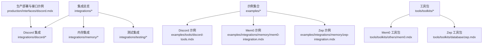
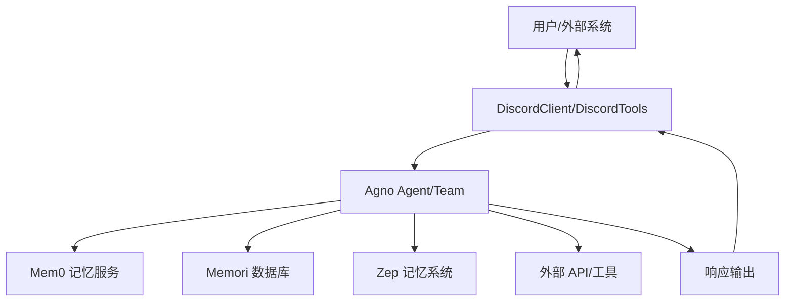
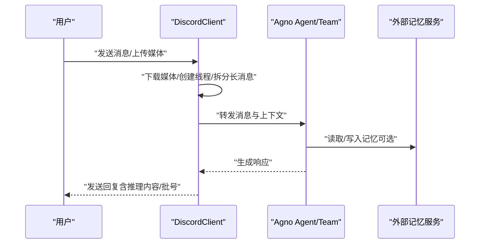
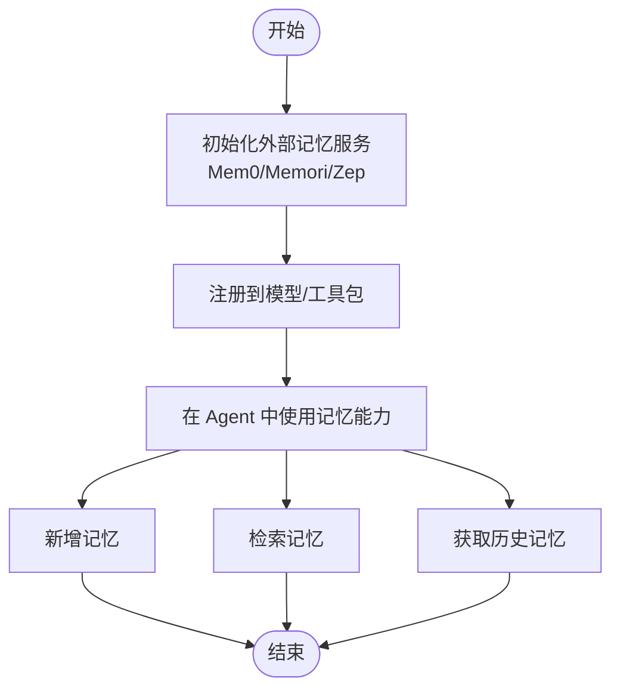
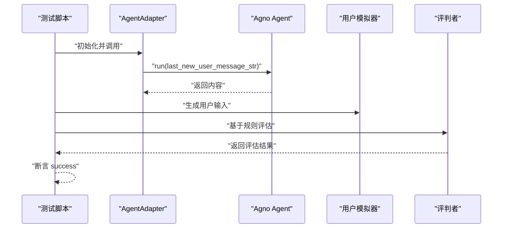
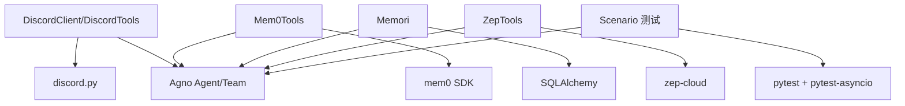

# 集成系统

<cite>
**本文引用的文件**   
- [integrations/discord/overview.mdx](file://integrations/discord/overview.mdx)
- [_snippets/setup-discord-app.mdx](file://_snippets/setup-discord-app.mdx)
- [production/interfaces/discord.mdx](file://production/interfaces/discord.mdx)
- [examples/tools/discord-tools.mdx](file://examples/tools/discord-tools.mdx)
- [integrations/memory/memori.mdx](file://integrations/memory/memori.mdx)
- [examples/integrations/memory/mem0-integration.mdx](file://examples/integrations/memory/mem0-integration.mdx)
- [examples/integrations/memory/zep-integration.mdx](file://examples/integrations/memory/zep-integration.mdx)
- [tools/toolkits/others/mem0.mdx](file://tools/toolkits/others/mem0.mdx)
- [tools/toolkits/database/zep.mdx](file://tools/toolkits/database/zep.mdx)
- [integrations/testing/overview.mdx](file://integrations/testing/overview.mdx)
- [integrations/testing/usage/basic.mdx](file://integrations/testing/usage/basic.mdx)
</cite>

## 目录
1. [引言](#引言)
2. [项目结构](#项目结构)
3. [核心组件](#核心组件)
4. [架构总览](#架构总览)
5. [详细组件分析](#详细组件分析)
6. [依赖关系分析](#依赖关系分析)
7. [性能考量](#性能考量)
8. [故障排查指南](#故障排查指南)
9. [结论](#结论)
10. [附录](#附录)

## 引言
本技术文档面向需要将 Agno 与外部系统（如 Discord、第三方记忆服务等）进行集成的开发者与运维人员。内容覆盖：
- 第三方服务集成与 API 适配的基本方法
- Discord 机器人的配置、频道管理与消息处理流程
- 内存集成（Mem0、Memori、Zep）的实现与配置要点
- 测试集成（场景测试、自动化测试、端到端测试）的实践路径
- 扩展方法：自定义集成开发与第三方服务接入指南
- 安全性、性能与故障处理策略
- 实际集成示例与配置步骤，帮助快速落地

## 项目结构
本仓库以“主题+示例”的方式组织集成相关内容，主要分布在以下区域：
- integrations：集成概览与第三方服务对接说明
- examples：可直接运行的集成示例
- tools/toolkits：工具包与工具集，支持与外部系统交互
- integrations/testing：测试框架与用法示例
- production：生产部署与接口示例

下图给出与“集成系统”相关的文档与示例的结构化视图：

**图表来源**
- [integrations/discord/overview.mdx:1-119](file://integrations/discord/overview.mdx#L1-L119)
- [integrations/memory/memori.mdx:1-85](file://integrations/memory/memori.mdx#L1-L85)
- [integrations/testing/overview.mdx:1-92](file://integrations/testing/overview.mdx#L1-L92)
- [examples/tools/discord-tools.mdx:1-148](file://examples/tools/discord-tools.mdx#L1-L148)
- [examples/integrations/memory/mem0-integration.mdx:1-74](file://examples/integrations/memory/mem0-integration.mdx#L1-L74)
- [examples/integrations/memory/zep-integration.mdx:1-64](file://examples/integrations/memory/zep-integration.mdx#L1-L64)
- [tools/toolkits/others/mem0.mdx:1-27](file://tools/toolkits/others/mem0.mdx#L1-L27)
- [tools/toolkits/database/zep.mdx:1-50](file://tools/toolkits/database/zep.mdx#L1-L50)
- [production/interfaces/discord.mdx:1-116](file://production/interfaces/discord.mdx#L1-L116)

**章节来源**
- [integrations/discord/overview.mdx:1-119](file://integrations/discord/overview.mdx#L1-L119)
- [integrations/memory/memori.mdx:1-85](file://integrations/memory/memori.mdx#L1-L85)
- [integrations/testing/overview.mdx:1-92](file://integrations/testing/overview.mdx#L1-L92)
- [examples/tools/discord-tools.mdx:1-148](file://examples/tools/discord-tools.mdx#L1-L148)
- [examples/integrations/memory/mem0-integration.mdx:1-74](file://examples/integrations/memory/mem0-integration.mdx#L1-L74)
- [examples/integrations/memory/zep-integration.mdx:1-64](file://examples/integrations/memory/zep-integration.mdx#L1-L64)
- [tools/toolkits/others/mem0.mdx:1-27](file://tools/toolkits/others/mem0.mdx#L1-L27)
- [tools/toolkits/database/zep.mdx:1-50](file://tools/toolkits/database/zep.mdx#L1-L50)
- [production/interfaces/discord.mdx:1-116](file://production/interfaces/discord.mdx#L1-L116)

## 核心组件
- Discord 集成
  - 主要入口：DiscordClient，封装 Agno Agent/Team 并通过 discord.py 处理事件
  - 关键能力：自动线程创建、媒体处理（图片/视频/音频/文件）、长消息拆分、推理内容格式化
  - 运行方式：serve() 启动客户端；环境变量 DISCORD_BOT_TOKEN 提供鉴权
- 内存集成
  - Mem0：通过 Mem0Tools 与外部记忆平台交互，支持增删查等操作
  - Memori：通过 SQLAlchemy 初始化数据库，注册到模型后持久化对话记忆
  - Zep：通过 ZepTools 与 Zep 记忆系统交互，支持上下文记忆检索
- 测试集成
  - 基于 Scenario 框架进行代理行为仿真测试，支持用户模拟器与评判者
  - 支持 pytest + pytest-asyncio 的自动化测试执行

**章节来源**
- [integrations/discord/overview.mdx:35-119](file://integrations/discord/overview.mdx#L35-L119)
- [examples/tools/discord-tools.mdx:1-148](file://examples/tools/discord-tools.mdx#L1-L148)
- [integrations/memory/memori.mdx:1-85](file://integrations/memory/memori.mdx#L1-L85)
- [tools/toolkits/others/mem0.mdx:1-27](file://tools/toolkits/others/mem0.mdx#L1-L27)
- [tools/toolkits/database/zep.mdx:1-50](file://tools/toolkits/database/zep.mdx#L1-L50)
- [integrations/testing/overview.mdx:1-92](file://integrations/testing/overview.mdx#L1-L92)

## 架构总览
下图展示了从用户输入到外部系统响应的整体流程，以及与 Agno Agent/Team 的交互关系。

**图表来源**
- [integrations/discord/overview.mdx:35-119](file://integrations/discord/overview.mdx#L35-L119)
- [examples/tools/discord-tools.mdx:1-148](file://examples/tools/discord-tools.mdx#L1-L148)
- [integrations/memory/memori.mdx:1-85](file://integrations/memory/memori.mdx#L1-L85)
- [tools/toolkits/others/mem0.mdx:1-27](file://tools/toolkits/others/mem0.mdx#L1-L27)
- [tools/toolkits/database/zep.mdx:1-50](file://tools/toolkits/database/zep.mdx#L1-L50)

## 详细组件分析

### Discord 集成
- 组件职责
  - 封装 Agent/Team，统一处理 Discord 事件
  - 自动线程管理、媒体下载与转发、消息拆分与格式化
- 关键参数与能力
  - 初始化参数：agent 或 team 二选一
  - 事件处理：消息接收、媒体处理、线程管理、执行 Agent/Team、响应发送
- 配置与部署
  - 在 Discord 开发者门户创建应用与 Bot，启用所需意图与权限
  - 设置 DISCORD_BOT_TOKEN 环境变量
  - 可直接通过网关 API 连接，无需 webhook 或内网穿透
- 使用示例
  - 两种模式：作为 DiscordClient 服务端运行；或作为工具集注入 Agent

**图表来源**
- [integrations/discord/overview.mdx:82-110](file://integrations/discord/overview.mdx#L82-L110)
- [production/interfaces/discord.mdx:10-105](file://production/interfaces/discord.mdx#L10-L105)

**章节来源**
- [integrations/discord/overview.mdx:1-119](file://integrations/discord/overview.mdx#L1-L119)
- [_snippets/setup-discord-app.mdx:1-88](file://_snippets/setup-discord-app.mdx#L1-L88)
- [production/interfaces/discord.mdx:1-116](file://production/interfaces/discord.mdx#L1-L116)
- [examples/tools/discord-tools.mdx:1-148](file://examples/tools/discord-tools.mdx#L1-L148)

### 内存集成（Mem0/Memori/Zep）
- Mem0 集成
  - 通过 Mem0Tools 与外部记忆平台交互，支持添加、搜索、获取全部、删除全部等操作
  - 示例演示了在 Agent 中注入工具并进行记忆交互
- Memori 集成
  - 使用 SQLAlchemy 创建数据库引擎，初始化 Memori 实例
  - 注册到模型后构建存储，实现跨会话的记忆持久化
- Zep 集成
  - 通过 ZepTools 与 Zep 记忆系统交互，支持上下文记忆检索
  - 示例演示了向 Zep 写入记忆并由 Agent 读取

**图表来源**
- [examples/integrations/memory/mem0-integration.mdx:1-74](file://examples/integrations/memory/mem0-integration.mdx#L1-L74)
- [integrations/memory/memori.mdx:1-85](file://integrations/memory/memori.mdx#L1-L85)
- [tools/toolkits/database/zep.mdx:1-50](file://tools/toolkits/database/zep.mdx#L1-L50)

**章节来源**
- [examples/integrations/memory/mem0-integration.mdx:1-74](file://examples/integrations/memory/mem0-integration.mdx#L1-L74)
- [tools/toolkits/others/mem0.mdx:1-27](file://tools/toolkits/others/mem0.mdx#L1-L27)
- [integrations/memory/memori.mdx:1-85](file://integrations/memory/memori.mdx#L1-L85)
- [tools/toolkits/database/zep.mdx:1-50](file://tools/toolkits/database/zep.mdx#L1-L50)
- [examples/integrations/memory/zep-integration.mdx:1-64](file://examples/integrations/memory/zep-integration.mdx#L1-L64)

### 测试集成（场景测试）
- 场景测试概述
  - 基于 Scenario 框架对代理行为进行仿真测试，支持用户模拟器与评判者
  - 通过 pytest + pytest-asyncio 执行异步测试
- 关键流程
  - 定义 AgentAdapter 包装 Agent
  - 运行 scenario.run，传入用户模拟器与评判者
  - 断言结果 success，评估代理表现

**图表来源**
- [integrations/testing/overview.mdx:10-64](file://integrations/testing/overview.mdx#L10-L64)
- [integrations/testing/usage/basic.mdx:11-63](file://integrations/testing/usage/basic.mdx#L11-L63)

**章节来源**
- [integrations/testing/overview.mdx:1-92](file://integrations/testing/overview.mdx#L1-L92)
- [integrations/testing/usage/basic.mdx:1-90](file://integrations/testing/usage/basic.mdx#L1-L90)

### 扩展方法：自定义集成与第三方接入
- 自定义工具与工具包
  - 通过工具包（如 Mem0/Zep）扩展 Agent 能力，注入到 Agent 的 tools 列表
  - 通过 dependencies 将外部记忆服务注入到上下文中
- 第三方服务接入
  - 以 Discord 为例：通过 DiscordClient/DiscordTools 适配 Discord 事件与 API
  - 以内存服务为例：通过工具包与外部平台交互，实现记忆的读取与写入
- 部署与运行
  - 生产部署可直接连接 Discord 网关，无需 webhook
  - 通过环境变量管理敏感信息（如 DISCORD_BOT_TOKEN）

**章节来源**
- [examples/tools/discord-tools.mdx:1-148](file://examples/tools/discord-tools.mdx#L1-L148)
- [tools/toolkits/others/mem0.mdx:1-27](file://tools/toolkits/others/mem0.mdx#L1-L27)
- [tools/toolkits/database/zep.mdx:1-50](file://tools/toolkits/database/zep.mdx#L1-L50)
- [production/interfaces/discord.mdx:107-116](file://production/interfaces/discord.mdx#L107-L116)

## 依赖关系分析
- 组件耦合
  - Discord 集成依赖 discord.py 与 Agno Agent/Team
  - 内存集成依赖对应平台 SDK（如 mem0、sqlalchemy、zep-cloud）
  - 测试集成依赖 Scenario、pytest、pytest-asyncio
- 外部依赖与集成点
  - Discord：Gateway API、OAuth2 权限与意图
  - Mem0/Memori/Zep：HTTP API 或 SDK
  - 测试：OpenAI API（用于用户模拟器与评判者）

**图表来源**
- [integrations/discord/overview.mdx:35-119](file://integrations/discord/overview.mdx#L35-L119)
- [tools/toolkits/others/mem0.mdx:1-27](file://tools/toolkits/others/mem0.mdx#L1-L27)
- [tools/toolkits/database/zep.mdx:1-50](file://tools/toolkits/database/zep.mdx#L1-L50)
- [integrations/testing/overview.mdx:1-92](file://integrations/testing/overview.mdx#L1-L92)

**章节来源**
- [integrations/discord/overview.mdx:35-119](file://integrations/discord/overview.mdx#L35-L119)
- [tools/toolkits/others/mem0.mdx:1-27](file://tools/toolkits/others/mem0.mdx#L1-L27)
- [tools/toolkits/database/zep.mdx:1-50](file://tools/toolkits/database/zep.mdx#L1-L50)
- [integrations/testing/overview.mdx:1-92](file://integrations/testing/overview.mdx#L1-L92)

## 性能考量
- 消息处理与媒体处理
  - 长消息拆分与批量编号可避免单次响应过大
  - 媒体下载与处理需注意带宽与存储开销
- 记忆服务访问
  - 记忆检索与写入应考虑网络延迟与并发访问
  - 对高频访问场景建议引入缓存与批量同步
- 测试执行
  - 场景测试建议控制并发与超时，避免外部 API 限流
- 部署与运行
  - Discord Bot 直连网关，减少中间层延迟
  - 使用稳定超时与重试策略提升稳定性

## 故障排查指南
- Discord 集成
  - 确认意图与权限已正确配置（消息内容意图、成员意图等）
  - 确保 DISCORD_BOT_TOKEN 环境变量正确且未泄露
  - 如无法接收消息，检查 Bot 是否被邀请至目标服务器
- 内存集成
  - Mem0/Memori/Zep 需确保网络可达与凭据正确
  - 记忆同步存在延迟，需等待同步完成后再查询
- 测试集成
  - 确认 OPENAI_API_KEY/LANGWATCH_API_KEY 等环境变量已设置
  - 使用 pytest-asyncio 运行异步测试，避免阻塞
- 通用建议
  - 使用日志记录关键路径（请求/响应、错误码）
  - 对异常进行分类处理并记录上下文信息

**章节来源**
- [_snippets/setup-discord-app.mdx:83-88](file://_snippets/setup-discord-app.mdx#L83-L88)
- [integrations/testing/overview.mdx:66-91](file://integrations/testing/overview.mdx#L66-L91)

## 结论
通过本集成系统，Agno 可以无缝对接 Discord 机器人与多种外部记忆服务，并借助场景测试框架实现可控的自动化验证。遵循本文提供的配置步骤、安全策略与性能建议，可在保证稳定性的同时快速扩展新的第三方服务与自定义集成。

## 附录
- 快速开始清单
  - Discord：创建应用与 Bot → 启用意图与权限 → 设置环境变量 → 邀请 Bot → 运行示例
  - Mem0/Memori/Zep：安装 SDK → 初始化客户端/数据库 → 注册到模型 → 编写 Agent 使用示例
  - 测试：安装依赖 → 配置 API Key → 运行 pytest 异步测试
- 参考示例路径
  - Discord 示例：[examples/tools/discord-tools.mdx:1-148](file://examples/tools/discord-tools.mdx#L1-L148)
  - Mem0 示例：[examples/integrations/memory/mem0-integration.mdx:1-74](file://examples/integrations/memory/mem0-integration.mdx#L1-L74)
  - Zep 示例：[examples/integrations/memory/zep-integration.mdx:1-64](file://examples/integrations/memory/zep-integration.mdx#L1-L64)
  - 测试示例：[integrations/testing/usage/basic.mdx:11-63](file://integrations/testing/usage/basic.mdx#L11-L63)