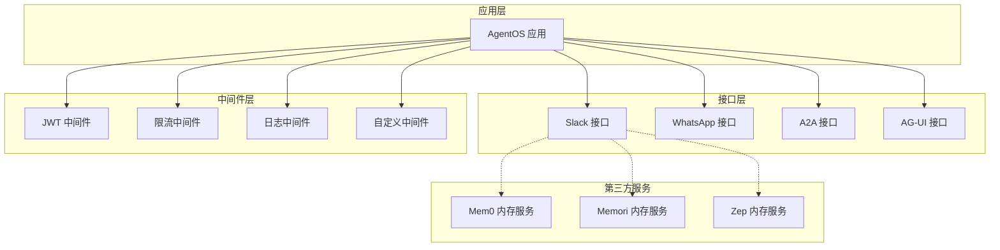
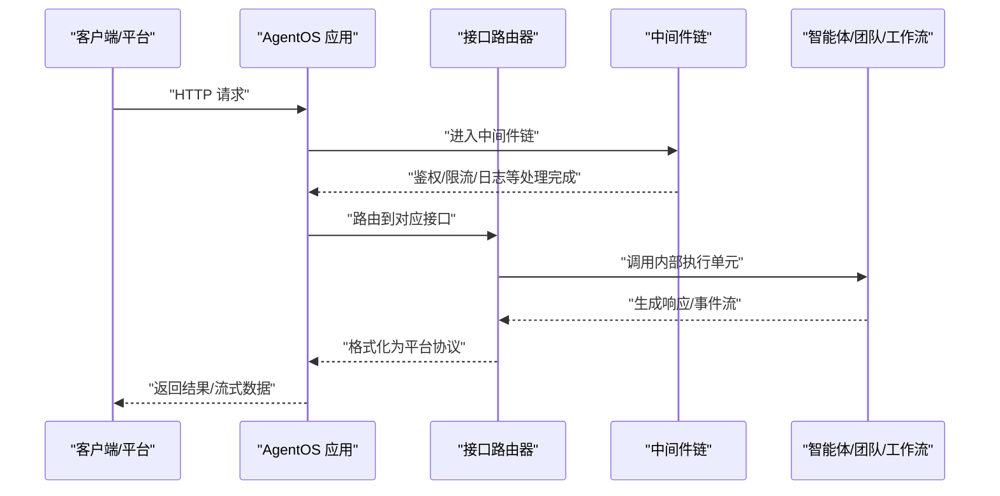
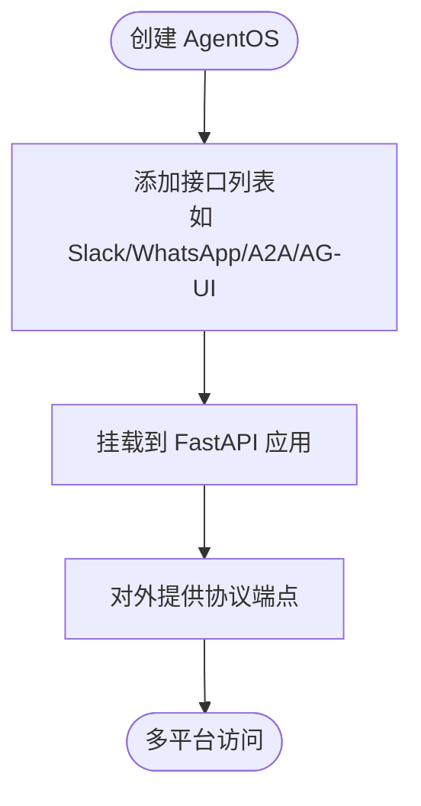
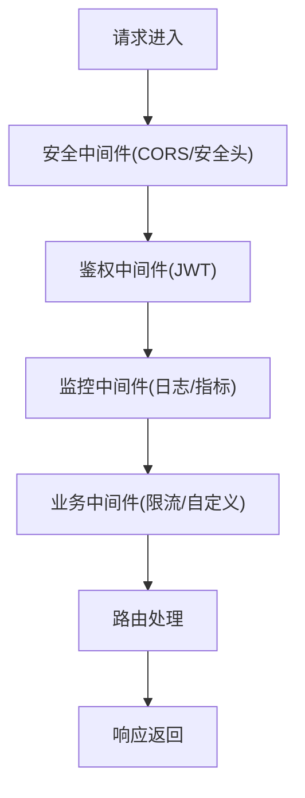
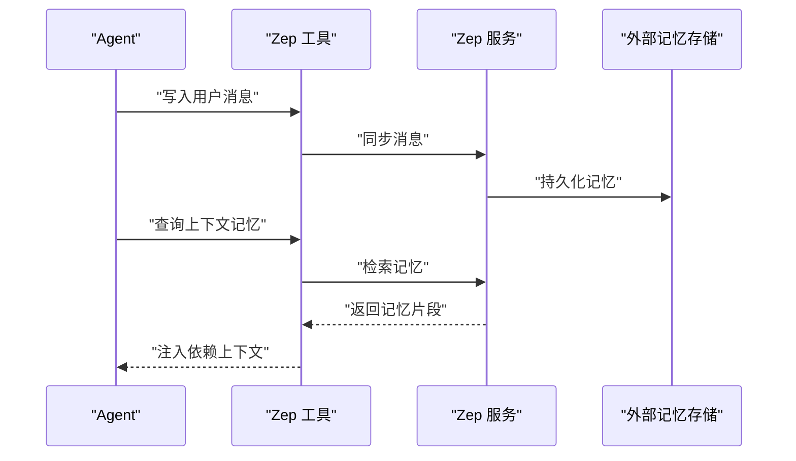
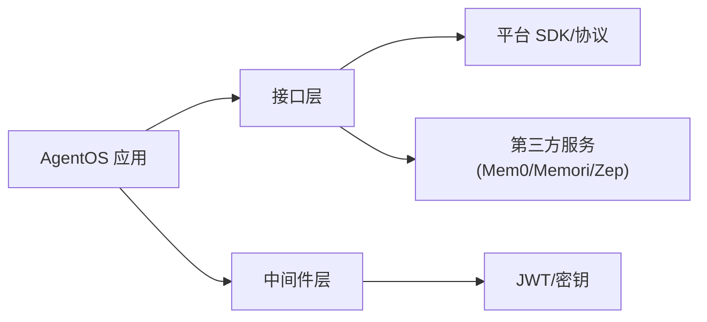

# 集成系统概述

<cite>
**本文引用的文件**
- [集成系统总览](file://agent-os/interfaces/overview.mdx)
- [中间件总览](file://agent-os/middleware/overview.mdx)
- [自定义中间件](file://agent-os/middleware/custom.mdx)
- [AgentOS 安全总览](file://agent-os/security/overview.mdx)
- [AgentOS 配置](file://agent-os/config.mdx)
- [环境变量与密钥（生产模板）](file://production/templates/customize-aws/env-vars.mdx)
- [密钥管理（生产模板）](file://production/templates/customize-aws/secrets.mdx)
- [Mem0 内存集成示例](file://examples/integrations/memory/mem0-integration.mdx)
- [Memori 内存集成示例](file://examples/integrations/memory/memori-integration.mdx)
- [Zep 内存集成示例](file://examples/integrations/memory/zep-integration.mdx)
- [A2A 接口示例](file://examples/agent-os/interfaces/a2a/multi-agent-a2a/trip-planning-a2a-client.mdx)
- [WhatsApp 接口示例](file://examples/agent-os/interfaces/whatsapp/multiple-instances.mdx)
- [JWT 中间件示例](file://examples/agent-os/middleware/agent-os-with-jwt-middleware.mdx)
- [自定义中间件示例](file://examples/agent-os/middleware/agent-os-with-custom-middleware.mdx)
- [内容提取中间件示例](file://examples/agent-os/middleware/extract-content-middleware.mdx)
</cite>

## 目录
1. [引言](#引言)
2. [项目结构](#项目结构)
3. [核心组件](#核心组件)
4. [架构总览](#架构总览)
5. [详细组件分析](#详细组件分析)
6. [依赖关系分析](#依赖关系分析)
7. [性能考量](#性能考量)
8. [故障排查指南](#故障排查指南)
9. [结论](#结论)
10. [附录](#附录)

## 引言
本文件面向希望在 Agno 框架中构建“集成系统”的读者，系统性阐述集成系统在框架中的核心作用、设计理念、整体架构、配置方式、最佳实践以及扩展指南。通过统一接口抽象、可插拔架构与扩展机制，集成系统将内部智能体能力暴露到多种外部平台与协议，实现与第三方服务的高效对接与价值转化。

## 项目结构
围绕“集成系统”的知识分布在以下几类文档中：
- 接口层：将 AgentOS 的智能体、团队与工作流以协议兼容的方式暴露到不同平台（如 Slack、WhatsApp、A2A、AG-UI）。
- 中间件层：在 FastAPI/Starlette 生态下，对请求/响应进行横切增强（鉴权、日志、限流、监控等）。
- 安全与授权：提供基础鉴权与基于 JWT 的细粒度权限控制（RBAC）。
- 配置与运行时：支持 YAML/类配置、/config 端点输出、环境变量与密钥注入。
- 第三方服务集成示例：内存服务（Mem0/Memori/Zep）、接口协议示例等。

图表来源
- [集成系统总览:43-67](file://agent-os/interfaces/overview.mdx#L43-L67)
- [中间件总览:42-74](file://agent-os/middleware/overview.mdx#L42-L74)
- [Mem0 内存集成示例:1-74](file://examples/integrations/memory/mem0-integration.mdx#L1-L74)
- [Memori 内存集成示例:1-88](file://examples/integrations/memory/memori-integration.mdx#L1-L88)
- [Zep 内存集成示例:1-64](file://examples/integrations/memory/zep-integration.mdx#L1-L64)

章节来源
- [集成系统总览:1-68](file://agent-os/interfaces/overview.mdx#L1-L68)
- [中间件总览:1-223](file://agent-os/middleware/overview.mdx#L1-L223)

## 核心组件
- 统一接口抽象：通过 FastAPI 路由器封装，将 AgentOS 的智能体/团队/工作流映射为协议兼容端点，负责认证、会话与格式化流式返回。
- 可插拔架构：接口与中间件均以可组合方式添加；同一 AgentOS 可同时挂载多个接口，实现多协议并行暴露。
- 扩展机制：支持自定义中间件与工具包，便于接入第三方服务或实现业务横切逻辑。

章节来源
- [集成系统总览:43-67](file://agent-os/interfaces/overview.mdx#L43-L67)
- [中间件总览:12-14](file://agent-os/middleware/overview.mdx#L12-L14)
- [自定义中间件:16-248](file://agent-os/middleware/custom.mdx#L16-L248)

## 架构总览
从“适配器模式”视角看，接口层扮演适配器角色，将内部智能体能力适配为外部平台可用的端点；中间件层作为横切关注点，贯穿请求生命周期；协议转换器（例如接口内部的认证与消息格式转换）确保与目标平台的协议一致。

图表来源
- [集成系统总览:43-67](file://agent-os/interfaces/overview.mdx#L43-L67)
- [中间件总览:143-163](file://agent-os/middleware/overview.mdx#L143-L163)

## 详细组件分析

### 接口层（适配器模式）
- 角色与职责：将 AgentOS 的智能体/团队/工作流包装为协议兼容端点，处理平台特定的认证、请求校验、会话与上下文保持、以及按平台要求的流式返回。
- 使用方式：通过 AgentOS 构造函数的 interfaces 参数挂载多个接口，实现“同源能力、多协议暴露”。

图表来源
- [集成系统总览:52-67](file://agent-os/interfaces/overview.mdx#L52-L67)

章节来源
- [集成系统总览:43-67](file://agent-os/interfaces/overview.mdx#L43-L67)

### 中间件层（横切增强）
- 支持范围：鉴权（JWT）、限流、日志、监控、安全头、CORS 等。
- 执行顺序：后加先执行，建议优先放置安全与通用中间件，再放业务逻辑中间件。
- 自定义能力：基于 BaseHTTPMiddleware 实现，可注入参数、提取声明、记录指标等。

图表来源
- [中间件总览:143-163](file://agent-os/middleware/overview.mdx#L143-L163)
- [自定义中间件:16-248](file://agent-os/middleware/custom.mdx#L16-L248)

章节来源
- [中间件总览:1-223](file://agent-os/middleware/overview.mdx#L1-L223)
- [自定义中间件:1-248](file://agent-os/middleware/custom.mdx#L1-L248)

### 协议转换器（接口内部）
- 认证转换：将平台令牌/签名转换为内部用户标识、会话标识与依赖注入。
- 消息格式转换：将内部消息模型转换为目标平台的消息结构，保证流式输出的一致性。
- 会话与上下文：在接口内维护会话状态与上下文，确保跨请求的连贯性。

章节来源
- [集成系统总览:43-67](file://agent-os/interfaces/overview.mdx#L43-L67)

### 第三方服务集成（内存服务）
- Mem0：通过外部内存客户端获取/写入记忆，作为 Agent 的依赖注入，实现跨会话的记忆复用。
- Memori：结合数据库会话注册 LLM 客户端，构建持久化记忆与归属追踪。
- Zep：使用 Zep 工具写入/检索记忆，作为上下文依赖注入到 Agent。

图表来源
- [Zep 内存集成示例:1-64](file://examples/integrations/memory/zep-integration.mdx#L1-L64)
- [Mem0 内存集成示例:1-74](file://examples/integrations/memory/mem0-integration.mdx#L1-L74)
- [Memori 内存集成示例:1-88](file://examples/integrations/memory/memori-integration.mdx#L1-L88)

章节来源
- [Mem0 内存集成示例:1-74](file://examples/integrations/memory/mem0-integration.mdx#L1-L74)
- [Memori 内存集成示例:1-88](file://examples/integrations/memory/memori-integration.mdx#L1-L88)
- [Zep 内存集成示例:1-64](file://examples/integrations/memory/zep-integration.mdx#L1-L64)

## 依赖关系分析
- 组件耦合：接口层与中间件层通过 FastAPI 应用解耦；接口内部依赖具体平台 SDK 或协议规范。
- 外部依赖：第三方服务（如 Mem0/Memori/Zep）通过工具或客户端库接入；认证依赖 JWT 公钥与平台密钥。
- 运行时依赖：AgentOS 配置、环境变量与密钥注入决定接口与中间件的行为。

图表来源
- [AgentOS 安全总览:1-70](file://agent-os/security/overview.mdx#L1-L70)
- [AgentOS 配置:1-213](file://agent-os/config.mdx#L1-L213)
- [环境变量与密钥（生产模板）:1-51](file://production/templates/customize-aws/env-vars.mdx#L1-L51)
- [密钥管理（生产模板）:51-73](file://production/templates/customize-aws/secrets.mdx#L51-L73)

章节来源
- [AgentOS 安全总览:1-70](file://agent-os/security/overview.mdx#L1-L70)
- [AgentOS 配置:1-213](file://agent-os/config.mdx#L1-L213)
- [环境变量与密钥（生产模板）:1-51](file://production/templates/customize-aws/env-vars.mdx#L1-L51)
- [密钥管理（生产模板）:51-73](file://production/templates/customize-aws/secrets.mdx#L51-L73)

## 性能考量
- 中间件层增加请求延迟，应合理选择中间件数量与顺序，优先放置高命中率的通用中间件。
- 流式输出需注意平台协议的帧边界与背压处理，避免阻塞主执行线程。
- 第三方服务调用应引入超时与重试策略，防止拖慢整体响应时间。
- 会话与上下文缓存可减少重复计算，但需平衡内存占用与一致性。

## 故障排查指南
- 鉴权失败
  - 基础鉴权：确认 OS_SECURITY_KEY 设置正确，请求携带有效 Bearer Token。
  - RBAC/JWT：确认 JWT_VERIFICATION_KEY 正确，令牌包含所需 scope，必要时切换至 RBAC 并清理旧密钥。
- 中间件异常
  - 检查中间件添加顺序与参数，确保安全中间件在前；查看日志中间件输出定位问题。
- 接口不可达
  - 确认接口已挂载到 AgentOS，并检查 /config 端点输出是否包含目标接口。
- 第三方服务错误
  - 校验服务密钥与网络连通性；对写入/检索操作增加重试与降级策略。

章节来源
- [AgentOS 安全总览:14-70](file://agent-os/security/overview.mdx#L14-L70)
- [中间件总览:77-84](file://agent-os/middleware/overview.mdx#L77-L84)
- [AgentOS 配置:146-213](file://agent-os/config.mdx#L146-L213)

## 结论
Agno 的集成系统以“统一接口抽象 + 可插拔架构 + 扩展机制”为核心，通过接口层适配多协议、中间件层增强横切能力、第三方服务集成提升智能体的上下文与能力边界，形成一套高扩展、易运维、可演进的系统方案。配合完善的配置与安全体系，可在开发、测试与生产环境中稳定落地。

## 附录

### 配置方法速览
- 环境变量与密钥
  - 开发/生产环境通过 env_vars 或 env_file 注入；生产推荐使用 AWS Secrets 管理敏感信息。
- AgentOS 配置
  - 支持 YAML 文件与 AgentOSConfig 类两种方式；/config 端点输出完整配置，便于前端与控制平面消费。
- 接口与中间件
  - 在 AgentOS 构造时传入 interfaces 列表；通过 app.add_middleware 添加中间件。

章节来源
- [环境变量与密钥（生产模板）:1-51](file://production/templates/customize-aws/env-vars.mdx#L1-L51)
- [密钥管理（生产模板）:51-73](file://production/templates/customize-aws/secrets.mdx#L51-L73)
- [AgentOS 配置:18-213](file://agent-os/config.mdx#L18-L213)
- [集成系统总览:52-67](file://agent-os/interfaces/overview.mdx#L52-L67)
- [中间件总览:42-74](file://agent-os/middleware/overview.mdx#L42-L74)

### 最佳实践
- 安全性
  - 生产环境启用 RBAC 与 JWT，避免使用基础鉴权；严格最小权限原则与 scope 映射。
- 性能
  - 合理安排中间件顺序与数量；对第三方服务调用引入超时与指数退避。
- 错误处理
  - 在中间件与接口层统一捕获异常并返回结构化错误；对关键路径增加可观测性与告警。

章节来源
- [AgentOS 安全总览:23-70](file://agent-os/security/overview.mdx#L23-L70)
- [中间件总览:81-84](file://agent-os/middleware/overview.mdx#L81-L84)

### 扩展指南
- 开发自定义接口
  - 参考现有接口（如 A2A/WhatsApp）的路由组织与认证流程，封装目标平台协议。
- 开发自定义中间件
  - 基于 BaseHTTPMiddleware 实现，支持参数注入、声明提取与指标采集。
- 接入新第三方服务
  - 将服务封装为工具或客户端，作为 Agent 的 dependencies 注入，或在接口层直接调用。

章节来源
- [A2A 接口示例:123-146](file://examples/agent-os/interfaces/a2a/multi-agent-a2a/trip-planning-a2a-client.mdx#L123-L146)
- [WhatsApp 接口示例:57-82](file://examples/agent-os/interfaces/whatsapp/multiple-instances.mdx#L57-L82)
- [自定义中间件:16-248](file://agent-os/middleware/custom.mdx#L16-L248)
- [自定义中间件示例:156-212](file://examples/agent-os/middleware/agent-os-with-custom-middleware.mdx#L156-L212)
- [JWT 中间件示例:83-121](file://examples/agent-os/middleware/agent-os-with-jwt-middleware.mdx#L83-L121)
- [内容提取中间件示例:160-210](file://examples/agent-os/middleware/extract-content-middleware.mdx#L160-L210)