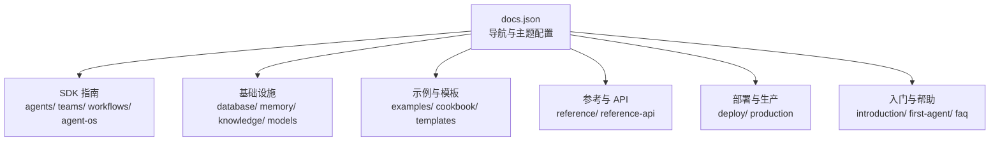
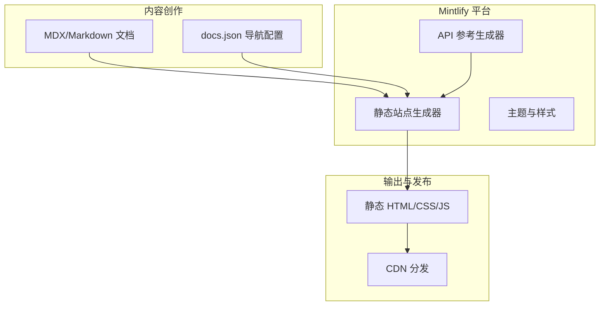
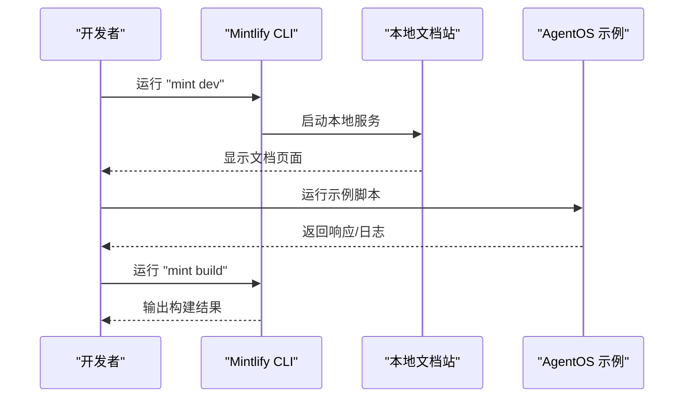
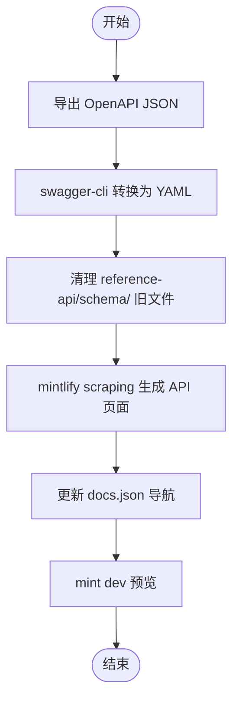
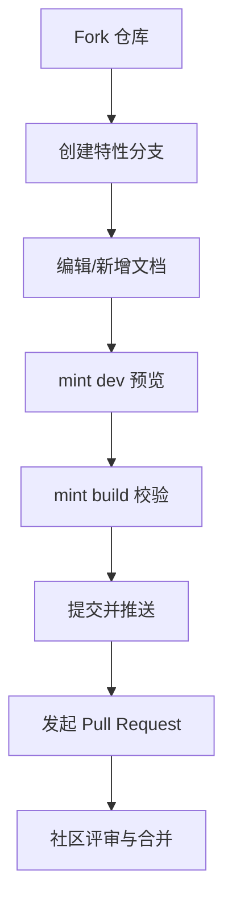
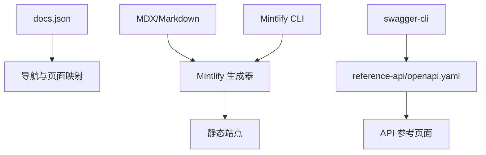

# 项目概述

<cite>
**本文档引用的文件**
- [README.md](file://README.md)
- [CONTRIBUTING.md](file://CONTRIBUTING.md)
- [docs.json](file://docs.json)
- [index.mdx](file://index.mdx)
- [introduction.mdx](file://introduction.mdx)
- [first-agent.mdx](file://first-agent.mdx)
- [install.mdx](file://other/install.mdx)
- [contribute.mdx](file://other/contribute.mdx)
- [openapi.yaml](file://reference-api/openapi.yaml)
- [.gitignore](file://.gitignore)
</cite>

## 目录
1. [引言](#引言)
2. [项目结构](#项目结构)
3. [核心组件](#核心组件)
4. [架构总览](#架构总览)
5. [详细组件分析](#详细组件分析)
6. [依赖关系分析](#依赖关系分析)
7. [性能考虑](#性能考虑)
8. [故障排除指南](#故障排除指南)
9. [结论](#结论)
10. [附录](#附录)

## 引言

Agno 是一个面向智能体软件（Agents）的全栈框架与运行时平台，支持从单智能体到分布式多智能体系统的规模化构建、运行与管理。该项目的文档站点由 Mintlify 提供支持，采用基于 MDX/Markdown 的内容管理系统，通过静态站点生成器实现高效、可维护的知识库与开发者文档。

- 核心价值主张
  - 一体化：在同一架构上统一支持智能体（Agents）、团队（Teams）与工作流（Workflows），并提供生产级运行时与控制平面。
  - 可扩展：无状态、水平可扩展的运行时，支持会话隔离、后台执行与可观测性。
  - 自主可控：所有数据与系统运行在用户自己的基础设施中，满足合规与安全要求。
  - 开源生态：开放的贡献模型与社区协作机制，鼓励开发者共同完善文档与示例。

- 为什么选择 Mintlify
  - 基于 MDX/Markdown 的内容管理，便于技术写作与代码示例嵌入。
  - 强大的导航与搜索能力，支持复杂的 SDK、API 参考与示例索引。
  - 静态生成与 CDN 分发，确保文档加载速度与稳定性。
  - 与 Git 工作流无缝集成，支持 PR 预览与自动化发布。

**章节来源**
- [introduction.mdx:1-54](file://introduction.mdx#L1-L54)
- [README.md:1-83](file://README.md#L1-L83)

## 项目结构

该仓库包含超过 3779 个有效文档页面，采用按功能域分层的目录组织方式，涵盖 SDK 指南、API 参考、示例代码、部署模板与社区资源等模块。导航结构由 `docs.json` 统一定义，确保文档体系的完整性与一致性。

- 主要目录与职责
  - introduction、first-agent 等入门与快速开始内容，帮助新用户快速上手。
  - agents、teams、workflows、agent-os 等核心功能域文档，覆盖从概念到实践的完整路径。
  - database、memory、knowledge、models 等基础设施与能力说明，支撑复杂场景。
  - examples、cookbook、templates 等示例与模板集合，加速落地实践。
  - reference、reference-api 等参考与自动生成的 API 文档，保证接口一致性。
  - deploy、production 等部署与生产运维指南，指导从开发到生产的迁移。
  - faq、videos、images 等辅助资源，提升用户体验与问题解决效率。

- 导航与主题配置
  - `docs.json` 定义了站点名称、颜色主题、字体、页脚社交链接、导航分组与页面映射。
  - 通过层级化的 groups/pages 结构，将海量页面有序组织，便于检索与维护。

**图表来源**
- [docs.json:76-12918](file://docs.json#L76-L12918)

**章节来源**
- [docs.json:1-12918](file://docs.json#L1-L12918)
- [index.mdx:1-487](file://index.mdx#L1-L487)

## 核心组件

- 内容管理系统（CMS）
  - 基于 MDX/Markdown 的文档格式，支持 JSX 组件与代码高亮，便于展示 SDK 示例与交互式内容。
  - 通过 Front Matter 管理页面元信息（标题、描述、关键词等），提升 SEO 与导航体验。

- 静态站点生成器（Mintlify）
  - 将 Markdown/MDX 内容与 `docs.json` 导航配置结合，生成高性能的静态站点。
  - 支持主题定制、字体与图标、页脚社交链接等视觉元素，统一品牌风格。

- API 参考（自动生成）
  - 通过 OpenAPI 规范（openapi.yaml）与 Mintlify scraping 工具，自动抽取 AgentOS 接口并生成可浏览的 API 文档。
  - 更新流程包括：拉取最新 OpenAPI、转换为 YAML、清理旧文件、重新生成、更新导航并本地预览。

- 质量保障与校验
  - 使用 .gitignore 忽略本地开发工具与临时文件，保持仓库整洁。
  - 通过 CONTRIBUTING.md 规范化贡献流程，包括分支命名、PR 标题格式、本地测试与构建验证。

**章节来源**
- [README.md:44-64](file://README.md#L44-L64)
- [CONTRIBUTING.md:116-132](file://CONTRIBUTING.md#L116-L132)
- [.gitignore:1-30](file://.gitignore#L1-L30)

## 架构总览

下图展示了 Agno 文档项目的整体架构：内容作者通过 MDX/Markdown 编写文档；Mintlify 读取 `docs.json` 进行导航与主题渲染；API 参考通过 OpenAPI 自动生成；最终生成静态站点并部署到 CDN。

**图表来源**
- [docs.json:1-12918](file://docs.json#L1-L12918)
- [openapi.yaml:1-200](file://reference-api/openapi.yaml#L1-L200)

**章节来源**
- [README.md:20-43](file://README.md#L20-L43)
- [openapi.yaml:1-200](file://reference-api/openapi.yaml#L1-L200)

## 详细组件分析

### 快速开始组件

- 入门与安装
  - introduction.mdx 提供 Agno 的定位、能力与使用场景概览，引导用户进入 SDK 与 AgentOS。
  - first-agent.mdx 展示“20 行代码”构建第一个智能体的完整流程，包括虚拟环境、依赖安装、API 密钥配置与本地运行。
  - other/install.mdx 提供更通用的安装与升级建议，强调虚拟环境与包管理工具的使用。

- 本地开发与预览
  - Mintlify CLI 提供 `mint dev` 一键启动本地服务，支持热重载与实时预览。
  - 通过 `mint build` 在提交前进行构建检查，提前发现语法或链接错误。

**图表来源**
- [README.md:20-32](file://README.md#L20-L32)
- [first-agent.mdx:56-103](file://first-agent.mdx#L56-L103)

**章节来源**
- [introduction.mdx:1-54](file://introduction.mdx#L1-L54)
- [first-agent.mdx:1-179](file://first-agent.mdx#L1-L179)
- [install.mdx:1-56](file://other/install.mdx#L1-L56)

### API 参考组件

- 数据流与生成流程
  - 通过 AgentOS 提供的 OpenAPI 端点导出最新接口定义。
  - 使用 swagger-cli 将 JSON 转换为 YAML，再用 Mintlify scraping 工具生成可浏览的 API 页面。
  - 清理旧文件后更新 `docs.json` 中的导航条目，最后通过 `mint dev` 验证变更。

**图表来源**
- [README.md:44-64](file://README.md#L44-L64)
- [openapi.yaml:1-200](file://reference-api/openapi.yaml#L1-L200)

**章节来源**
- [README.md:44-64](file://README.md#L44-L64)
- [openapi.yaml:1-200](file://reference-api/openapi.yaml#L1-L200)

### 贡献与质量保障组件

- 贡献流程
  - 遵循 fork/pull request 工作流，使用约定式提交标题与分支命名规范。
  - 在本地通过 `mint dev` 预览，使用 `mint build` 进行构建验证，确保链接与格式正确。

- 文档结构与写作规范
  - 按照 introduction、tutorials、how-to、basics、integrations、reference、examples、templates、agent-os、deploy、evals、faq、videos、_snippets 等分类组织内容。
  - 强调 MDX 格式、代码示例、跨页面链接与一致的排版风格。

**图表来源**
- [CONTRIBUTING.md:16-41](file://CONTRIBUTING.md#L16-L41)

**章节来源**
- [CONTRIBUTING.md:16-135](file://CONTRIBUTING.md#L16-L135)
- [contribute.mdx:1-45](file://other/contribute.mdx#L1-L45)

## 依赖关系分析

- 组件耦合与内聚
  - docs.json 作为单一事实来源，集中管理导航与主题，降低页面间的耦合度。
  - API 参考与导航解耦：OpenAPI 文件独立维护，通过脚本驱动生成，避免手动同步带来的误差。

- 外部依赖与集成点
  - Mintlify CLI：本地开发与构建。
  - swagger-cli：OpenAPI 转换工具。
  - Git 与 GitHub：版本控制与 PR 流程。

**图表来源**
- [docs.json:1-12918](file://docs.json#L1-L12918)
- [openapi.yaml:1-200](file://reference-api/openapi.yaml#L1-L200)
- [README.md:44-64](file://README.md#L44-L64)

**章节来源**
- [docs.json:1-12918](file://docs.json#L1-L12918)
- [README.md:44-64](file://README.md#L44-L64)

## 性能考虑

- 静态生成的优势
  - 文档以静态 HTML/CSS/JS 形式交付，减少服务器端计算开销，提升加载速度与并发承载能力。
- 导航与索引优化
  - 通过 docs.json 的分组与层级设计，减少页面跳转成本，提升用户查找效率。
- 版本与缓存策略
  - CDN 缓存与浏览器缓存配合，缩短重复访问延迟；API 参考更新采用增量生成，避免全量重建。

[本节为通用指导，无需特定文件引用]

## 故障排除指南

- Mintlify 开发服务无法启动
  - 执行 `mint update` 更新依赖，确保 CLI 版本与配置兼容。
- 页面显示 404
  - 确认当前工作目录包含 `docs.json`，并在该目录下运行 `mint dev`。
- 本地预览与构建失败
  - 使用 `mint build` 检查语法与链接错误，修复后再提交 PR。
- API 参考未更新
  - 按照 README 中的步骤重新导出 OpenAPI、转换 YAML、清理旧文件并重新生成，最后更新导航并预览。

**章节来源**
- [README.md:65-83](file://README.md#L65-L83)

## 结论

Agno 文档项目以 Mintlify 为核心，结合 MDX/Markdown 内容管理与静态生成技术，构建了一个结构清晰、易于维护且高度可扩展的开发者知识库。通过规范化的贡献流程、完善的 API 参考生成机制与严格的本地验证，项目实现了高质量的内容产出与稳定的发布节奏。开源与社区协作的理念贯穿始终，为全球开发者提供了统一、权威且易用的文档入口。

[本节为总结性内容，无需特定文件引用]

## 附录

- 快速开始清单
  - 安装 Mintlify CLI：`npm i -g mint`
  - 在仓库根目录运行：`mint dev`
  - 打开浏览器访问：`http://localhost:3000`
- 贡献者须知
  - 遵循分支命名与 PR 标题规范，使用 `mint build` 进行本地验证。
- API 参考更新流程
  - 导出 OpenAPI → 转换 YAML → 清理旧文件 → 生成页面 → 更新导航 → 预览验证

**章节来源**
- [README.md:5-43](file://README.md#L5-L43)
- [CONTRIBUTING.md:28-41](file://CONTRIBUTING.md#L28-L41)